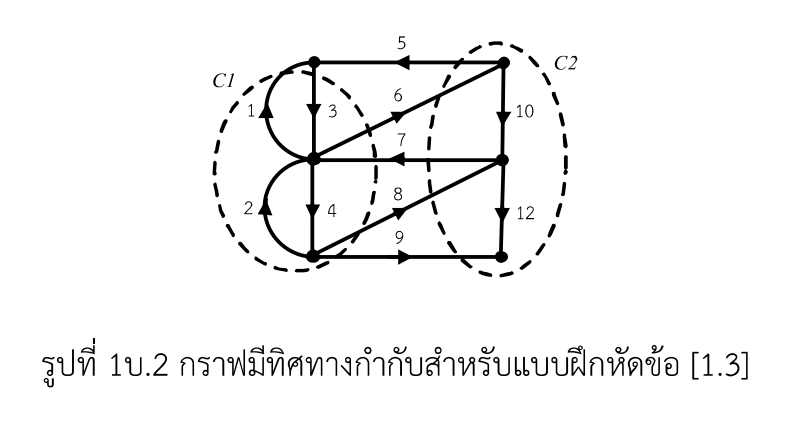
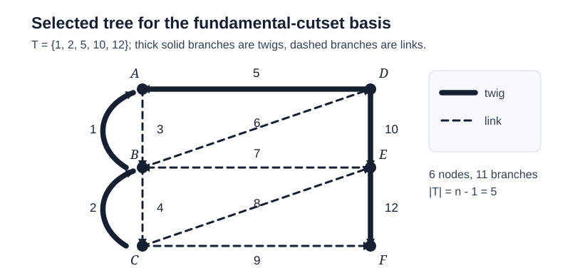

# โจทย์พิเศษ — spanning tree และชุดตัดอิสระ

> ใช้กราฟมีทิศทางกำกับรูปที่ 1บ.2 ใน [lecture 01](../lectures/303212S1Y2569lec01.pdf) และใช้หลักเดียวกับเฉลย [Fundamental Cutset Analysis](../fundamental-cutset-analysis/README.md): แยกเรื่อง **topology**, กำหนดทิศอ้างอิงให้ชัดเจน แล้วจึงเขียน KCL เป็นสมการ cutset
>
> สำหรับผู้เรียนที่ต้องการทบทวนพื้นฐาน โปรดดูหลักสูตร 12 ชั่วโมง [Network Topology for Circuit Analysis](../lectures/README.md) และ [คำศัพท์](../lectures/GLOSSARY.md) ก่อนอ่านเฉลยนี้

## โจทย์

กราฟมีทิศทางกำกับในรูปที่ 1บ.2 มี **6 ปม** และ **11 กิ่ง**

1. **หา tree ได้กี่แบบ พร้อมระบุทุกแบบที่เป็นไปได้**
2. **หาชุดตัดที่อิสระต่อกัน (independent cutsets) ทั้งหมด พร้อมเขียนสมการเซตตัดของแต่ละชุด**

---

## คำตอบย่อ

1. กราฟนี้มี **spanning tree ได้ 139 แบบ**; รายชื่อครบทุกแบบอยู่ที่ [ALL_SPANNING_TREES.md](ALL_SPANNING_TREES.md)
2. เลือกต้นไม้

   $$
   T_0=\{1,2,5,10,12\}
   $$

   จะได้ fundamental cutset ที่อิสระต่อกันครบ $n-1=5$ ชุด คือ

   $$
   \begin{aligned}
   C_1&=\{1,3,6,7,8,9\}, & i_1-i_3+i_6-i_7+i_8+i_9&=0,\\
   C_2&=\{5,6,7,8,9\},   & i_5-i_6+i_7-i_8-i_9&=0,\\
   C_3&=\{2,4,8,9\},     & i_2-i_4+i_8+i_9&=0,\\
   C_4&=\{7,8,9,10\},    & -i_7+i_8+i_9+i_{10}&=0,\\
   C_5&=\{9,12\},        & i_9+i_{12}&=0.
   \end{aligned}
   $$

สองชุดแรกตรงกับ $C_1,C_2$ ที่เส้นประระบุไว้ในรูปของแบบฝึกหัด [1.3] พอดี

---

## 1. อ่านกราฟให้ตรงกันก่อน

รูปมี **6 ปม** และ **11 กิ่ง**. แม้จะเห็นเลข 12 แต่ไม่ได้มี ``กิ่ง 11``: หมายเลขกิ่งจริงคือ

$$
\mathcal B=\{1,2,3,4,5,6,7,8,9,10,12\}.
$$

ทิศลูกศรมีผลกับเครื่องหมายของกระแส แต่ไม่มีผลกับการตัดสินว่าเซตกิ่งเป็น tree หรือไม่ (ตอนหา tree ให้มองกิ่งเป็นเส้นเชื่อมแบบไม่กำกับทิศก่อน)

เพื่อให้ระบุปมและเช็กเครื่องหมายได้แน่นอน ให้เรียกปมซ้ายจากบนลงล่างว่า $A,B,C$ และปมขวาว่า $D,E,F$.

| กิ่ง | ปลายกิ่งตามทิศลูกศร | กิ่ง | ปลายกิ่งตามทิศลูกศร |
|---:|:---|---:|:---|
| 1 | $B\to A$ | 2 | $C\to B$ |
| 3 | $A\to B$ | 4 | $B\to C$ |
| 5 | $D\to A$ | 6 | $B\to D$ |
| 7 | $E\to B$ | 8 | $C\to E$ |
| 9 | $C\to F$ | 10 | $D\to E$ |
| 12 | $E\to F$ | | |

---

## 2. ข้อ 1 — หา tree ได้กี่แบบ

spanning tree ของกราฟ $n$ ปมต้องมี $n-1$ กิ่ง, ต่อถึงทุกปม, และไม่มีวงรอบ (ดู [หน่วยที่ 1: Foundations of Graphs](../lectures/01-foundations-of-graphs.md)) ดังนั้นทุกต้นไม้ของโจทย์นี้ต้องมี

$$
|T|=n-1=6-1=5\text{ กิ่ง}.
$$

มีวิธีตรวจจำนวนที่ไม่ต้องเดา: ใช้ **Matrix-Tree Theorem** (ดู [หน่วยที่ 2: Graph Matrices and Matrix-Tree Theorem](../lectures/02-graph-matrices-and-matrix-tree-theorem.md)). เมื่อละทิ้งทิศลูกศรชั่วคราวแล้วนับกิ่งขนาน 1/3 และ 2/4 แยกคนละกิ่ง จะได้ Laplacian

$$
L=
\begin{bmatrix}
3&-2&0&-1&0&0\\
-2&6&-2&-1&-1&0\\
0&-2&4&0&-1&-1\\
-1&-1&0&3&-1&0\\
0&-1&-1&-1&4&-1\\
0&0&-1&0&-1&2
\end{bmatrix}.
$$

ลบแถวและหลักของปมใดปมหนึ่งออก (เช่น ปม $F$) แล้วหาดีเทอร์มิแนนต์ร่วม (cofactor) จะได้

$$
\tau(G)=\det L^{(F)}=139.
$$

จึงมี **139 spanning trees**. รายชื่อทั้งหมดถูกจัดไว้เป็นตารางอ่านง่ายใน [ภาคผนวก A](ALL_SPANNING_TREES.md); แต่ละรายการผ่านเกณฑ์ connected และ acyclic ครบถ้วน และตรวจซ้ำจากชุดกิ่งที่เป็นไปได้ $\binom{11}{5}=462$ ชุดแล้ว

---

## 3. เลือก tree ที่ทำให้ตอบข้อ [1.3] ต่อได้ทันที

คำว่า “ชุดตัดอิสระ” ต้องอ้างอิงต้นไม้ที่เลือกก่อน (ดู [หน่วยที่ 3: Circuit Topology Branches, Twigs, Links](../lectures/03-circuit-topology-branches-twigs-links.md)) เพราะ **แต่ละ spanning tree ให้ fundamental-cutset basis ของตนเอง**. เพื่อให้ตรงกับเส้นประ $C_1,C_2$ ในโจทย์ จึงเลือก

$$
\boxed{T_0=\{1,2,5,10,12\}}\qquad
\text{และ}\qquad
\overline T_0=\{3,4,6,7,8,9\}.
$$

`T0` ต่อครบหกปมและมีห้ากิ่ง จึงเป็น tree; กิ่งใน $T_0$ เรียกว่า **twig** และกิ่งใน $\overline T_0$ เรียกว่า **link**.

เมื่อเอา twig ออกทีละกิ่ง ต้นไม้จะแยกออกเป็นสองส่วนแน่นอน กิ่งของกราฟเดิมทั้งหมดที่พาดระหว่างสองส่วนนี้คือ **fundamental cutset** ของ twig นั้น เนื่องจากมี twig 5 กิ่ง จึงได้ fundamental cutset อิสระ 5 ชุด - พอดีกับ $n-1$ เสมอ

ตารางในหัวข้อ 4 แสดงทั้งสองกลุ่มปมหลังตัด twig, รายชื่อกิ่งที่ข้ามขอบเขต และสมการ KCL ของ cutset ทุกชุด จึงใช้ตรวจภาพกราฟและเครื่องหมายทีละแถวได้โดยตรง

### กฎเครื่องหมายที่ใช้ทุกชุด

สำหรับแต่ละ cutset ให้เลือกทิศอ้างอิง **จากส่วนที่มีหางของ twig ไปยังส่วนที่มีหัวของ twig**. ด้วยกติกานี้ twig ของ cutset นั้นมีสัมประสิทธิ์ $+1$ เสมอ

- กิ่งที่ข้ามจากฝั่งหางไปฝั่งหัว: $+i_j$
- กิ่งที่ข้ามสวนทาง: $-i_j$
- กิ่งที่ไม่ข้ามชุดตัด: สัมประสิทธิ์ $0$

ผลรวมกระแสเชิงพีชคณิตที่ผ่านขอบเขตของส่วนใดส่วนหนึ่งเป็นศูนย์ตาม KCL สำหรับคำอธิบายละเอียด ดู [หน่วยที่ 4: Cutsets and Fundamental Cutsets](../lectures/04-cutsets-and-fundamental-cutsets.md)

---

## 4. ข้อ 2 — fundamental cutset ทั้งหมดของ $T_0$

| ชุดตัด | twig ที่ตัดออก | ส่วนหาง $\to$ ส่วนหัว | กิ่งที่ข้ามชุดตัด | สมการ KCL |
|:---:|:---:|:---|:---|:---|
| $C_1$ | $1: B\to A$ | $\{B,C\}\to\{A,D,E,F\}$ | $\{1,3,6,7,8,9\}$ | $i_1-i_3+i_6-i_7+i_8+i_9=0$ |
| $C_2$ | $5: D\to A$ | $\{D,E,F\}\to\{A,B,C\}$ | $\{5,6,7,8,9\}$ | $i_5-i_6+i_7-i_8-i_9=0$ |
| $C_3$ | $2: C\to B$ | $\{C\}\to\{A,B,D,E,F\}$ | $\{2,4,8,9\}$ | $i_2-i_4+i_8+i_9=0$ |
| $C_4$ | $10: D\to E$ | $\{A,B,C,D\}\to\{E,F\}$ | $\{7,8,9,10\}$ | $-i_7+i_8+i_9+i_{10}=0$ |
| $C_5$ | $12: E\to F$ | $\{A,B,C,D,E\}\to\{F\}$ | $\{9,12\}$ | $i_9+i_{12}=0$ |

### ตรวจทานสองชุดที่โจทย์กำหนด

**$C_1$**: ตัด twig 1 แล้วฝั่ง $\{B,C\}$ แยกจาก $\{A,D,E,F\}$. กิ่ง 1, 6, 8, 9 ข้ามจากซ้ายไปขวาตามทิศอ้างอิง; กิ่ง 3, 7 ข้ามกลับทาง จึงได้

$$
\boxed{i_1-i_3+i_6-i_7+i_8+i_9=0}.
$$

**$C_2$**: ตัด twig 5 แล้วฝั่ง $\{D,E,F\}$ แยกจาก $\{A,B,C\}$. กิ่ง 5 และ 7 ไปตามทิศอ้างอิง; กิ่ง 6, 8, 9 สวนทิศ จึงได้

$$
\boxed{i_5-i_6+i_7-i_8-i_9=0}.
$$

---

## 5. เขียนพร้อมกันเป็น cutset matrix

เรียง branch-current vector โดยวาง twig ก่อน เพื่อให้เห็นความเป็นอิสระชัดเจน:

$$
i_b=
\begin{bmatrix}
i_1&i_5&i_2&i_{10}&i_{12}&i_3&i_4&i_6&i_7&i_8&i_9
\end{bmatrix}^{T}.
$$

เมทริกซ์ fundamental cutset คือ

$$
Q_f=
\left[
\begin{array}{ccccc|rrrrrr}
1&0&0&0&0&-1&0& 1&-1& 1& 1\\
0&1&0&0&0& 0&0&-1& 1&-1&-1\\
0&0&1&0&0& 0&-1&0&0& 1& 1\\
0&0&0&1&0& 0&0&0&-1& 1& 1\\
0&0&0&0&1& 0&0&0& 0& 0& 1
\end{array}
\right].
$$

ดังนั้นคำตอบในรูปเมทริกซ์-เวกเตอร์คือ

$$
\boxed{Q_f i_b=0.}
$$

บล็อกห้าหลักแรกของ $Q_f$ เป็น $I_5$ เพราะแต่ละแถวมี twig ของตนเองเพียงกิ่งเดียวและสัมประสิทธิ์เป็น $+1$ การเขียนและตรวจสอบ cutset matrix ดู [หน่วยที่ 6: Advanced Problem Solving](../lectures/06-advanced-problem-solving.md). นี่คือเหตุผลเชิงเมทริกซ์ที่ยืนยันว่า $C_1,\ldots,C_5$ **เป็นอิสระต่อกัน** ไม่ใช่เพียง “เป็น cutset ห้าชุด” เท่านั้น

---

## สรุปแนวคิดสำคัญ

1. กราฟนี้มี 139 spanning trees ไม่ใช่ tree เดียว; รายการ tree ทั้งหมดอยู่ในภาคผนวก
2. เมื่อตรึง $T_0=\{1,2,5,10,12\}$ แล้ว มี fundamental cutset อิสระได้พอดี 5 ชุดตามจำนวน twig ตัวอย่างเต็ม 6 ปม 11 กิ่ง ดู [หน่วยที่ 5: Worked Example 6 Nodes 11 Branches](../lectures/05-worked-example-6-nodes-11-branches.md)
3. $C_1$ และ $C_2$ ในสไลด์เป็นสองแถวแรกของ basis เดียวกัน และสมการเครื่องหมายมาจาก KCL ที่ขอบเขตสองส่วนหลังตัด twig
4. หากเลือก spanning tree ชุดอื่น จะได้ basis ของ fundamental cutset ชุดอื่นได้เช่นกัน; ข้อความว่า “ทั้งหมด” ในเฉลยนี้หมายถึง **ทั้งหมดของ basis ที่เกิดจาก $T_0$**, ซึ่งเป็นต้นไม้ที่สอดคล้องกับรูปโจทย์โดยตรง

## แหล่งอ้างอิง

- หลักสูตร 12 ชั่วโมง [Network Topology for Circuit Analysis](../lectures/README.md)
- [GLOSSARY.md](../lectures/GLOSSARY.md) — คำศัพท์คณิตศาสตร์ วงจร และ cutset
- [303212S1Y2569lec01.pdf](../lectures/303212S1Y2569lec01.pdf), หน้า 11-12: นิยามและกฎเครื่องหมายของ cutset; หน้า 18: แบบฝึกหัด [1.3]
- C.A. Desoer & E.S. Kuh, *Basic Circuit Theory*, บท Network Topology - แนวคิด tree, cutset และ fundamental cutset matrix
