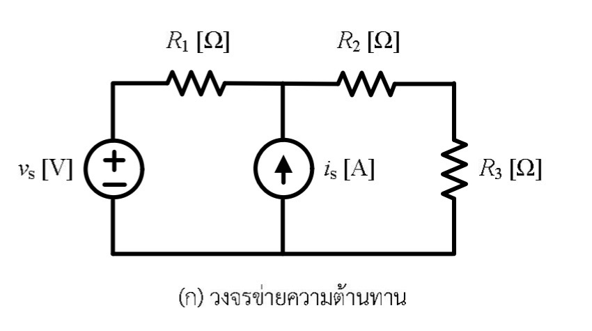
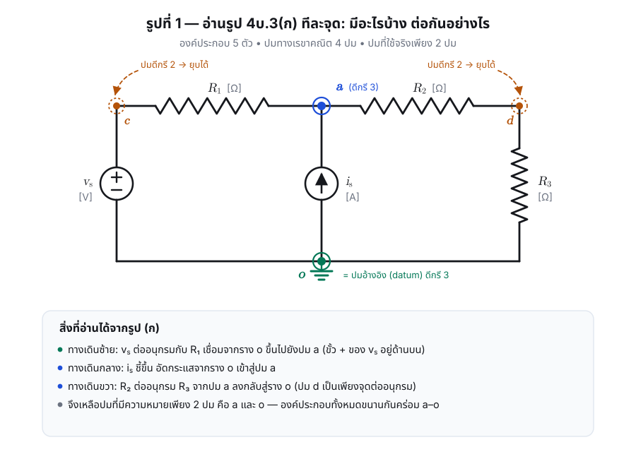
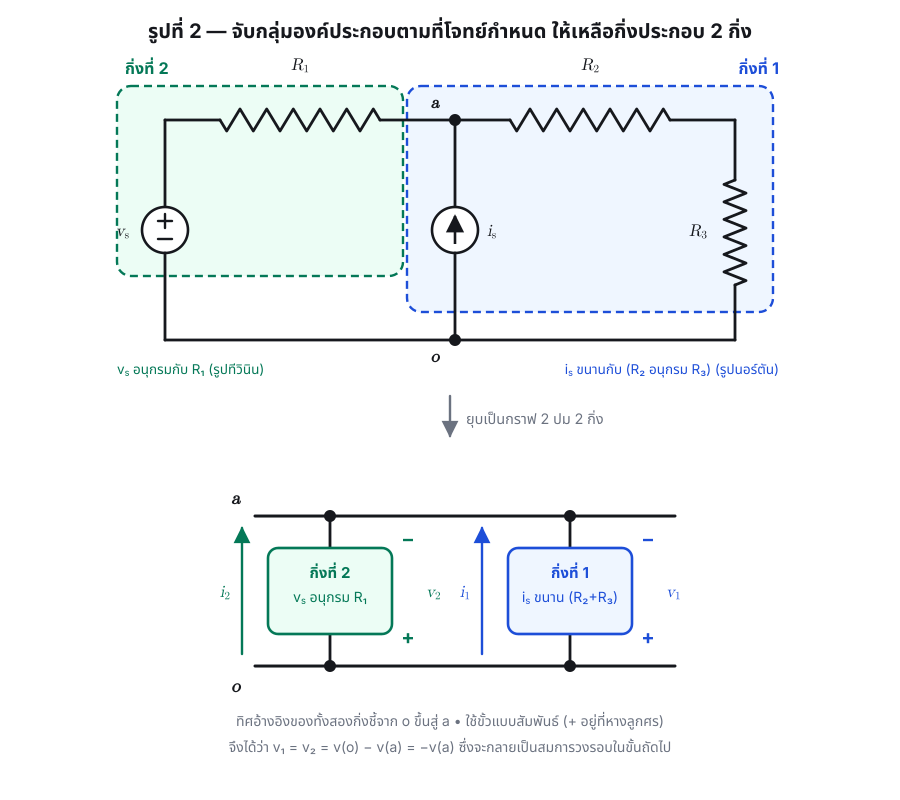
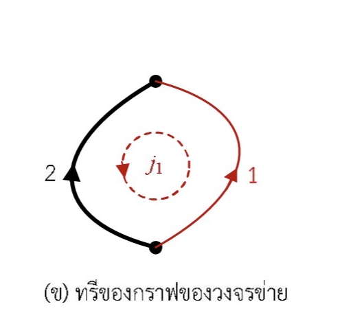
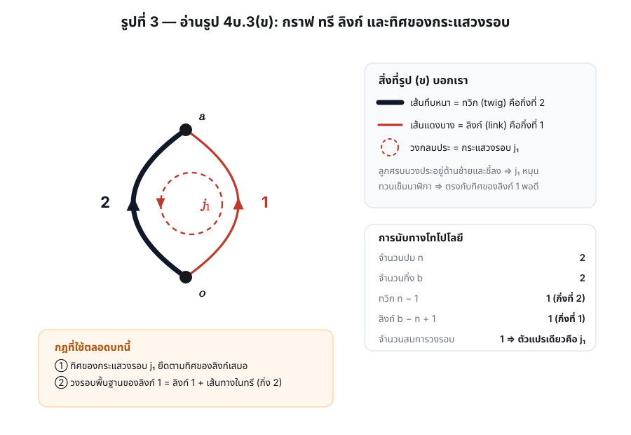

# วิเคราะห์รูปประกอบโจทย์ [4.3] ทีละรูป

เอกสารนี้แยกอ่าน **รูปที่ 4บ.3(ก)** และ **รูปที่ 4บ.3(ข)** อย่างละเอียด ก่อนจะนำไปตั้งสมการใน
[solution.md](solution.md) เหตุผลที่ต้องแยกอ่านคือรูปสองรูปนี้ให้ข้อมูลคนละชนิด และถ้าอ่านผิด
เพียงจุดเดียว (เช่น ทิศลูกศร) เครื่องหมายของคำตอบจะกลับด้านทั้งข้อ

| รูป | ให้ข้อมูลอะไร | ถ้าอ่านผิดจะพลาดตรงไหน |
|---|---|---|
| (ก) วงจรข่ายความต้านทาน | องค์ประกอบ ค่าพารามิเตอร์ ขั้วของแหล่งจ่าย และการต่อทางกายภาพ | สมการเฉพาะกิ่ง (branch v–i relation) ผิด |
| (ข) ทรีของกราฟ | เลขกิ่ง ทิศอ้างอิงของกิ่ง ทรี/ลิงก์ และทิศหมุนของ $j_1$ | เครื่องหมายในเมทริกซ์ $\mathbf{B}$ ผิด |

---

## ส่วนที่ 1 — วิเคราะห์รูปที่ 4บ.3(ก)

### 1.1 นับองค์ประกอบ

รูป (ก) มีองค์ประกอบทั้งหมด **5 ตัว**

| # | องค์ประกอบ | ตำแหน่งในรูป | รายละเอียดของขั้ว/ทิศ |
|---|---|---|---|
| 1 | แหล่งกำเนิดแรงดัน $v_s$ | เสาซ้าย | วงกลมมีเครื่องหมาย $+$ **ด้านบน** และ $-$ ด้านล่าง |
| 2 | ตัวต้านทาน $R_1$ | รางบน ช่วงซ้าย | ระหว่างยอดเสาซ้ายกับปมกลางบน |
| 3 | แหล่งกำเนิดกระแส $i_s$ | เสากลาง | วงกลมมีลูกศร **ชี้ขึ้น** |
| 4 | ตัวต้านทาน $R_2$ | รางบน ช่วงขวา | ระหว่างปมกลางบนกับมุมขวาบน |
| 5 | ตัวต้านทาน $R_3$ | เสาขวา | ระหว่างมุมขวาบนกับรางล่าง |

### 1.2 ระบุปมและนับดีกรี

จุดต่อทางเรขาคณิตมี 4 จุด แต่ไม่ใช่ปมที่มีความหมายทั้งหมด

| จุด | ตำแหน่ง | ดีกรี | สถานะ |
|---|---|---|---|
| $a$ | ปมกลางบน (จุดร่วมของ $R_1$, $i_s$, $R_2$) | 3 | **ปมจริง** |
| $o$ | รางล่างทั้งเส้น (จุดร่วมของ $v_s$, $i_s$, $R_3$) | 3 | **ปมจริง** เลือกเป็นปมอ้างอิง (datum) |
| $c$ | ยอดเสาซ้าย (จุดต่อระหว่าง $v_s$ กับ $R_1$) | 2 | ยุบได้ — เป็นแค่จุดต่ออนุกรม |
| $d$ | มุมขวาบน (จุดต่อระหว่าง $R_2$ กับ $R_3$) | 2 | ยุบได้ — เป็นแค่จุดต่ออนุกรม |

> **หลักการ** ปมที่มีดีกรี 2 ไม่ให้สมการ KCL ใหม่ (กระแสเข้าเท่ากับกระแสออกโดยอัตโนมัติ)
> จึงยุบรวมองค์ประกอบสองตัวที่ต่ออยู่ให้เป็นกิ่งประกอบเดียวได้ โดยไม่เปลี่ยนพฤติกรรมของวงจร

หลังยุบแล้วเหลือปมจริงเพียง **2 ปม** คือ $a$ กับ $o$ — และองค์ประกอบทุกตัวขนานกันคร่อม $a$–$o$

### 1.3 จัดกลุ่มเป็นกิ่งประกอบตามที่โจทย์กำหนด

| กิ่ง | องค์ประกอบภายใน | รูปแบบ | เชื่อมปม |
|---|---|---|---|
| กิ่งที่ 2 | $v_s$ **อนุกรม** $R_1$ | รูปทีวินิน (Thévenin form) | $o \to a$ |
| กิ่งที่ 1 | $i_s$ **ขนาน** $(R_2 \text{ อนุกรม } R_3)$ | รูปนอร์ตัน (Norton form) | $o \to a$ |

**จุดที่ต้องระวัง** $R_2$ กับ $R_3$ ต่อ **อนุกรม** กัน (ไม่ใช่ขนาน) เพราะ $R_2$ ออกจากปม $a$ ไปยังปม $d$
แล้ว $R_3$ ต่อจากปม $d$ ลงราง $o$ โดยไม่มีทางแยกที่ปม $d$ ดังนั้นความต้านทานของทางเดินนี้คือ $R_2+R_3$

### 1.4 ทิศทางที่ธรรมชาติของแต่ละกิ่ง

- $v_s$ มีขั้ว $+$ อยู่บน จึงมีแนวโน้มดันกระแสจากราง $o$ ขึ้นผ่าน $R_1$ เข้าสู่ปม $a$
- $i_s$ ลูกศรชี้ขึ้น จึงอัดกระแสจากราง $o$ เข้าสู่ปม $a$

ทั้งสองกิ่งจึง "ชี้ขึ้น" ในทิศ $o \to a$ เหมือนกัน — สอดคล้องกับลูกศรทั้งสองเส้นในรูป (ข)

---

## ส่วนที่ 2 — วิเคราะห์รูปที่ 4บ.3(ข)

### 2.1 อ่านองค์ประกอบของภาพทีละอย่าง

| สิ่งที่เห็นในภาพ | ความหมาย |
|---|---|
| จุดทึบ 2 จุด (บน–ล่าง) | ปม 2 ปม ⇒ $n = 2$ — จุดบนคือปม $a$ จุดล่างคือปม $o$ |
| เส้นโค้ง **ทึบหนาสีดำ** ด้านซ้าย กำกับเลข **2** | กิ่งที่ 2 และการวาดแบบหนาแปลว่าเป็น **ทวิก (twig)** คือกิ่งที่อยู่ในทรี |
| เส้นโค้ง **บางสีแดง** ด้านขวา กำกับเลข **1** | กิ่งที่ 1 และการวาดแบบบาง/ต่างสีแปลว่าเป็น **ลิงก์ (link)** คือกิ่งนอกทรี |
| หัวลูกศรกลางเส้นทั้งสอง **ชี้ขึ้น** | ทิศอ้างอิงของกระแสกิ่งทั้งสองคือ $o \to a$ |
| วงกลม **เส้นประสีแดง** ตรงกลาง กำกับ $j_1$ | กระแสวงรอบของวงรอบพื้นฐานที่เกิดจากลิงก์ที่ 1 |
| หัวลูกศรบนวงกลมประอยู่ **ด้านซ้ายและชี้ลง** | ด้านซ้ายลง → ด้านล่างไปขวา → ด้านขวาขึ้น ⇒ $j_1$ หมุน **ทวนเข็มนาฬิกา** |

### 2.2 ตรวจความสอดคล้องของทิศ $j_1$ กับลิงก์

กฎมาตรฐานของการวิเคราะห์วงรอบคือ **ทิศของกระแสวงรอบต้องตรงกับทิศของลิงก์ที่สร้างวงรอบนั้น**

- $j_1$ ทวนเข็มนาฬิกา ⇒ ด้าน **ขวา** ของวงรอบวิ่งขึ้น
- กิ่งที่ 1 (ลิงก์) อยู่ด้านขวา และมีทิศชี้ขึ้น

ทั้งสองตรงกันพอดี ⇒ การอ่านภาพถูกต้อง และ **ค่าของ $j_1$ จะเท่ากับกระแสของลิงก์โดยตรง** คือ $i_1 = +j_1$

ขณะเดียวกัน ด้าน **ซ้าย** ของวงรอบวิ่งลง แต่กิ่งที่ 2 ชี้ขึ้น ⇒ สวนทางกัน ⇒ $i_2 = -j_1$

### 2.3 การนับทางโทโปโลยี

$$
n = 2,\qquad b = 2
$$

$$
\text{จำนวนทวิก} = n - 1 = 1 \quad\Rightarrow\quad \{\text{กิ่งที่ }2\}
$$

$$
\text{จำนวนลิงก์} = l = b - n + 1 = 2 - 2 + 1 = 1 \quad\Rightarrow\quad \{\text{กิ่งที่ }1\}
$$

$$
\text{จำนวนสมการรอบอิสระ} = l = 1
$$

ดังนั้นทั้งวงจรมีตัวแปรอิสระเพียงตัวเดียวคือ $j_1$ — นี่คือเหตุผลที่โจทย์ตั้งชื่อไว้ตัวเดียว

### 2.4 ตรวจว่าเส้นทึบเป็นทรีจริงหรือไม่

ทรี (tree) ต้องมีสมบัติครบสามข้อ

1. **เชื่อมทุกปม** — กิ่งที่ 2 เชื่อม $o$ กับ $a$ ครบทั้ง 2 ปม ✓
2. **ไม่มีวงรอบ** — กิ่งเดียวไม่สามารถสร้างวงรอบได้ ✓
3. **มีจำนวนกิ่งเท่ากับ $n-1$** — มี 1 กิ่ง และ $n-1=1$ ✓

เส้นทึบในรูป (ข) จึงเป็น spanning tree ที่ถูกต้อง

---

## ส่วนที่ 3 — ตารางเชื่อมโยงสองรูปเข้าด้วยกัน

| หัวข้อ | รูป (ก) บอกว่า | รูป (ข) บอกว่า | ผลลัพธ์ที่ใช้ตั้งสมการ |
|---|---|---|---|
| กิ่งที่ 1 | $i_s$ ขนาน $(R_2+R_3)$ ระหว่างราง $o$ กับปม $a$ | เป็นลิงก์ ทิศ $o\to a$ | $v_1 = (R_2+R_3)(i_1-i_s)$ |
| กิ่งที่ 2 | $v_s$ อนุกรม $R_1$ ระหว่างราง $o$ กับปม $a$ ($+$ อยู่บน) | เป็นทวิก ทิศ $o\to a$ | $v_2 = R_1 i_2 - v_s$ |
| จำนวนตัวแปร | ปมจริง 2 ปม | $l = 1$ | ตัวแปรเดียวคือ $j_1$ |
| เครื่องหมาย | — | ลิงก์ตามทิศ / ทวิกสวนทาง | $\mathbf{B} = \begin{bmatrix} +1 & -1\end{bmatrix}$ |

> ขั้นต่อไป: นำผลจากตารางนี้ไปตั้งสมการและแก้ใน [solution.md](solution.md)
