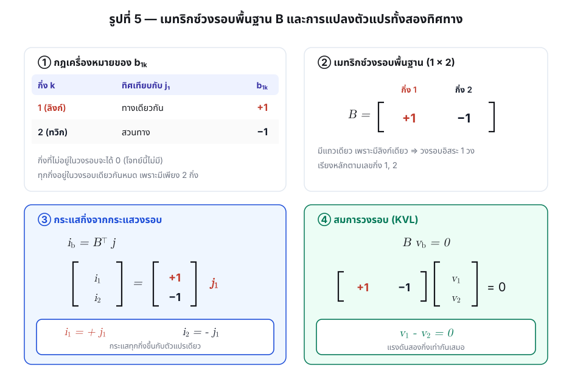
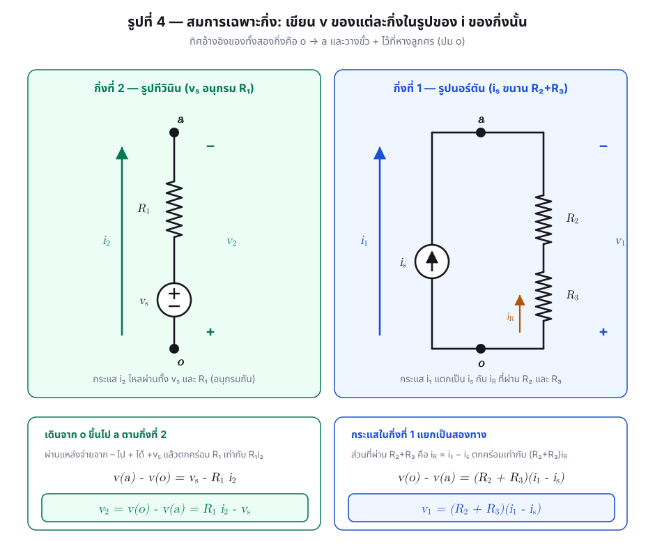
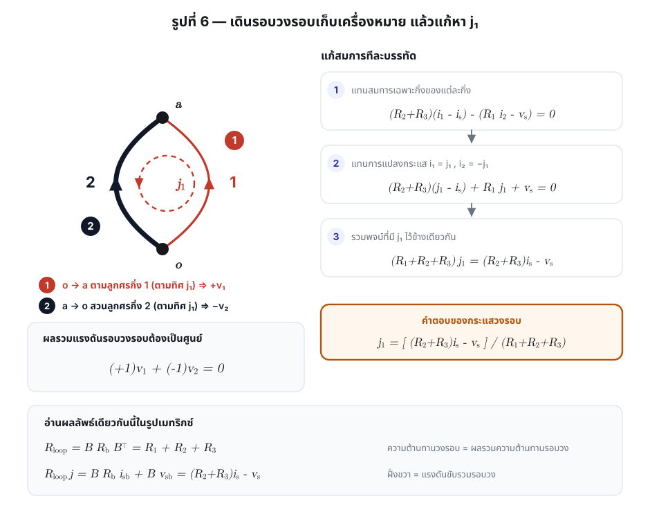
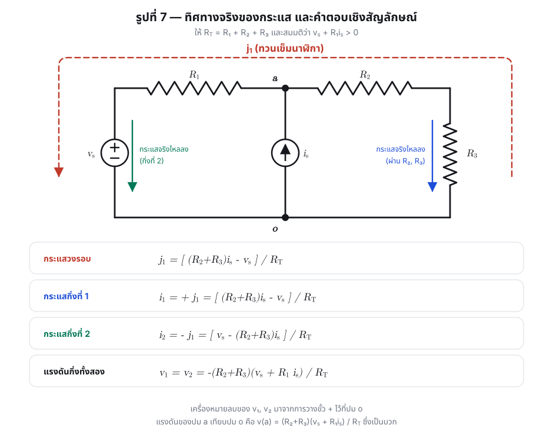
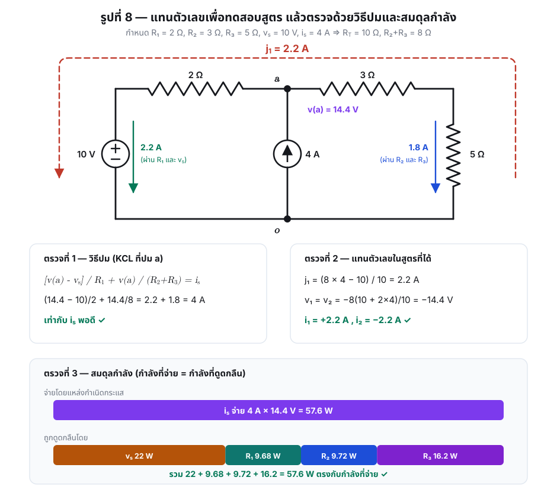

# เฉลยละเอียด โจทย์ [4.3] — การวิเคราะห์วงรอบด้วยเมทริกซ์ tie-set

> **โจทย์:** [problem.md](problem.md) • **การอ่านรูปประกอบ:** [figure-analysis.md](figure-analysis.md)
> **ระดับ:** วิศวกรรมไฟฟ้าปริญญาตรี — วิชาทฤษฎีวงจร/โทโปโลยีวงจรข่าย

---

## คำตอบโดยสรุป

ให้ $R_T \equiv R_1+R_2+R_3$

**สมการรอบ**

$$
\boxed{\;(R_1+R_2+R_3)\,j_1 \;=\; (R_2+R_3)\,i_s \;-\; v_s\;}
$$

**กระแสวงรอบ**

$$
\boxed{\;j_1=\frac{(R_2+R_3)\,i_s-v_s}{R_1+R_2+R_3}\;}
$$

**กระแสกิ่ง**

$$
\boxed{\;i_1=+j_1=\frac{(R_2+R_3)i_s-v_s}{R_T}\;},\qquad
\boxed{\;i_2=-j_1=\frac{v_s-(R_2+R_3)i_s}{R_T}\;}
$$

**แรงดันกิ่ง**

$$
\boxed{\;v_1=v_2=-\frac{(R_2+R_3)\,(v_s+R_1 i_s)}{R_T}\;}
$$

(เครื่องหมายลบเกิดจากการวางขั้ว $+$ ไว้ที่ปม $o$ ตามทิศอ้างอิง $o\to a$
ถ้าอ่านเป็นแรงดันของปม $a$ เทียบปม $o$ จะได้ $v(a)=+\dfrac{(R_2+R_3)(v_s+R_1i_s)}{R_T}$ ซึ่งเป็นบวก)

---

# 1. วางกรอบความคิดก่อนลงมือ

## 1.1 ทำไมโจทย์นี้ถึงใช้ "วิธีวงรอบ"

วิธีวิเคราะห์วงจรมีสองสายหลักที่สมมาตรกัน

| | วิธีเซตตัด/ปม | วิธีวงรอบ |
|---|---|---|
| ตัวแปรอิสระ | แรงดันทวิก / แรงดันปม | **กระแสลิงก์ / กระแสวงรอบ** |
| จำนวนสมการ | $n-1$ | $b-n+1$ |
| กฎที่บังคับใช้ | KCL | **KVL** |
| เมทริกซ์หลัก | $\mathbf{Q}$ (cutset) หรือ $\mathbf{A}$ (incidence) | $\mathbf{B}$ (tie-set) |

โจทย์ข้อนี้กำหนด $j_1$ มาให้ และวาดทรีมาให้ จึงเป็นการบังคับใช้ **วิธีวงรอบ** โดยตรง

## 1.2 โครงของการแก้ปัญหา 5 ขั้น

```
รูป (ก) วงจรจริง
      │  ยุบปมดีกรี 2 → กิ่งประกอบ
      ▼
กราฟ 2 ปม 2 กิ่ง  ──►  รูป (ข) เลือกทรี → ได้ทวิก/ลิงก์
      │                        │
      │                        ▼
      │                 เมทริกซ์ B = [ +1  −1 ]
      │                        │
      ▼                        ▼
สมการเฉพาะกิ่ง  ───────►  KVL:  B v_b = 0
   v1(i1), v2(i2)               และ  i_b = Bᵀ j
                                 │
                                 ▼
                     สมการรอบ 1 สมการ 1 ตัวแปร → j1
                                 │
                                 ▼
                     ย้อนกลับหา i1, i2, v1, v2
```

## 1.3 ตัวแปรทุกตัวที่จะใช้

| สัญลักษณ์ | ความหมาย | ทิศ/ขั้วอ้างอิง |
|---|---|---|
| $i_1$ | กระแสของกิ่งที่ 1 | จากปม $o$ ขึ้นสู่ปม $a$ |
| $i_2$ | กระแสของกิ่งที่ 2 | จากปม $o$ ขึ้นสู่ปม $a$ |
| $v_1$ | แรงดันของกิ่งที่ 1 | $+$ ที่ปม $o$ (หางลูกศร) |
| $v_2$ | แรงดันของกิ่งที่ 2 | $+$ ที่ปม $o$ (หางลูกศร) |
| $j_1$ | กระแสวงรอบ | ทวนเข็มนาฬิกา = ตามทิศลิงก์ที่ 1 |
| $i_R$ | กระแสส่วนที่ไหลผ่าน $R_2$ และ $R_3$ ในกิ่งที่ 1 | จากปม $o$ ขึ้นสู่ปม $a$ |
| $R_T$ | $R_1+R_2+R_3$ | — |

> **ข้อตกลงเครื่องหมาย** เราใช้ *associated reference direction* คือวางขั้ว $+$ ของแรงดันกิ่ง
> ไว้ที่ **หางลูกศร** ของกระแสกิ่ง ทำให้ตัวต้านทานล้วนเป็นไปตาม $v=Ri$ ตรง ๆ ไม่ต้องใส่ลบ
> ผลที่ตามมาคือ $v_k = v(\text{หาง}) - v(\text{หัว})$ ซึ่งในที่นี้แปลว่า $v_k = v(o)-v(a)$

---

# 2. ขั้นที่ 1 — จากวงจรจริงสู่กราฟ

## 2.1 ยุบปมดีกรี 2


ในรูป (ก) มีจุดต่อ 4 จุด แต่จุด $c$ (ระหว่าง $v_s$ กับ $R_1$) และจุด $d$ (ระหว่าง $R_2$ กับ $R_3$)
มีดีกรีเพียง 2 จึงไม่ให้สมการ KCL ที่เป็นอิสระเพิ่ม ยุบทิ้งได้ เหลือปมจริง 2 ปมคือ $a$ และ $o$

## 2.2 จับกลุ่มเป็นกิ่งประกอบตามที่โจทย์กำหนด


$$
\text{กิ่งที่ 2} = \{\,v_s \text{ อนุกรม } R_1\,\},\qquad
\text{กิ่งที่ 1} = \{\,i_s \text{ ขนาน } (R_2 \text{ อนุกรม } R_3)\,\}
$$

ผลลัพธ์คือกราฟที่มี $n=2$ และ $b=2$ — เล็กที่สุดเท่าที่จะเป็นไปได้ นี่คือประโยชน์ของการใช้
"กิ่งประกอบ": ย้ายความซับซ้อนไปไว้ในสมการเฉพาะกิ่ง แทนที่จะไปเพิ่มจำนวนสมการ

---

# 3. ขั้นที่ 2 — อ่านทรี ทวิก ลิงก์ และทิศของ $j_1$


$$
n=2,\qquad b=2,\qquad
\underbrace{n-1=1}_{\text{ทวิก: กิ่งที่ }2},\qquad
\underbrace{l=b-n+1=1}_{\text{ลิงก์: กิ่งที่ }1}
$$

**วงรอบพื้นฐาน (fundamental loop) ของลิงก์ที่ 1** สร้างโดยเติมลิงก์ที่ 1 กลับเข้าไปในทรี
วงรอบที่เกิดขึ้นคือ ลิงก์ที่ 1 $+$ เส้นทางในทรีระหว่างสองปลายของลิงก์ นั่นคือ

$$
L_1 = \{\,\text{กิ่งที่ }1,\ \text{กิ่งที่ }2\,\}
$$

**ทิศของ $j_1$** ในรูป (ข) หัวลูกศรบนวงประอยู่ด้านซ้ายและชี้ลง ⇒ ทวนเข็มนาฬิกา ⇒
ด้านขวาวิ่งขึ้น ซึ่งตรงกับทิศของลิงก์ที่ 1 พอดี เป็นไปตามกฎที่ว่า
**ทิศกระแสวงรอบต้องยึดตามทิศของลิงก์**

---

# 4. ขั้นที่ 3 — เมทริกซ์ tie-set และการแปลงตัวแปร



## 4.1 นิยามของสมาชิกในเมทริกซ์

$$
b_{qk}=
\begin{cases}
+1, & \text{กิ่ง }k\text{ อยู่ในวงรอบ }q\text{ และทิศเดียวกับกระแสวงรอบ}\\[2pt]
-1, & \text{กิ่ง }k\text{ อยู่ในวงรอบ }q\text{ แต่สวนทาง}\\[2pt]
0,  & \text{กิ่ง }k\text{ ไม่อยู่ในวงรอบ }q
\end{cases}
$$

## 4.2 กรอกค่าสำหรับโจทย์นี้

| กิ่ง $k$ | อยู่ในวงรอบ $L_1$ ? | ทิศเทียบกับ $j_1$ | $b_{1k}$ |
|---|---|---|---|
| 1 (ลิงก์) | ใช่ | ทางเดียวกัน | $+1$ |
| 2 (ทวิก) | ใช่ | สวนทาง | $-1$ |

$$
\mathbf{B}=\begin{bmatrix} +1 & -1 \end{bmatrix}
$$

## 4.3 การแปลงกระแส (มาจาก KCL)

$$
\mathbf{i}_b=\mathbf{B}^{\mathsf T}\,\mathbf{j}
\qquad\Longrightarrow\qquad
\begin{bmatrix} i_1\\ i_2\end{bmatrix}
=\begin{bmatrix} +1\\ -1\end{bmatrix} j_1
$$

$$
\boxed{\,i_1=+j_1\,},\qquad \boxed{\,i_2=-j_1\,}
$$

**ตรวจด้วยสามัญสำนึก** KCL ที่ปม $a$: กระแสทั้งสองกิ่งชี้เข้าปม $a$ เหมือนกัน จึงต้องได้
$i_1+i_2=0$ ซึ่งเป็นจริงเพราะ $j_1+(-j_1)=0$ ✓

## 4.4 การแปลงแรงดัน (มาจาก KVL)

$$
\mathbf{B}\,\mathbf{v}_b=\mathbf{0}
\qquad\Longrightarrow\qquad
\begin{bmatrix} +1 & -1\end{bmatrix}\begin{bmatrix} v_1\\ v_2\end{bmatrix}=0
\qquad\Longrightarrow\qquad
\boxed{\,v_1-v_2=0\,}
$$

**ตรวจด้วยสามัญสำนึก** ทั้งสองกิ่งคร่อมปมคู่เดียวกัน ($o$ กับ $a$) และวางขั้วเหมือนกัน
แรงดันจึงต้องเท่ากันอยู่แล้ว ✓

---

# 5. ขั้นที่ 4 — สมการเฉพาะกิ่ง (branch $v$–$i$ relations)



ขั้นนี้คือหัวใจของโจทย์ เพราะเป็นจุดเดียวที่ค่า $R$, $v_s$, $i_s$ เข้ามาในระบบสมการ

## 5.1 กิ่งที่ 2 — รูปทีวินิน

เดินจากปม $o$ ขึ้นไปปม $a$ ตามทิศอ้างอิง

1. ผ่านแหล่งกำเนิดแรงดันจากขั้ว $-$ ไปยังขั้ว $+$ ⇒ ศักย์ **เพิ่ม** ขึ้น $v_s$
2. ผ่านตัวต้านทาน $R_1$ ในทิศเดียวกับกระแส $i_2$ ⇒ ศักย์ **ลด** ลง $R_1 i_2$

$$
v(a)-v(o)=v_s-R_1 i_2
$$

เนื่องจาก $v_2 = v(o)-v(a)$ (ขั้ว $+$ อยู่ที่หางลูกศร)

$$
\boxed{\,v_2=R_1 i_2-v_s\,}
$$

## 5.2 กิ่งที่ 1 — รูปนอร์ตัน

กิ่งนี้มีสองทางเดินขนานกัน กระแสรวมของกิ่งจึงแยกออกเป็น

$$
i_1=i_s+i_R \qquad\Longrightarrow\qquad i_R=i_1-i_s
$$

โดย $i_R$ คือกระแสที่ไหลผ่าน $R_2$ และ $R_3$ (ซึ่งอนุกรมกัน จึงเป็นกระแสเดียวกัน) ในทิศ $o\to a$

แรงดันตกคร่อมทางเดินความต้านทานนี้ในทิศ $o\to a$ คือ

$$
v(o)-v(a)=(R_2+R_3)\,i_R
$$

$$
\boxed{\,v_1=(R_2+R_3)(i_1-i_s)\,}
$$

## 5.3 เขียนรวมเป็นรูปเมทริกซ์

$$
\mathbf{v}_b=\mathbf{R}_b\left(\mathbf{i}_b-\mathbf{i}_{sb}\right)-\mathbf{v}_{sb}
$$

โดย

$$
\mathbf{R}_b=\begin{bmatrix} R_2+R_3 & 0\\ 0 & R_1\end{bmatrix},\qquad
\mathbf{i}_{sb}=\begin{bmatrix} i_s\\ 0\end{bmatrix},\qquad
\mathbf{v}_{sb}=\begin{bmatrix} 0\\ v_s\end{bmatrix}
$$

- $\mathbf{i}_{sb}$ เก็บกระแสของแหล่งกำเนิดกระแสที่ **ขนาน** อยู่ในกิ่ง โดยนับบวกเมื่อทิศตรงกับทิศกิ่ง
- $\mathbf{v}_{sb}$ เก็บแรงดันของแหล่งกำเนิดแรงดันที่ **อนุกรม** อยู่ในกิ่ง โดยนับบวกเมื่อยกศักย์ขึ้นในทิศกิ่ง

---

# 6. ขั้นที่ 5 — ตั้งสมการรอบแล้วแก้



## 6.1 เดินรอบวงรอบเก็บเครื่องหมาย

| ลำดับ | เดินจาก → ไป | ผ่านกิ่ง | เทียบกับทิศ $j_1$ | พจน์ที่ได้ |
|---|---|---|---|---|
| ① | $o \to a$ | 1 (ลิงก์) | ตามทิศ | $+v_1$ |
| ② | $a \to o$ | 2 (ทวิก) | สวนทิศ | $-v_2$ |

$$
(+1)v_1+(-1)v_2=0
$$

## 6.2 แทนสมการเฉพาะกิ่ง

$$
(R_2+R_3)(i_1-i_s)-\bigl(R_1 i_2-v_s\bigr)=0
$$

## 6.3 แทนการแปลงกระแส $i_1=j_1,\ i_2=-j_1$

$$
(R_2+R_3)(j_1-i_s)-\bigl(-R_1 j_1-v_s\bigr)=0
$$

$$
(R_2+R_3)j_1-(R_2+R_3)i_s+R_1 j_1+v_s=0
$$

## 6.4 รวมพจน์ — ได้สมการรอบ

$$
\boxed{\;(R_1+R_2+R_3)\,j_1=(R_2+R_3)\,i_s-v_s\;}
$$

$$
\boxed{\;j_1=\frac{(R_2+R_3)\,i_s-v_s}{R_1+R_2+R_3}=\frac{(R_2+R_3)i_s-v_s}{R_T}\;}
$$

## 6.5 อ่านผลลัพธ์ในรูปเมทริกซ์มาตรฐาน

แทน $\mathbf{i}_b=\mathbf{B}^{\mathsf T}\mathbf{j}$ ลงในสมการเฉพาะกิ่ง แล้วคูณด้วย $\mathbf{B}$ ตาม $\mathbf{B}\mathbf{v}_b=\mathbf{0}$

$$
\underbrace{\bigl(\mathbf{B}\,\mathbf{R}_b\,\mathbf{B}^{\mathsf T}\bigr)}_{\mathbf{R}_{\text{loop}}}\mathbf{j}
=\mathbf{B}\,\mathbf{R}_b\,\mathbf{i}_{sb}+\mathbf{B}\,\mathbf{v}_{sb}
$$

ตรวจทีละก้อน

$$
\mathbf{R}_{\text{loop}}=\begin{bmatrix}1&-1\end{bmatrix}
\begin{bmatrix} R_2+R_3&0\\0&R_1\end{bmatrix}
\begin{bmatrix}1\\-1\end{bmatrix}
=(R_2+R_3)+R_1=R_T
$$

$$
\mathbf{B}\,\mathbf{R}_b\,\mathbf{i}_{sb}
=\begin{bmatrix}1&-1\end{bmatrix}\begin{bmatrix}(R_2+R_3)i_s\\0\end{bmatrix}=(R_2+R_3)i_s
$$

$$
\mathbf{B}\,\mathbf{v}_{sb}=\begin{bmatrix}1&-1\end{bmatrix}\begin{bmatrix}0\\v_s\end{bmatrix}=-v_s
$$

$$
R_T\,j_1=(R_2+R_3)i_s-v_s \qquad\checkmark\ \text{ตรงกับที่แก้มือ}
$$

> **ความหมายเชิงกายภาพ** $\mathbf{R}_{\text{loop}}$ คือผลรวมความต้านทานที่พบเมื่อเดินครบรอบวง
> ส่วนฝั่งขวาคือ "แรงดันขับสุทธิ" รอบวง — สังเกตว่า $(R_2+R_3)i_s$ คือแรงดันสมมูลแบบทีวินิน
> ของแหล่งกระแสในกิ่งที่ 1 ส่วน $-v_s$ ติดลบเพราะ $v_s$ ดันในทิศสวนกับ $j_1$

---

# 7. ขั้นที่ 6 — คำนวณกระแสกิ่งและแรงดันกิ่ง



## 7.1 กระแสกิ่ง

$$
i_1=+j_1=\frac{(R_2+R_3)i_s-v_s}{R_T}
$$

$$
i_2=-j_1=\frac{v_s-(R_2+R_3)i_s}{R_T}
$$

## 7.2 แรงดันกิ่ง

จากกิ่งที่ 2

$$
v_2=R_1 i_2-v_s
=R_1\cdot\frac{v_s-(R_2+R_3)i_s}{R_T}-v_s
=\frac{R_1 v_s-R_1(R_2+R_3)i_s-R_T v_s}{R_T}
$$

$$
=\frac{-(R_2+R_3)v_s-R_1(R_2+R_3)i_s}{R_T}
=-\frac{(R_2+R_3)\bigl(v_s+R_1 i_s\bigr)}{R_T}
$$

จากกิ่งที่ 1 (ตรวจซ้ำโดยอิสระ)

$$
v_1=(R_2+R_3)(j_1-i_s)
=(R_2+R_3)\cdot\frac{(R_2+R_3)i_s-v_s-R_T i_s}{R_T}
=(R_2+R_3)\cdot\frac{-R_1 i_s-v_s}{R_T}
$$

$$
=-\frac{(R_2+R_3)\bigl(v_s+R_1 i_s\bigr)}{R_T}
$$

$$
\boxed{\,v_1=v_2=-\frac{(R_2+R_3)(v_s+R_1 i_s)}{R_T}\,}
$$

ผลลัพธ์สองทางตรงกัน และสอดคล้องกับ $v_1-v_2=0$ ที่ได้จาก KVL ✓

## 7.3 แรงดันของปม $a$

เนื่องจาก $v_1=v(o)-v(a)$ และเลือก $v(o)=0$

$$
\boxed{\,v(a)=\frac{(R_2+R_3)(v_s+R_1 i_s)}{R_T}\,}
$$

## 7.4 ปริมาณระดับองค์ประกอบ (ถ้าโจทย์ถามต่อ)

| ปริมาณ | นิพจน์ | ทิศ/ขั้ว |
|---|---|---|
| กระแสผ่าน $R_1$ และ $v_s$ | $i_2=\dfrac{v_s-(R_2+R_3)i_s}{R_T}$ | ทิศ $o\to a$ |
| กระแสผ่าน $R_2,R_3$ | $i_R=i_1-i_s=-\dfrac{v_s+R_1 i_s}{R_T}$ | ทิศ $o\to a$ (ค่าลบ ⇒ ไหลจริงจาก $a\to o$) |
| แรงดันคร่อม $R_1$ | $R_1 i_2$ | $+$ ที่ปลายด้านที่ต่อกับ $v_s$ (ปม $c$) ตามทิศกระแส $o\to a$ |
| แรงดันคร่อม $R_2$ | $\dfrac{R_2(v_s+R_1 i_s)}{R_T}$ | $+$ ที่ด้านปม $a$ |
| แรงดันคร่อม $R_3$ | $\dfrac{R_3(v_s+R_1 i_s)}{R_T}$ | $+$ ที่ด้านบน |
| แรงดันคร่อมแหล่งกระแส | $v(a)=\dfrac{(R_2+R_3)(v_s+R_1 i_s)}{R_T}$ | $+$ ที่ด้านบน |

---

# 8. การตรวจคำตอบ 4 ทาง



## 8.1 ตรวจด้วยวิธีปม (node analysis)

เขียน KCL ที่ปม $a$ โดยตรงจากรูป (ก) โดยให้ $v(o)=0$

$$
\frac{v(a)-v_s}{R_1}+\frac{v(a)}{R_2+R_3}=i_s
$$

$$
v(a)\left(\frac{1}{R_1}+\frac{1}{R_2+R_3}\right)=i_s+\frac{v_s}{R_1}
$$

คูณตลอดด้วย $R_1(R_2+R_3)$

$$
v(a)\bigl(R_2+R_3+R_1\bigr)=R_1(R_2+R_3)i_s+(R_2+R_3)v_s
$$

$$
v(a)=\frac{(R_2+R_3)(v_s+R_1 i_s)}{R_T}\qquad\checkmark
$$

ตรงกับข้อ 7.3 ทุกประการ ทั้งที่ใช้กฎคนละข้อ (KCL แทน KVL) และตัวแปรคนละชุด

## 8.2 ตรวจด้วยกรณีพิเศษ (limiting cases)

| กรณี | สูตรให้ | ผลที่ควรเป็นทางกายภาพ | ตรงกัน |
|---|---|---|---|
| $i_s=0$ | $j_1=-\dfrac{v_s}{R_T}$ ⇒ $i_2=+\dfrac{v_s}{R_T}$ | $v_s$ ขับกระแสผ่าน $R_1,R_2,R_3$ ที่อนุกรมกันทั้งหมด | ✓ |
| $v_s=0$ | $i_2=-\dfrac{(R_2+R_3)i_s}{R_T}$ | ตัวแบ่งกระแส: $i_s$ แบ่งลงกิ่ง $R_1$ ตามสัดส่วน $\dfrac{R_2+R_3}{R_T}$ | ✓ |
| $v_s=0$ | $i_R=-\dfrac{R_1 i_s}{R_T}$ | ตัวแบ่งกระแส: ส่วนที่ลงทาง $R_2+R_3$ คือ $\dfrac{R_1}{R_T}$ ของ $i_s$ | ✓ |
| $R_2+R_3\to\infty$ | $j_1\to i_s$ | ทางความต้านทานเปิดวงจร กระแสกิ่งที่ 1 ต้องเท่ากับ $i_s$ พอดี | ✓ |
| $R_1\to 0$ | $v(a)\to v_s$ | $v_s$ ต่อตรงคร่อมปม $a$–$o$ | ✓ |

## 8.3 ตรวจด้วยวิธีเมช (supermesh) จากวงจรจริง

ให้ $m_1$ และ $m_2$ เป็นกระแสเมชซ้ายและขวา ทั้งคู่หมุนตามเข็มนาฬิกา
แหล่งกำเนิดกระแสอยู่บนกิ่งร่วม จึงต้องใช้ supermesh

**ข้อจำกัดจากแหล่งกระแส** (กระแสขึ้นในกิ่งกลาง $=i_s$)

$$
m_2-m_1=i_s
$$

**KVL รอบ supermesh (วงนอก ตามเข็มนาฬิกา)**

$$
-v_s+R_1 m_1+R_2 m_2+R_3 m_2=0
$$

แทน $m_2=m_1+i_s$

$$
-v_s+R_1 m_1+(R_2+R_3)(m_1+i_s)=0
\quad\Longrightarrow\quad
m_1=\frac{v_s-(R_2+R_3)i_s}{R_T}
$$

$m_1$ คือกระแสที่ไหลขึ้นผ่าน $v_s$ แล้วผ่าน $R_1$ เข้าปม $a$ ซึ่งก็คือ $i_2$ พอดี

$$
m_1=i_2\qquad\checkmark
$$

และ $m_2=m_1+i_s=\dfrac{v_s+R_1 i_s}{R_T}$ คือกระแสที่ไหลลงผ่าน $R_2,R_3$ ซึ่งเท่ากับ $-i_R$ ✓

## 8.4 ตรวจด้วยสมดุลกำลัง

กำลังที่แหล่งกระแสจ่าย $=i_s\,v(a)$ ส่วนแหล่งแรงดันจ่าย $=v_s\,i_2$ (ติดลบแปลว่าดูดกลืน)
และกำลังที่ตัวต้านทานดูดกลืนรวม $=R_1 i_2^2+(R_2+R_3)i_R^2$ ทั้งสองฝั่งต้องเท่ากันเสมอ
ดูตัวเลขในหัวข้อถัดไป

---

# 9. ตัวอย่างตัวเลขเพื่อทดสอบสูตร

กำหนด $R_1=2\ \Omega$, $R_2=3\ \Omega$, $R_3=5\ \Omega$, $v_s=10\ \text{V}$, $i_s=4\ \text{A}$
⇒ $R_T=10\ \Omega$, $R_2+R_3=8\ \Omega$

**กระแสวงรอบ**

$$
j_1=\frac{8(4)-10}{10}=\frac{32-10}{10}=2.2\ \text{A}
$$

**กระแสกิ่ง**

$$
i_1=+2.2\ \text{A},\qquad i_2=-2.2\ \text{A}
$$

**แรงดันกิ่ง**

$$
v_1=v_2=-\frac{8\,(10+2\times 4)}{10}=-\frac{8(18)}{10}=-14.4\ \text{V}
$$

**แรงดันปม**

$$
v(a)=+14.4\ \text{V}
$$

**ตรวจด้วย KCL ที่ปม $a$**

$$
\frac{14.4-10}{2}+\frac{14.4}{8}=2.2+1.8=4.0\ \text{A}=i_s\qquad\checkmark
$$

**ตรวจด้วยสมดุลกำลัง**

| องค์ประกอบ | กระแส | แรงดัน | กำลัง |
|---|---|---|---|
| $i_s$ (จ่าย) | 4 A | 14.4 V | $+57.6$ W จ่าย |
| $v_s$ (ดูดกลืน) | 2.2 A ไหลเข้าขั้ว $+$ | 10 V | $22.0$ W ดูดกลืน |
| $R_1$ | 2.2 A | 4.4 V | $9.68$ W |
| $R_2$ | 1.8 A | 5.4 V | $9.72$ W |
| $R_3$ | 1.8 A | 9.0 V | $16.20$ W |

$$
22.0+9.68+9.72+16.20=57.60\ \text{W}=\text{กำลังที่จ่าย}\qquad\checkmark
$$

---

# 10. กับดักที่ทำให้ตอบผิดบ่อย

| # | กับดัก | ผลที่เกิด | วิธีกันพลาด |
|---|---|---|---|
| 1 | กำหนดทิศ $j_1$ ตามใจ ไม่ยึดทิศลิงก์ | ได้ $i_1=-j_1$ ทำให้เครื่องหมายกลับหมด | ท่องกฎ: **ทิศกระแสวงรอบ = ทิศลิงก์เสมอ** |
| 2 | ใช้ $v_1=(R_2+R_3)\,i_1$ | ลืมหักกระแสของแหล่งจ่าย ⇒ ผิดทั้งข้อ | กิ่งนอร์ตันต้องใช้ $(i_1-i_s)$ เพราะ $i_s$ ไม่ได้ผ่านตัวต้านทาน |
| 3 | คิดว่า $R_2$ ขนาน $R_3$ | ได้ $\dfrac{R_2R_3}{R_2+R_3}$ แทน $R_2+R_3$ | ดูปม $d$ — ดีกรี 2 ไม่มีทางแยก ⇒ อนุกรม |
| 4 | วางขั้ว $+$ ของ $v_k$ ไว้ที่หัวลูกศร | เครื่องหมายของ $v_1,v_2$ กลับด้าน | ประกาศข้อตกลงให้ชัดตั้งแต่ต้น แล้วใช้ให้ตลอด |
| 5 | ลืมว่า $v_s$ ยกศักย์ขึ้นในทิศ $o\to a$ | ได้ $v_2=R_1i_2+v_s$ | ไล่เดินจากขั้ว $-$ ไป $+$ แล้วบวก $v_s$ |
| 6 | ไม่ยุบปมดีกรี 2 | ได้ $b=5,\ n=4,\ l=2$ ต้องแก้ 2 สมการ | คำตอบยังถูก แต่ยาวกว่าโดยไม่จำเป็น |
| 7 | ตกใจที่ $v_1,v_2$ ติดลบ | คิดว่าคำนวณผิด | ค่าลบเป็นเรื่องปกติ แปลว่าศักย์จริงที่ปม $a$ สูงกว่าปม $o$ |

---

# 11. สรุปสูตรสำหรับทบทวน

| ปริมาณ | สูตร |
|---|---|
| เมทริกซ์ tie-set | $\mathbf{B}=\begin{bmatrix}+1&-1\end{bmatrix}$ |
| แปลงกระแส | $\mathbf{i}_b=\mathbf{B}^{\mathsf T}\mathbf{j}$ ⇒ $i_1=j_1,\ i_2=-j_1$ |
| KVL | $\mathbf{B}\mathbf{v}_b=0$ ⇒ $v_1=v_2$ |
| สมการเฉพาะกิ่ง | $v_1=(R_2+R_3)(i_1-i_s)$ , $v_2=R_1i_2-v_s$ |
| ความต้านทานวงรอบ | $\mathbf{R}_{\text{loop}}=\mathbf{B}\mathbf{R}_b\mathbf{B}^{\mathsf T}=R_1+R_2+R_3$ |
| สมการรอบ | $R_T\,j_1=(R_2+R_3)i_s-v_s$ |
| กระแสวงรอบ | $j_1=\dfrac{(R_2+R_3)i_s-v_s}{R_T}$ |
| กระแสกิ่ง | $i_1=j_1$ , $i_2=-j_1$ |
| แรงดันกิ่ง | $v_1=v_2=-\dfrac{(R_2+R_3)(v_s+R_1i_s)}{R_T}$ |
| แรงดันปม | $v(a)=+\dfrac{(R_2+R_3)(v_s+R_1i_s)}{R_T}$ |

---

# 12. แบบฝึกหัดต่อยอด

1. ถ้าสลับเลือกทรีเป็น **กิ่งที่ 1** แทน (ลิงก์กลายเป็นกิ่งที่ 2) จงหา $\mathbf{B}$ ใหม่ แล้วแสดงว่า
   $j_1'$ ที่ได้มีค่าเท่ากับ $-j_1$ เดิม และ $v_1,v_2$ ไม่เปลี่ยน — ยืนยันว่าคำตอบไม่ขึ้นกับการเลือกทรี
2. ถ้ากลับขั้วของ $v_s$ (ให้ $+$ อยู่ล่าง) สมการรอบเปลี่ยนเป็นอะไร
3. ถ้ากลับทิศลูกศรของ $i_s$ (ชี้ลง) $j_1$ เปลี่ยนเป็นอะไร
4. หาเงื่อนไขของ $v_s,i_s$ ที่ทำให้ $j_1=0$ แล้วอธิบายความหมายทางกายภาพ
   *(คำใบ้: $v_s=(R_2+R_3)i_s$ — แหล่งจ่ายทั้งสองหักล้างกันพอดี)*
5. เพิ่มตัวต้านทาน $R_4$ ขนานกับแหล่งกำเนิดกระแส แล้วทำใหม่ทั้งข้อ (จะได้ $b=3$, $l=2$)
