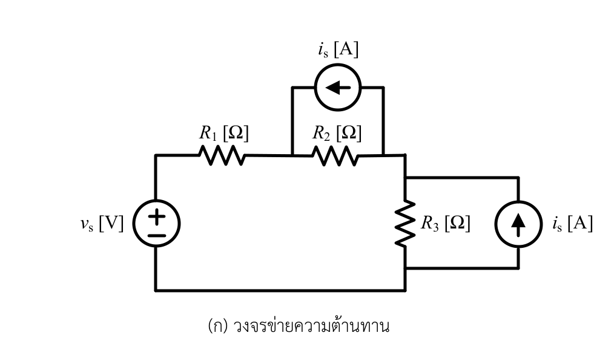
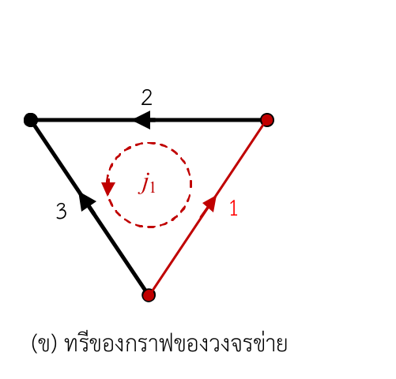

# โจทย์ [4.4] — สมการวงรอบหลักมูลของวงจรข่ายความต้านทาน

> ที่มา: แบบฝึกหัดท้ายบทที่ 4 (การวิเคราะห์วงรอบ / Loop–Tie-set Analysis) — หน้า 104
> เอกสารบรรยาย: [303212S1Y2569lec04_5048.pdf](../lecture/303212S1Y2569lec04_5048.pdf)
> ไฟล์ภาพต้นฉบับ: [problem.png](problem.png)

---

## 1. คำโจทย์ (ถอดความจากภาพ)

> **[4.4]** พิจารณาวงจรข่ายความต้านทานไฟฟ้าในรูปที่ 4บ.4(ก) กำหนดให้แหล่งกำเนิดแรงดันอิสระต่ออนุกรมกับตัวต้านทาน $R_1$ ตั้งอยู่บน **กิ่งที่ 3** และกำหนดให้แหล่งกำเนิดกระแสอิสระต่อขนานกับตัวต้านทาน $R_2$ ตั้งอยู่บน **กิ่งที่ 2** และต่อขนานกับตัวต้านทาน $R_3$ ตั้งอยู่บน **กิ่งที่ 1** ดังที่แสดงทรีของวงจรข่ายไว้ในรูปที่ 4บ.4(ข) หากกำหนดให้ $j_1$ เป็นกระแสวงรอบหลักมูลแล้ว จงเขียนสมการรอบและจงคำนวณหาค่าของแรงดันกิ่งและกระแสกิ่ง

---

## 2. รูปประกอบที่สกัดออกมา

| รูป | ภาพ | คำบรรยาย |
|---|---|---|
| 4บ.4(ก) |  | วงจรข่ายความต้านทาน — บอก **ตัวองค์ประกอบและการต่อทางกายภาพ** |
| 4บ.4(ข) |  | ทรีของกราฟของวงจรข่าย — บอก **การกำหนดกิ่ง ทิศอ้างอิง ทรี และทิศของ $j_1$** |

> อ่านการวิเคราะห์ทีละจุดของทั้งสองรูปได้ที่ [figure-analysis.md](figure-analysis.md)

---

## 3. สิ่งที่กำหนดให้ (Given)

| สัญลักษณ์ | ความหมาย | หน่วย |
|---|---|---|
| $v_s$ | แรงดันของแหล่งกำเนิดแรงดันอิสระบนกิ่งที่ 3 (ขั้ว $+$ อยู่ด้านบน) | $\text{V}$ |
| $i_s$ (บน) | กระแสของแหล่งกำเนิดกระแสอิสระที่ขนานกับ $R_2$ บนกิ่งที่ 2 (ลูกศรชี้ไปทางซ้าย $\leftarrow$) | $\text{A}$ |
| $i_s$ (ขวา) | กระแสของแหล่งกำเนิดกระแสอิสระที่ขนานกับ $R_3$ บนกิ่งที่ 1 (ลูกศรชี้ขึ้น $\uparrow$) | $\text{A}$ |
| $R_1$ | ตัวต้านทานที่ต่ออนุกรมกับ $v_s$ บนกิ่งที่ 3 | $\Omega$ |
| $R_2$ | ตัวต้านทานที่ต่อขนานกับ $i_s$ บนกิ่งที่ 2 | $\Omega$ |
| $R_3$ | ตัวต้านทานที่ต่อขนานกับ $i_s$ บนกิ่งที่ 1 | $\Omega$ |

**ข้อกำหนดเชิงโทโปโลยีที่โจทย์บังคับไว้**

- **กิ่งที่ 3**: $v_s$ อนุกรม $R_1$ (แบบจำลองรูปทีวินิน / Thévenin form) เชื่อมระหว่างปมล่างกับปมซ้ายบน ทิศอ้างอิงชี้ขึ้น-ซ้าย ($\nwarrow$)
- **กิ่งที่ 2**: $i_s$ ขนาน $R_2$ (แบบจำลองรูปนอร์ตัน / Norton form) เชื่อมระหว่างปมขวาบนกับปมซ้ายบน ทิศอ้างอิงชี้ไปทางซ้าย ($\leftarrow$)
- **กิ่งที่ 1**: $i_s$ ขนาน $R_3$ (แบบจำลองรูปนอร์ตัน / Norton form) เชื่อมระหว่างปมล่างกับปมขวาบน ทิศอ้างอิงชี้ขึ้น-ขวา ($\nearrow$)
- **ทรีของกราฟ** $T = \{\text{กิ่งที่ 2, กิ่งที่ 3}\}$ (เส้นหนาสีดำในรูป ข)
- **โค-ทรี (ลิงก์)** $L = \{\text{กิ่งที่ 1}\}$ (เส้นบางสีแดงในรูป ข)
- $j_1$ คือ **กระแสวงรอบหลักมูล (fundamental loop current)** ที่เกิดจากลิงก์ที่ 1 หมุนทวนเข็มนาฬิกา (CCW) ตามทิศของลิงก์ที่ 1

---

## 4. สิ่งที่ต้องหา (Find)

1. **สมการรอบ (loop equation)** ในรูปของกระแสวงรอบ $j_1$
2. **กระแสวงรอบ** $j_1$
3. **กระแสกิ่ง (branch currents)** $i_1,\ i_2,\ i_3$
4. **แรงดันกิ่ง (branch voltages)** $v_1,\ v_2,\ v_3$

---

## 5. ข้อตกลงเรื่องสัญกรณ์ที่ใช้ตลอดการวิเคราะห์

| สัญลักษณ์ | ความหมาย |
|---|---|
| $n$ | จำนวนปม (node) ของกราฟ $= 3$ |
| $b$ | จำนวนกิ่ง (branch) ของกราฟ $= 3$ |
| $l = b - n + 1$ | จำนวนลิงก์ = จำนวนวงรอบหลักมูล = จำนวนสมการรอบ $= 3 - 3 + 1 = 1$ |
| $i_k,\ v_k$ | กระแสกิ่งและแรงดันกิ่งของกิ่งที่ $k$ ($k=1,2,3$) |
| $\mathbf{i}_b,\ \mathbf{v}_b$ | เวกเตอร์กระแสกิ่งและแรงดันกิ่ง $\mathbf{i}_b = [i_1, i_2, i_3]^{\mathsf T}$, $\mathbf{v}_b = [v_1, v_2, v_3]^{\mathsf T}$ |
| $\mathbf{B}$ | เมทริกซ์วงรอบหลักมูล (fundamental tie-set matrix) ขนาด $1 \times 3$ |
| $\mathbf{j}$ | เวกเตอร์กระแสวงรอบ $\mathbf{j} = [j_1]$ |
| $R_T$ | ผลรวมความต้านทาน $R_1 + R_2 + R_3$ |

**เครื่องหมายกำกับแบบสัมพันธ์ (Associated Reference Direction)**:
- ลูกศรบนกิ่งของกราฟกำหนดทิศทางบวกของกระแสกิ่ง $i_k$
- ขั้วบวก $+$ ของแรงดันกิ่ง $v_k$ วางไว้ที่ **หางลูกศร** และขั้วลบ $-$ อยู่ที่ **หัวลูกศร** เสมอ
- สำหรับตัวต้านทานบริสุทธิ์: $v_R = R \, i_R$
