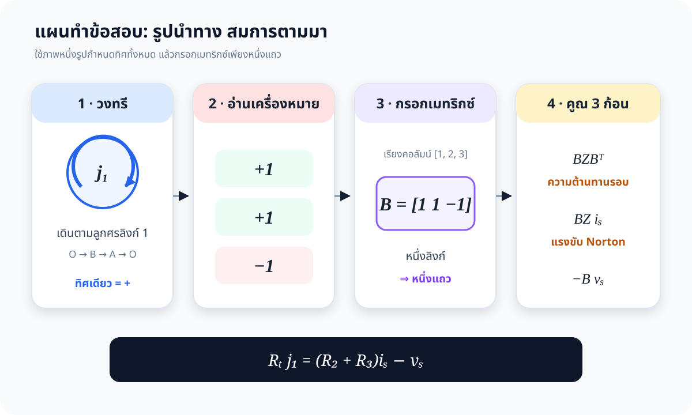
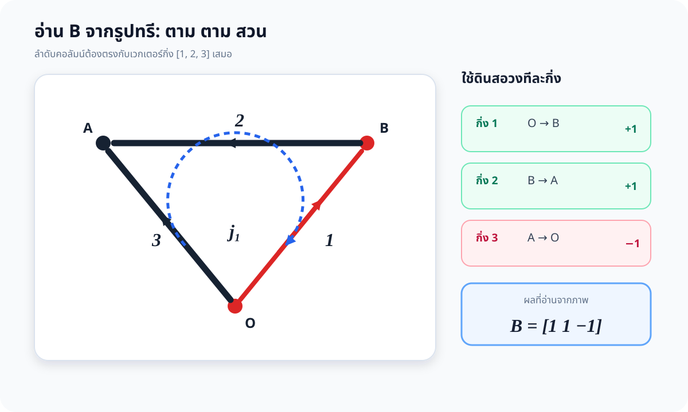
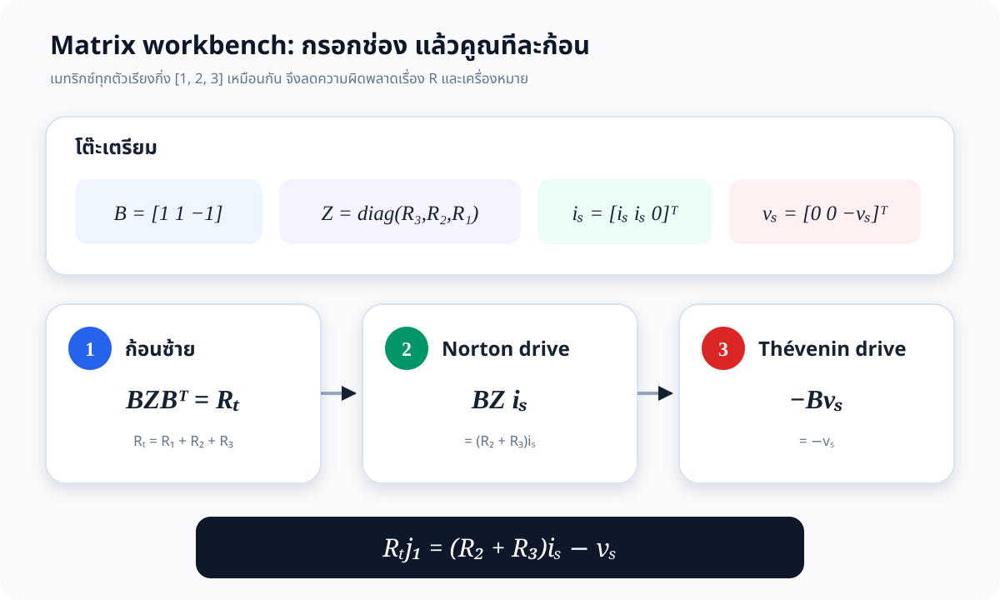
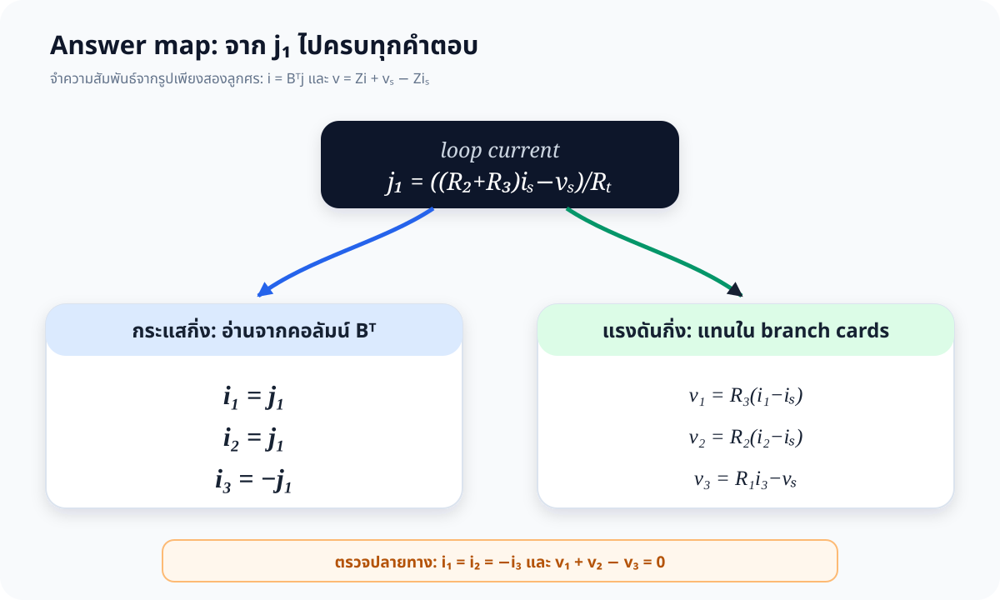

# โจทย์ 4.4 — วิธีที่ 2: Visual Matrix สำหรับทำข้อสอบ

> จุดประสงค์ของวิธีนี้คือ **อ่านทิศจากรูปให้ถูกครั้งเดียว** แล้วให้เมทริกซ์จัดการ KCL/KVL ที่เหลือ
> เหมาะกับแนวการสอนบทที่ 4 และการเขียนคำตอบในเวลาสอบ โดยยังคงพิสูจน์ได้ครบถ้วน

[เปิดหน้า Interactive Reader](index.html) · [กลับเฉลยวิธีที่ 1](../solution.md) · [โจทย์](../problem.md)

---

## 0. คำตอบสุดท้าย

กำหนด

\[
R_T=R_1+R_2+R_3,\qquad K=v_s+R_1i_s
\]

| ปริมาณ | คำตอบ |
|---|---|
| เมทริกซ์วงรอบหลักมูล | \(\mathbf B=\begin{bmatrix}1&1&-1\end{bmatrix}\) |
| สมการวงรอบ | \(R_Tj_1=(R_2+R_3)i_s-v_s\) |
| กระแสวงรอบ | \(j_1=\dfrac{(R_2+R_3)i_s-v_s}{R_T}\) |
| กระแสกิ่ง | \(i_1=i_2=j_1,\quad i_3=-j_1\) |
| แรงดันกิ่ง 1 | \(v_1=-\dfrac{R_3K}{R_T}\) |
| แรงดันกิ่ง 2 | \(v_2=-\dfrac{R_2K}{R_T}\) |
| แรงดันกิ่ง 3 | \(v_3=-\dfrac{(R_2+R_3)K}{R_T}\) |

---

## 1. ทำไมวิธีนี้จึงเริ่มที่ “รูป”

เอกสารบรรยายบทที่ 4 ให้สมการแม่แบบ

\[
\mathbf B\mathbf v_b=\mathbf0,\qquad
\mathbf i_b=\mathbf B^{\mathsf T}\mathbf j,
\]

\[
\mathbf v_b=\mathbf Z_b\mathbf i_b+\mathbf v_{sb}-\mathbf Z_b\mathbf i_{sb},
\]

จึงรวมเป็น

\[
\boxed{
\mathbf B\mathbf Z_b\mathbf B^{\mathsf T}\mathbf j
=\mathbf B\mathbf Z_b\mathbf i_{sb}-\mathbf B\mathbf v_{sb}}
\]

สังเกตว่าสิ่งที่ต้องตัดสินใจจริงมีเพียงสามเรื่องจากรูป:

1. กิ่งใดเป็นทรีและกิ่งใดเป็นลิงก์
2. วงรอบเดินตามหรือสวนลูกศรของแต่ละกิ่ง
3. แหล่งกำเนิดในแต่ละกิ่งมีเครื่องหมายอย่างไรตามทิศอ้างอิง

หลังจากนั้นเป็นการกรอกช่องและคูณเมทริกซ์ตามแบบ ไม่จำเป็นต้องตั้ง KCL/KVL ใหม่หลายบรรทัด

---

## 2. รูปหลักที่ใช้ในข้อสอบ

ให้เรียกปมซ้ายบนว่า \(A\), ปมขวาบนว่า \(B\), และปมล่างว่า \(O\)

- ทรี \(T=\{2,3\}\)
- ลิงก์ \(L=\{1\}\)
- ลิงก์ 1 สร้างวงรอบหลักมูลเพียงหนึ่งวง เพราะ \(l=b-n+1=3-3+1=1\)
- กำหนดทิศ \(j_1\) ตามทิศลิงก์ 1: \(O\to B\to A\to O\)

### กฎอ่านเครื่องหมายหนึ่งบรรทัด

เดินตาม \(j_1\) แล้วเทียบกับลูกศรของกิ่ง:

| กิ่ง | การเดินของวงรอบ | ลูกศรกิ่ง | ค่าใน \(\mathbf B\) |
|---:|---|---|---:|
| 1 | \(O\to B\) | \(O\to B\) | \(+1\) |
| 2 | \(B\to A\) | \(B\to A\) | \(+1\) |
| 3 | \(A\to O\) | \(O\to A\) | \(-1\) |

ดังนั้น เมื่อเรียงคอลัมน์เป็น **[กิ่ง 1, กิ่ง 2, กิ่ง 3]**

\[
\boxed{\mathbf B=\begin{bmatrix}1&1&-1\end{bmatrix}}
\]

นี่คือจุดสำคัญที่สุดของข้อ ถ้าแถวนี้ถูก ความสัมพันธ์ทางโทโพโลยีจะออกมาทันที:

\[
\mathbf i_b=\mathbf B^{\mathsf T}j_1
\quad\Longrightarrow\quad
\boxed{i_1=j_1,\ i_2=j_1,\ i_3=-j_1}
\]

และ

\[
\mathbf B\mathbf v_b=0
\quad\Longrightarrow\quad
\boxed{v_1+v_2-v_3=0}
\]

---

## 3. ทำ Branch Cards ก่อนเขียนเมทริกซ์

ใช้ associated reference direction: \(v_k\) มีขั้วบวกที่หางลูกศรกิ่ง และขั้วลบที่หัวลูกศร

### กิ่ง 1 — Norton: \(i_s\parallel R_3\)

ลูกศรแหล่งกระแสตรงกับ \(i_1\) จึงเหลือกระแสผ่านตัวต้านทาน \(i_1-i_s\):

\[
v_1=R_3(i_1-i_s)
\]

### กิ่ง 2 — Norton: \(i_s\parallel R_2\)

ลูกศรแหล่งกระแสตรงกับ \(i_2\) เช่นกัน:

\[
v_2=R_2(i_2-i_s)
\]

### กิ่ง 3 — Thévenin: \(v_s\) อนุกรม \(R_1\)

เดินตามทิศกิ่งจาก \(O\to A\) ผ่านแหล่งจากขั้ว \(-\) ไปขั้ว \(+\) จึงเป็นแรงดันขึ้น \(v_s\) หรือแรงดันตก \(-v_s\):

\[
v_3=R_1i_3-v_s
\]

จากการ์ดสามใบนี้ กรอกโต๊ะเมทริกซ์ได้โดยไม่ต้องตั้งสมการใหม่:

\[
\mathbf Z_b=\operatorname{diag}(R_3,R_2,R_1),\quad
\mathbf i_{sb}=\begin{bmatrix}i_s\\i_s\\0\end{bmatrix},\quad
\mathbf v_{sb}=\begin{bmatrix}0\\0\\-v_s\end{bmatrix}.
\]

> จุดจำ: ลำดับแนวทแยงของ \(\mathbf Z_b\) คือ \(R_3,R_2,R_1\) ไม่ใช่ \(R_1,R_2,R_3\)
> เพราะเวกเตอร์กิ่งเรียงเป็น [1,2,3] และกิ่ง 1 มี \(R_3\), กิ่ง 2 มี \(R_2\), กิ่ง 3 มี \(R_1\)

---

## 4. คูณเมทริกซ์แบบสามก้อน

### ก้อนที่ 1 — ความต้านทานรอบ

\[
\mathbf B\mathbf Z_b\mathbf B^{\mathsf T}
=
\begin{bmatrix}1&1&-1\end{bmatrix}
\begin{bmatrix}R_3&0&0\\0&R_2&0\\0&0&R_1\end{bmatrix}
\begin{bmatrix}1\\1\\-1\end{bmatrix}
=R_1+R_2+R_3=R_T.
\]

เหตุผลเชิงภาพ: วงรอบผ่านตัวต้านทานครบทั้งสามตัว และเครื่องหมายถูกยกกำลังสอง จึงรวมเป็นบวกทั้งหมด

### ก้อนที่ 2 — แรงขับจาก Norton

\[
\mathbf B\mathbf Z_b\mathbf i_{sb}
=R_3i_s+R_2i_s=(R_2+R_3)i_s.
\]

เหตุผลเชิงภาพ: แหล่งกระแสอยู่ในกิ่ง 1 และ 2 เท่านั้น จึงไม่มีพจน์ \(R_1i_s\)

### ก้อนที่ 3 — แรงขับจาก Thévenin

\[
-\mathbf B\mathbf v_{sb}
=-\begin{bmatrix}1&1&-1\end{bmatrix}
\begin{bmatrix}0\\0\\-v_s\end{bmatrix}
=-v_s.
\]

รวมสามก้อน:

\[
\boxed{R_Tj_1=(R_2+R_3)i_s-v_s}
\]

จึงได้

\[
\boxed{j_1=\frac{(R_2+R_3)i_s-v_s}{R_T}}
\]

---

## 5. แตกคำตอบจาก \(j_1\)

### 5.1 กระแสกิ่ง

อ่านจาก \(\mathbf B^{\mathsf T}\) โดยตรง:

\[
\boxed{
i_1=i_2=\frac{(R_2+R_3)i_s-v_s}{R_T}}
\]

\[
\boxed{
i_3=\frac{v_s-(R_2+R_3)i_s}{R_T}}
\]

### 5.2 แรงดันกิ่ง

แทน \(i_1=i_2=j_1\), \(i_3=-j_1\) กลับลงใน Branch Cards จะได้

\[
v_1=R_3(j_1-i_s)
=-\frac{R_3(v_s+R_1i_s)}{R_T},
\]

\[
v_2=R_2(j_1-i_s)
=-\frac{R_2(v_s+R_1i_s)}{R_T},
\]

\[
v_3=-R_1j_1-v_s
=-\frac{(R_2+R_3)(v_s+R_1i_s)}{R_T}.
\]

หรือใช้ \(K=v_s+R_1i_s\) เพื่อเขียนสั้น:

\[
\boxed{
v_1=-\frac{R_3K}{R_T},\qquad
v_2=-\frac{R_2K}{R_T},\qquad
v_3=-\frac{(R_2+R_3)K}{R_T}}
\]

---

## 6. แบบคำตอบ 7 ช่องสำหรับเขียนในห้องสอบ

คัดโครงนี้ลงกระดาษแล้วกรอกค่า:

1. \(T=\{2,3\},\ L=\{1\}\), วง \(j_1: O\to B\to A\to O\)
2. \(\mathbf B=[1\ 1\ -1]\)
3. \(\mathbf Z_b=\operatorname{diag}(R_3,R_2,R_1)\)
4. \(\mathbf i_{sb}=[i_s\ i_s\ 0]^{\mathsf T}\), \(\mathbf v_{sb}=[0\ 0\ -v_s]^{\mathsf T}\)
5. \(\mathbf B\mathbf Z_b\mathbf B^{\mathsf T}j_1=\mathbf B\mathbf Z_b\mathbf i_{sb}-\mathbf B\mathbf v_{sb}\)
6. \(R_Tj_1=(R_2+R_3)i_s-v_s\)
7. \(\mathbf i_b=\mathbf B^{\mathsf T}j_1\), แล้วแทนใน Branch Cards เพื่อหา \(\mathbf v_b\)

### การตรวจ 60 วินาที

- **Topology:** \(i_1=i_2=-i_3\)
- **KVL:** \(v_1+v_2-v_3=0\)
- **หน่วย:** ซ้ายของสมการรอบเป็น \(\Omega\cdot\mathrm A=\mathrm V\); ขวาก็เป็น V
- **ปิดแหล่งกระแส:** เมื่อ \(i_s=0\), ได้ \(i_3=v_s/R_T\) ซึ่งตรงกับวงจรอนุกรม
- **แรงขับหักล้าง:** เมื่อ \(v_s=(R_2+R_3)i_s\), ได้ \(j_1=0\)

---

## 7. ตัวอย่างตัวเลข

กำหนด

\[
R_1=2\ \Omega,\quad R_2=3\ \Omega,\quad R_3=5\ \Omega,
\quad v_s=10\ \mathrm V,\quad i_s=4\ \mathrm A.
\]

อ่านเป็นสามก้อน:

\[
R_T=10\ \Omega,\qquad (R_2+R_3)i_s=32\ \mathrm V,\qquad -v_s=-10\ \mathrm V.
\]

ดังนั้น

\[
j_1=\frac{32-10}{10}=2.2\ \mathrm A.
\]

| ปริมาณ | ค่า |
|---|---:|
| \(i_1,i_2,i_3\) | \(2.2,\ 2.2,\ -2.2\ \mathrm A\) |
| \(v_1\) | \(-9.0\ \mathrm V\) |
| \(v_2\) | \(-5.4\ \mathrm V\) |
| \(v_3\) | \(-14.4\ \mathrm V\) |
| KVL | \(-9.0-5.4-(-14.4)=0\ \mathrm V\) |

---

## 8. จุดดักที่พบบ่อย

1. **ดูรูปวงจรจริงอย่างเดียวแล้วเดาเลขกิ่ง** — ให้ยึดรูปทรี (ข) เป็นตัวกำหนดเลขและทิศ
2. **เรียง \(\mathbf Z_b\) เป็น \(R_1,R_2,R_3\)** — ผิด เพราะดัชนี R ไม่ตรงกับเลขกิ่งในข้อนี้
3. **ใส่กิ่ง 3 เป็น \(+1\)** — วง \(j_1\) เดิน \(A\to O\) แต่ลูกศรกิ่ง 3 ชี้ \(O\to A\), จึงเป็น \(-1\)
4. **เขียนกิ่ง Norton เป็น \(v=Ri\)** — ต้องหักกระแสแหล่งออกก่อน: \(v_1=R_3(i_1-i_s)\), \(v_2=R_2(i_2-i_s)\)
5. **รวมแหล่งกระแสเป็น \(2i_s\)** — สมการรอบเป็นแรงดัน จึงต้องเป็น \((R_2+R_3)i_s\)
6. **สรุปว่าเครื่องหมายลบคือคำตอบผิด** — ค่าลบเพียงบอกว่าค่าจริงสวนทิศอ้างอิงที่เลือกจากรูป

---

## 9. แหล่งอ้างอิงและความสอดคล้องกับวิชาระดับปริญญาตรี

1. **เอกสารบรรยาย 303212 บทที่ 4 หน้า 91–94** — Fundamental Loop Theorem และสมการ (4-1) ถึง (4-7):
   \(\mathbf B\mathbf v=0\), \(\mathbf i=\mathbf B^{\mathsf T}\mathbf j\), สมการเฉพาะกิ่ง และ
   \(\mathbf B\mathbf Z_b\mathbf B^{\mathsf T}\mathbf j\).  
   [เปิด Lecture PDF](../../lecture/303212S1Y2569lec04_5048.pdf)
2. **NPTEL / IIT Kharagpur, Network Analysis** — หลักสูตรปริญญาตรีระบุ graph, tree, cut-set matrix และความสัมพันธ์ของเมทริกซ์ \([A],[B],[Q]\) ในสัปดาห์ 9–10.  
   <https://archive.nptel.ac.in/content/syllabus_pdf/108105159.pdf>
3. **MIT OpenCourseWare, Circuit Analysis using the Node and Mesh Methods** — เน้นขั้นตอน label parameters, ระบุ mesh, กำหนดกระแสและขั้ว, ใช้ KVL แล้วแก้สมการ ซึ่งเป็นหลักเดียวกับ workflow ทางภาพของเฉลยนี้.  
   <https://ocw.mit.edu/courses/6-071j-introduction-to-electronics-signals-and-measurement-spring-2006/9d19116cbabeada1c98004a4367a0ee0_nodal_mesh_methd.pdf>
4. **Nilsson & Riedel, Electric Circuits, Pearson** — ตำราวงจรระดับปริญญาตรีที่จัดบท “Techniques of Circuit Analysis” และเน้นขั้นตอนวิเคราะห์อย่างเป็นระบบ.  
   <https://www.pearson.com/content/dam/one-dot-com/one-dot-com/us/en/files/14939-ENG-Nilsson-ElectricCircuits-12E.pdf>
5. **Agarwal & Lang, Foundations of Analog and Digital Electronic Circuits** — ตำราหลักของ MIT 6.002; รายการอ่านครอบคลุม KVL/KCL และ resistive network analysis.  
   <https://ocw.mit.edu/courses/6-002-circuits-and-electronics-spring-2007/pages/readings/>

วิธีนี้ไม่ได้แทนที่ทฤษฎีใน [เฉลยวิธีที่ 1](../solution.md) แต่ย่อทฤษฎีนั้นให้อยู่ในรูปที่ตรวจทิศและเครื่องหมายจากภาพได้รวดเร็ว เหมาะสำหรับการฝึกทำข้อสอบ
