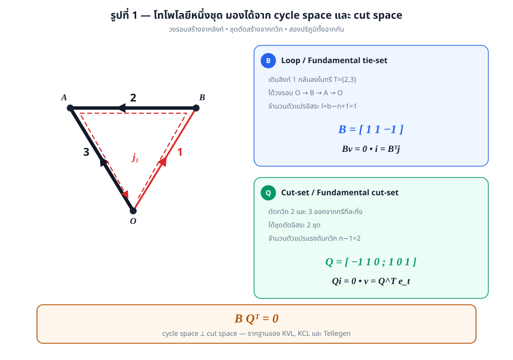
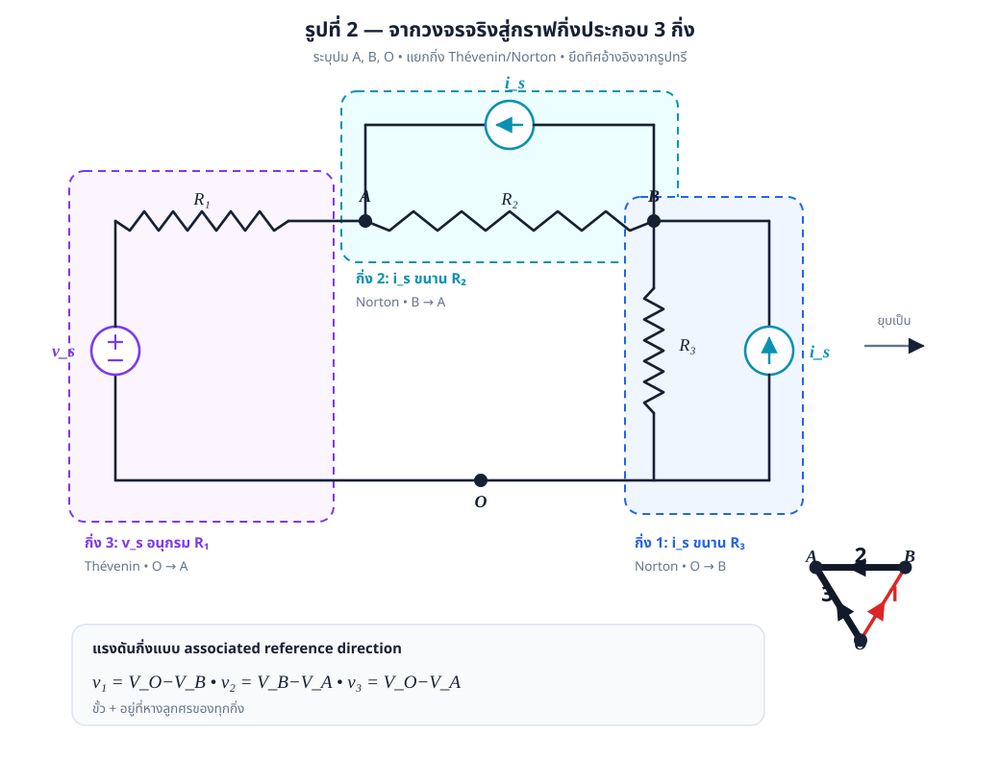
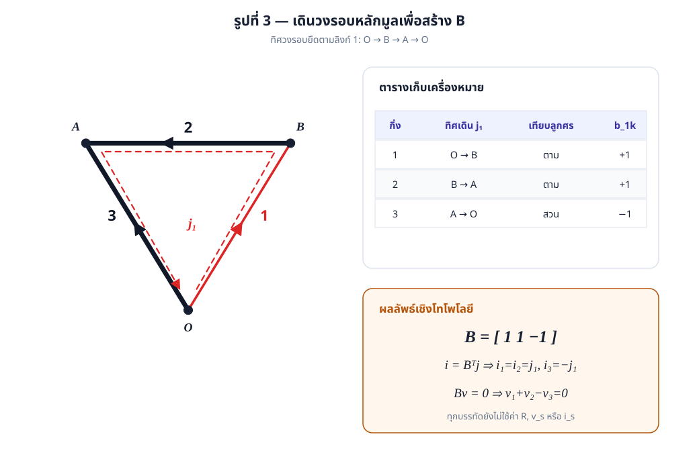
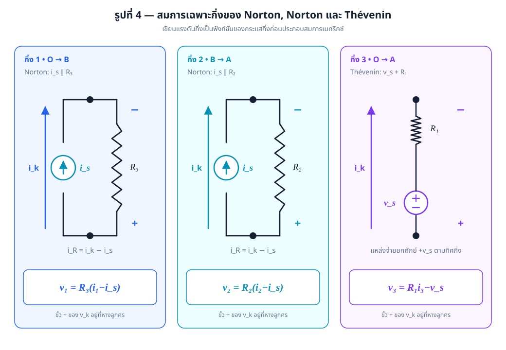
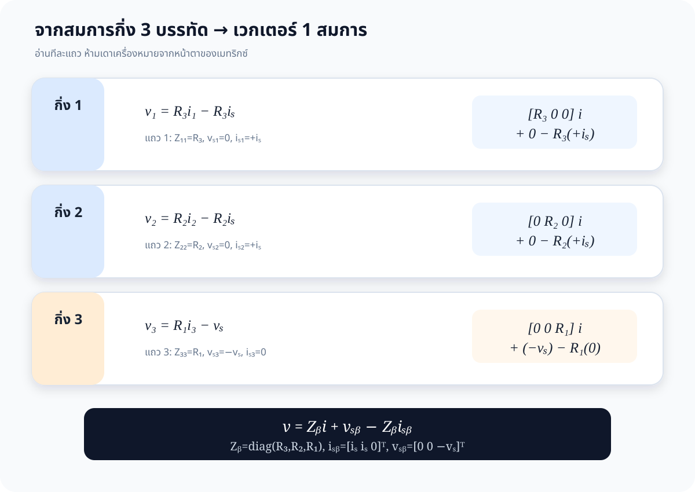
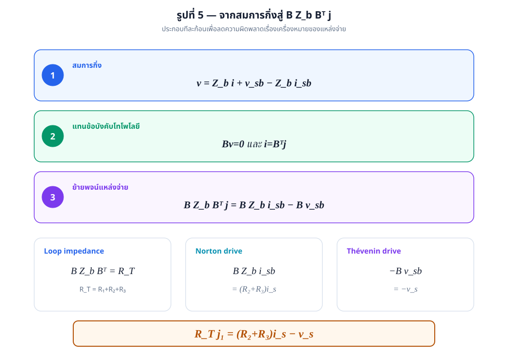
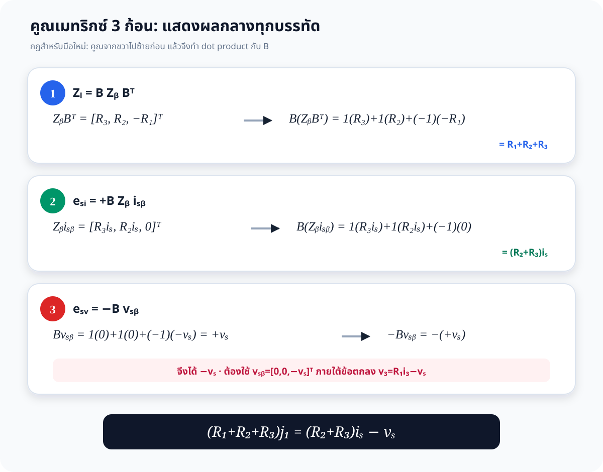
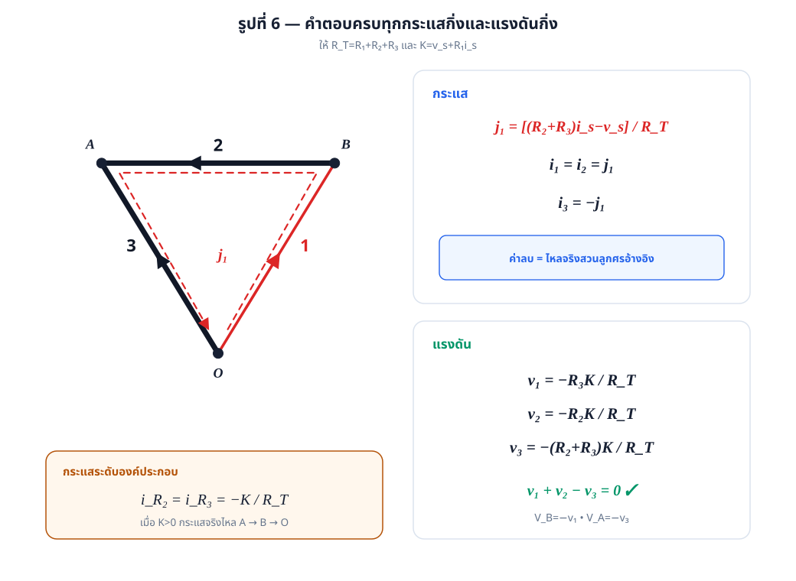
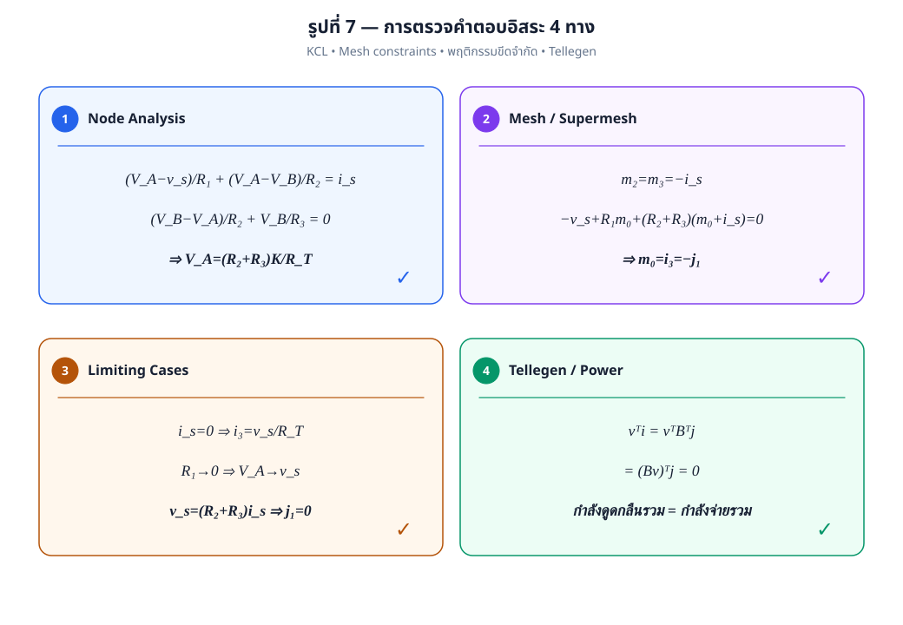
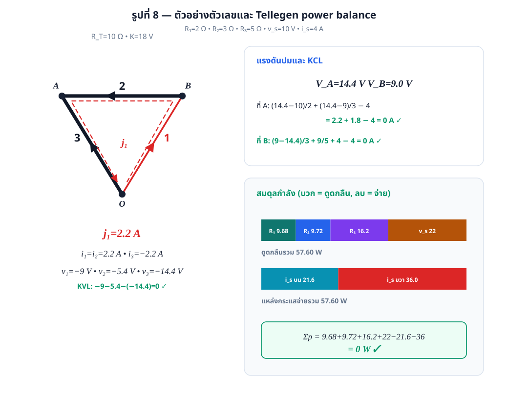

# เฉลยละเอียด โจทย์ [4.4] — การวิเคราะห์วงรอบหลักมูลด้วยเมทริกซ์ tie-set

> **โจทย์:** [problem.md](problem.md) • **การอ่านรูป:** [figure-analysis.md](figure-analysis.md)  
> **ทฤษฎีอ้างอิง:** [เอกสารบรรยายบทที่ 4](../lecture/303212S1Y2569lec04_5048.pdf) หน้า 91–94
> (ทฤษฎีบทวงรอบหลักมูลและสมการ (4-1)–(4-7))

---

## คำตอบโดยสรุป

กำหนด

$$
R_T\equiv R_1+R_2+R_3,\qquad K\equiv v_s+R_1i_s,\qquad R_k>0
$$

โดยแหล่งกระแสทั้งสองตัวมีค่าเท่ากันคือ $i_s$ ตามโจทย์ และเรียงเวกเตอร์กิ่งเป็น $[1,2,3]$

$$
\boxed{\mathbf B=\begin{bmatrix}1&1&-1\end{bmatrix}},\qquad
\boxed{(R_1+R_2+R_3)j_1=(R_2+R_3)i_s-v_s}
$$

$$
\boxed{j_1=\frac{(R_2+R_3)i_s-v_s}{R_T}}
$$

$$
\boxed{i_1=i_2=j_1=\frac{(R_2+R_3)i_s-v_s}{R_T}},\qquad
\boxed{i_3=-j_1=\frac{v_s-(R_2+R_3)i_s}{R_T}}
$$

$$
\boxed{v_1=-\frac{R_3K}{R_T}},\qquad
\boxed{v_2=-\frac{R_2K}{R_T}},\qquad
\boxed{v_3=-\frac{(R_2+R_3)K}{R_T}}
$$

จึงมี $v_1+v_2-v_3=0$ ตาม KVL และถ้าเลือกปมล่าง $O$ เป็น datum จะได้

$$
\boxed{V_B=\frac{R_3K}{R_T}},\qquad
\boxed{V_A=\frac{(R_2+R_3)K}{R_T}}
$$

---

# 0. คู่มืออ่านเมทริกซ์สำหรับนิสิตที่เริ่มจากศูนย์

ส่วนนี้กำหนดความหมายก่อนคำนวณ เพื่อไม่ให้ต้องจินตนาการว่าแถวและหลักมาจากที่ใด

| ตัวแปร | ขนาด | แถวแทนอะไร | หลักแทนอะไร |
|---|---:|---|---|
| $\mathbf B$ | $1\times3$ | วงรอบหลักมูล $j_1$ | กิ่ง $1,2,3$ ตามลำดับ |
| $\mathbf B^{\mathsf T}$ | $3\times1$ | กิ่ง $1,2,3$ | วงรอบ $j_1$ |
| $\mathbf Z_b$ | $3\times3$ | กิ่งที่รับแรงดัน | กิ่งที่มีกระแส; วงจรนี้ไม่มี mutual resistance จึงเป็นแนวทแยง |
| $\mathbf i_b,\mathbf v_b$ | $3\times1$ | สมาชิกที่ $k$ คือกระแส/แรงดันกิ่ง $k$ | หนึ่งหลัก |
| $\mathbf i_{sb},\mathbf v_{sb}$ | $3\times1$ | สมาชิกที่ $k$ คือแหล่งกำเนิดในกิ่ง $k$ | หนึ่งหลัก |
| $\mathbf j$ | $1\times1$ | สมาชิกเดียวคือ $j_1$ | หนึ่งหลัก |

## 0.1 ลำดับกิ่งเป็นกติกาที่ห้ามเปลี่ยนกลางทาง

ทุกเวกเตอร์ในเฉลยเรียงเป็น $[1,2,3]$ ดังนั้น

$$
\mathbf i_b=\begin{bmatrix}i_1\\i_2\\i_3\end{bmatrix},\quad
\mathbf v_b=\begin{bmatrix}v_1\\v_2\\v_3\end{bmatrix}.
$$

กิ่ง 1 มี $R_3$, กิ่ง 2 มี $R_2$, และกิ่ง 3 มี $R_1$ จึงต้องเขียน

$$
\mathbf Z_b=\operatorname{diag}(R_3,R_2,R_1),
$$

ไม่ใช่ $\operatorname{diag}(R_1,R_2,R_3)$. ดัชนีของ $R$ บอกชื่ออุปกรณ์ แต่ตำแหน่งในเมทริกซ์บอกเลขกิ่ง

## 0.2 กฎคูณที่ใช้ตลอดข้อ

ถ้าแถว $[a\ b\ c]$ คูณหลัก $[x\ y\ z]^{\mathsf T}$ จะได้

$$
\begin{bmatrix}a&b&c\end{bmatrix}
\begin{bmatrix}x\\y\\z\end{bmatrix}=ax+by+cz.
$$

สำหรับผลคูณสามตัวให้คูณจากขวาไปซ้ายก่อน ตัวอย่าง

$$
\underbrace{\mathbf B}_{1\times3}
\underbrace{\mathbf Z_b}_{3\times3}
\underbrace{\mathbf B^{\mathsf T}}_{3\times1}
=\underbrace{\mathbf Z_l}_{1\times1}.
$$

ผล $1\times1$ เป็นตัวเลขสเกลาร์หนึ่งค่า เพราะวงจรนี้มีวงรอบอิสระเพียงหนึ่งวง

---

# 1. กรอบความคิด: ความสมมาตรของ loop/tie-set กับ cut-set

## 1.1 ตัวแปรอิสระของวงจรถูกกำหนดโดยโทโพโลยี

วงจรหลังจัดกลุ่มองค์ประกอบตามที่โจทย์กำหนดมี $n=3$ ปมและ $b=3$ กิ่ง ดังนั้น

$$
\underbrace{n-1}_{\text{ทวิก}}=2,\qquad
\underbrace{l=b-n+1}_{\text{ลิงก์/วงรอบอิสระ}}=1
$$

โจทย์เลือกทรี $T=\{2,3\}$ และลิงก์ $L=\{1\}$ มาให้แล้ว การเติมลิงก์ที่ 1 กลับลงในทรี
ทำให้เกิดวงรอบหลักมูลเพียงวงเดียว จึงต้องแก้ตัวแปรกระแสวงรอบเพียง $j_1$ ตัวเดียว

## 1.2 คู่สมมาตรของสมการวงรอบและสมการชุดตัด

| มุมมอง | Loop / Tie-set analysis | Cut-set / Node-like analysis |
|---|---|---|
| โครงสร้างที่สร้างสมการ | เติม **ลิงก์** ลงในทรี | ตัด **ทวิก** ออกจากทรี |
| จำนวนตัวแปรอิสระ | $l=b-n+1=1$ | $n-1=2$ |
| เมทริกซ์หลัก | $\mathbf B\in\mathbb R^{1\times3}$ | $\mathbf Q\in\mathbb R^{2\times3}$ |
| กฎเชิงโทโพโลยี | $\mathbf B\mathbf v_b=\mathbf0$ (KVL) | $\mathbf Q\mathbf i_b=\mathbf0$ (KCL) |
| การสร้างตัวแปรกิ่ง | $\mathbf i_b=\mathbf B^{\mathsf T}\mathbf j$ | $\mathbf v_b=\mathbf Q^{\mathsf T}\mathbf e_t$ |
| เหมาะเมื่อ | $l<n-1$ หรือโจทย์กำหนดลิงก์ | $n-1<l$ หรือแรงดันปมสะดวกกว่า |

สำหรับทรีที่โจทย์กำหนด เมทริกซ์ชุดตัดหลักมูลที่วางทิศตามทวิก 2 และ 3 คือ

$$
\mathbf Q=
\begin{bmatrix}
-1&1&0\\
 1&0&1
\end{bmatrix}
$$

ซึ่งให้ $-i_1+i_2=0$ และ $i_1+i_3=0$ พอดี นอกจากนี้

$$
\boxed{\mathbf B\mathbf Q^{\mathsf T}=\mathbf0}
$$

คือข้อความเชิงพีชคณิตว่า cycle space และ cut space ตั้งฉากกัน ความตั้งฉากนี้เป็นแกนกลางของ
KVL, KCL และทฤษฎีบทของ Tellegen ที่จะใช้ตรวจคำตอบภายหลัง

---

# 2. จากวงจรจริงสู่กราฟกิ่งประกอบ

เลือกชื่อปมดังนี้

- $A$: ปมซ้ายบน ระหว่าง $R_1$ กับกิ่งขนาน $R_2\parallel i_s$
- $B$: ปมขวาบน ระหว่างกิ่งขนาน $R_2\parallel i_s$ กับ $R_3\parallel i_s$
- $O$: รางล่าง เลือกเป็นปมอ้างอิง $V_O=0$

จุดต่อระหว่าง $v_s$ กับ $R_1$ มีดีกรี 2 จึงรวมเป็นกิ่งประกอบเดียวได้ โจทย์จึงนิยามกิ่งไว้ดังนี้

| กิ่ง | ทิศอ้างอิง | ปมต้น $\to$ ปมปลาย | องค์ประกอบภายใน | แบบจำลอง |
|---|---|---|---|---|
| 1 | ขึ้นขวา | $O\to B$ | $i_s$ ขนาน $R_3$ | Norton |
| 2 | ไปซ้าย | $B\to A$ | $i_s$ ขนาน $R_2$ | Norton |
| 3 | ขึ้นซ้าย | $O\to A$ | $v_s$ อนุกรม $R_1$ | Thévenin |

> **ข้อตกลงแรงดัน:** วางขั้ว $+$ ของ $v_k$ ที่หางลูกศรกิ่งและขั้ว $-$ ที่หัวลูกศรกิ่ง
> ดังนั้น $v_k=V_{\text{tail}}-V_{\text{head}}$ และตัวต้านทานในทิศเดียวกันเป็น $v=Ri$

จึงมีความสัมพันธ์ระหว่างแรงดันกิ่งกับแรงดันปมทันทีว่า

$$
v_1=V_O-V_B=-V_B,\qquad
v_2=V_B-V_A,\qquad
v_3=V_O-V_A=-V_A
$$

---

# 3. สร้างเมทริกซ์วงรอบหลักมูล $\mathbf B$

## 3.1 กฎเครื่องหมาย

สำหรับแถวที่แทนวงรอบ $q$ และหลักที่แทนกิ่ง $k$

$$
b_{qk}=\begin{cases}
+1,&\text{กิ่ง }k\text{ อยู่ในวงรอบและทิศเดียวกับวงรอบ}\\
-1,&\text{กิ่ง }k\text{ อยู่ในวงรอบแต่สวนทิศวงรอบ}\\
0,&\text{กิ่ง }k\text{ ไม่อยู่ในวงรอบ}
\end{cases}
$$

ทิศของวงรอบหลักมูลยึดตามทิศของลิงก์ที่ 1 คือ

$$
O\xrightarrow{1}B\xrightarrow{2}A\xrightarrow{3\text{ ย้อนทิศ}}O
$$

| กิ่ง | ทิศกิ่ง | ทิศเดินของ $j_1$ | สมาชิกใน $\mathbf B$ |
|---|---|---|---|
| 1 (ลิงก์) | $O\to B$ | $O\to B$ | $+1$ |
| 2 (ทวิก) | $B\to A$ | $B\to A$ | $+1$ |
| 3 (ทวิก) | $O\to A$ | $A\to O$ | $-1$ |

ดังนั้น เมื่อเรียงหลักเป็น $[1,2,3]$

$$
\boxed{\mathbf B=\begin{bmatrix}1&1&-1\end{bmatrix}}
$$

ถ้าเรียงกิ่งแบบ “ลิงก์ก่อน ทวิกทีหลัง” เมทริกซ์จะอยู่ในรูปมาตรฐาน
$\mathbf B=[\mathbf I_l\mid\mathbf F]=[1\mid1\;-1]$ จึงมี rank เท่ากับ $l=1$ แน่นอน

## 3.2 แปลงกระแสวงรอบเป็นกระแสกิ่ง

จาก KCL และทฤษฎีบทวงรอบหลักมูล

$$
\mathbf i_b=\mathbf B^{\mathsf T}\mathbf j
$$

$$
\begin{bmatrix}i_1\\i_2\\i_3\end{bmatrix}
=\begin{bmatrix}1\\1\\-1\end{bmatrix}j_1
\quad\Longrightarrow\quad
\boxed{i_1=j_1,\ i_2=j_1,\ i_3=-j_1}
$$

ตรวจ KCL ได้ทันที:

$$
\text{ปม }B:\ -i_1+i_2=0,\qquad
\text{ปม }O:\ i_1+i_3=0
$$

## 3.3 สมการ KVL เชิงโทโพโลยี

$$
\mathbf B\mathbf v_b=\mathbf0
$$

$$
\begin{bmatrix}1&1&-1\end{bmatrix}
\begin{bmatrix}v_1\\v_2\\v_3\end{bmatrix}=0
\quad\Longrightarrow\quad
\boxed{v_1+v_2-v_3=0}
$$

สมการในหัวข้อนี้เป็นจริงจากโทโพโลยีล้วน ๆ ยังไม่ต้องทราบชนิดหรือค่าขององค์ประกอบภายในกิ่ง

---

# 4. สมการเฉพาะกิ่ง (branch constitutive relations)

## 4.1 กิ่งที่ 1 — Norton: $i_s\parallel R_3$

แหล่งกระแสและกระแสกิ่งชี้จาก $O\to B$ เหมือนกัน กระแสผ่านตัวต้านทานในทิศอ้างอิงจึงเป็น

$$
i_{R3}=i_1-i_s
$$

$$
\boxed{v_1=R_3(i_1-i_s)=R_3i_1-R_3i_s}
$$

## 4.2 กิ่งที่ 2 — Norton: $i_s\parallel R_2$

แหล่งกระแสและกระแสกิ่งชี้จาก $B\to A$ เหมือนกัน จึงมี

$$
i_{R2}=i_2-i_s
$$

$$
\boxed{v_2=R_2(i_2-i_s)=R_2i_2-R_2i_s}
$$

## 4.3 กิ่งที่ 3 — Thévenin: $v_s$ อนุกรม $R_1$

เดินตามทิศกิ่งจาก $O\to A$: แหล่งแรงดันยกศักย์จาก $-$ ไป $+$ เท่ากับ $v_s$
แล้วตัวต้านทานลดศักย์ $R_1i_3$ ดังนั้น

$$
V_A-V_O=v_s-R_1i_3
$$

แต่ $v_3=V_O-V_A$ จึงได้

$$
\boxed{v_3=R_1i_3-v_s}
$$

## 4.4 รวมเป็นสมการกิ่งแบบเมทริกซ์

ให้

$$
\mathbf Z_b=
\begin{bmatrix}
R_3&0&0\\0&R_2&0\\0&0&R_1
\end{bmatrix},\qquad
\mathbf i_{sb}=\begin{bmatrix}i_s\\i_s\\0\end{bmatrix},\qquad
\mathbf v_{sb}=\begin{bmatrix}0\\0\\-v_s\end{bmatrix}
$$

$\mathbf v_{sb}$ เป็นเวกเตอร์ **แรงดันตกแบบมีเครื่องหมายตามทิศกิ่ง** กิ่งที่ 3 จึงมีค่า $-v_s$
เพราะแหล่งจ่ายเป็นแรงดันยกเมื่อเดิน $O\to A$ แล้วเขียนรวมได้ว่า

$$
\boxed{\mathbf v_b=\mathbf Z_b\mathbf i_b+\mathbf v_{sb}-\mathbf Z_b\mathbf i_{sb}}
$$

ซึ่งตรงกับรูปแบบสมการ (4-3) ของเอกสารบรรยาย และเมื่อกระจายแต่ละแถวจะได้สมการกิ่งทั้งสามข้างต้นพอดี

### 4.5 กระจายสมการเมทริกซ์กลับเป็นสามแถวเพื่อพิสูจน์

แทนเมทริกซ์ทุกตัวโดยยังไม่ยุบขั้น:

$$
\begin{bmatrix}v_1\\v_2\\v_3\end{bmatrix}
=
\begin{bmatrix}R_3&0&0\\0&R_2&0\\0&0&R_1\end{bmatrix}
\begin{bmatrix}i_1\\i_2\\i_3\end{bmatrix}
+\begin{bmatrix}0\\0\\-v_s\end{bmatrix}
-
\begin{bmatrix}R_3&0&0\\0&R_2&0\\0&0&R_1\end{bmatrix}
\begin{bmatrix}i_s\\i_s\\0\end{bmatrix}.
$$

ผลคูณเมทริกซ์สองชุดคือ

$$
\begin{bmatrix}R_3&0&0\\0&R_2&0\\0&0&R_1\end{bmatrix}
\begin{bmatrix}i_1\\i_2\\i_3\end{bmatrix}
=\begin{bmatrix}R_3i_1\\R_2i_2\\R_1i_3\end{bmatrix},
$$

$$
\begin{bmatrix}R_3&0&0\\0&R_2&0\\0&0&R_1\end{bmatrix}
\begin{bmatrix}i_s\\i_s\\0\end{bmatrix}
=\begin{bmatrix}R_3i_s\\R_2i_s\\0\end{bmatrix}.
$$

แทนผลคูณกลับ:

$$
\begin{bmatrix}v_1\\v_2\\v_3\end{bmatrix}
=
\begin{bmatrix}R_3i_1\\R_2i_2\\R_1i_3\end{bmatrix}
+\begin{bmatrix}0\\0\\-v_s\end{bmatrix}
-\begin{bmatrix}R_3i_s\\R_2i_s\\0\end{bmatrix}
$$

$$
=\begin{bmatrix}
R_3i_1-R_3i_s\\
R_2i_2-R_2i_s\\
R_1i_3-v_s
\end{bmatrix}.
$$

ดังนั้นแถว 1, 2, 3 คือสมการในหัวข้อ 4.1, 4.2, 4.3 ตามลำดับ ไม่มีสมการใดถูกเพิ่มหรือละทิ้ง

---

# 5. สร้างและแก้สมการวงรอบในรูปเมทริกซ์

ในหัวข้อนี้จะไม่ยุบผลคูณสามตัวในบรรทัดเดียว แต่จะแสดงผลคูณกลางทุกตัว

| ก้อน | ขนาดก่อนคูณ | ผลที่ต้องได้ | ความหมาย |
|---|---|---|---|
| $\mathbf B\mathbf Z_b\mathbf B^{\mathsf T}$ | $(1\times3)(3\times3)(3\times1)$ | $1\times1$ | อิมพีแดนซ์วงรอบ $\mathbf Z_l$ |
| $\mathbf B\mathbf Z_b\mathbf i_{sb}$ | $(1\times3)(3\times3)(3\times1)$ | $1\times1$ | แรงขับจากแหล่งกระแส |
| $-\mathbf B\mathbf v_{sb}$ | $(1\times3)(3\times1)$ | $1\times1$ | แรงขับจากแหล่งแรงดัน |

เริ่มจาก $\mathbf B\mathbf v_b=\mathbf0$ แล้วแทนสมการกิ่งและ
$\mathbf i_b=\mathbf B^{\mathsf T}\mathbf j$

$$
\mathbf0=
\mathbf B\left(\mathbf Z_b\mathbf B^{\mathsf T}\mathbf j
+\mathbf v_{sb}-\mathbf Z_b\mathbf i_{sb}\right)
$$

ย้ายพจน์แหล่งจ่ายไปอีกข้าง

$$
\boxed{
\mathbf B\mathbf Z_b\mathbf B^{\mathsf T}\mathbf j
=\mathbf B\mathbf Z_b\mathbf i_{sb}-\mathbf B\mathbf v_{sb}}
$$

คำนวณทีละก้อน โดยคูณจากขวาไปซ้าย

### ก้อนที่ 1: $\mathbf Z_l=\mathbf B\mathbf Z_b\mathbf B^{\mathsf T}$

ขั้นแรก ทรานสโพสแถว $\mathbf B$ ให้เป็นหลัก

$$
\mathbf B^{\mathsf T}=\begin{bmatrix}1\\1\\-1\end{bmatrix}.
$$

ขั้นที่สอง คูณ $\mathbf Z_b\mathbf B^{\mathsf T}$ ทีละแถว

$$
\begin{bmatrix}R_3&0&0\\0&R_2&0\\0&0&R_1\end{bmatrix}
\begin{bmatrix}1\\1\\-1\end{bmatrix}
=\begin{bmatrix}
R_3(1)+0(1)+0(-1)\\
0(1)+R_2(1)+0(-1)\\
0(1)+0(1)+R_1(-1)
\end{bmatrix}
=\begin{bmatrix}R_3\\R_2\\-R_1\end{bmatrix}.
$$

ขั้นที่สาม นำ $\mathbf B$ มาทำ dot product

$$
\mathbf B\mathbf Z_b\mathbf B^{\mathsf T}
=\begin{bmatrix}1&1&-1\end{bmatrix}
\begin{bmatrix}R_3\\R_2\\-R_1\end{bmatrix}
$$

$$
=1(R_3)+1(R_2)+(-1)(-R_1)
=R_1+R_2+R_3=R_T.
$$

### ก้อนที่ 2: $+\mathbf B\mathbf Z_b\mathbf i_{sb}$

ขั้นแรก คูณ $\mathbf Z_b\mathbf i_{sb}$

$$
\begin{bmatrix}R_3&0&0\\0&R_2&0\\0&0&R_1\end{bmatrix}
\begin{bmatrix}i_s\\i_s\\0\end{bmatrix}
=\begin{bmatrix}
R_3i_s+0i_s+0(0)\\
0i_s+R_2i_s+0(0)\\
0i_s+0i_s+R_1(0)
\end{bmatrix}
=\begin{bmatrix}R_3i_s\\R_2i_s\\0\end{bmatrix}.
$$

ขั้นที่สอง คูณด้วย $\mathbf B$

$$
\mathbf B\mathbf Z_b\mathbf i_{sb}
=\begin{bmatrix}1&1&-1\end{bmatrix}
\begin{bmatrix}R_3i_s\\R_2i_s\\0\end{bmatrix}
$$

$$
=1(R_3i_s)+1(R_2i_s)+(-1)(0)
=(R_2+R_3)i_s.
$$

### ก้อนที่ 3: $-\mathbf B\mathbf v_{sb}$

คำนวณ $\mathbf B\mathbf v_{sb}$ ก่อน

$$
\mathbf B\mathbf v_{sb}
=\begin{bmatrix}1&1&-1\end{bmatrix}
\begin{bmatrix}0\\0\\-v_s\end{bmatrix}
$$

$$
=1(0)+1(0)+(-1)(-v_s)=+v_s.
$$

จากนั้นใช้เครื่องหมายลบที่อยู่หน้าก้อนตามสมการ (4-4)

$$
-\mathbf B\mathbf v_{sb}=-(+v_s)=-v_s.
$$

> **เหตุผลที่สมาชิกตัวที่ 3 เป็น $-v_s$:** เรากำหนดสมการกิ่งไว้ว่า
> $v_3=R_1i_3-v_s$ จึงต้องเขียน $\mathbf v_{sb}=[0,0,-v_s]^{\mathsf T}$.
> หากใส่ $+v_s$ ผลจะกลับเครื่องหมายและไม่ตรงกับสมการกิ่งที่พิสูจน์ในหัวข้อ 4.3

ดังนั้น

$$
\underbrace{(R_1+R_2+R_3)}_{\mathbf Z_l}j_1
=\underbrace{(R_2+R_3)i_s}_{+\mathbf B\mathbf Z_b\mathbf i_{sb}}
+\underbrace{(-v_s)}_{-\mathbf B\mathbf v_{sb}}
$$

ตัดวงเล็บ $+(-v_s)$ ให้เป็น $-v_s$:

$$
\boxed{R_Tj_1=(R_2+R_3)i_s-v_s}
$$

และเพราะ $R_k>0\Rightarrow R_T>0$ เมทริกซ์วงรอบ $[R_T]$ ไม่เอกฐาน คำตอบจึงมีเพียงค่าเดียว

$$
\boxed{j_1=\frac{(R_2+R_3)i_s-v_s}{R_T}}
$$

## 5.1 ตรวจด้วยการแทนตรงใน KVL

$$
R_3(j_1-i_s)+R_2(j_1-i_s)-\left[R_1(-j_1)-v_s\right]=0
$$

$$
R_Tj_1-(R_2+R_3)i_s+v_s=0
$$

ตรงกับผลเมทริกซ์ทุกประการ

---

# 6. คำตอบเชิงสัญลักษณ์ครบทุกปริมาณ

## 6.1 กระแสวงรอบและกระแสกิ่ง

$$
\boxed{j_1=\frac{(R_2+R_3)i_s-v_s}{R_T}}
$$

$$
\boxed{i_1=i_2=\frac{(R_2+R_3)i_s-v_s}{R_T}}
$$

$$
\boxed{i_3=\frac{v_s-(R_2+R_3)i_s}{R_T}}
$$

ค่าลบของกระแสใดไม่ได้แปลว่าสูตรผิด แต่แปลว่ากระแสจริงไหลสวนทิศลูกศรอ้างอิงของกิ่งนั้น

## 6.2 แรงดันกิ่ง

กำหนด $K=v_s+R_1i_s$ เพื่อลดความยาวของนิพจน์ จากกิ่งที่ 1

$$
v_1=R_3(j_1-i_s)
$$

แทน $j_1$ และเขียน $i_s=R_Ti_s/R_T$ เพื่อทำส่วนร่วม

$$
v_1
=R_3\left[
\frac{(R_2+R_3)i_s-v_s}{R_T}-\frac{R_Ti_s}{R_T}
\right]
$$

$$
=R_3\frac{(R_2+R_3)i_s-v_s-(R_1+R_2+R_3)i_s}{R_T}
$$

$$
=R_3\frac{-v_s-R_1i_s}{R_T}
=-\frac{R_3(v_s+R_1i_s)}{R_T}
$$

$$
\boxed{v_1=-\frac{R_3K}{R_T}}
$$

กิ่งที่ 2 มีวงเล็บ $j_1-i_s$ ชุดเดียวกับกิ่ง 1 แต่คูณด้วย $R_2$

$$
v_2=R_2(j_1-i_s)
=R_2\frac{-v_s-R_1i_s}{R_T}
=-\frac{R_2(v_s+R_1i_s)}{R_T}
$$

$$
\boxed{v_2=-\frac{R_2K}{R_T}}
$$

กิ่งที่ 3 ใช้ $i_3=-j_1$ ก่อน แล้วทำส่วนร่วมอย่างชัดเจน

$$
v_3=R_1(-j_1)-v_s
$$

$$
=-R_1\frac{(R_2+R_3)i_s-v_s}{R_T}-\frac{R_Tv_s}{R_T}
$$

$$
=\frac{-R_1(R_2+R_3)i_s+R_1v_s-(R_1+R_2+R_3)v_s}{R_T}
$$

$$
=\frac{-R_1(R_2+R_3)i_s-(R_2+R_3)v_s}{R_T}
$$

$$
=-\frac{(R_2+R_3)(v_s+R_1i_s)}{R_T}
$$

$$
\boxed{v_3=-\frac{(R_2+R_3)K}{R_T}}
$$

ตรวจ KVL:

$$
v_1+v_2-v_3
=-\frac{R_3K}{R_T}-\frac{R_2K}{R_T}
+\frac{(R_2+R_3)K}{R_T}=0\qquad\checkmark
$$

## 6.3 แรงดันปมและปริมาณระดับองค์ประกอบ

$$
\boxed{V_B=-v_1=\frac{R_3K}{R_T}},\qquad
\boxed{V_A=-v_3=\frac{(R_2+R_3)K}{R_T}}
$$

กระแสผ่านตัวต้านทาน $R_2$ และ $R_3$ ในทิศกิ่งมีค่าเท่ากัน

$$
i_{R2}=i_2-i_s=i_{R3}=i_1-i_s=-\frac{K}{R_T}
$$

ดังนั้นกระแสจริงในทิศ $A\to B\to O$ คือ $K/R_T$ เมื่อ $K>0$

| องค์ประกอบ | กระแสตามทิศอ้างอิง | แรงดันตามขั้วที่กำหนด |
|---|---|---|
| $R_1$ | $i_3=[v_s-(R_2+R_3)i_s]/R_T$ | $R_1i_3$ |
| $R_2$ | $i_{R2}=-K/R_T$ ในทิศ $B\to A$ | $v_2=-R_2K/R_T$ |
| $R_3$ | $i_{R3}=-K/R_T$ ในทิศ $O\to B$ | $v_1=-R_3K/R_T$ |
| แหล่งกระแสบน | $i_s$ จาก $B\to A$ | $v_2=V_B-V_A$ |
| แหล่งกระแสขวา | $i_s$ จาก $O\to B$ | $v_1=V_O-V_B$ |
| แหล่งแรงดัน | $i_3$ จากขั้ว $-$ ไปขั้ว $+$ | $v_s$ โดยขั้ว $+$ อยู่ด้านบน |

---

# 7. ตรวจคำตอบอิสระทางที่ 1 — Node Analysis

เลือก $V_O=0$ และเนื่องจากขั้วบนของแหล่งแรงดันมีศักย์ $v_s$ เขียน KCL ที่ $A$ ได้ว่า

$$
\frac{V_A-v_s}{R_1}+\frac{V_A-V_B}{R_2}-i_s=0
\tag{N1}
$$

ที่ปม $B$ แหล่งกระแสบนไหลออก $+i_s$ และแหล่งกระแสขวาไหลเข้า $-i_s$ จึงหักล้างกัน

$$
\frac{V_B-V_A}{R_2}+\frac{V_B}{R_3}+i_s-i_s=0
\tag{N2}
$$

จาก (N2)

$$
V_B=\frac{R_3}{R_2+R_3}V_A
$$

แทนใน (N1)

$$
\frac{V_A-v_s}{R_1}+\frac{V_A}{R_2+R_3}=i_s
$$

$$
\boxed{V_A=\frac{(R_2+R_3)(v_s+R_1i_s)}{R_T}},\qquad
\boxed{V_B=\frac{R_3(v_s+R_1i_s)}{R_T}}
$$

ตรงกับผลจาก tie-set โดยใช้ KCL และแรงดันปมซึ่งเป็นชุดตัวแปรคนละชุดอย่างอิสระ $\checkmark$

---

# 8. ตรวจคำตอบอิสระทางที่ 2 — Mesh / Supermesh Analysis

พิจารณากราฟระนาบของวงจรจริง ให้กระแสเมชทั้งสามหมุนตามเข็มนาฬิกา

- $m_0$: เมชหลักที่ผ่าน $v_s,R_1,R_2,R_3$
- $m_2$: เมชเล็กระหว่างแหล่งกระแสบนกับ $R_2$
- $m_3$: เมชเล็กระหว่าง $R_3$ กับแหล่งกระแสขวา

แหล่งกระแสทั้งสองอยู่บนขอบนอกของเมชเล็ก จึงกำหนดกระแสเมชได้โดยตรง

$$
m_2=-i_s,\qquad m_3=-i_s
$$

ถ้าแหล่งกระแสอยู่บนกิ่งร่วมระหว่างสองเมชจึงค่อยรวมเมชเป็น supermesh; สำหรับรูปนี้
ข้อจำกัดแหล่งกระแสข้างต้นทำหน้าที่เดียวกันโดยไม่ต้องสร้างสมการ KVL ผ่านแหล่งกระแส

กระแสผ่าน $R_2$ ในทิศ $A\to B$ คือ $m_0-m_2=m_0+i_s$ และกระแสผ่าน $R_3$
ในทิศ $B\to O$ คือ $m_0-m_3=m_0+i_s$ KVL รอบเมชหลักจึงเป็น

$$
-v_s+R_1m_0+R_2(m_0+i_s)+R_3(m_0+i_s)=0
$$

$$
\boxed{m_0=\frac{v_s-(R_2+R_3)i_s}{R_T}=i_3=-j_1}
$$

และ

$$
m_0+i_s=\frac{v_s+R_1i_s}{R_T}=\frac{K}{R_T}
$$

ตรงกับกระแสจริง $A\to B\to O$ ผ่าน $R_2,R_3$ ที่ได้ในข้อ 6.3 $\checkmark$

---

# 9. ตรวจคำตอบอิสระทางที่ 3 — Limiting Cases

| กรณี | สูตรลดรูป | ความหมายทางกายภาพ |
|---|---|---|
| $i_s=0$ | $j_1=-v_s/R_T$, $i_3=v_s/R_T$ | ปิดแหล่งกระแสเป็นวงจรเปิด เหลือ $v_s$ ขับ $R_1,R_2,R_3$ อนุกรมกัน $\checkmark$ |
| $v_s=0$ | $j_1=(R_2+R_3)i_s/R_T$ | ลัดวงจรแหล่งแรงดัน กระแสแหล่งทั้งสองแบ่งตามเครือข่ายตัวต้านทาน $\checkmark$ |
| $R_1\to0$ | $V_A\to v_s$ | แหล่งแรงดันอุดมคติหนีบปม $A$ ไว้ที่ $v_s$ $\checkmark$ |
| $R_1\to\infty$ | $j_1\to0$, $K/R_T\to i_s$ | กิ่ง 3 เปิด; แหล่งกระแสแต่ละตัวหมุนกระแสผ่าน $R_2,R_3$ โดยกระแสกิ่งรวมเป็นศูนย์ $\checkmark$ |
| $v_s=(R_2+R_3)i_s$ | $j_1=i_1=i_2=i_3=0$ | แรงขับสุทธิรอบวงเป็นศูนย์ แม้ยังมีกระแสภายในกิ่ง Norton $\checkmark$ |
| $R_3\to\infty$ | $j_1\to i_s$, $i_{R3}\to0$ | ทางตัวต้านทาน $R_3$ เปิด แต่แหล่งกระแสขนานยังคงบังคับกระแสกิ่ง 1 $\checkmark$ |

กรณีที่ $j_1=0$ เป็นจุดดักที่ดี: “กระแสกิ่งเป็นศูนย์” ไม่ได้แปลว่าองค์ประกอบทุกตัวไม่มีกระแส
เพราะในแต่ละกิ่ง Norton ยังมี $i_s$ หมุนกลับผ่านตัวต้านทานของกิ่งนั้นได้

---

# 10. ตรวจคำตอบอิสระทางที่ 4 — Tellegen และสมดุลกำลัง

## 10.1 พิสูจน์จากโทโพโลยีโดยไม่แทนค่าองค์ประกอบ

เนื่องจาก $\mathbf i_b=\mathbf B^{\mathsf T}\mathbf j$ และ $\mathbf B\mathbf v_b=\mathbf0$

$$
\boxed{
\mathbf v_b^{\mathsf T}\mathbf i_b
=\mathbf v_b^{\mathsf T}\mathbf B^{\mathsf T}\mathbf j
=(\mathbf B\mathbf v_b)^{\mathsf T}\mathbf j=0}
$$

นี่คือ Tellegen's theorem: ผลรวมกำลังแบบมีเครื่องหมายของทุกกิ่งเป็นศูนย์
โดยอาศัยเพียงว่าแรงดันเป็นไปตาม KVL และกระแสเป็นไปตาม KCL

## 10.2 ตรวจระดับองค์ประกอบเชิงสัญลักษณ์

ให้

$$
m=i_3=\frac{v_s-(R_2+R_3)i_s}{R_T},\qquad
q=\frac{K}{R_T}
$$

$q$ คือกระแสจริงผ่าน $R_2,R_3$ ในทิศ $A\to B\to O$ กำลังดูดกลืนของตัวต้านทานคือ

$$
P_R=R_1m^2+(R_2+R_3)q^2
$$

กำลังดูดกลืนแบบมีเครื่องหมายของแหล่งจ่ายคือ

$$
P_S=-v_sm-R_2i_sq-R_3i_sq
=-v_sm-(R_2+R_3)i_sq
$$

และจากการแทน $m,q$

$$
R_1m^2+(R_2+R_3)q^2
=v_sm+(R_2+R_3)i_sq
$$

จึงได้ $P_R+P_S=0$ ทุกค่าของ $R_k>0,v_s,i_s$ $\checkmark$

---

# 11. ตัวอย่างตัวเลขทดสอบครบวงจร

กำหนด

$$
R_1=2\ \Omega,\quad R_2=3\ \Omega,\quad R_3=5\ \Omega,\quad
v_s=10\ \mathrm V,\quad i_s=4\ \mathrm A
$$

ดังนั้น $R_T=10\ \Omega$, $R_2+R_3=8\ \Omega$ และ $K=18\ \mathrm V$

$$
j_1=\frac{8(4)-10}{10}=2.2\ \mathrm A
$$

$$
\boxed{i_1=i_2=2.2\ \mathrm A},\qquad
\boxed{i_3=-2.2\ \mathrm A}
$$

$$
\boxed{v_1=-9.0\ \mathrm V},\qquad
\boxed{v_2=-5.4\ \mathrm V},\qquad
\boxed{v_3=-14.4\ \mathrm V}
$$

$$
V_B=9.0\ \mathrm V,\qquad V_A=14.4\ \mathrm V
$$

ตรวจ KVL:

$$
-9.0-5.4-(-14.4)=0\ \mathrm V\qquad\checkmark
$$

ตรวจ KCL:

$$
\text{ที่ }A:\quad \frac{14.4-10}{2}+\frac{14.4-9.0}{3}-4=2.2+1.8-4=0
$$

$$
\text{ที่ }B:\quad \frac{9.0-14.4}{3}+\frac{9.0}{5}+4-4=-1.8+1.8=0
$$

## ตารางสมดุลกำลัง

ใช้เครื่องหมายบวกเมื่อดูดกลืนและลบเมื่อจ่าย

| องค์ประกอบ | กำลัง (W) | สถานะ |
|---|---:|---|
| $R_1$ | $2(2.2)^2=9.68$ | ดูดกลืน |
| $R_2$ | $3(1.8)^2=9.72$ | ดูดกลืน |
| $R_3$ | $5(1.8)^2=16.20$ | ดูดกลืน |
| $v_s$ | $-v_si_3=-10(-2.2)=22.00$ | ดูดกลืน |
| $i_s$ บน | $v_2i_s=(-5.4)(4)=-21.60$ | จ่าย |
| $i_s$ ขวา | $v_1i_s=(-9)(4)=-36.00$ | จ่าย |
| **รวม** | **$9.68+9.72+16.20+22-21.60-36=0$** | $\checkmark$ |

กำลังที่แหล่งกระแสทั้งสองจ่ายรวม $57.60\ \mathrm W$ เท่ากับกำลังที่ $R_1,R_2,R_3$
และแหล่งแรงดันดูดกลืนรวม $57.60\ \mathrm W$ พอดี

---

# 12. จุดดักที่พบบ่อย (Common Pitfalls)

| # | จุดดัก | ผลผิดที่มักเกิด | วิธีป้องกัน |
|---|---|---|---|
| 1 | อ่านกิ่ง 2 เป็น $A\to B$ | สมาชิกหลักที่ 2 ของ $\mathbf B$ กลายเป็น $-1$ | อ่านหัวลูกศรในรูป (ข): กิ่ง 2 ชี้ $B\to A$ |
| 2 | อ่านกิ่ง 3 เป็น $A\to O$ | ได้ $i_3=+j_1$ และเครื่องหมาย $v_s$ ผิด | กิ่ง 3 ชี้ $O\to A$ แต่เส้นทางวงรอบเดินย้อนกิ่งนี้ |
| 3 | เขียนกิ่ง Norton เป็น $v_k=R_ki_k$ | ลืมหักกระแสแหล่งจ่าย | ใช้ $i_R=i_k-i_s$ ก่อนเขียน $v_k=R_ki_R$ |
| 4 | รวมแหล่งกระแสสองตัวเป็น $2i_s$ ใน RHS | แรงขับของแต่ละแหล่งถูกคูณด้วยความต้านทานคนละตัว | คำนวณ $\mathbf B\mathbf Z_b\mathbf i_{sb}=R_3i_s+R_2i_s$ |
| 5 | ใช้ $\mathbf B=[1,-1,-1]$ เพราะดูจากรูปสามเหลี่ยม | สมการกระแสกิ่งและ KVL ผิด | เดินจริง $O\to B\to A\to O$: กิ่ง 1,2 ตาม; กิ่ง 3 สวน |
| 6 | ใส่ $\mathbf v_{sb}=[0,0,+v_s]^{\mathsf T}$ โดยไม่เปลี่ยนรูปสมการ | เครื่องหมาย $v_s$ กลับ | ในรูป $\mathbf v=\mathbf Zi+\mathbf v_{sb}-\mathbf Zi_s$ ต้องใช้แรงดันตก signed: $-v_s$ |
| 7 | สรุปว่า $v_1=v_2=v_3$ | สับสนวงจรสามปมกับกิ่งขนานสองปม | ใช้ KVL ที่ถูกต้อง: $v_1+v_2-v_3=0$ |
| 8 | ตกใจที่ $i_3$ หรือ $v_k$ ติดลบ | เปลี่ยนสูตรกลางคัน | ค่าลบหมายถึงทิศจริงตรงข้ามทิศ/ขั้วอ้างอิง |
| 9 | ตรวจกำลังเฉพาะตัวต้านทาน | ผลรวมไม่เป็นศูนย์ | รวมแหล่งจ่ายทั้งสามและใช้ passive sign convention |
| 10 | คิดว่า $j_1=0$ แล้วกระแสทุกองค์ประกอบเป็นศูนย์ | มองข้ามกระแสหมุนภายในกิ่ง Norton | แยกกระแสกิ่ง $i_k$ ออกจากกระแสองค์ประกอบ $i_{Rk},i_s$ |

---

# 13. สรุปสูตรสำหรับทบทวน

ให้ $R_T=R_1+R_2+R_3$ และ $K=v_s+R_1i_s$

| ปริมาณ | สูตร |
|---|---|
| Tie-set matrix | $\mathbf B=[1\ \ 1\ \ -1]$ |
| Fundamental cut-set matrix | $\mathbf Q=\begin{bmatrix}-1&1&0\\1&0&1\end{bmatrix}$ |
| ความตั้งฉาก | $\mathbf B\mathbf Q^{\mathsf T}=\mathbf0$ |
| แปลงกระแส | $\mathbf i_b=\mathbf B^{\mathsf T}\mathbf j$ |
| KVL | $\mathbf B\mathbf v_b=0\Rightarrow v_1+v_2-v_3=0$ |
| สมการกิ่ง | $v_1=R_3(i_1-i_s)$, $v_2=R_2(i_2-i_s)$, $v_3=R_1i_3-v_s$ |
| Branch impedance matrix | $\mathbf Z_b=\operatorname{diag}(R_3,R_2,R_1)$ |
| Loop impedance | $\mathbf B\mathbf Z_b\mathbf B^{\mathsf T}=[R_T]$ |
| สมการรอบ | $R_Tj_1=(R_2+R_3)i_s-v_s$ |
| กระแสวงรอบ | $j_1=[(R_2+R_3)i_s-v_s]/R_T$ |
| กระแสกิ่ง | $i_1=i_2=j_1$, $i_3=-j_1$ |
| แรงดันกิ่ง | $v_1=-R_3K/R_T$, $v_2=-R_2K/R_T$, $v_3=-(R_2+R_3)K/R_T$ |
| แรงดันปม | $V_B=R_3K/R_T$, $V_A=(R_2+R_3)K/R_T$ |
| Tellegen | $\mathbf v_b^{\mathsf T}\mathbf i_b=0$ |

---

# 14. ข้อสังเกตต่อยอด

1. หากแหล่งกระแสสองตัวไม่เท่ากัน ให้แทน
   $\mathbf i_{sb}=[i_{s1},i_{s2},0]^{\mathsf T}$ จะได้
   $R_Tj_1=R_3i_{s1}+R_2i_{s2}-v_s$; สูตรของโจทย์เป็นกรณี $i_{s1}=i_{s2}=i_s$
2. หากกลับทิศ $j_1$ ทั้งแถวของ $\mathbf B$ และค่าของ $j_1$ จะกลับเครื่องหมายพร้อมกัน
   แต่ $\mathbf i_b,\mathbf v_b$ ทางกายภาพไม่เปลี่ยน
3. การเลือกทรีอื่นเปลี่ยนพิกัดของ cycle space แต่ไม่เปลี่ยนคำตอบกิ่ง นี่เหมือนการเปลี่ยนฐานในปริภูมิเวกเตอร์
4. $\mathbf B\mathbf Z_b\mathbf B^{\mathsf T}$ เป็น positive definite เมื่อ $R_k>0$ เพราะ
   $x^{\mathsf T}\mathbf B\mathbf Z_b\mathbf B^{\mathsf T}x
   =(\mathbf B^{\mathsf T}x)^{\mathsf T}\mathbf Z_b(\mathbf B^{\mathsf T}x)>0$ สำหรับ $x\ne0$
   จึงรับประกันเอกลักษณ์ของคำตอบวงรอบ
