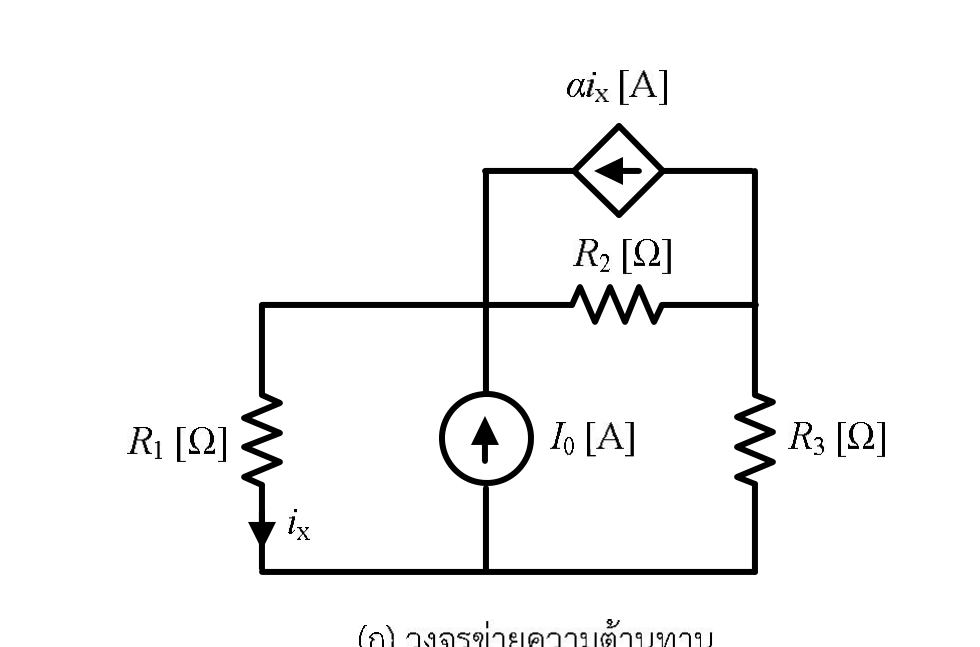
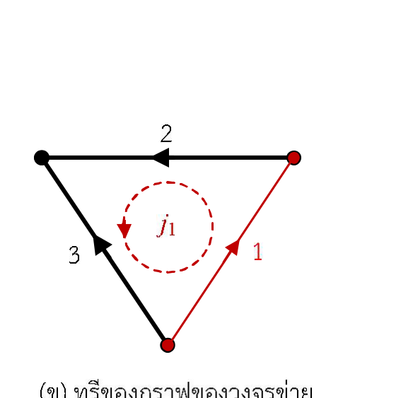

# การวิเคราะห์ภาพโจทย์ [4.5] (Figure Analysis)

> เอกสารนี้วิเคราะห์โครงสร้างของภาพประกอบในโจทย์ข้อ [4.5] อย่างละเอียด เพื่อใช้เป็นฐานข้อมูลในการแก้โจทย์

---

## 1. ภาพรวมของภาพประกอบ

โจทย์ประกอบด้วยรูปหลักสองรูป:
1. **รูปที่ 4บ.5(ก) วงจรข่ายความต้านทาน (Resistive Network)**
2. **รูปที่ 4บ.5(ข) ทรีของกราฟของวงจรข่าย (Tree of Graph)**

---

## 2. การวิเคราะห์รูปที่ 4บ.5(ก) — วงจรข่ายความต้านทาน

### 2.1 ปมไฟฟ้า (Electrical Nodes)
วงจรประกอบด้วย 3 ปมหลัก:
1. **ปมซ้ายบน (Node A)**: จุดเชื่อมต่อระหว่างกิ่งซ้าย (กิ่ง 3) และกิ่งบน (กิ่ง 2) รวมถึงขั้วบนของแหล่งจ่ายกระแส $
2. **ปมขวาบน (Node B)**: จุดเชื่อมต่อระหว่างกิ่งบน (กิ่ง 2) และกิ่งขวา (กิ่ง 1)
3. **ปมล่าง (Node O / Datum)**: ราวด้านล่างที่เชื่อมระหว่างขั้วล่างของกิ่งซ้าย (กิ่ง 3), ขั้วล่างของ $, และขั้วล่างของกิ่งขวา (กิ่ง 1)

### 2.2 องค์ประกอบในแต่ละกิ่ง (Branch Elements)
- **กิ่งซ้าย (กิ่งที่ 3)**:
  - ประกอบด้วยตัวต้านทาน $ ต่อขนานกับแหล่งจ่ายกระแสอิสระ $ (ชี้ขึ้น $\uparrow$)
  - มีตัวแปรควบคุม $ กำหนดทิศทางการไหลผ่านตัวต้านทาน $ ในทิศ **ชี้ลง ($\downarrow$)**
- **กิ่งบน (กิ่งที่ 2)**:
  - ประกอบด้วยตัวต้านทาน $ ต่อขนานกับแหล่งกำเนิดกระแสไม่อิสระ $\alpha i_x$ (CCCS รูปข้าวหลามตัด ชี้ไปทางซ้าย $\leftarrow$)
- **กิ่งขวา (กิ่งที่ 1)**:
  - ประกอบด้วยตัวต้านทาน $ เดี่ยวๆ เชื่อมต่อระหว่างปมล่างกับปมขวาบน

---

## 3. การวิเคราะห์รูปที่ 4บ.5(ข) — กราฟและทรีของวงจรข่าย

### 3.1 ทรี (Tree) และ ลิงก์ (Link)
- **ทวิก / กิ่งทรี (Twigs - $)**: เส้นทึบหนาสีดำ
  - **กิ่งที่ 3**: เชื่อมจากปมล่างไปยังปมซ้ายบน ลูกศรชี้ขึ้น-ซ้าย ($\nwarrow$)
  - **กิ่งที่ 2**: เชื่อมจากปมขวาบนไปยังปมซ้ายบน ลูกศรชี้ไปทางซ้าย ($\leftarrow$)
  - เซตของทรี:  = \{2, 3\}$
- **ลิงก์ / กิ่งคอร์ด (Links - $)**: เส้นบางสีแดง
  - **กิ่งที่ 1**: เชื่อมจากปมล่างไปยังปมขวาบน ลูกศรชี้ขึ้น-ขวา ($\nearrow$)
  - เซตของลิงก์:  = \{1\}$

### 3.2 กระแสวงรอบหลักมูล (Fundamental Loop Current $)
- เส้นประสีแดงวงกลมตรงกลางวงรอบ กำหนด $ หมุนในทิศ **ทวนเข็มนาฬิกา (Counter-Clockwise - CCW)**
- ทิศของ $ สอดคล้องกับทิศทางของลิงก์กิ่งที่ 1 เสมอ:
  - ผ่านกิ่งที่ 1: ทิศทวนเข็มนาฬิกา = ทิศชี้ขึ้น $\implies$ **ตรงกับลูกศรกิ่งที่ 1 (+1)**
  - ผ่านกิ่งที่ 2: ทิศทวนเข็มนาฬิกา = ทิศชี้ซ้าย $\implies$ **ตรงกับลูกศรกิ่งที่ 2 (+1)**
  - ผ่านกิ่งที่ 3: ทิศทวนเข็มนาฬิกา = ทิศชี้ลง $\implies$ **สวนทางกับลูกศรกิ่งที่ 3 (-1)**

---

## 4. เมทริกซ์วงรอบหลักมูล (Fundamental Tie-set Matrix $\mathbf{B}$)

จากการเดินรอบวงรอบหลักมูล $ ตามทิศทวนเข็มนาฬิกา:

52288\mathbf{B} = \begin{bmatrix} b_{11} & b_{12} & b_{13} \end{bmatrix} = \begin{bmatrix} +1 & +1 & -1 \end{bmatrix}52288

ทำให้ได้ความสัมพันธ์ของกระแสกิ่ง:

52288\mathbf{i}_b = \mathbf{B}^{\mathsf T} \mathbf{j} \implies \begin{bmatrix} i_1 \ i_2 \ i_3 \end{bmatrix} = \begin{bmatrix} 1 \ 1 \ -1 \end{bmatrix} [j_1] \implies \begin{cases} i_1 = +j_1 \ i_2 = +j_1 \ i_3 = -j_1 \end{cases}52288
