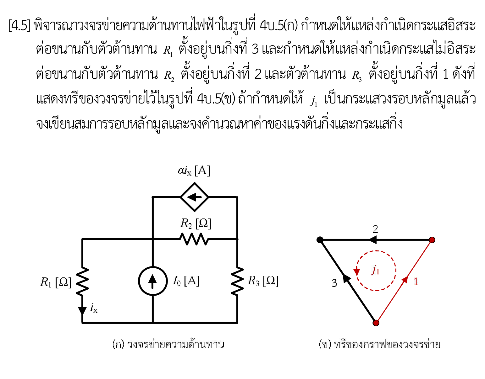

# โจทย์ 4.5 — Loop / Tie-set Analysis ที่มีแหล่งกำเนิดไม่อิสระ

## ข้อความโจทย์

กำหนดวงจรในรูป (ก) และ tree ของกราฟวงจรในรูป (ข) จงใช้ **การวิเคราะห์วงรอบหลักมูล** (fundamental loop หรือ tie-set analysis) หาค่ากระแสและแรงดันทุกกิ่งของวงจร

วงจรประกอบด้วยตัวต้านทาน \(R_1,R_2,R_3\), แหล่งกระแสอิสระ \(I_0\) และแหล่งกระแสควบคุมด้วยกระแส (CCCS) ขนาด \(\alpha i_x\) โดย \(i_x\) คือกระแสผ่าน \(R_1\) ในทิศจากปม \(A\) ลงสู่ปมอ้างอิง \(O\)

## การจัดกิ่งประกอบที่ใช้ในเฉลย

เพื่อตรงกับ tree ที่โจทย์กำหนด ให้รวมอุปกรณ์ที่ต่อขนานและมีแรงดันเท่ากันเป็น 3 กิ่งประกอบ

| กิ่ง | ปลายกิ่งและทิศอ้างอิง | อุปกรณ์ในกิ่ง |
|---|---|---|
| 1 | \(O\to B\) | \(R_3\) |
| 2 | \(B\to A\) | \(R_2\parallel \alpha i_x\) |
| 3 | \(O\to A\) | \(R_1\parallel I_0\) |

กำหนด tree \(T=\{2,3\}\), link \(L=\{1\}\) และให้ทิศวงรอบหลักมูลตามทิศ link 1 คือ

\[
O\xrightarrow{1}B\xrightarrow{2}A\xrightarrow{-3}O.
\]

ดังนั้นเมทริกซ์วงรอบหลักมูลคือ

\[
\mathbf B=\begin{bmatrix}1&1&-1\end{bmatrix}.
\]

## สัญลักษณ์และข้อตกลง

- \(i_k\) เป็นกระแสกิ่งในทิศอ้างอิงของกิ่ง \(k\)
- \(v_k\) เป็นแรงดันกิ่งแบบ **บวกที่ต้นลูกศร ลบที่ปลายลูกศร** ของกิ่ง \(k\)
- \(V_O=0\), \(V_A\) และ \(V_B\) เป็นแรงดันปมเทียบกับ \(O\)
- \(i_x\) ไหลจาก \(A\to O\) ผ่าน \(R_1\)
- ลูกศรของ \(I_0\) ชี้ \(O\to A\)
- ลูกศรของ CCCS \(\alpha i_x\) ชี้ \(B\to A\)
- สมมติ \(R_1,R_2,R_3>0\) และ \(\alpha\) ไม่มีหน่วย

จากข้อตกลงแรงดันกิ่ง

\[
v_1=V_O-V_B=-V_B,\qquad
v_2=V_B-V_A,\qquad
v_3=V_O-V_A=-V_A.
\]

> หมายเหตุ: สูตรคำตอบทั่วไปใช้เมื่อ \(D=R_1+R_3+(1-\alpha)R_2\ne0\) ส่วนกรณี \(D=0\) ต้องพิจารณาแยก เพราะระบบอุดมคติเป็นเอกฐาน

## ไฟล์ประกอบ

- [วิเคราะห์ภาพและสัญกรณ์](./figure-analysis.md)
- [เฉลยฉบับสมบูรณ์](./solution.md)
- [Interactive Reader](./index.html)
