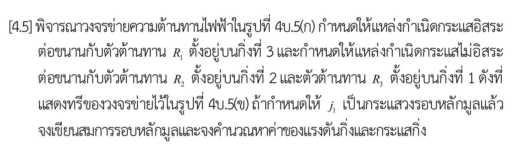

# โจทย์ [4.5] — สมการวงรอบหลักมูลของวงจรข่ายความต้านทานที่มีแหล่งกำเนิดไม่อิสระ

> ที่มา: แบบฝึกหัดท้ายบทที่ 4 (การวิเคราะห์วงรอบ / Loop–Tie-set Analysis) — หน้า 105
> เอกสารบรรยาย: [303212S1Y2569lec04_5048.pdf](../lecture/303212S1Y2569lec04_5048.pdf)
> ไฟล์ภาพต้นฉบับ: [problem.png](problem.png)

---

## 1. คำโจทย์ (ถอดความจากภาพ)

> **[4.5]** พิจารณาวงจรข่ายความต้านทานไฟฟ้าในรูปที่ 4บ.5(ก) กำหนดให้แหล่งกำเนิดกระแสอิสระต่อขนานกับตัวต้านทาน $ ตั้งอยู่บน **กิ่งที่ 3** และกำหนดให้แหล่งกำเนิดกระแสไม่อิสระต่อขนานกับตัวต้านทาน $ ตั้งอยู่บน **กิ่งที่ 2** และตัวต้านทาน $ ตั้งอยู่บน **กิ่งที่ 1** ดังที่แสดงทรีของวงจรข่ายไว้ในรูปที่ 4บ.5(ข) ถ้ากำหนดให้ $ เป็นกระแสวงรอบหลักมูลแล้ว จงเขียนสมการรอบหลักมูลและจงคำนวณหาค่าของแรงดันกิ่งและกระแสกิ่ง

---

## 2. รูปประกอบที่สกัดออกมา

| รูป | ภาพ | คำบรรยาย |
|---|---|---|
| 4บ.5(ก) |  | วงจรข่ายความต้านทาน — บอก **ตัวองค์ประกอบ แหล่งจ่ายกระแสอิสระ $ แหล่งจ่ายกระแสไม่อิสระ $\alpha i_x$ และตัวแปรควบคุม * |
| 4บ.5(ข) |  | ทรีของกราฟของวงจรข่าย — บอก **การกำหนดกิ่ง (1, 2, 3) ทิศอ้างอิง ทรี และทิศของ * |

> อ่านการวิเคราะห์ทีละจุดของทั้งสองรูปได้ที่ [figure-analysis.md](figure-analysis.md)

---

## 3. สิ่งที่กำหนดให้ (Given)

| สัญลักษณ์ | ความหมาย | หน่วย / ชนิด |
|---|---|---|
| $ | แหล่งกำเนิดกระแสอิสระ (Independent Current Source) ขนาน $ บนกิ่งที่ 3 ลูกศรชี้ขึ้น $\uparrow$ | $\text{A}$ |
| $\alpha i_x$ | แหล่งกำเนิดกระแสไม่อิสระควบคุมด้วยกระแส (CCCS) ขนาน $ บนกิ่งที่ 2 ลูกศรชี้ซ้าย $\leftarrow$ | $\text{A}$ |
| $ | ตัวแปรควบคุม (Controlling Variable) คือกระแสที่ไหลลงผ่านตัวต้านทาน $ | $\text{A}$ |
| $\alpha$ | อัตราขยายกระแส (Current Gain / Dimensionless Parameter) | - |
| $ | ตัวต้านทานบนกิ่งที่ 3 | $\Omega$ |
| $ | ตัวต้านทานบนกิ่งที่ 2 | $\Omega$ |
| $ | ตัวต้านทานบนกิ่งที่ 1 | $\Omega$ |

**ข้อกำหนดเชิงโทโปโลยีที่โจทย์บังคับไว้**

- **กิ่งที่ 3 (Norton Form)**: $ ขนาน $ เชื่อมระหว่างปมล่างกับปมซ้ายบน ทิศอ้างอิงชี้ขึ้น-ซ้าย ($\nwarrow$)
- **กิ่งที่ 2 (Norton Form with CCCS)**: $\alpha i_x$ ขนาน $ เชื่อมระหว่างปมขวาบนกับปมซ้ายบน ทิศอ้างอิงชี้ไปทางซ้าย ($\leftarrow$)
- **กิ่งที่ 1 (Pure Resistor)**: $ เดี่ยวๆ เชื่อมระหว่างปมล่างกับปมขวาบน ทิศอ้างอิงชี้ขึ้น-ขวา ($\nearrow$)
- **ทรีของกราฟ**  = \{\text{กิ่งที่ 2, กิ่งที่ 3}\}$ (เส้นหนาสีดำในรูป ข)
- **โค-ทรี (ลิงก์)**  = \{\text{กิ่งที่ 1}\}$ (เส้นบางสีแดงในรูป ข)
- $ คือ **กระแสวงรอบหลักมูล (Fundamental Loop Current)** ที่เกิดจากลิงก์ที่ 1 หมุนทวนเข็มนาฬิกา (CCW)

---

## 4. สิ่งที่ต้องหา (Find)

1. **สมการรอบหลักมูล (Fundamental Loop Equation)** ในรูปของ $
2. **กระแสวงรอบหลักมูล** $
3. **กระแสกิ่ง (Branch Currents)** ,\ i_2,\ i_3$
4. **แรงดันกิ่ง (Branch Voltages)** ,\ v_2,\ v_3$
5. **กระแสตัวแปรควบคุม** $

---

## 5. ข้อตกลงเรื่องสัญกรณ์ที่ใช้ตลอดการวิเคราะห์

| สัญลักษณ์ | ความหมาย |
|---|---|
| $ | จำนวนปม (node) ของกราฟ  3$ |
| $ | จำนวนกิ่ง (branch) ของกราฟ  3$ |
|  = b - n + 1$ | จำนวนลิงก์ = จำนวนวงรอบหลักมูล = จำนวนสมการรอบ  3 - 3 + 1 = 1$ |
| ,\ v_k$ | กระแสกิ่งและแรงดันกิ่งของกิ่งที่ $ (=1,2,3$) |
| $\mathbf{i}_b,\ \mathbf{v}_b$ | เวกเตอร์กระแสกิ่งและแรงดันกิ่ง $\mathbf{i}_b = [i_1, i_2, i_3]^{\mathsf T}$, $\mathbf{v}_b = [v_1, v_2, v_3]^{\mathsf T}$ |
| $\mathbf{B}$ | เมทริกซ์วงรอบหลักมูล (Fundamental Tie-Set Matrix) ขนาด  \times 3$ |
| $\mathbf{j}$ | เวกเตอร์กระแสวงรอบ $\mathbf{j} = [j_1]$ |

**เครื่องหมายกำกับแบบสัมพันธ์ (Associated Reference Direction)**:
- ลูกศรบนกิ่งของกราฟกำหนดทิศทางบวกของกระแสกิ่ง $
- ขั้วบวก $+$ ของแรงดันกิ่ง $ วางไว้ที่ **หางลูกศร** และขั้วลบ 569X$ อยู่ที่ **หัวลูกศร** เสมอ
