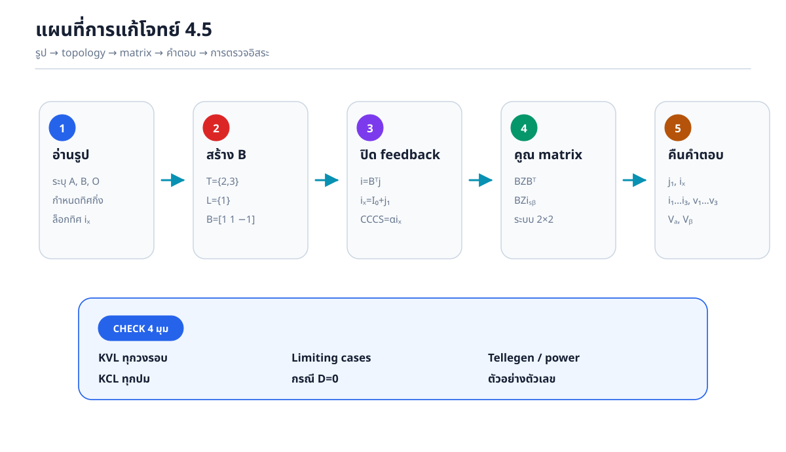
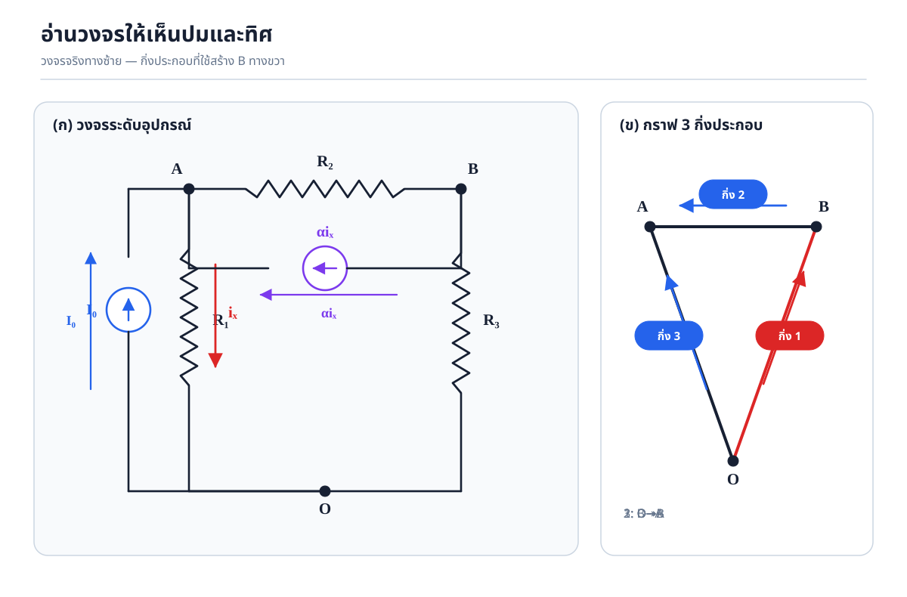
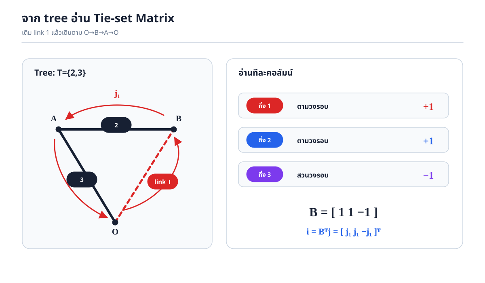
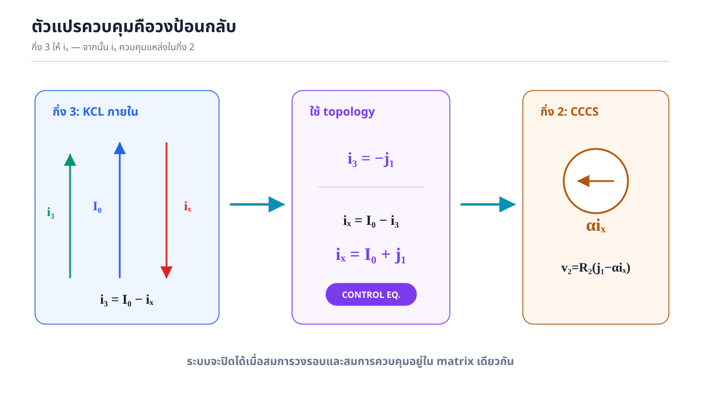
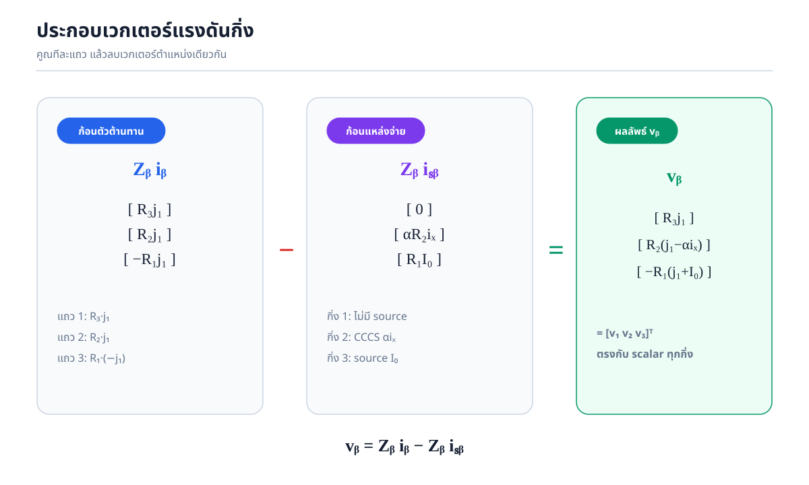
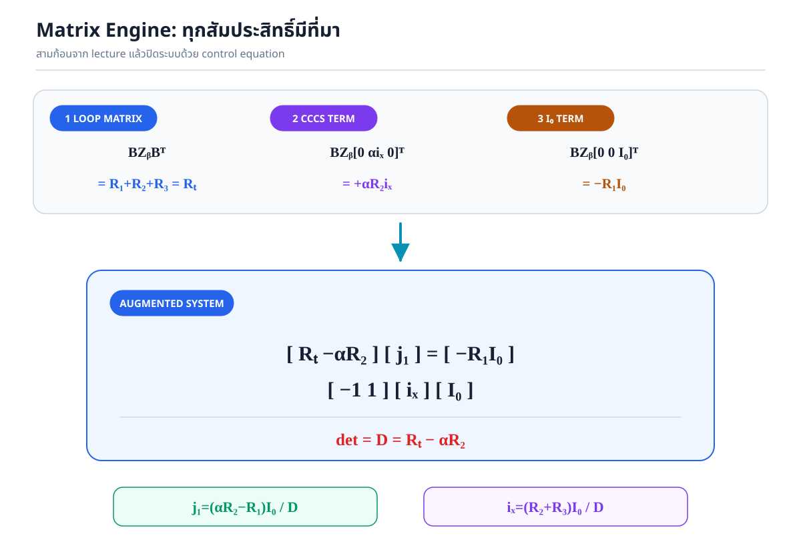
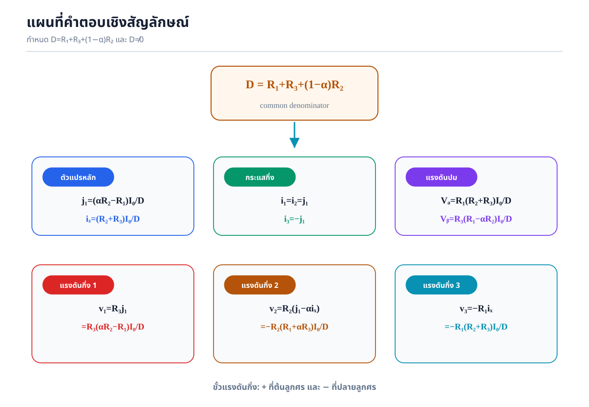
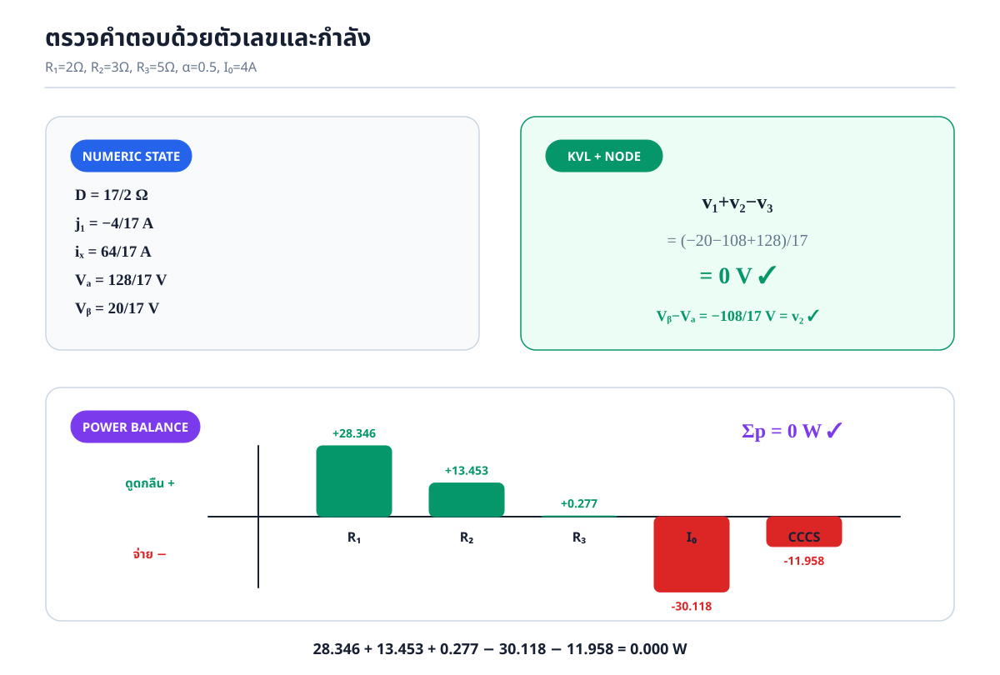

# เฉลยโจทย์ 4.5 — Fundamental Loop / Tie-set Analysis with CCCS

> **เป้าหมาย:** สร้างคำตอบจากรูปวงจรอย่างเป็นระบบด้วยเมทริกซ์วงรอบหลักมูล \(\mathbf B\) จัดการแหล่งกระแสควบคุม \(\alpha i_x\) โดยไม่ทิ้งตัวแปรควบคุมไว้กลางทาง และตรวจคำตอบอิสระครบทั้ง KVL, KCL, limiting cases และ Tellegen’s theorem

---

## สารบัญวิธีคิด

1. อ่านปมและทิศจากรูป
2. รวมอุปกรณ์ขนานเป็น 3 กิ่งประกอบ
3. เลือก tree/link และสร้าง \(\mathbf B\)
4. เปลี่ยนกระแสวงรอบเป็นกระแสกิ่งด้วย \(\mathbf i_b=\mathbf B^{\mathsf T}\mathbf j\)
5. เขียนสมการควบคุม \(i_x=I_0+j_1\)
6. สร้างสมการกิ่ง \(\mathbf v_b=\mathbf Z_b\mathbf i_b-\mathbf Z_b\mathbf i_{sb}\)
7. คูณเมทริกซ์ทุกก้อนและประกอบระบบ \(2\times2\)
8. แก้ \(j_1,i_x\), แล้วคืนค่ากระแส/แรงดันทุกกิ่งและแรงดันทุกปม
9. ตรวจคำตอบอิสระ 4 มุมมอง

---

## 0. คำตอบสุดท้ายสำหรับตรวจระหว่างทำ

กำหนด

\[
R_T=R_1+R_2+R_3,
\qquad
D=R_T-\alpha R_2
=R_1+R_3+(1-\alpha)R_2.
\]

สำหรับ \(D\ne0\)

\[
\boxed{j_1=\frac{(\alpha R_2-R_1)I_0}{D}},
\qquad
\boxed{i_x=\frac{(R_2+R_3)I_0}{D}}.
\]

กระแสกิ่งตามทิศอ้างอิง \(1:O\to B\), \(2:B\to A\), \(3:O\to A\) คือ

\[
\boxed{i_1=i_2=\frac{(\alpha R_2-R_1)I_0}{D}},
\qquad
\boxed{i_3=\frac{(R_1-\alpha R_2)I_0}{D}}.
\]

แรงดันกิ่งแบบขั้วบวกที่ต้นลูกศรกิ่งคือ

\[
\boxed{v_1=\frac{R_3(\alpha R_2-R_1)I_0}{D}},
\]

\[
\boxed{v_2=-\frac{R_2(R_1+\alpha R_3)I_0}{D}},
\qquad
\boxed{v_3=-\frac{R_1(R_2+R_3)I_0}{D}}.
\]

เมื่อ \(V_O=0\)

\[
\boxed{V_A=\frac{R_1(R_2+R_3)I_0}{D}},
\qquad
\boxed{V_B=\frac{R_3(R_1-\alpha R_2)I_0}{D}}.
\]

ส่วนต่อไปพิสูจน์ทุกสูตรโดยไม่ข้ามขั้น

---

## 1. อ่านรูปก่อนเขียนสมการ

วงจรมีปม \(A,B,O\) โดยกำหนด \(V_O=0\)

- \(R_1\) และแหล่ง \(I_0\) ต่อขนานระหว่าง \(A\) กับ \(O\)
- \(R_2\) และ CCCS \(\alpha i_x\) ต่อขนานระหว่าง \(B\) กับ \(A\)
- \(R_3\) ต่อระหว่าง \(O\) กับ \(B\)
- \(i_x\) คือกระแสผ่าน \(R_1\) จาก \(A\to O\)
- \(I_0\) ชี้จาก \(O\to A\)
- \(\alpha i_x\) ชี้จาก \(B\to A\)

### 1.1 ทำไมรวมเป็น 3 กิ่งประกอบได้

อุปกรณ์ที่ต่อขนานมีปลายทั้งสองอยู่ที่ปมคู่เดียวกัน จึงมีแรงดันเท่ากัน เราสามารถแทน

- \(R_1\parallel I_0\) ด้วยกิ่งประกอบ 3
- \(R_2\parallel \alpha i_x\) ด้วยกิ่งประกอบ 2

การรวมนี้ลดกราฟเหลือ \(b=3\) กิ่ง แต่ไม่ได้ทำให้กระแสย่อยหายไป เพราะจะใช้ KCL ภายในกิ่งแยกกระแสของตัวต้านทานและแหล่งจ่ายภายหลัง

### 1.2 ตารางทิศอ้างอิง

| กิ่ง | ทิศกระแสกิ่ง | แรงดันกิ่ง | อุปกรณ์ |
|---:|---|---|---|
| 1 | \(O\to B\) | \(v_1=V_O-V_B\) | \(R_3\) |
| 2 | \(B\to A\) | \(v_2=V_B-V_A\) | \(R_2\parallel\alpha i_x\) |
| 3 | \(O\to A\) | \(v_3=V_O-V_A\) | \(R_1\parallel I_0\) |

เครื่องหมายแรงดันเลือกแบบ associated reference: ขั้วบวกอยู่ที่ต้นลูกศรกระแสกิ่งและขั้วลบอยู่ที่ปลายลูกศร

---

## 2. จาก tree สู่ Fundamental Tie-set Matrix \(\mathbf B\)

โจทย์ให้ tree

\[
T=\{2,3\},\qquad L=\{1\}.
\]

กราฟมี \(n=3\) ปมและ \(b=3\) กิ่ง จำนวนวงรอบหลักมูลจึงเป็น

\[
l=b-n+1=3-3+1=1.
\]

มี link เพียงกิ่ง 1 เมื่อเติมกิ่ง 1 กลับเข้าต้นไม้จะได้วงรอบเดียว กำหนดทิศ \(j_1\) ตามทิศ link 1:

\[
O\xrightarrow{1}B\xrightarrow{2}A\xrightarrow{-3}O.
\]

อ่านสมาชิกแถวของ \(\mathbf B\) ทีละคอลัมน์

| กิ่ง | กิ่งอยู่ในวงรอบหรือไม่ | เทียบทิศกิ่งกับ \(j_1\) | ค่า |
|---:|---|---|---:|
| 1 | อยู่ | เหมือนกัน | \(+1\) |
| 2 | อยู่ | เหมือนกัน | \(+1\) |
| 3 | อยู่ | สวนกัน | \(-1\) |

ดังนั้น

\[
\boxed{\mathbf B=\begin{bmatrix}1&1&-1\end{bmatrix}},
\qquad
\boxed{\mathbf B^{\mathsf T}=\begin{bmatrix}1\\1\\-1\end{bmatrix}}.
\]

### 2.1 ความหมายของสมการ topology สองสมการ

Tie-set matrix เชื่อมตัวแปรวงรอบและตัวแปรกิ่งด้วย

\[
\boxed{\mathbf i_b=\mathbf B^{\mathsf T}\mathbf j}
\quad\text{และ}\quad
\boxed{\mathbf B\mathbf v_b=\mathbf0}.
\]

สมการแรกทำให้ KCL เป็นจริงโดยโครงสร้าง ส่วนสมการที่สองคือ KVL ของวงรอบหลักมูล

---

## 3. คูณ \(\mathbf i_b=\mathbf B^{\mathsf T}\mathbf j\) ทีละแถว

เพราะมีวงรอบเดียว

\[
\mathbf j=\begin{bmatrix}j_1\end{bmatrix}.
\]

แทนค่า

\[
\begin{bmatrix}
i_1\\ i_2\\ i_3
\end{bmatrix}
=
\begin{bmatrix}
1\\1\\-1
\end{bmatrix}
\begin{bmatrix}j_1\end{bmatrix}.
\]

คูณทีละแถว

\[
i_1=(1)j_1=j_1,
\]

\[
i_2=(1)j_1=j_1,
\]

\[
i_3=(-1)j_1=-j_1.
\]

จึงได้

\[
\boxed{
\mathbf i_b=
\begin{bmatrix}j_1\\j_1\\-j_1\end{bmatrix}}
\quad\Longleftrightarrow\quad
\boxed{i_1=j_1,\ i_2=j_1,\ i_3=-j_1}.
\]

### จุดสังเกต

\(i_3=-j_1\) ไม่ได้แปลว่ากระแสจริงต้องติดลบ แต่แปลว่าทิศกิ่ง 3 ที่เลือก \(O\to A\) สวนกับทิศเดินของวงรอบ \(A\to O\) หากคำตอบตัวเลขของ \(j_1\) ติดลบ ทิศจริงของกระแสทั้งวงรอบจะกลับจากลูกศรที่สมมติไว้ ซึ่งเป็นเรื่องปกติ

---

## 4. สมการตัวแปรควบคุม \(i_x\): ขั้นที่ห้ามข้าม

พิจารณากิ่ง 3 ซึ่งประกอบด้วย \(I_0\) และ \(R_1\) ขนานกัน

- \(I_0\) ไหล \(O\to A\): ตรงกับทิศ \(i_3\)
- \(i_x\) ผ่าน \(R_1\) ไหล \(A\to O\): สวนกับทิศ \(i_3\)

ดังนั้นกระแสสุทธิตามทิศกิ่ง 3 คือ

\[
i_3=(+I_0)+(-i_x)=I_0-i_x.
\]

ย้ายข้างอย่างละเอียด

\[
i_3=I_0-i_x,
\]

\[
i_3+i_x=I_0,
\]

\[
i_x=I_0-i_3.
\]

แต่จาก topology \(i_3=-j_1\) จึงได้

\[
i_x=I_0-(-j_1)
=I_0+j_1.
\]

ดังนั้นสมการควบคุมคือ

\[
\boxed{i_x-j_1=I_0}.
\]

สมการนี้จำเป็น เพราะแหล่ง \(\alpha i_x\) ไม่ใช่ค่าคงที่อิสระ หากนำ \(\alpha i_x\) ใส่ในเวกเตอร์แหล่งจ่ายแล้วแก้เฉพาะ \(j_1\) จะยังไม่ใช่ระบบปิด

---

## 5. สมการเฉพาะกิ่งแบบสเกลาร์

### 5.1 กิ่ง 1: \(R_3\)

กระแสผ่าน \(R_3\) คือ \(i_1\) ในทิศอ้างอิงเดียวกับแรงดันกิ่ง จึงใช้ Ohm’s law ได้ทันที

\[
v_1=R_3i_1.
\]

แทน \(i_1=j_1\)

\[
\boxed{v_1=R_3j_1}.
\]

### 5.2 กิ่ง 2: \(R_2\parallel \alpha i_x\)

กระแสกิ่ง \(i_2\) เป็นผลรวมของ

- กระแสตัวต้านทาน \(i_{R_2}\) จาก \(B\to A\)
- กระแส CCCS \(\alpha i_x\) จาก \(B\to A\)

KCL ภายในกิ่งให้

\[
i_2=i_{R_2}+\alpha i_x.
\]

แก้หากระแสตัวต้านทาน

\[
i_{R_2}=i_2-\alpha i_x.
\]

ดังนั้น

\[
v_2=R_2i_{R_2}
=R_2(i_2-\alpha i_x).
\]

แทน \(i_2=j_1\)

\[
\boxed{v_2=R_2(j_1-\alpha i_x)}.
\]

### 5.3 กิ่ง 3: \(R_1\parallel I_0\)

กระแสตัวต้านทานในทิศกิ่ง \(O\to A\) เท่ากับ \(-i_x\) เพราะนิยาม \(i_x\) จาก \(A\to O\) ดังนั้น

\[
v_3=R_1(-i_x)=-R_1i_x.
\]

หรือเริ่มจากรูป Norton ของกิ่ง

\[
i_3=i_{R_1}+I_0
\quad\Longrightarrow\quad
i_{R_1}=i_3-I_0,
\]

จึงได้

\[
v_3=R_1(i_3-I_0).
\]

แทน \(i_3=-j_1\)

\[
v_3=R_1(-j_1-I_0)
=-R_1(j_1+I_0).
\]

เนื่องจาก \(i_x=j_1+I_0\) สองรูปจึงเท่ากัน

\[
\boxed{v_3=-R_1(j_1+I_0)=-R_1i_x}.
\]

---

## 6. สมการกิ่งแบบเมทริกซ์

เอกสารบรรยายบทที่ 4 ใช้แม่แบบ Norton ในโดเมนกิ่ง

\[
\boxed{\mathbf v_b=\mathbf Z_b\mathbf i_b-\mathbf Z_b\mathbf i_{sb}+\mathbf v_{sb}}.
\]

วงจรนี้ไม่มีแหล่งแรงดันอนุกรม จึงมี \(\mathbf v_{sb}=\mathbf0\) และเหลือ

\[
\boxed{\mathbf v_b=\mathbf Z_b\mathbf i_b-\mathbf Z_b\mathbf i_{sb}}.
\]

### 6.1 สร้างเวกเตอร์และเมทริกซ์ทีละตัว

เรียงกิ่งเป็น \([1,2,3]\)

\[
\mathbf v_b=
\begin{bmatrix}v_1\\v_2\\v_3\end{bmatrix},
\qquad
\mathbf i_b=
\begin{bmatrix}i_1\\i_2\\i_3\end{bmatrix}.
\]

เมทริกซ์อิมพีแดนซ์กิ่งเป็นแนวทแยง เพราะตัวต้านทานแต่ละกิ่งไม่คัปปลิงกันโดยตรง

\[
\boxed{
\mathbf Z_b=
\begin{bmatrix}
R_3&0&0\\
0&R_2&0\\
0&0&R_1
\end{bmatrix}}.
\]

เวกเตอร์แหล่งกระแสเรียงตามกิ่งคือ

\[
\boxed{
\mathbf i_{sb}=
\begin{bmatrix}
0\\
\alpha i_x\\
I_0
\end{bmatrix}}.
\]

เครื่องหมายทุกตัวเป็นบวกในเวกเตอร์ เพราะลูกศรแหล่งกระแสทั้งกิ่ง 2 และกิ่ง 3 ตรงกับทิศกิ่งที่กำหนด เครื่องหมายลบอยู่ในแม่แบบ \(-\mathbf Z_b\mathbf i_{sb}\) อยู่แล้ว

### 6.2 คูณก้อน \(\mathbf Z_b\mathbf i_b\) ทีละแถว

แทน \(\mathbf i_b=[j_1\;j_1\;-j_1]^{\mathsf T}\)

\[
\mathbf Z_b\mathbf i_b=
\begin{bmatrix}
R_3&0&0\\
0&R_2&0\\
0&0&R_1
\end{bmatrix}
\begin{bmatrix}j_1\\j_1\\-j_1\end{bmatrix}.
\]

แถว 1:

\[
R_3j_1+0(j_1)+0(-j_1)=R_3j_1.
\]

แถว 2:

\[
0(j_1)+R_2j_1+0(-j_1)=R_2j_1.
\]

แถว 3:

\[
0(j_1)+0(j_1)+R_1(-j_1)=-R_1j_1.
\]

ดังนั้น

\[
\boxed{
\mathbf Z_b\mathbf i_b=
\begin{bmatrix}
R_3j_1\\R_2j_1\\-R_1j_1
\end{bmatrix}}.
\]

### 6.3 คูณก้อน \(\mathbf Z_b\mathbf i_{sb}\) ทีละแถว

\[
\mathbf Z_b\mathbf i_{sb}=
\begin{bmatrix}
R_3&0&0\\
0&R_2&0\\
0&0&R_1
\end{bmatrix}
\begin{bmatrix}0\\\alpha i_x\\I_0\end{bmatrix}.
\]

แถว 1:

\[
R_3(0)+0(\alpha i_x)+0(I_0)=0.
\]

แถว 2:

\[
0(0)+R_2(\alpha i_x)+0(I_0)=\alpha R_2i_x.
\]

แถว 3:

\[
0(0)+0(\alpha i_x)+R_1I_0=R_1I_0.
\]

ดังนั้น

\[
\boxed{
\mathbf Z_b\mathbf i_{sb}=
\begin{bmatrix}0\\\alpha R_2i_x\\R_1I_0\end{bmatrix}}.
\]

### 6.4 ลบสองเวกเตอร์เพื่อได้แรงดันกิ่ง

\[
\mathbf v_b=
\begin{bmatrix}
R_3j_1\\R_2j_1\\-R_1j_1
\end{bmatrix}
-
\begin{bmatrix}
0\\\alpha R_2i_x\\R_1I_0
\end{bmatrix}.
\]

ลบสมาชิกตำแหน่งเดียวกัน

\[
\boxed{
\mathbf v_b=
\begin{bmatrix}
R_3j_1\\
R_2j_1-\alpha R_2i_x\\
-R_1j_1-R_1I_0
\end{bmatrix}}
=
\begin{bmatrix}
R_3j_1\\
R_2(j_1-\alpha i_x)\\
-R_1(j_1+I_0)
\end{bmatrix}.
\]

ผลตรงกับสมการสเกลาร์ทั้งสามกิ่งทุกประการ

---

## 7. สร้างสมการวงรอบ \(\mathbf B\mathbf Z_b\mathbf B^{\mathsf T}\mathbf j=\mathbf B\mathbf Z_b\mathbf i_{sb}\)

เริ่มจาก KVL เชิง topology

\[
\mathbf B\mathbf v_b=\mathbf0.
\]

แทน \(\mathbf v_b=\mathbf Z_b\mathbf B^{\mathsf T}\mathbf j-\mathbf Z_b\mathbf i_{sb}\)

\[
\mathbf B\left(
\mathbf Z_b\mathbf B^{\mathsf T}\mathbf j
-\mathbf Z_b\mathbf i_{sb}
\right)=\mathbf0.
\]

กระจาย \(\mathbf B\)

\[
\mathbf B\mathbf Z_b\mathbf B^{\mathsf T}\mathbf j
-\mathbf B\mathbf Z_b\mathbf i_{sb}
=\mathbf0.
\]

ย้ายพจน์แหล่งกระแสไปขวา

\[
\boxed{
\mathbf B\mathbf Z_b\mathbf B^{\mathsf T}\mathbf j
=\mathbf B\mathbf Z_b\mathbf i_{sb}}.
\]

### 7.1 ก้อนที่ 1: \(\mathbf Z_l=\mathbf B\mathbf Z_b\mathbf B^{\mathsf T}\)

แทนค่าทุกเมทริกซ์

\[
\mathbf Z_l=
\begin{bmatrix}1&1&-1\end{bmatrix}
\begin{bmatrix}
R_3&0&0\\
0&R_2&0\\
0&0&R_1
\end{bmatrix}
\begin{bmatrix}1\\1\\-1\end{bmatrix}.
\]

คูณจากขวาก่อน

\[
\mathbf Z_b\mathbf B^{\mathsf T}=
\begin{bmatrix}
R_3&0&0\\
0&R_2&0\\
0&0&R_1
\end{bmatrix}
\begin{bmatrix}1\\1\\-1\end{bmatrix}
=
\begin{bmatrix}
R_3(1)+0(1)+0(-1)\\
0(1)+R_2(1)+0(-1)\\
0(1)+0(1)+R_1(-1)
\end{bmatrix}
=
\begin{bmatrix}R_3\\R_2\\-R_1\end{bmatrix}.
\]

จากนั้นคูณทางซ้ายด้วย \(\mathbf B\)

\[
\mathbf Z_l=
\begin{bmatrix}1&1&-1\end{bmatrix}
\begin{bmatrix}R_3\\R_2\\-R_1\end{bmatrix}.
\]

คูณแบบ row-by-column

\[
\mathbf Z_l=(1)R_3+(1)R_2+(-1)(-R_1).
\]

\[
\boxed{\mathbf Z_l=R_1+R_2+R_3=R_T}.
\]

### 7.2 ก้อนที่ 2: \(\mathbf B\mathbf Z_b\mathbf i_{sb}\)

จากหัวข้อ 6.3 มี

\[
\mathbf Z_b\mathbf i_{sb}=
\begin{bmatrix}0\\\alpha R_2i_x\\R_1I_0\end{bmatrix}.
\]

คูณด้วย \(\mathbf B\)

\[
\mathbf B\mathbf Z_b\mathbf i_{sb}
=
\begin{bmatrix}1&1&-1\end{bmatrix}
\begin{bmatrix}0\\\alpha R_2i_x\\R_1I_0\end{bmatrix}.
\]

คูณทีละสมาชิก

\[
=(1)(0)+(1)(\alpha R_2i_x)+(-1)(R_1I_0).
\]

ดังนั้น

\[
\boxed{
\mathbf B\mathbf Z_b\mathbf i_{sb}
=\alpha R_2i_x-R_1I_0}.
\]

### 7.3 ประกบสองก้อน

\[
(R_1+R_2+R_3)j_1
=\alpha R_2i_x-R_1I_0.
\]

หรือ

\[
\boxed{R_Tj_1-\alpha R_2i_x=-R_1I_0}.
\]

นี่เป็นสมการวงรอบหนึ่งสมการ แต่มีตัวไม่ทราบค่า \(j_1\) และ \(i_x\) จึงต้องประกบกับสมการควบคุม \(i_x-j_1=I_0\)

---

## 8. ระบบเมทริกซ์ขยาย \(2\times2\) และการแก้ทุกขั้น

เรียงสมการสองสมการ

\[
R_Tj_1-\alpha R_2i_x=-R_1I_0,
\]

\[
-j_1+i_x=I_0.
\]

เขียนเป็นเมทริกซ์

\[
\boxed{
\begin{bmatrix}
R_T&-\alpha R_2\\
-1&1
\end{bmatrix}
\begin{bmatrix}j_1\\i_x\end{bmatrix}
=
\begin{bmatrix}-R_1I_0\\I_0\end{bmatrix}}.
\]

### 8.1 ตรวจว่าการคูณเมทริกซ์คืนสมการเดิม

แถวแรก

\[
(R_T)j_1+(-\alpha R_2)i_x=-R_1I_0.
\]

แถวที่สอง

\[
(-1)j_1+(1)i_x=I_0.
\]

จึงไม่มีสัมประสิทธิ์ใดเกิดขึ้นโดยไม่มีที่มา

### 8.2 หา determinant

ให้

\[
\mathbf M=
\begin{bmatrix}
R_T&-\alpha R_2\\
-1&1
\end{bmatrix}.
\]

สำหรับเมทริกซ์ \(2\times2\), \(\det\begin{bmatrix}a&b\\c&d\end{bmatrix}=ad-bc\) ดังนั้น

\[
\det\mathbf M=(R_T)(1)-(-\alpha R_2)(-1).
\]

\[
=R_T-\alpha R_2.
\]

กำหนด

\[
\boxed{D=R_T-\alpha R_2
=R_1+R_3+(1-\alpha)R_2}.
\]

### 8.3 หา \(j_1\) ด้วย Cramer’s rule

แทนคอลัมน์แรกของ \(\mathbf M\) ด้วยเวกเตอร์ขวามือ

\[
\mathbf M_j=
\begin{bmatrix}
-R_1I_0&-\alpha R_2\\
I_0&1
\end{bmatrix}.
\]

หา determinant

\[
\det\mathbf M_j=(-R_1I_0)(1)-(-\alpha R_2)(I_0).
\]

\[
=-R_1I_0+\alpha R_2I_0.
\]

ดึง \(I_0\) ออกเป็นตัวร่วม

\[
\det\mathbf M_j=(\alpha R_2-R_1)I_0.
\]

ดังนั้น

\[
\boxed{
j_1=\frac{\det\mathbf M_j}{\det\mathbf M}
=\frac{(\alpha R_2-R_1)I_0}{D}}.
\]

### 8.4 หา \(i_x\) ด้วย Cramer’s rule

แทนคอลัมน์ที่สองด้วยเวกเตอร์ขวามือ

\[
\mathbf M_x=
\begin{bmatrix}
R_T&-R_1I_0\\
-1&I_0
\end{bmatrix}.
\]

หา determinant

\[
\det\mathbf M_x=(R_T)(I_0)-(-R_1I_0)(-1).
\]

\[
=R_TI_0-R_1I_0.
\]

\[
=(R_T-R_1)I_0.
\]

เพราะ \(R_T-R_1=R_2+R_3\)

\[
\det\mathbf M_x=(R_2+R_3)I_0.
\]

ดังนั้น

\[
\boxed{
i_x=\frac{\det\mathbf M_x}{\det\mathbf M}
=\frac{(R_2+R_3)I_0}{D}}.
\]

### 8.5 ตรวจ \(i_x=I_0+j_1\) โดยแทนคำตอบ

\[
I_0+j_1
=I_0+\frac{(\alpha R_2-R_1)I_0}{D}.
\]

ทำส่วนให้เท่ากัน

\[
=\frac{DI_0+(\alpha R_2-R_1)I_0}{D}.
\]

แทน \(D=R_1+R_2+R_3-\alpha R_2\)

\[
=\frac{
[R_1+R_2+R_3-\alpha R_2+\alpha R_2-R_1]I_0
}{D}.
\]

ตัด \(+R_1-R_1\) และ \(-\alpha R_2+\alpha R_2\)

\[
=\frac{(R_2+R_3)I_0}{D}=i_x.
\]

---

## 9. คืนค่ากระแสทุกกิ่ง

จาก \(i_1=j_1\), \(i_2=j_1\), \(i_3=-j_1\)

\[
\boxed{
i_1=\frac{(\alpha R_2-R_1)I_0}{D}},
\]

\[
\boxed{
i_2=\frac{(\alpha R_2-R_1)I_0}{D}},
\]

\[
i_3=-\frac{(\alpha R_2-R_1)I_0}{D}
=\boxed{\frac{(R_1-\alpha R_2)I_0}{D}}.
\]

กระแสผ่านอุปกรณ์แต่ละตัว ซึ่งช่วยให้ตรวจคำตอบได้ชัดขึ้น คือ

\[
\boxed{i_{R_3}=j_1},
\qquad
\boxed{i_{R_2}=j_1-\alpha i_x},
\qquad
\boxed{i_{R_1}=i_x\ \text{ในทิศ }A\to O}.
\]

หาค่า \(i_{R_2}\) เชิงสัญลักษณ์เต็มรูป

\[
i_{R_2}
=\frac{(\alpha R_2-R_1)I_0}{D}
-\alpha\frac{(R_2+R_3)I_0}{D},
\]

\[
=\frac{[\alpha R_2-R_1-\alpha R_2-\alpha R_3]I_0}{D},
\]

\[
\boxed{i_{R_2}=-\frac{(R_1+\alpha R_3)I_0}{D}}
\quad\text{เมื่ออ้างทิศ }B\to A.
\]

---

## 10. คืนค่าแรงดันทุกกิ่งทีละตัว

### 10.1 \(v_1\)

\[
v_1=R_3j_1.
\]

แทน \(j_1\)

\[
\boxed{
v_1=\frac{R_3(\alpha R_2-R_1)I_0}{D}}.
\]

### 10.2 \(v_2\)

\[
v_2=R_2(j_1-\alpha i_x)=R_2i_{R_2}.
\]

แทนค่า \(i_{R_2}\)

\[
\boxed{
v_2=-\frac{R_2(R_1+\alpha R_3)I_0}{D}}.
\]

### 10.3 \(v_3\)

\[
v_3=-R_1i_x.
\]

แทน \(i_x\)

\[
\boxed{
v_3=-\frac{R_1(R_2+R_3)I_0}{D}}.
\]

---

## 11. หาแรงดันปม \(V_A,V_B\)

จากนิยามแรงดันกิ่ง

\[
v_1=V_O-V_B=-V_B.
\]

ดังนั้น

\[
V_B=-v_1
=-\frac{R_3(\alpha R_2-R_1)I_0}{D},
\]

\[
\boxed{V_B=\frac{R_3(R_1-\alpha R_2)I_0}{D}}.
\]

สำหรับปม \(A\)

\[
v_3=V_O-V_A=-V_A.
\]

ดังนั้น

\[
V_A=-v_3,
\]

\[
\boxed{V_A=\frac{R_1(R_2+R_3)I_0}{D}}.
\]

ตรวจความสัมพันธ์กิ่ง 2

\[
V_B-V_A
=\frac{R_3(R_1-\alpha R_2)I_0-R_1(R_2+R_3)I_0}{D}.
\]

กระจายตัวเศษ

\[
=\frac{[R_1R_3-\alpha R_2R_3-R_1R_2-R_1R_3]I_0}{D}.
\]

ตัด \(+R_1R_3-R_1R_3\)

\[
=-\frac{R_2(R_1+\alpha R_3)I_0}{D}=v_2.
\]

---

## 12. การตรวจอิสระที่ 1 — Node Analysis

วิธีนี้ไม่ใช้ \(\mathbf B\) หรือกระแสวงรอบ จึงเป็นการตรวจอิสระที่ดี

จาก \(i_x=V_A/R_1\)

### 12.1 KCL ที่ปม \(A\)

กำหนดกระแสออกจาก \(A\) เป็นบวก

- ผ่าน \(R_1\): \(V_A/R_1\)
- ผ่าน \(R_2\) จาก \(A\to B\): \((V_A-V_B)/R_2\)
- แหล่ง \(I_0\) ชี้เข้า \(A\): contribution \(-I_0\)
- CCCS ชี้จาก \(B\to A\): ชี้เข้า \(A\), contribution \(-\alpha V_A/R_1\)

ดังนั้น

\[
\frac{V_A}{R_1}
+\frac{V_A-V_B}{R_2}
-I_0
-\alpha\frac{V_A}{R_1}=0.
\]

รวมสัมประสิทธิ์

\[
\left(\frac{1-\alpha}{R_1}+\frac1{R_2}\right)V_A
-\frac1{R_2}V_B
=I_0.
\]

### 12.2 KCL ที่ปม \(B\)

กำหนดกระแสออกจาก \(B\) เป็นบวก

- ผ่าน \(R_3\): \(V_B/R_3\)
- ผ่าน \(R_2\) จาก \(B\to A\): \((V_B-V_A)/R_2\)
- CCCS จาก \(B\to A\): \(+\alpha V_A/R_1\)

ดังนั้น

\[
\frac{V_B}{R_3}
+\frac{V_B-V_A}{R_2}
+\alpha\frac{V_A}{R_1}=0.
\]

จัดรูป

\[
\left(\frac{\alpha}{R_1}-\frac1{R_2}\right)V_A
+\left(\frac1{R_2}+\frac1{R_3}\right)V_B
=0.
\]

### 12.3 ระบบเมทริกซ์ปม

\[
\boxed{
\begin{bmatrix}
\dfrac{1-\alpha}{R_1}+\dfrac1{R_2}&-\dfrac1{R_2}\\[6pt]
\dfrac{\alpha}{R_1}-\dfrac1{R_2}&\dfrac1{R_2}+\dfrac1{R_3}
\end{bmatrix}
\begin{bmatrix}V_A\\V_B\end{bmatrix}
=
\begin{bmatrix}I_0\\0\end{bmatrix}}.
\]

หา determinant โดยกำหนด \(a,b,c,d\) ตามตำแหน่ง

\[
\Delta_N=
\left(\frac{1-\alpha}{R_1}+\frac1{R_2}\right)
\left(\frac1{R_2}+\frac1{R_3}\right)
-\left(-\frac1{R_2}\right)
\left(\frac{\alpha}{R_1}-\frac1{R_2}\right).
\]

ขยายพจน์แรก

\[
=\frac{1-\alpha}{R_1R_2}
+\frac{1-\alpha}{R_1R_3}
+\frac1{R_2^2}
+\frac1{R_2R_3}
+\frac{\alpha}{R_1R_2}
-\frac1{R_2^2}.
\]

ตัด \(+1/R_2^2-1/R_2^2\) และรวมพจน์ \(R_1R_2\)

\[
=\frac1{R_1R_2}
+\frac{1-\alpha}{R_1R_3}
+\frac1{R_2R_3}.
\]

ทำส่วนร่วม \(R_1R_2R_3\)

\[
\Delta_N
=\frac{R_3+(1-\alpha)R_2+R_1}{R_1R_2R_3}
=\boxed{\frac{D}{R_1R_2R_3}}.
\]

ใช้ Cramer’s rule หา \(V_A\)

\[
V_A=
\frac{
\begin{vmatrix}
I_0&-1/R_2\\0&1/R_2+1/R_3
\end{vmatrix}
}{\Delta_N}
=\frac{I_0(1/R_2+1/R_3)}{D/(R_1R_2R_3)}.
\]

\[
=\frac{I_0(R_2+R_3)}{R_2R_3}
\frac{R_1R_2R_3}{D}
=\boxed{\frac{R_1(R_2+R_3)I_0}{D}}.
\]

หา \(V_B\)

\[
V_B=
\frac{
\begin{vmatrix}
(1-\alpha)/R_1+1/R_2&I_0\\
\alpha/R_1-1/R_2&0
\end{vmatrix}
}{\Delta_N}.
\]

ตัวเศษเท่ากับ

\[
0-I_0\left(\frac{\alpha}{R_1}-\frac1{R_2}\right)
=I_0\left(\frac1{R_2}-\frac{\alpha}{R_1}\right).
\]

ดังนั้น

\[
V_B=
\frac{I_0(R_1-\alpha R_2)}{R_1R_2}
\frac{R_1R_2R_3}{D}
=\boxed{\frac{R_3(R_1-\alpha R_2)I_0}{D}}.
\]

ตรงกับวิธี tie-set ทั้งสองปม

---

## 13. การตรวจอิสระที่ 2 — KVL รอบวงรอบทั้งหมด

### 13.1 วงรอบหลักมูลของกิ่งประกอบ

จาก \(\mathbf B\mathbf v_b=0\)

\[
\begin{bmatrix}1&1&-1\end{bmatrix}
\begin{bmatrix}v_1\\v_2\\v_3\end{bmatrix}=0.
\]

จึงได้

\[
\boxed{v_1+v_2-v_3=0}.
\]

แทนคำตอบ โดยทำส่วนร่วม \(D\)

\[
v_1+v_2-v_3
=\frac{I_0}{D}\left[
R_3(\alpha R_2-R_1)
-R_2(R_1+\alpha R_3)
+R_1(R_2+R_3)
\right].
\]

กระจายวงเล็บ

\[
=\frac{I_0}{D}\left[
\alpha R_2R_3-R_1R_3-R_1R_2-\alpha R_2R_3+R_1R_2+R_1R_3
\right].
\]

ทุกพจน์หักล้างกัน

\[
\boxed{v_1+v_2-v_3=0}.
\]

### 13.2 วงรอบขนานภายใน

หากมองกราฟระดับอุปกรณ์ จะมีวงรอบขนานเพิ่มอีกสองวง

- \(R_1\) และ \(I_0\) มีปลายที่ \(A,O\) เหมือนกัน จึงมีแรงดันเท่ากัน \(-v_3=V_A\)
- \(R_2\) และ CCCS มีปลายที่ \(B,A\) เหมือนกัน จึงมีแรงดันเท่ากัน \(v_2=V_B-V_A\)

ผลต่างแรงดันรอบวงรอบขนานจึงเป็นศูนย์โดยนิยามของปม ส่วนวงรอบภายนอกยุบเหลือสมการ \(v_1+v_2-v_3=0\) ข้างต้น ครบทุกวงรอบอิสระของวงจรระดับอุปกรณ์

---

## 14. การตรวจอิสระที่ 3 — KCL ทุกปม

### 14.1 ระดับกิ่งประกอบ

ใช้ \(i_1=i_2=j_1\), \(i_3=-j_1\)

ที่ปม \(B\): กิ่ง 1 ไหลเข้าและกิ่ง 2 ไหลออก

\[
-i_1+i_2=-j_1+j_1=0.
\]

ที่ปม \(O\): กิ่ง 1 และกิ่ง 3 ต่างกำหนดให้ไหลออกจาก \(O\)

\[
i_1+i_3=j_1-j_1=0.
\]

ที่ปม \(A\): กิ่ง 2 และกิ่ง 3 ต่างกำหนดให้ไหลเข้า \(A\)

\[
-i_2-i_3=-j_1-(-j_1)=0.
\]

### 14.2 ระดับอุปกรณ์ที่ปม \(A\)

กระแสไหลเข้า \(A\) คือ

\[
I_0+\alpha i_x+i_{R_2}
=I_0+\alpha i_x+(j_1-\alpha i_x).
\]

ตัด \(+\alpha i_x-\alpha i_x\)

\[
=I_0+j_1=i_x.
\]

ซึ่งเท่ากับกระแสไหลออกผ่าน \(R_1\) พอดี

### 14.3 ระดับอุปกรณ์ที่ปม \(B\)

กระแสไหลเข้าจาก \(R_3\) ตามทิศอ้างอิงคือ \(j_1\) กระแสไหลออกไป \(A\) คือ

\[
i_{R_2}+\alpha i_x
=(j_1-\alpha i_x)+\alpha i_x
=j_1.
\]

KCL จึงเป็นจริงทุกปม

---

## 15. การตรวจอิสระที่ 4 — Limiting Cases และกรณีพิเศษ

### 15.1 เมื่อ \(\alpha\to0\): ปิดผลของ CCCS

\[
D\to R_T.
\]

\[
j_1\to-\frac{R_1I_0}{R_T},
\qquad
i_x\to\frac{(R_2+R_3)I_0}{R_T}.
\]

นี่คือผลของแหล่ง Norton \(I_0\parallel R_1\) ป้อนเส้นทางอนุกรม \(R_2+R_3\): กระแสวงรอบที่อ้าง \(O\to B\to A\) ติดลบ เพราะกระแสจริงจาก \(A\to B\to O\)

### 15.2 เมื่อ \(I_0\to0\), โดย \(D\ne0\)

ตัวเศษของทุกคำตอบเป็นสัดส่วนกับ \(I_0\)

\[
j_1,i_x,i_1,i_2,i_3,v_1,v_2,v_3,V_A,V_B\to0.
\]

CCCS ไม่สามารถสร้างสัญญาณเองได้เมื่อระบบเชิงเส้นไม่เป็นเอกฐาน เพราะค่าควบคุม \(i_x\) เป็นศูนย์ด้วย

### 15.3 เมื่อ \(R_1\to\infty\)

หารเศษและส่วนด้วย \(R_1\)

\[
j_1=I_0\frac{\alpha R_2/R_1-1}{1+[R_3+(1-\alpha)R_2]/R_1}
\to-I_0.
\]

\[
i_x=I_0\frac{(R_2+R_3)/R_1}{1+[R_3+(1-\alpha)R_2]/R_1}
\to0.
\]

กิ่ง \(R_1\) เปิดวงจร ตัวควบคุมจึงเป็นศูนย์และกระแส \(I_0\) ทั้งหมดไหลจาก \(A\to B\to O\) ซึ่งสวนทิศ \(j_1\)

### 15.4 เมื่อ \(R_3\to\infty\)

\[
j_1\to0,
\qquad i_x\to I_0.
\]

แรงดันลิมิตคือ

\[
v_2\to-\alpha R_2I_0,
\qquad
v_3\to-R_1I_0,
\qquad
v_1\to(\alpha R_2-R_1)I_0.
\]

แม้กระแสผ่าน \(R_3\) เข้าใกล้ศูนย์ แต่ \(R_3j_1\) อาจมีแรงดันจำกัด จึงห้ามสรุปว่า \(v_1=0\)

### 15.5 จุดสมดุล \(\alpha=R_1/R_2\)

ตัวเศษของ \(j_1\) เป็นศูนย์

\[
j_1=0,
\qquad
D=R_2+R_3,
\qquad
i_x=I_0.
\]

จึงได้ \(v_1=0\) และ

\[
v_2=v_3=-R_1I_0.
\]

### 15.6 กรณีเอกฐาน \(D=0\)

ระบบเอกฐานเมื่อ

\[
\boxed{\alpha=\frac{R_T}{R_2}
=1+\frac{R_1+R_3}{R_2}}.
\]

- ถ้า \(I_0\ne0\): เมื่อนำ \(i_x=I_0+j_1\) ไปแทนสมการวงรอบ สัมประสิทธิ์ของ \(j_1\) เป็นศูนย์ แต่ขวาเหลือ \((R_2+R_3)I_0\ne0\) จึงไม่มีคำตอบ DC จำกัดในแบบจำลองอุดมคติ
- ถ้า \(I_0=0\): ระบบเป็น homogeneous และ singular จึงมีคำตอบไม่เอกลักษณ์ต่อเนื่อง แหล่งควบคุมชดเชยความต้านทานวงรอบพอดี

ดังนั้นสูตรที่หารด้วย \(D\) ใช้เฉพาะ \(D\ne0\)

---

## 16. การตรวจอิสระที่ 5 — Tellegen’s Power Balance

ใช้ passive sign convention: กำลังบวกหมายถึงอุปกรณ์ดูดกลืนกำลัง

### 16.1 กำลังของตัวต้านทาน

\[
p_{R_1}=R_1i_x^2,
\]

\[
p_{R_2}=R_2(j_1-\alpha i_x)^2,
\]

\[
p_{R_3}=R_3j_1^2.
\]

### 16.2 กำลังของแหล่งกระแส

แหล่ง \(I_0\) มีทิศ \(O\to A\) และแรงดัน associated คือ \(v_3=-R_1i_x\)

\[
p_{I_0}=v_3I_0=-R_1i_xI_0.
\]

CCCS มีทิศ \(B\to A\) ตรงกับแรงดัน \(v_2\)

\[
p_{\mathrm{CCCS}}=v_2(\alpha i_x)
=R_2(j_1-\alpha i_x)\alpha i_x.
\]

### 16.3 รวมกำลังและลดรูป

ให้ \(x=i_x\) ชั่วคราวเพื่อให้บรรทัดอ่านง่าย

\[
\sum p=
R_3j_1^2
+R_2(j_1-\alpha x)^2
+R_1x^2
-R_1xI_0
+\alpha xR_2(j_1-\alpha x).
\]

รวมสองพจน์ที่มี \(R_2\)

\[
R_2(j_1-\alpha x)^2
+\alpha xR_2(j_1-\alpha x)
=R_2(j_1-\alpha x)[(j_1-\alpha x)+\alpha x].
\]

วงเล็บหลังเท่ากับ \(j_1\)

\[
=R_2j_1(j_1-\alpha x).
\]

รวมสองพจน์ที่มี \(R_1\)

\[
R_1x^2-R_1xI_0=R_1x(x-I_0).
\]

จากสมการควบคุม \(x-I_0=j_1\)

\[
=R_1xj_1.
\]

ดังนั้น

\[
\sum p
=R_3j_1^2+R_2j_1(j_1-\alpha x)+R_1xj_1.
\]

ดึง \(j_1\) ออก

\[
\sum p
=j_1\left[R_3j_1+R_2(j_1-\alpha x)+R_1x\right].
\]

แต่

\[
R_3j_1=v_1,
\quad
R_2(j_1-\alpha x)=v_2,
\quad
R_1x=-v_3.
\]

จึงได้

\[
\sum p=j_1(v_1+v_2-v_3)=j_1(0)=\boxed{0}.
\]

หรือพิสูจน์เชิง topology ในหนึ่งบรรทัด

\[
\mathbf v_b^{\mathsf T}\mathbf i_b
=\mathbf v_b^{\mathsf T}\mathbf B^{\mathsf T}\mathbf j
=(\mathbf B\mathbf v_b)^{\mathsf T}\mathbf j
=\mathbf0^{\mathsf T}\mathbf j=0.
\]

---

## 17. ตัวอย่างตัวเลขครบวงจร

กำหนด

\[
R_1=2\ \Omega,\quad
R_2=3\ \Omega,\quad
R_3=5\ \Omega,\quad
\alpha=0.5,\quad
I_0=4\ \mathrm A.
\]

### 17.1 คำนวณตัวส่วน

\[
D=2+5+(1-0.5)(3)=7+1.5=8.5=\frac{17}{2}\ \Omega.
\]

### 17.2 คำนวณ \(j_1\)

\[
j_1=\frac{[(0.5)(3)-2](4)}{8.5}
=\frac{(-0.5)(4)}{8.5}
=-\frac4{17}\ \mathrm A
\approx-0.235294\ \mathrm A.
\]

### 17.3 คำนวณ \(i_x\)

\[
i_x=\frac{(3+5)(4)}{8.5}
=\frac{64}{17}\ \mathrm A
\approx3.764706\ \mathrm A.
\]

ตรวจสมการควบคุม

\[
I_0+j_1=4-\frac4{17}
=\frac{68-4}{17}
=\frac{64}{17}=i_x.
\]

### 17.4 กระแสกิ่ง

\[
i_1=i_2=-\frac4{17}\ \mathrm A,
\qquad
i_3=\frac4{17}\ \mathrm A.
\]

### 17.5 แรงดันกิ่งและแรงดันปม

\[
v_1=R_3j_1=5\left(-\frac4{17}\right)
=-\frac{20}{17}\ \mathrm V
\approx-1.17647\ \mathrm V,
\]

\[
v_2=-\frac{3[2+(0.5)(5)](4)}{8.5}
=-\frac{108}{17}\ \mathrm V
\approx-6.35294\ \mathrm V,
\]

\[
v_3=-2\left(\frac{64}{17}\right)
=-\frac{128}{17}\ \mathrm V
\approx-7.52941\ \mathrm V.
\]

\[
V_A=-v_3=\frac{128}{17}\ \mathrm V,
\qquad
V_B=-v_1=\frac{20}{17}\ \mathrm V.
\]

ตรวจ \(v_2=V_B-V_A\)

\[
V_B-V_A=\frac{20-128}{17}
=-\frac{108}{17}\ \mathrm V=v_2.
\]

### 17.6 ตารางกำลังตัวเลข

| อุปกรณ์ | กำลัง (W) | บทบาท |
|---|---:|---|
| \(R_1\) | \(8192/289\approx28.346\) | ดูดกลืน |
| \(R_2\) | \(3888/289\approx13.453\) | ดูดกลืน |
| \(R_3\) | \(80/289\approx0.277\) | ดูดกลืน |
| \(I_0\) | \(-8704/289\approx-30.118\) | จ่าย |
| CCCS | \(-3456/289\approx-11.958\) | จ่าย |
| **รวม** | **\(0\)** | สมดุล |

---

## 18. จุดดักที่พบบ่อย

1. **ใช้ \(i_x=i_3\):** ผิด เพราะ \(i_x\) เป็นกระแสเฉพาะ \(R_1\) และสวนกับทิศกิ่ง 3; ที่ถูกคือ \(i_3=I_0-i_x\)
2. **ตั้ง \(\mathbf i_{sb}=[0,\alpha j_1,I_0]^{\mathsf T}\):** ผิด เพราะตัวควบคุมคือ \(i_x\), ไม่ใช่ \(j_1\); ต้องหา \(i_x=I_0+j_1\) ก่อนหรือใช้ระบบขยาย
3. **อ่าน \(\mathbf B=[1,1,1]\):** ผิด เพราะเดินรอบจาก \(A\to O\) สวนกับทิศกิ่ง 3 \(O\to A\)
4. **ลืมเครื่องหมายลบหน้า \(\mathbf Z_b\mathbf i_{sb}\):** แม่แบบ Norton คือ \(\mathbf v_b=\mathbf Z_b(\mathbf i_b-\mathbf i_{sb})\)
5. **เขียน \(v_3=+R_1i_x\):** ผิดสำหรับแรงดันกิ่งที่กำหนด \(O\to A\); ที่ถูกคือ \(v_3=-R_1i_x\)
6. **เห็น \(j_1<0\) แล้วเปลี่ยนเครื่องหมายคำตอบ:** ไม่ต้องเปลี่ยน; ค่าลบเพียงบอกว่ากระแสจริงสวนลูกศรสมมติ
7. **หารด้วย \(D\) โดยไม่ตรวจ \(D=0\):** ต้องแยกกรณีเอกฐาน
8. **ตรวจ power เฉพาะกิ่งประกอบ:** เพื่อแจกแจงกำลังของแหล่งและตัวต้านทาน ต้องใช้กระแสอุปกรณ์จริง \(i_x\) และ \(j_1-\alpha i_x\)

---

## 19. แม่แบบทำข้อสอบแบบไม่ลัด

เขียนตามลำดับนี้จะตรวจคะแนนย่อยได้ง่าย

1. กำหนดทิศกิ่งและแรงดัน associated reference
2. เขียน \(T=\{2,3\}\), \(L=\{1\}\), แล้วอ่าน \(\mathbf B=[1\ 1\ -1]\)
3. คูณ \(\mathbf i_b=\mathbf B^{\mathsf T}j_1=[j_1,j_1,-j_1]^{\mathsf T}\)
4. จากกิ่ง 3 เขียน \(i_3=I_0-i_x\Rightarrow i_x=I_0+j_1\)
5. เขียน
   \[
   \mathbf Z_b=\operatorname{diag}(R_3,R_2,R_1),\qquad
   \mathbf i_{sb}=[0,\alpha i_x,I_0]^{\mathsf T}
   \]
6. คำนวณ
   \[
   \mathbf B\mathbf Z_b\mathbf B^{\mathsf T}=R_T,
   \quad
   \mathbf B\mathbf Z_b\mathbf i_{sb}=\alpha R_2i_x-R_1I_0
   \]
7. ประกบระบบ
   \[
   \begin{bmatrix}R_T&-\alpha R_2\\-1&1\end{bmatrix}
   \begin{bmatrix}j_1\\i_x\end{bmatrix}
   =
   \begin{bmatrix}-R_1I_0\\I_0\end{bmatrix}
   \]
8. กำหนด \(D=R_T-\alpha R_2\), แล้วแก้ \(j_1,i_x\)
9. คืน \(\mathbf i_b\), \(\mathbf v_b\), \(V_A=-v_3\), \(V_B=-v_1\)
10. ตรวจอย่างน้อย KVL หนึ่งบรรทัดและ KCL หนึ่งปม

---

## 20. ตารางสรุปคำตอบ

ให้ \(D=R_1+R_3+(1-\alpha)R_2\ne0\)

| ปริมาณ | คำตอบเชิงสัญลักษณ์ | ทิศ/ขั้วอ้างอิง |
|---|---|---|
| \(\mathbf B\) | \([1\;1\;-1]\) | loop ตาม link 1 |
| \(j_1\) | \(\dfrac{(\alpha R_2-R_1)I_0}{D}\) | \(O\to B\to A\to O\) |
| \(i_x\) | \(\dfrac{(R_2+R_3)I_0}{D}\) | ผ่าน \(R_1: A\to O\) |
| \(i_1\) | \(\dfrac{(\alpha R_2-R_1)I_0}{D}\) | \(O\to B\) |
| \(i_2\) | \(\dfrac{(\alpha R_2-R_1)I_0}{D}\) | \(B\to A\) |
| \(i_3\) | \(\dfrac{(R_1-\alpha R_2)I_0}{D}\) | \(O\to A\) |
| \(v_1\) | \(\dfrac{R_3(\alpha R_2-R_1)I_0}{D}\) | \(+\) ที่ \(O\), \(-\) ที่ \(B\) |
| \(v_2\) | \(-\dfrac{R_2(R_1+\alpha R_3)I_0}{D}\) | \(+\) ที่ \(B\), \(-\) ที่ \(A\) |
| \(v_3\) | \(-\dfrac{R_1(R_2+R_3)I_0}{D}\) | \(+\) ที่ \(O\), \(-\) ที่ \(A\) |
| \(V_A\) | \(\dfrac{R_1(R_2+R_3)I_0}{D}\) | เทียบ \(O\) |
| \(V_B\) | \(\dfrac{R_3(R_1-\alpha R_2)I_0}{D}\) | เทียบ \(O\) |

---

## 21. เอกสารอ้างอิง

1. เอกสารบรรยายรายวิชา 303212, บทที่ 4, หัวข้อ Loop–Tie-set Analysis, สมการกิ่ง (4-3), สมการวงรอบ (4-4)–(4-7) และตัวอย่างแหล่งกำเนิดไม่อิสระ: [`../lecture/303212S1Y2569lec04_5048.pdf`](../lecture/303212S1Y2569lec04_5048.pdf)
2. William H. Hayt, Jack E. Kemmerly, Steven M. Durbin, *Engineering Circuit Analysis*, McGraw-Hill — KCL, KVL, nodal/mesh analysis และ dependent sources
3. Norman Balabanian and Theodore A. Bickart, *Electrical Network Theory*, Wiley — graph, tree, link, tie-set และ cut-set formulations
4. เฉลยมาตรฐานในชุดเดียวกัน: [`../4.3/solution.md`](../4.3/solution.md), [`../4.4/solution.md`](../4.4/solution.md) และ [`../4.4/solution-2/solution-matrix-visual.md`](../4.4/solution-2/solution-matrix-visual.md)

---

## บทสรุปเชิงแนวคิด

แก่นของโจทย์นี้ไม่ใช่เพียงหา \(j_1\) แต่คือการเห็นว่า topology ให้ \(\mathbf i_b=\mathbf B^{\mathsf T}\mathbf j\) และ \(\mathbf B\mathbf v_b=0\) โดยอัตโนมัติ ขณะที่ CCCS เพิ่มวงป้อนกลับทาง constitutive relation ผ่าน \(i_x=I_0+j_1\) เมื่อนำสองส่วนมาประกบกัน ระบบที่สมบูรณ์จึงเป็นเมทริกซ์ \(2\times2\) ผลลัพธ์ทั้งหมดตามมาจากระบบเดียว และคำตอบได้รับการยืนยันโดยวิธีปม กฎของเคอร์ชอฟฟ์ ลิมิตทางกายภาพ และสมดุลกำลังอย่างเป็นอิสระ
