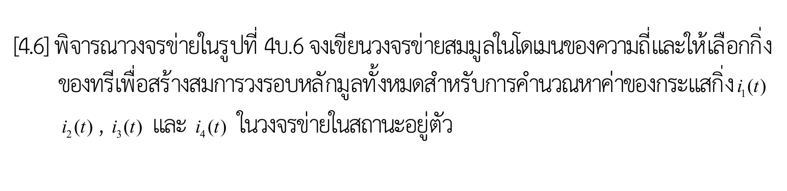
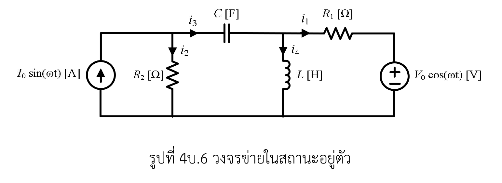

# โจทย์ [4.6] — การวิเคราะห์วงรอบหลักมูลของวงจรข่าย RLC ในโดเมนความถี่ (AC Steady-State)

> ที่มา: แบบฝึกหัดท้ายบทที่ 4 (การวิเคราะห์วงรอบ / Loop–Tie-set Analysis) — หน้า 105
> เอกสารบรรยาย: [303212S1Y2569lec04_5048.pdf](../lecture/303212S1Y2569lec04_5048.pdf)
> ภาพโจทย์ต้นฉบับ: [problem.png](problem.png)

---

## 1. คำโจทย์ (ถอดความภาษาไทยฉบับสมบูรณ์)

> **[4.6]** พิจารณาวงจรข่ายในรูปที่ 4บ.6 จงเขียนวงจรข่ายสมมูลในโดเมนของความถี่และให้เลือกกิ่งของทรีเพื่อสร้างสมการวงรอบหลักมูลทั้งหมดสำหรับการคำนวณหาค่าของกระแสกิ่ง \(i_1(t)\), \(i_2(t)\), \(i_3(t)\) และ \(i_4(t)\) ในวงจรข่ายในสถานะอยู่ตัว

---

## 2. รูปประกอบที่สกัดจากเอกสารคำสอน

| รูป | ภาพ | คำบรรยาย |
|---|---|---|
| 4บ.6 |  | วงจรข่าย RLC ในสถานะอยู่ตัว — แหล่งจ่ายไซน์ \(I_0\sin(\omega t)\), \(V_0\cos(\omega t)\), \(R_1, R_2, C, L\) และกระแสกิ่ง \(i_1(t), i_2(t), i_3(t), i_4(t)\) |

> ศึกษาบทวิเคราะห์โครงสร้างวงจรและโทโปโลยีเชิงลึกได้ที่ [figure-analysis.md](figure-analysis.md)

---

## 3. สิ่งที่กำหนดให้ (Given Parameters)

### 3.1 แหล่งกำเนิดไซน์ในโดเมนเวลา (Time-Domain Sinusoidal Sources)
- **แหล่งจ่ายแรงดันอิสระ (Voltage Source):**
  \[
  v_s(t) = V_0\cos(\omega t)\quad [\text{V}] \iff \mathbf{V}_s = V_0\angle 0^\circ = V_0\quad [\text{V}]
  \]
  (ต่ออนุกรมกับ \(R_1\) อยู่ทางกิ่งขวาสุด ขั้วบวกอยู่ด้านบน)
- **แหล่งจ่ายกระแสอิสระ (Current Source):**
  \[
  i_s(t) = I_0\sin(\omega t) = I_0\cos(\omega t - 90^\circ)\quad [\text{A}] \iff \mathbf{I}_s = I_0\angle -90^\circ = -jI_0\quad [\text{A}]
  \]
  (ต่อขนานกับ \(R_2\) อยู่ทางกิ่งซ้ายสุด ลูกศรชี้ขึ้นจากปมล่างไปยังปมซ้ายบน)
- **ความถี่เชิงมุม:** \(\omega\quad [\text{rad/s}]\)

### 3.2 องค์ประกอบพาสซีฟและอิมพีแดนซ์เชิงซ้อน (Complex Impedances)
- ตัวต้านทาน \(R_1\): \(\mathbf{Z}_{R1} = R_1\quad [\Omega]\)
- ตัวต้านทาน \(R_2\): \(\mathbf{Z}_{R2} = R_2\quad [\Omega]\)
- ตัวเก็บประจุ \(C\): \(\mathbf{Z}_C = \dfrac{1}{j\omega C} = -\dfrac{j}{\omega C}\quad [\Omega]\)
- ตัวเหนี่ยวนำ \(L\): \(\mathbf{Z}_L = j\omega L\quad [\Omega]\)

---

## 4. การจัดกิ่งประกอบและโทโปโลยีของวงจร (Composite Branches & Topology)

วงจรมี **3 ปมหลัก (\(n = 3\))** และ **4 กิ่งประกอบ (\(b = 4\))**:

| กิ่ง | จุดเชื่อมต่อ (ปม) | องค์ประกอบภายในกิ่ง | รูปแบบกิ่ง (Branch Model) | อิมพีแดนซ์กิ่ง \(\mathbf{Z}_{bk}\) | แหล่งจ่ายในกิ่ง |
|:---:|:---:|:---:|:---:|:---:|:---:|
| **1** | ปมขวาบน (\(B\)) \(\to\) ปมล่าง (\(O\)) | \(R_1\) อนุกรมกับ \(V_0\cos(\omega t)\) | Thévenin Model | \(\mathbf{Z}_{b1} = R_1\) | \(\mathbf{V}_{s1} = +V_0\) |
| **2** | ปมซ้ายบน (\(A\)) \(\to\) ปมล่าง (\(O\)) | \(R_2\) ขนานกับ \(I_0\sin(\omega t)\) | Norton Model | \(\mathbf{Z}_{b2} = R_2\) | \(\mathbf{I}_{s2} = -(-jI_0) = +jI_0\) |
| **3** | ปมซ้ายบน (\(A\)) \(\to\) ปมขวาบน (\(B\)) | ตัวเก็บประจุ \(C\) | Passive Branch | \(\mathbf{Z}_{b3} = \dfrac{1}{j\omega C}\) | - |
| **4** | ปมขวาบน (\(B\)) \(\to\) ปมล่าง (\(O\)) | ตัวเหนี่ยวนำ \(L\) | Passive Branch | \(\mathbf{Z}_{b4} = j\omega L\) | - |

- จำนวนกิ่งของทรี (Twigs): \(n - 1 = 3 - 1 = 2\) กิ่ง
- จำนวนลิงก์ (Links / Co-tree): \(l = b - n + 1 = 4 - 3 + 1 = 2\) กิ่ง
- จำนวนสมการวงรอบหลักมูล: \(l = 2\) สมการ (ใช้กระแสวงรอบหลักมูล \(\mathbf{J} = [J_1, J_2]^{\mathsf T}\))

---

## 5. สิ่งที่ต้องหา (Find)

1. **วงจรข่ายสมมูลในโดเมนความถี่ (Frequency-Domain Equivalent Circuit / Phasor Diagram)**
2. **การเลือกกิ่งของทรี (\(T\)) และลิงก์ (\(L\))** พร้อมเขียนกราฟระบุทิศทาง
3. **เมทริกซ์วงรอบหลักมูล (Fundamental Tie-set Matrix \(\mathbf{B}\))** ขนาด \(2 \times 4\)
4. **ระบบสมการวงรอบหลักมูลในรูปเมทริกซ์-เวกเตอร์ (Matrix-Vector Loop Equations):**
   \[
   \mathbf{Z}_l \mathbf{J} = \mathbf{E}_s \iff (\mathbf{B}\mathbf{Z}_b\mathbf{B}^{\mathsf T})\mathbf{J} = \mathbf{B}\mathbf{Z}_b\mathbf{I}_{sb} - \mathbf{B}\mathbf{V}_{sb}
   \]
5. **เฟสเซอร์กระแสวงรอบและกระแสกิ่ง:** \(\mathbf{J} = [J_1, J_2]^{\mathsf T}\) และ \(\mathbf{I}_b = [\mathbf{I}_1, \mathbf{I}_2, \mathbf{I}_3, \mathbf{I}_4]^{\mathsf T}\)
6. **กระแสกิ่งในสถานะอยู่ตัวในโดเมนเวลา (Steady-State Time-Domain Branch Currents):**
   \[
   i_1(t),\quad i_2(t),\quad i_3(t),\quad i_4(t)
   \]

---

## 6. สัญลักษณ์และข้อตกลง (Conventions & Notation)

- อ้างอิงตามรูปแบบมาตรฐานบทที่ 4 ในเอกสารคำสอน [303212S1Y2569lec04_5048.pdf](../lecture/303212S1Y2569lec04_5048.pdf) หน้า 96–100
- อักษรตัวพิมพ์ใหญ่หนา (\(\mathbf{I}, \mathbf{V}, \mathbf{J}, \mathbf{Z}\)) หมายถึง ปริมาณเฟสเซอร์/เมทริกซ์เชิงซ้อนในโดเมนความถี่
- อักษรตัวพิมพ์เล็ก (\(i(t), v(t), j(t)\)) หมายถึง ปริมาณในโดเมนเวลาจริง
- เครื่องหมายกำกับแบบสัมพันธ์ (Associated Reference Direction): กระแสไหลเข้าขั้วบวกของแรงดันกิ่ง
- เฟสเซอร์ในโจทย์และเฉลยเป็น **peak phasor** อ้างอิงโคไซน์ เพื่อให้แปลงกลับได้โดยตรงเป็น \(A_k\cos(\omega t+\phi_k)\); เมื่อคำนวณ complex power ใช้ \(\mathbf S=\tfrac12\mathbf V\mathbf I^*\)

## 7. เอกสารเฉลย

- [เฉลยฉบับสมบูรณ์](./solution.md)
- [Interactive Dashboard](./index.html)
- [SVG และสคริปต์สร้างภาพ](./assets/)
