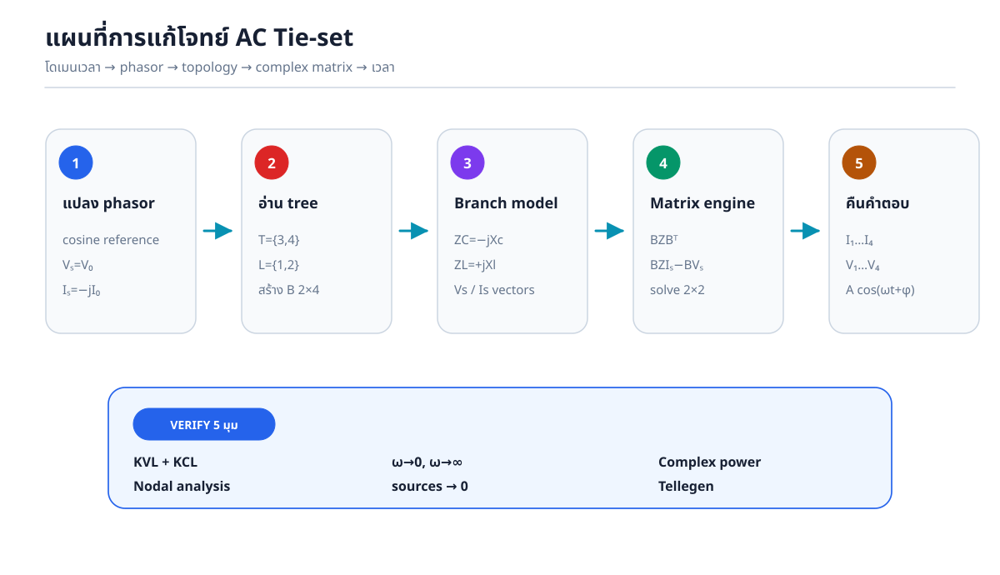
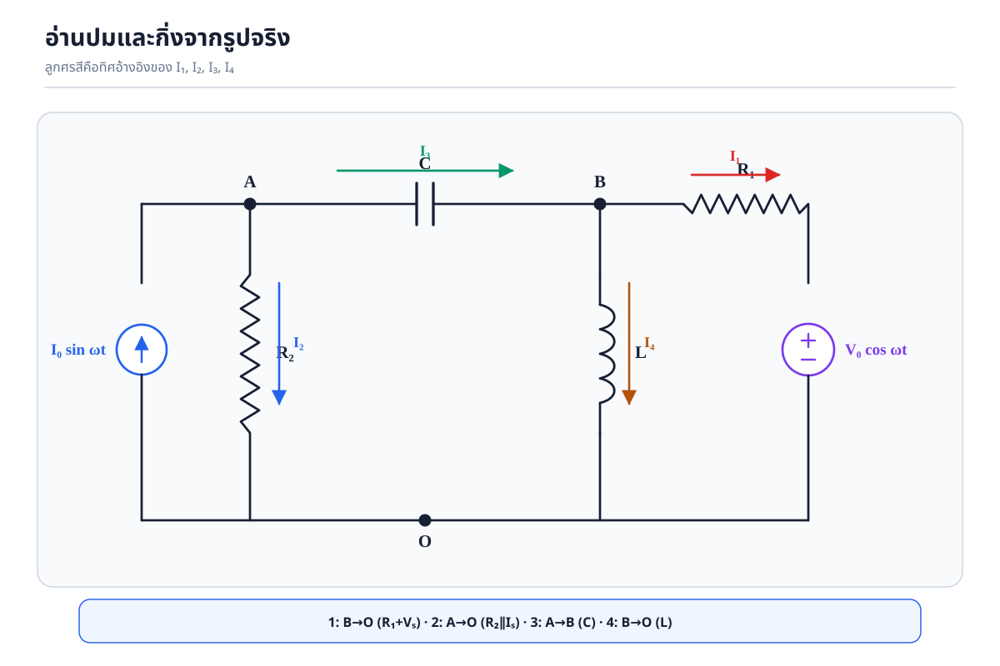
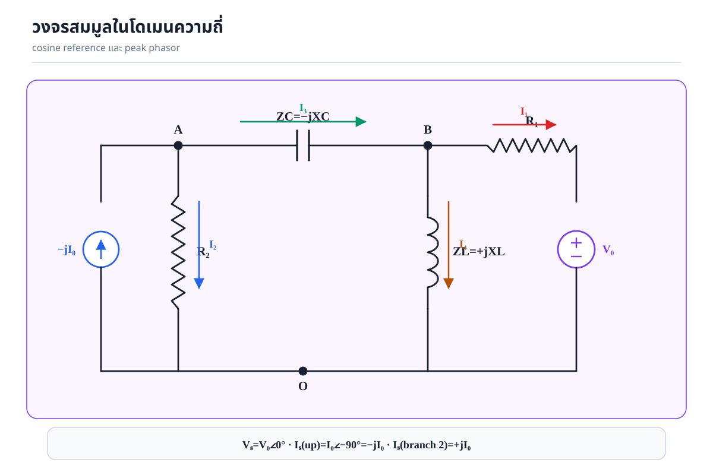
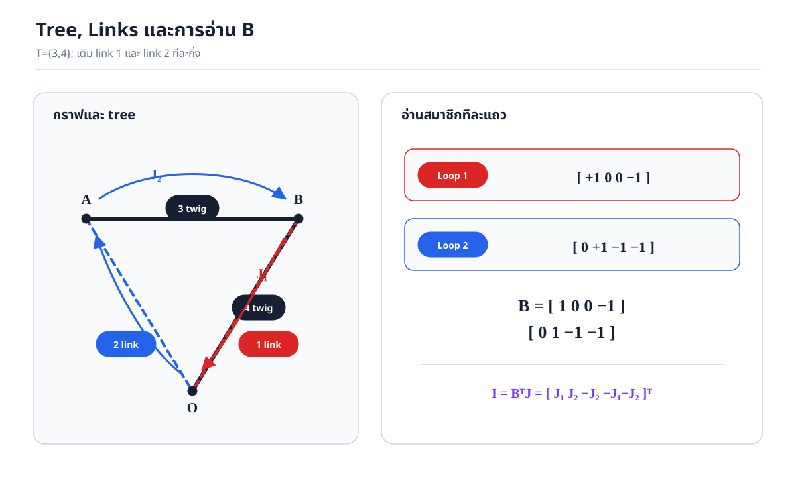
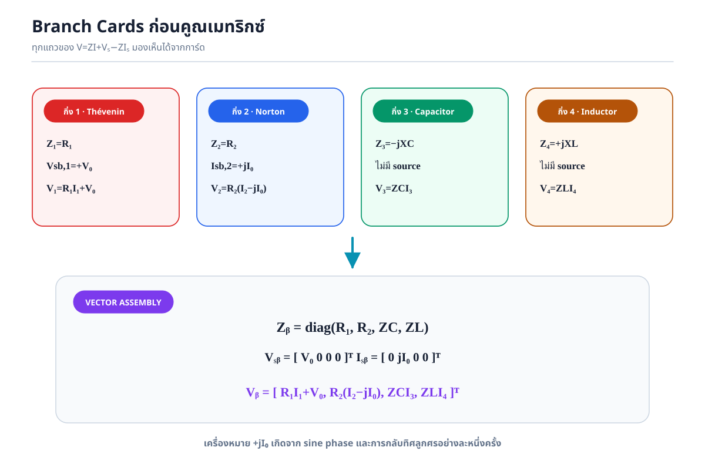
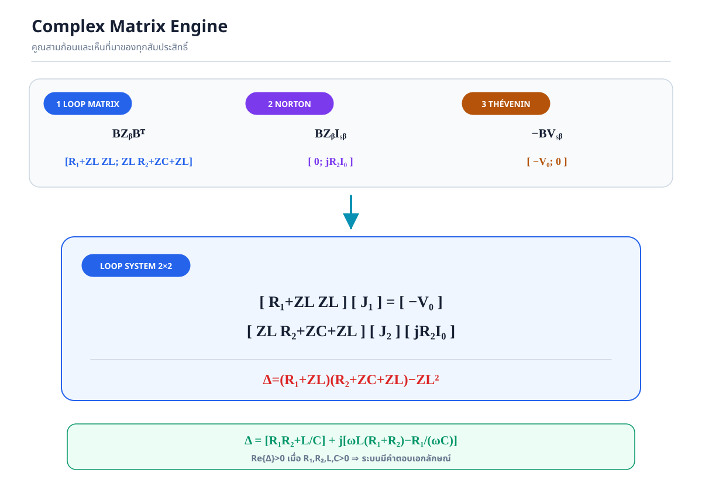
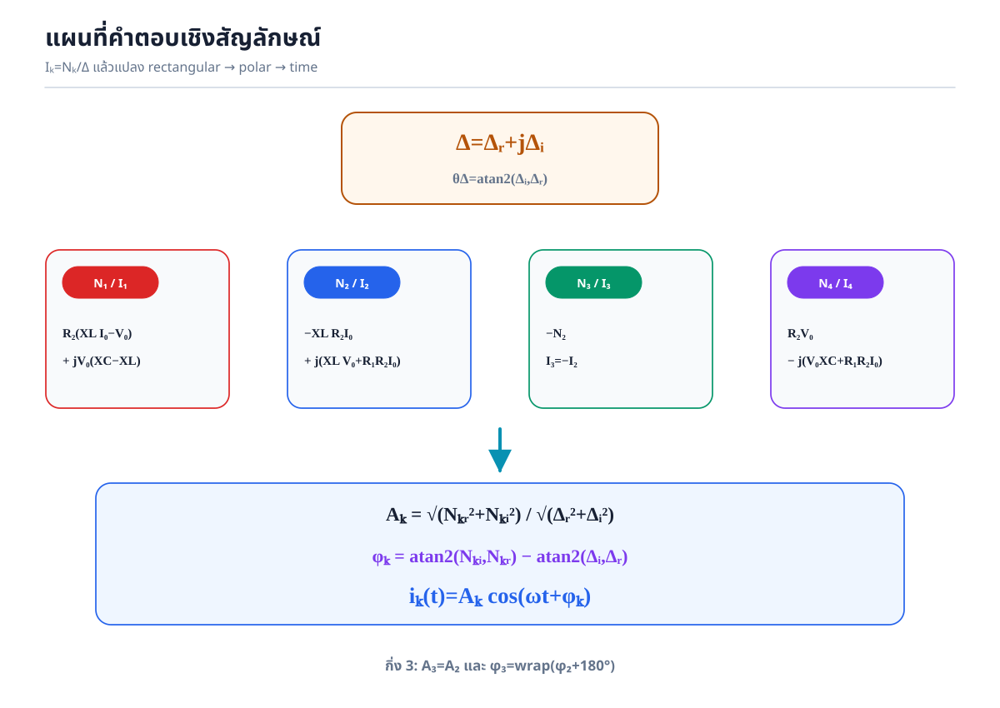
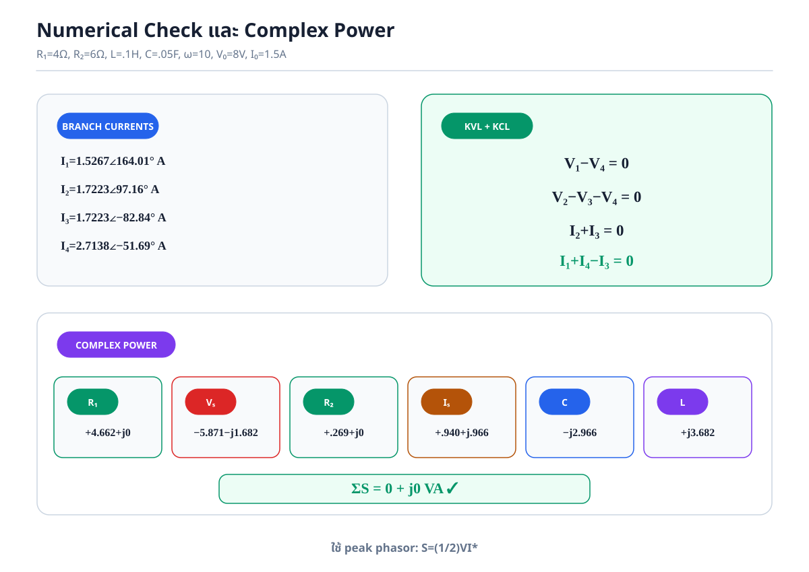

# เฉลยโจทย์ 4.6 — Fundamental Tie-set Analysis ของวงจร RLC ในสถานะอยู่ตัวไซน์

> **เป้าหมาย:** แปลงวงจรจากโดเมนเวลาเป็นโดเมนเฟสเซอร์ สร้างเมทริกซ์วงรอบหลักมูล \(\mathbf B\) และคูณ \(\mathbf B\mathbf Z_b\mathbf B^{\mathsf T}\) ทุกขั้น แก้กระแสวงรอบเชิงซ้อน คืนค่ากระแส/แรงดันทุกกิ่ง แปลงกลับเป็น \(A_k\cos(\omega t+\phi_k)\) และตรวจคำตอบด้วย KVL, KCL, limiting cases, nodal analysis และ complex-power balance

---

## แผนการแก้โจทย์

1. ล็อก cosine reference และชนิดของเฟสเซอร์
2. อ่านปม กิ่ง และทิศจากรูปจริง
3. เลือก tree \(T=\{3,4\}\), links \(L=\{1,2\}\)
4. สร้าง \(\mathbf B\) และคูณ \(\mathbf I_b=\mathbf B^{\mathsf T}\mathbf J\)
5. แปลง \(R,L,C\) และแหล่งไซน์เป็นแบบจำลองกิ่งเชิงซ้อน
6. สร้าง \(\mathbf Z_l=\mathbf B\mathbf Z_b\mathbf B^{\mathsf T}\) และ \(\mathbf E_s\)
7. แก้ \(J_1,J_2\) ด้วย inverse/Cramer’s rule
8. คืนค่า \(\mathbf I_1\ldots\mathbf I_4\), \(\mathbf V_1\ldots\mathbf V_4\)
9. เขียนสูตร magnitude/phase และกระแสในโดเมนเวลา
10. ตรวจคำตอบอิสระอย่างน้อย 4 ทาง

---

## 0. คำตอบหลักสำหรับตรวจระหว่างทำ

กำหนดรีแอกแตนซ์บวก

\[
X_L=\omega L,
\qquad
X_C=\frac{1}{\omega C},
\]

ดังนั้น

\[
Z_L=jX_L,
\qquad
Z_C=-jX_C.
\]

เมทริกซ์วงรอบหลักมูลคือ

\[
\boxed{
\mathbf B=
\begin{bmatrix}
1&0&0&-1\\
0&1&-1&-1
\end{bmatrix}}.
\]

เมทริกซ์อิมพีแดนซ์วงรอบและเวกเตอร์แหล่งกำเนิดคือ

\[
\boxed{
\mathbf Z_l=
\begin{bmatrix}
R_1+Z_L&Z_L\\
Z_L&R_2+Z_C+Z_L
\end{bmatrix}},
\qquad
\boxed{
\mathbf E_s=
\begin{bmatrix}-V_0\\jR_2I_0\end{bmatrix}}.
\]

กำหนด determinant

\[
\boxed{
\Delta=(R_1+Z_L)(R_2+Z_C+Z_L)-Z_L^2}.
\]

รูปสี่เหลี่ยมมุมฉากของ \(\Delta\) คือ

\[
\boxed{
\Delta=Delta_r+j\Delta_i}
\]

โดย

\[
\boxed{\Delta_r=R_1R_2+X_LX_C=R_1R_2+\frac LC},
\]

\[
\boxed{\Delta_i=X_L(R_1+R_2)-R_1X_C}.
\]

เมื่อ \(R_1,R_2,L,C,\omega>0\), \(\Delta_r>0\) เสมอ จึงมี \(\Delta\ne0\) และคำตอบเอกลักษณ์

เฟสเซอร์กระแสวงรอบคือ

\[
\boxed{
J_1=
\frac{-V_0(R_2+Z_C+Z_L)-Z_L(jR_2I_0)}{\Delta}},
\]

\[
\boxed{
J_2=
\frac{Z_LV_0+(R_1+Z_L)(jR_2I_0)}{\Delta}}.
\]

และกระแสกิ่งคือ

\[
\boxed{
\begin{bmatrix}I_1\\I_2\\I_3\\I_4\end{bmatrix}
=
\begin{bmatrix}
1&0\\0&1\\0&-1\\-1&-1
\end{bmatrix}
\begin{bmatrix}J_1\\J_2\end{bmatrix}
=
\begin{bmatrix}J_1\\J_2\\-J_2\\-J_1-J_2\end{bmatrix}}.
\]

ส่วนต่อไปพิสูจน์ทุกบรรทัดและให้สูตรเวลาแบบปิดครบทั้ง 4 กิ่ง

---

## 1. Convention ของเฟสเซอร์: จุดที่ต้องกำหนดก่อนคำนวณ

### 1.1 ใช้ cosine reference

กำหนดการแปลง

\[
A\cos(\omega t+\phi)
\longleftrightarrow
\mathbf A=A\angle\phi=Ae^{j\phi}.
\]

ในเอกสารนี้เฟสเซอร์เป็น **peak phasor** เพราะ \(V_0\) และ \(I_0\) ในโจทย์เป็นแอมพลิจูดของสัญญาณเวลา ไม่ได้หารด้วย \(\sqrt2\)

ดังนั้นการแปลงกลับคือ

\[
x(t)=\Re\{\mathbf X e^{j\omega t}\}
=|\mathbf X|\cos(\omega t+\arg\mathbf X).
\]

### 1.2 แหล่งแรงดัน

\[
v_s(t)=V_0\cos(\omega t)
\longleftrightarrow
\boxed{\mathbf V_s=V_0\angle0^\circ=V_0}.
\]

### 1.3 แหล่งกระแส

ใช้เอกลักษณ์

\[
\sin\theta=\cos(\theta-90^\circ).
\]

จึงได้

\[
i_s(t)=I_0\sin(\omega t)
=I_0\cos(\omega t-90^\circ),
\]

\[
\boxed{
\mathbf I_s=I_0\angle(-90^\circ)=-jI_0}
\]

ในทิศลูกศรจริงของแหล่งจาก \(O\to A\)

### 1.4 Peak phasor กับ complex power

ถ้าใช้ RMS phasor จะมี \(\mathbf S=\mathbf V_{\rm rms}\mathbf I_{\rm rms}^*\) แต่เอกสารนี้ใช้ peak phasor จึงมี

\[
\boxed{
\mathbf S=\frac12\mathbf V_{\rm peak}\mathbf I_{\rm peak}^*}.
\]

ตัวประกอบ \(1/2\) เป็นตัวร่วมทุกอุปกรณ์ จึงไม่เปลี่ยนข้อสรุป \(\sum\mathbf S_k=0\)

---

## 2. อ่านวงจรจากรูปและจัดเป็น 4 กิ่ง

กำหนดปม

- \(A\): ปมซ้ายบน ก่อนตัวเก็บประจุ
- \(B\): ปมขวาบน หลังตัวเก็บประจุ
- \(O\): รางล่าง ใช้เป็น datum, \(V_O=0\)

### 2.1 ตารางกิ่งและ associated reference

| กิ่ง | ทิศ \(I_k\) | อุปกรณ์ | แรงดันกิ่ง |
|---:|---|---|---|
| 1 | \(B\to O\) | \(R_1\) อนุกรม \(V_0\cos\omega t\) | \(V_1=V_B\) |
| 2 | \(A\to O\) | \(R_2\parallel I_0\sin\omega t\) | \(V_2=V_A\) |
| 3 | \(A\to B\) | \(C\) | \(V_3=V_A-V_B\) |
| 4 | \(B\to O\) | \(L\) | \(V_4=V_B\) |

แรงดันกิ่งทุกตัวใช้ขั้วบวกที่ต้นลูกศรกระแสกิ่งและขั้วลบที่ปลายลูกศร

### 2.2 ทำไมกิ่ง 1 และกิ่ง 4 มีปลายเดียวกัน

ทั้งสองกิ่งต่อระหว่าง \(B\) กับ \(O\) จึงขนานกันในเชิง topology และต้องมี

\[
\boxed{V_1=V_4=V_B}.
\]

กิ่ง 1 มีอุปกรณ์อนุกรมสองตัว แต่จุดกลางระหว่าง \(R_1\) กับแหล่งแรงดันไม่มีการแตกกิ่ง จึงรวมเป็นกิ่งประกอบเดียวได้

### 2.3 ทำไมแหล่งกระแสในกิ่ง 2 มีเครื่องหมาย \(+jI_0\)

ลูกศรแหล่งจริงชี้ \(O\to A\) และเฟสเซอร์ตามลูกศรคือ \(-jI_0\) แต่ทิศกิ่ง 2 ชี้ตรงข้าม \(A\to O\) ดังนั้นเฟสเซอร์ของแหล่งเมื่ออ้างตามทิศกิ่ง 2 คือ

\[
I_{sb,2}=-(-jI_0)=\boxed{+jI_0}.
\]

เครื่องหมายนี้เกิดจาก **สองการกลับ**:

1. sine เป็น cosine ลบ 90 องศา: \(-jI_0\)
2. ลูกศรแหล่งสวนกับลูกศรกิ่ง: คูณ \(-1\)

ผลสุดท้ายจึงเป็น \(+jI_0\)

---

## 3. แปลงอุปกรณ์เป็นอิมพีแดนซ์เชิงซ้อน

### 3.1 ตัวต้านทาน

\[
Z_{R_1}=R_1,
\qquad
Z_{R_2}=R_2.
\]

### 3.2 ตัวเหนี่ยวนำ

จาก \(v_L=L\,di_L/dt\), ในโดเมนเฟสเซอร์ \(d/dt\mapsto j\omega\)

\[
\mathbf V_L=j\omega L\mathbf I_L.
\]

ดังนั้น

\[
\boxed{Z_L=j\omega L=jX_L}.
\]

### 3.3 ตัวเก็บประจุ

จาก \(i_C=C\,dv_C/dt\)

\[
\mathbf I_C=j\omega C\mathbf V_C.
\]

แก้หาอัตราส่วนแรงดันต่อกระแส

\[
Z_C=\frac{\mathbf V_C}{\mathbf I_C}
=\frac1{j\omega C}
=-\frac{j}{\omega C}
=-jX_C.
\]

ดังนั้น

\[
\boxed{Z_C=-jX_C}.
\]

---

## 4. เลือก Tree และสร้าง Fundamental Tie-set Matrix

กราฟมี

\[
n=3\text{ ปม},\qquad b=4\text{ กิ่ง}.
\]

จำนวน twigs ของ tree คือ

\[
n-1=2.
\]

จำนวน links และวงรอบหลักมูลคือ

\[
l=b-n+1=4-3+1=2.
\]

### 4.1 เลือก tree

เลือก

\[
\boxed{T=\{3,4\}},
\qquad
\boxed{L=\{1,2\}}.
\]

เหตุผล:

1. กิ่ง 3 เชื่อม \(A\leftrightarrow B\) และกิ่ง 4 เชื่อม \(B\leftrightarrow O\) จึงครอบคลุมทุกปม
2. กิ่ง 3 และ 4 ไม่สร้างวงปิด จึงเป็น tree ที่ถูกต้อง
3. แหล่งกำเนิดทั้งสองอยู่บน links ทำให้ \(J_1=I_1\) และ \(J_2=I_2\) โดยตรง เหมาะกับการทำข้อสอบ

### 4.2 วงรอบหลักมูลที่ 1 จาก link 1

เริ่มตามทิศ link 1:

\[
B\xrightarrow{1}O\xrightarrow{-4}B.
\]

| กิ่ง | อยู่ในวงรอบหรือไม่ | ทิศเทียบกับวงรอบ | ค่า |
|---:|---|---|---:|
| 1 | อยู่ | ตาม | \(+1\) |
| 2 | ไม่อยู่ | - | \(0\) |
| 3 | ไม่อยู่ | - | \(0\) |
| 4 | อยู่ | สวน | \(-1\) |

แถวแรกคือ

\[
\begin{bmatrix}1&0&0&-1\end{bmatrix}.
\]

### 4.3 วงรอบหลักมูลที่ 2 จาก link 2

เริ่มตามทิศ link 2:

\[
A\xrightarrow{2}O\xrightarrow{-4}B\xrightarrow{-3}A.
\]

| กิ่ง | อยู่ในวงรอบหรือไม่ | ทิศเทียบกับวงรอบ | ค่า |
|---:|---|---|---:|
| 1 | ไม่อยู่ | - | \(0\) |
| 2 | อยู่ | ตาม | \(+1\) |
| 3 | อยู่ | สวน | \(-1\) |
| 4 | อยู่ | สวน | \(-1\) |

แถวที่สองคือ

\[
\begin{bmatrix}0&1&-1&-1\end{bmatrix}.
\]

ดังนั้น

\[
\boxed{
\mathbf B=
\begin{bmatrix}
1&0&0&-1\\
0&1&-1&-1
\end{bmatrix}}.
\]

---

## 5. คูณ \(\mathbf I_b=\mathbf B^{\mathsf T}\mathbf J\) ทุกแถว

ให้

\[
\mathbf J=
\begin{bmatrix}J_1\\J_2\end{bmatrix}.
\]

Transpose ของ \(\mathbf B\) คือ

\[
\mathbf B^{\mathsf T}=
\begin{bmatrix}
1&0\\
0&1\\
0&-1\\
-1&-1
\end{bmatrix}.
\]

แทนลงในสมการ

\[
\begin{bmatrix}I_1\\I_2\\I_3\\I_4\end{bmatrix}
=
\begin{bmatrix}
1&0\\0&1\\0&-1\\-1&-1
\end{bmatrix}
\begin{bmatrix}J_1\\J_2\end{bmatrix}.
\]

คูณทีละแถว

\[
I_1=(1)J_1+(0)J_2=J_1,
\]

\[
I_2=(0)J_1+(1)J_2=J_2,
\]

\[
I_3=(0)J_1+(-1)J_2=-J_2,
\]

\[
I_4=(-1)J_1+(-1)J_2=-J_1-J_2.
\]

จึงได้

\[
\boxed{
\mathbf I_b=
\begin{bmatrix}J_1\\J_2\\-J_2\\-J_1-J_2\end{bmatrix}}.
\]

สมการนี้ทำให้ KCL เป็นจริงโดย topology ก่อนใช้ค่าของอุปกรณ์ใด ๆ

---

## 6. สร้างสมการเฉพาะกิ่งทีละกิ่ง

แม่แบบ lecture คือ

\[
\boxed{
\mathbf V_b
=\mathbf Z_b\mathbf I_b
+\mathbf V_{sb}
-\mathbf Z_b\mathbf I_{sb}}.
\]

### 6.1 กิ่ง 1: Thévenin \(R_1\) อนุกรม \(V_0\)

เดินจาก \(B\to O\) ผ่าน \(R_1\) แล้วผ่านแหล่งจากขั้ว \(+\) ไป \(-\) จึงเป็นแรงดันตก \(+V_0\)

\[
\boxed{V_1=R_1I_1+V_0}.
\]

### 6.2 กิ่ง 2: Norton \(R_2\parallel I_s\)

เฟสเซอร์แหล่งตามทิศกิ่งคือ \(+jI_0\) กระแสผ่านตัวต้านทานจึงเป็น

\[
I_{R_2}=I_2-jI_0.
\]

ดังนั้น

\[
\boxed{V_2=R_2(I_2-jI_0)}.
\]

### 6.3 กิ่ง 3: ตัวเก็บประจุ

\[
\boxed{V_3=Z_CI_3}.
\]

### 6.4 กิ่ง 4: ตัวเหนี่ยวนำ

\[
\boxed{V_4=Z_LI_4}.
\]

### 6.5 ประกอบเมทริกซ์กิ่ง

\[
\boxed{
\mathbf Z_b=
\begin{bmatrix}
R_1&0&0&0\\
0&R_2&0&0\\
0&0&Z_C&0\\
0&0&0&Z_L
\end{bmatrix}},
\]

\[
\boxed{
\mathbf V_{sb}=
\begin{bmatrix}V_0\\0\\0\\0\end{bmatrix}},
\qquad
\boxed{
\mathbf I_{sb}=
\begin{bmatrix}0\\jI_0\\0\\0\end{bmatrix}}.
\]

คูณ

\[
\mathbf Z_b\mathbf I_b=
\begin{bmatrix}
R_1I_1\\R_2I_2\\Z_CI_3\\Z_LI_4
\end{bmatrix},
\]

\[
\mathbf Z_b\mathbf I_{sb}=
\begin{bmatrix}
0\\jR_2I_0\\0\\0
\end{bmatrix}.
\]

จึงได้

\[
\boxed{
\mathbf V_b=
\begin{bmatrix}
R_1I_1+V_0\\
R_2I_2-jR_2I_0\\
Z_CI_3\\
Z_LI_4
\end{bmatrix}}.
\]

---

## 7. สร้าง Matrix Engine จาก KVL

KVL เชิง topology คือ

\[
\mathbf B\mathbf V_b=\mathbf0.
\]

แทนสมการกิ่ง

\[
\mathbf B
\left(
\mathbf Z_b\mathbf I_b
+\mathbf V_{sb}
-\mathbf Z_b\mathbf I_{sb}
\right)=\mathbf0.
\]

แทน \(\mathbf I_b=\mathbf B^{\mathsf T}\mathbf J\)

\[
\mathbf B\mathbf Z_b\mathbf B^{\mathsf T}\mathbf J
+\mathbf B\mathbf V_{sb}
-\mathbf B\mathbf Z_b\mathbf I_{sb}
=\mathbf0.
\]

ย้ายพจน์แหล่งจ่ายไปขวา

\[
\boxed{
\underbrace{\mathbf B\mathbf Z_b\mathbf B^{\mathsf T}}_{\mathbf Z_l}
\mathbf J
=
\underbrace{\mathbf B\mathbf Z_b\mathbf I_{sb}
-\mathbf B\mathbf V_{sb}}_{\mathbf E_s}}.
\]

---

## 8. คูณ \(\mathbf Z_l=\mathbf B\mathbf Z_b\mathbf B^{\mathsf T}\) ทีละขั้น

ขนาดเมทริกซ์คือ

\[
(2\times4)(4\times4)(4\times2)=(2\times2).
\]

### 8.1 คูณ \(\mathbf Z_b\mathbf B^{\mathsf T}\) ก่อน

\[
\mathbf Z_b\mathbf B^{\mathsf T}
=
\begin{bmatrix}
R_1&0&0&0\\
0&R_2&0&0\\
0&0&Z_C&0\\
0&0&0&Z_L
\end{bmatrix}
\begin{bmatrix}
1&0\\
0&1\\
0&-1\\
-1&-1
\end{bmatrix}.
\]

คูณทีละแถว

\[
\text{แถว 1}:\quad [R_1,0],
\]

\[
\text{แถว 2}:\quad [0,R_2],
\]

\[
\text{แถว 3}:\quad [0,-Z_C],
\]

\[
\text{แถว 4}:\quad [-Z_L,-Z_L].
\]

ดังนั้น

\[
\boxed{
\mathbf Z_b\mathbf B^{\mathsf T}=
\begin{bmatrix}
R_1&0\\
0&R_2\\
0&-Z_C\\
-Z_L&-Z_L
\end{bmatrix}}.
\]

### 8.2 คูณทางซ้ายด้วย \(\mathbf B\)

\[
\mathbf Z_l=
\begin{bmatrix}
1&0&0&-1\\
0&1&-1&-1
\end{bmatrix}
\begin{bmatrix}
R_1&0\\
0&R_2\\
0&-Z_C\\
-Z_L&-Z_L
\end{bmatrix}.
\]

สมาชิก \((1,1)\): แถว 1 คูณคอลัมน์ 1

\[
(1)R_1+(0)0+(0)0+(-1)(-Z_L)
=R_1+Z_L.
\]

สมาชิก \((1,2)\): แถว 1 คูณคอลัมน์ 2

\[
(1)0+(0)R_2+(0)(-Z_C)+(-1)(-Z_L)
=Z_L.
\]

สมาชิก \((2,1)\): แถว 2 คูณคอลัมน์ 1

\[
(0)R_1+(1)0+(-1)0+(-1)(-Z_L)
=Z_L.
\]

สมาชิก \((2,2)\): แถว 2 คูณคอลัมน์ 2

\[
(0)0+(1)R_2+(-1)(-Z_C)+(-1)(-Z_L)
=R_2+Z_C+Z_L.
\]

ดังนั้น

\[
\boxed{
\mathbf Z_l=
\begin{bmatrix}
R_1+Z_L&Z_L\\
Z_L&R_2+Z_C+Z_L
\end{bmatrix}}.
\]

### 8.3 ความหมายของสมาชิกนอกแนวทแยง

วงรอบ 1 และ 2 ใช้กิ่ง 4 ร่วมกัน และทั้งคู่สวนทิศกิ่ง 4 เครื่องหมายจึงเป็น

\[
(-1)(-1)Z_L=+Z_L.
\]

เมทริกซ์สมมาตร \(Z_{12}=Z_{21}\) เพราะวงจรเป็น reciprocal RLC network และ \(\mathbf Z_b\) เป็นเมทริกซ์แนวทแยง

---

## 9. คูณเวกเตอร์แหล่งจ่าย \(\mathbf E_s\) ทีละก้อน

### 9.1 ก้อน Norton: \(\mathbf B\mathbf Z_b\mathbf I_{sb}\)

คำนวณด้านในก่อน

\[
\mathbf Z_b\mathbf I_{sb}
=
\begin{bmatrix}
R_1&0&0&0\\0&R_2&0&0\\0&0&Z_C&0\\0&0&0&Z_L
\end{bmatrix}
\begin{bmatrix}0\\jI_0\\0\\0\end{bmatrix}
=
\begin{bmatrix}0\\jR_2I_0\\0\\0\end{bmatrix}.
\]

คูณด้วย \(\mathbf B\)

\[
\mathbf B\mathbf Z_b\mathbf I_{sb}
=
\begin{bmatrix}
1&0&0&-1\\0&1&-1&-1
\end{bmatrix}
\begin{bmatrix}0\\jR_2I_0\\0\\0\end{bmatrix}.
\]

แถวแรก

\[
(1)0+(0)(jR_2I_0)+(0)0+(-1)0=0.
\]

แถวที่สอง

\[
(0)0+(1)(jR_2I_0)+(-1)0+(-1)0=jR_2I_0.
\]

ดังนั้น

\[
\boxed{
\mathbf B\mathbf Z_b\mathbf I_{sb}
=\begin{bmatrix}0\\jR_2I_0\end{bmatrix}}.
\]

### 9.2 ก้อน Thévenin: \(-\mathbf B\mathbf V_{sb}\)

\[
-\mathbf B\mathbf V_{sb}
=-
\begin{bmatrix}
1&0&0&-1\\0&1&-1&-1
\end{bmatrix}
\begin{bmatrix}V_0\\0\\0\\0\end{bmatrix}.
\]

คูณด้านใน

\[
\mathbf B\mathbf V_{sb}
=
\begin{bmatrix}V_0\\0\end{bmatrix}.
\]

ใส่เครื่องหมายลบ

\[
\boxed{
-\mathbf B\mathbf V_{sb}
=
\begin{bmatrix}-V_0\\0\end{bmatrix}}.
\]

### 9.3 รวมสองก้อน

\[
\mathbf E_s
=
\begin{bmatrix}0\\jR_2I_0\end{bmatrix}
+
\begin{bmatrix}-V_0\\0\end{bmatrix}
=
\boxed{
\begin{bmatrix}-V_0\\jR_2I_0\end{bmatrix}}.
\]

---

## 10. ระบบสมการวงรอบเชิงซ้อน

นำ \(\mathbf Z_l\) และ \(\mathbf E_s\) มาประกบ

\[
\boxed{
\begin{bmatrix}
R_1+Z_L&Z_L\\
Z_L&R_2+Z_C+Z_L
\end{bmatrix}
\begin{bmatrix}J_1\\J_2\end{bmatrix}
=
\begin{bmatrix}-V_0\\jR_2I_0\end{bmatrix}}.
\]

ถอดเป็นสองสมการสเกลาร์

\[
\boxed{(R_1+Z_L)J_1+Z_LJ_2=-V_0},
\]

\[
\boxed{Z_LJ_1+(R_2+Z_C+Z_L)J_2=jR_2I_0}.
\]

สมการแรกคือ KVL ของวงรอบกิ่ง 1-4 และสมการที่สองคือ KVL ของวงรอบกิ่ง 2-4-3

---

## 11. แก้ \(J_1,J_2\) ด้วย determinant ทุกขั้น

กำหนด

\[
a=R_1+Z_L,
\quad
b=Z_L,
\quad
d=R_2+Z_C+Z_L.
\]

ระบบคือ

\[
\begin{bmatrix}a&b\\b&d\end{bmatrix}
\begin{bmatrix}J_1\\J_2\end{bmatrix}
=
\begin{bmatrix}-V_0\\jR_2I_0\end{bmatrix}.
\]

### 11.1 Determinant หลัก

\[
\Delta=
\begin{vmatrix}a&b\\b&d\end{vmatrix}
=ad-b^2.
\]

แทนค่า

\[
\boxed{
\Delta=(R_1+Z_L)(R_2+Z_C+Z_L)-Z_L^2}.
\]

กระจายผลคูณ

\[
\Delta
=R_1R_2+R_1Z_C+R_1Z_L+Z_LR_2+Z_LZ_C+Z_L^2-Z_L^2.
\]

ตัด \(+Z_L^2-Z_L^2\)

\[
\Delta
=R_1R_2+R_1Z_C+(R_1+R_2)Z_L+Z_LZ_C.
\]

แทน \(Z_L=jX_L\), \(Z_C=-jX_C\)

\[
Z_LZ_C=(jX_L)(-jX_C)=X_LX_C=\frac LC.
\]

ดังนั้น

\[
\Delta
=R_1R_2+X_LX_C
+j\left[X_L(R_1+R_2)-R_1X_C\right].
\]

### 11.2 หา \(J_1\)

แทนคอลัมน์แรกด้วยเวกเตอร์ขวามือ

\[
\Delta_1=
\begin{vmatrix}
-V_0&Z_L\\
jR_2I_0&R_2+Z_C+Z_L
\end{vmatrix}.
\]

\[
\Delta_1
=(-V_0)(R_2+Z_C+Z_L)-Z_L(jR_2I_0).
\]

จึงได้

\[
\boxed{
J_1=\frac{\Delta_1}{\Delta}
=\frac{-V_0(R_2+Z_C+Z_L)-Z_L(jR_2I_0)}{\Delta}}.
\]

### 11.3 หา \(J_2\)

แทนคอลัมน์ที่สอง

\[
\Delta_2=
\begin{vmatrix}
R_1+Z_L&-V_0\\
Z_L&jR_2I_0
\end{vmatrix}.
\]

\[
\Delta_2
=(R_1+Z_L)(jR_2I_0)-(-V_0)Z_L.
\]

\[
\Delta_2
=Z_LV_0+(R_1+Z_L)(jR_2I_0).
\]

จึงได้

\[
\boxed{
J_2=\frac{\Delta_2}{\Delta}
=\frac{Z_LV_0+(R_1+Z_L)(jR_2I_0)}{\Delta}}.
\]

---

## 12. รูปสี่เหลี่ยมมุมฉากของกระแสทุกกิ่ง

นิยามตัวเศษ

\[
J_1=\frac{N_1}{\Delta},
\qquad
J_2=\frac{N_2}{\Delta}.
\]

### 12.1 ตัวเศษ \(N_1\)

แทน \(Z_L=jX_L\), \(Z_C=-jX_C\)

\[
N_1=-V_0[R_2+j(X_L-X_C)]-(jX_L)(jR_2I_0).
\]

เพราะ \(j^2=-1\)

\[
-(jX_L)(jR_2I_0)=+X_LR_2I_0.
\]

ดังนั้น

\[
\boxed{
N_1=R_2(X_LI_0-V_0)+jV_0(X_C-X_L)}.
\]

### 12.2 ตัวเศษ \(N_2\)

\[
N_2=jX_LV_0+(R_1+jX_L)(jR_2I_0).
\]

กระจาย

\[
N_2=jX_LV_0+jR_1R_2I_0-X_LR_2I_0.
\]

ดังนั้น

\[
\boxed{
N_2=-X_LR_2I_0+j(X_LV_0+R_1R_2I_0)}.
\]

### 12.3 ตัวเศษของกระแสกิ่ง 3 และ 4

เพราะ \(I_3=-J_2\)

\[
\boxed{N_3=-N_2
=X_LR_2I_0-j(X_LV_0+R_1R_2I_0)}.
\]

เพราะ \(I_4=-J_1-J_2\)

\[
N_4=-(N_1+N_2).
\]

รวมส่วนจริงของ \(N_1+N_2\)

\[
R_2(X_LI_0-V_0)-X_LR_2I_0=-R_2V_0.
\]

รวมส่วนจินตภาพ

\[
V_0(X_C-X_L)+X_LV_0+R_1R_2I_0
=V_0X_C+R_1R_2I_0.
\]

ดังนั้น

\[
\boxed{
N_4=R_2V_0-j(V_0X_C+R_1R_2I_0)}.
\]

สรุป

\[
\boxed{
I_1=\frac{N_1}{\Delta},\quad
I_2=\frac{N_2}{\Delta},\quad
I_3=\frac{N_3}{\Delta},\quad
I_4=\frac{N_4}{\Delta}}.
\]

---

## 13. แปลงกระแสทุกกิ่งกลับสู่โดเมนเวลาแบบปิด

กำหนด

\[
D_m=|\Delta|=\sqrt{\Delta_r^2+\Delta_i^2},
\qquad
\theta_\Delta=\operatorname{atan2}(\Delta_i,\Delta_r).
\]

สำหรับ \(N_k=N_{kr}+jN_{ki}\)

\[
I_k=\frac{N_k}{\Delta}
=\frac{\sqrt{N_{kr}^2+N_{ki}^2}}{D_m}
\angle
\left[
\operatorname{atan2}(N_{ki},N_{kr})-\theta_\Delta
\right].
\]

### 13.1 กิ่ง 1

\[
\boxed{
A_1=\frac{
\sqrt{R_2^2(X_LI_0-V_0)^2+V_0^2(X_C-X_L)^2}
}{D_m}},
\]

\[
\boxed{
\phi_1=\operatorname{atan2}
\left(V_0(X_C-X_L),R_2(X_LI_0-V_0)\right)
-\theta_\Delta}.
\]

\[
\boxed{i_1(t)=A_1\cos(\omega t+\phi_1)}.
\]

### 13.2 กิ่ง 2

\[
\boxed{
A_2=\frac{
\sqrt{(X_LR_2I_0)^2+(X_LV_0+R_1R_2I_0)^2}
}{D_m}},
\]

\[
\boxed{
\phi_2=\operatorname{atan2}
\left(X_LV_0+R_1R_2I_0,-X_LR_2I_0\right)
-\theta_\Delta}.
\]

\[
\boxed{i_2(t)=A_2\cos(\omega t+\phi_2)}.
\]

### 13.3 กิ่ง 3

เพราะ \(I_3=-I_2\)

\[
\boxed{A_3=A_2},
\qquad
\boxed{\phi_3=\operatorname{wrap}(\phi_2+\pi)}.
\]

\[
\boxed{i_3(t)=A_2\cos(\omega t+\phi_3)}.
\]

คำว่า \(\operatorname{wrap}\) หมายถึงปรับมุมด้วยจำนวนเต็มเท่าของ \(2\pi\) ให้อยู่ช่วงหลัก เช่น \((-\pi,\pi]\)

### 13.4 กิ่ง 4

\[
\boxed{
A_4=\frac{
\sqrt{(R_2V_0)^2+(V_0X_C+R_1R_2I_0)^2}
}{D_m}},
\]

\[
\boxed{
\phi_4=\operatorname{atan2}
\left(-(V_0X_C+R_1R_2I_0),R_2V_0\right)
-\theta_\Delta}.
\]

\[
\boxed{i_4(t)=A_4\cos(\omega t+\phi_4)}.
\]

ถ้า \(A_k=0\), phase ของกิ่งนั้นไม่มีความหมายทางกายภาพและเลือกค่าใดก็ได้

---

## 14. หาแรงดันกิ่งทั้งหมดแบบเชิงสัญลักษณ์

จากสมการกิ่งและ \(I_k=N_k/\Delta\)

### 14.1 กิ่ง 1

\[
V_1=R_1I_1+V_0
=\frac{R_1N_1+V_0\Delta}{\Delta}.
\]

หรือใช้ \(V_1=V_4=Z_LI_4\)

\[
\boxed{
V_1=V_4
=\frac{Z_LN_4}{\Delta}}.
\]

ขยายด้วย \(Z_L=jX_L\)

\[
\boxed{
V_1=V_4
=\frac{
X_L(V_0X_C+R_1R_2I_0)+jX_LR_2V_0
}{\Delta}}.
\]

### 14.2 กิ่ง 2

\[
V_2=R_2(I_2-jI_0)
=\frac{R_2(N_2-jI_0\Delta)}{\Delta}.
\]

ลดรูปตัวเศษได้เป็น

\[
\boxed{
V_2=
\frac{
R_1R_2I_0(X_L-X_C)
+jR_2X_L(V_0-X_CI_0)
}{\Delta}}.
\]

### 14.3 กิ่ง 3

\[
V_3=Z_CI_3=-\frac{Z_CN_2}{\Delta}.
\]

แทน \(-Z_C=jX_C\)

\[
\boxed{
V_3=
\frac{
-X_C(X_LV_0+R_1R_2I_0)
-jX_LX_CR_2I_0
}{\Delta}}.
\]

### 14.4 กิ่ง 4

\[
\boxed{V_4=Z_LI_4=\frac{Z_LN_4}{\Delta}=V_1}.
\]

### 14.5 แรงดันปม

\[
\boxed{V_A=V_2},
\qquad
\boxed{V_B=V_1=V_4}.
\]

และ

\[
\boxed{V_3=V_A-V_B=V_2-V_4}.
\]

---

## 15. การตรวจอิสระที่ 1 — Nodal Analysis

วิธีนี้ไม่ใช้ tree, link หรือ \(\mathbf B\)

กำหนดแอดมิตแตนซ์

\[
Y_C=j\omega C,
\qquad
Y_L=\frac1{j\omega L}.
\]

### 15.1 KCL ที่ปม \(A\)

กระแสออกจาก \(A\):

- ผ่าน \(R_2\): \(V_A/R_2\)
- ผ่าน \(C\) ไป \(B\): \(Y_C(V_A-V_B)\)
- ผ่านแหล่งกระแสในทิศ \(A\to O\): \(+jI_0\)

ดังนั้น

\[
\frac{V_A}{R_2}+Y_C(V_A-V_B)+jI_0=0.
\]

จัดรูป

\[
\boxed{
\left(\frac1{R_2}+Y_C\right)V_A-Y_CV_B=-jI_0}.
\]

### 15.2 KCL ที่ปม \(B\)

กระแสกิ่ง 1 จาก \(B\to O\) หาได้จาก

\[
V_B=R_1I_1+V_0
\quad\Longrightarrow\quad
I_1=\frac{V_B-V_0}{R_1}.
\]

KCL ที่ \(B\)

\[
\frac{V_B-V_0}{R_1}
+Y_LV_B
+Y_C(V_B-V_A)=0.
\]

จัดรูป

\[
\boxed{
-Y_CV_A+\left(\frac1{R_1}+Y_L+Y_C\right)V_B
=\frac{V_0}{R_1}}.
\]

### 15.3 ระบบเมทริกซ์ปม

\[
\boxed{
\begin{bmatrix}
\dfrac1{R_2}+Y_C&-Y_C\\[5pt]
-Y_C&\dfrac1{R_1}+Y_L+Y_C
\end{bmatrix}
\begin{bmatrix}V_A\\V_B\end{bmatrix}
=
\begin{bmatrix}-jI_0\\V_0/R_1\end{bmatrix}}.
\]

determinant ของระบบปมคือ

\[
\Delta_N
=\left(\frac1{R_2}+\frac1{Z_C}\right)
\left(\frac1{R_1}+\frac1{Z_L}+\frac1{Z_C}\right)
-\frac1{Z_C^2}.
\]

ขยายทุกพจน์

\[
\Delta_N
=\frac1{R_1R_2}
+\frac1{R_2Z_L}
+\frac1{R_2Z_C}
+\frac1{R_1Z_C}
+\frac1{Z_CZ_L}.
\]

ทำส่วนร่วม \(R_1R_2Z_LZ_C\)

\[
\Delta_N
=\frac{
Z_LZ_C+R_1Z_C+R_1Z_L+R_2Z_L+R_1R_2
}{R_1R_2Z_LZ_C}.
\]

ตัวเศษคือ \(\Delta\) ที่กระจายแล้ว

\[
\boxed{
\Delta_N=\frac{\Delta}{R_1R_2Z_LZ_C}}.
\]

ดังนั้นระบบปมเอกฐานก็ต่อเมื่อระบบวงรอบเอกฐาน และการแก้ Cramer’s rule ให้ \(V_A=V_2\), \(V_B=V_1=V_4\) ตรงกับหัวข้อ 14

---

## 16. การตรวจอิสระที่ 2 — KVL ทุกวงรอบหลักมูล

จาก \(\mathbf B\mathbf V_b=0\)

\[
\begin{bmatrix}
1&0&0&-1\\0&1&-1&-1
\end{bmatrix}
\begin{bmatrix}V_1\\V_2\\V_3\\V_4\end{bmatrix}
=
\begin{bmatrix}0\\0\end{bmatrix}.
\]

แถวแรก

\[
\boxed{V_1-V_4=0}.
\]

จากคำตอบ \(V_1=V_4=Z_LN_4/\Delta\) จึงเป็นศูนย์ทันที

แถวที่สอง

\[
\boxed{V_2-V_3-V_4=0}.
\]

แทน \(V_3=V_2-V_4\)

\[
V_2-(V_2-V_4)-V_4=0.
\]

สองแถวนี้เป็น basis ของ cycle space จึงเพียงพอสำหรับทุกวงรอบของกราฟ 4 กิ่ง

---

## 17. การตรวจอิสระที่ 3 — KCL ทุกปม

### 17.1 ระดับกิ่งประกอบ

ที่ปม \(A\), กิ่ง 2 และ 3 ต่างกำหนดให้ไหลออก

\[
I_2+I_3=J_2-J_2=\boxed{0}.
\]

ที่ปม \(B\), กิ่ง 1 และ 4 ไหลออก แต่กิ่ง 3 ไหลเข้า

\[
I_1+I_4-I_3
=J_1+(-J_1-J_2)-(-J_2)
=\boxed{0}.
\]

ที่ปม \(O\) เป็นสมการตามจากสองปมแรก

\[
-I_1-I_2-I_4
=-J_1-J_2-(-J_1-J_2)
=\boxed{0}.
\]

### 17.2 ระดับอุปกรณ์ที่ปม \(A\)

กระแสผ่าน \(R_2\) ในทิศลงคือ

\[
I_{R_2}=I_2-jI_0.
\]

กระแสแหล่งตามทิศลงคือ \(jI_0\) ดังนั้น

\[
I_{R_2}+jI_0+I_3
=(I_2-jI_0)+jI_0+I_3
=I_2+I_3=0.
\]

KCL จึงเป็นจริงทั้งระดับกิ่งและระดับอุปกรณ์

---

## 18. การตรวจอิสระที่ 4 — Physical Limiting Cases

### 18.1 \(\omega\to0^+\): low-frequency/DC impedance limit

\[
Z_C\to\infty\quad(\text{capacitor open}),
\qquad
Z_L\to0\quad(\text{inductor short}).
\]

ดังนั้น

\[
I_3\to0,
\qquad
V_B\to0.
\]

กิ่ง 1 ให้

\[
0=R_1I_1+V_0
\quad\Longrightarrow\quad
\boxed{I_1\to-\frac{V_0}{R_1}}.
\]

KCL ที่ \(B\) ให้

\[
\boxed{I_4\to\frac{V_0}{R_1}}.
\]

เมื่อ capacitor เปิด กิ่งประกอบ 2 มี \(I_2\to0\) แต่กระแสภายใน \(R_2\) ยังหักล้างแหล่งกระแส

\[
I_{R_2}\to-jI_0,
\qquad
V_A\to-jR_2I_0.
\]

ข้อควรระวัง: ที่ \(\omega=0\) โดยตรง สัญญาณ \(I_0\sin(\omega t)\) เป็นศูนย์ทุกเวลา แต่ low-frequency phasor limit ถือแอมพลิจูด \(I_0\) คงไว้สำหรับ \(\omega>0\) สองการตีความจึงต่างกันที่จุดเดียว \(\omega=0\)

### 18.2 \(\omega\to\infty\)

\[
Z_C\to0\quad(\text{capacitor short}),
\qquad
Z_L\to\infty\quad(\text{inductor open}).
\]

ดังนั้น \(V_A=V_B=V_\infty\), \(I_4\to0\)

KCL ของปมที่ถูกรวมให้

\[
\frac{V_\infty-V_0}{R_1}
+\frac{V_\infty}{R_2}
+jI_0=0.
\]

แก้หาแรงดัน

\[
\boxed{
V_\infty=\frac{R_2V_0-jR_1R_2I_0}{R_1+R_2}}.
\]

จึงได้

\[
\boxed{
I_1\to-\frac{V_0+jR_2I_0}{R_1+R_2}},
\]

\[
\boxed{
I_2\to\frac{V_0+jR_2I_0}{R_1+R_2}},
\qquad
I_3\to I_1,
\qquad
I_4\to0}.
\]

### 18.3 ปิดแหล่งทั้งสอง \(V_0,I_0\to0\)

ตัวเศษ \(N_1,N_2,N_3,N_4\to0\) ขณะที่ \(\Delta\ne0\)

\[
\boxed{I_1,I_2,I_3,I_4,V_1,V_2,V_3,V_4\to0}.
\]

### 18.4 ความถี่ที่ส่วนจินตภาพของ \(\Delta\) เป็นศูนย์

เงื่อนไข

\[
X_L(R_1+R_2)=R_1X_C
\]

ให้

\[
\omega^2=\frac{R_1}{LC(R_1+R_2)}.
\]

แม้ \(\Delta_i=0\), ยังมี

\[
\Delta_r=R_1R_2+\frac LC>0.
\]

จึงไม่เกิด pole บนแกนจริงในวงจรที่มีความต้านทานบวก

---

## 19. การตรวจอิสระที่ 5 — Complex Power และ Tellegen

ใช้ peak phasor จึงกำหนด

\[
\mathbf S_k=\frac12\mathbf V_k\mathbf I_k^*.
\]

### 19.1 กำลังของอุปกรณ์แต่ละตัว

ตัวต้านทาน \(R_1\)

\[
\boxed{S_{R_1}=\frac12R_1|I_1|^2}.
\]

แหล่งแรงดัน กระแส \(I_1\) เข้าขั้วบวก

\[
\boxed{S_{V_s}=\frac12V_0I_1^*}.
\]

ตัวต้านทาน \(R_2\)

\[
\boxed{S_{R_2}=\frac12R_2|I_2-jI_0|^2}.
\]

แหล่งกระแส โดยกระแส passive-reference จาก \(A\to O\) คือ \(jI_0\)

\[
\boxed{S_{I_s}=\frac12V_2(jI_0)^*}.
\]

ตัวเก็บประจุ

\[
\boxed{S_C=\frac12Z_C|I_3|^2
=-j\frac{X_C}{2}|I_3|^2}.
\]

ตัวเหนี่ยวนำ

\[
\boxed{S_L=\frac12Z_L|I_4|^2
=j\frac{X_L}{2}|I_4|^2}.
\]

### 19.2 พิสูจน์ Tellegen เชิง topology

เพราะ \(\mathbf B\) เป็นเมทริกซ์จริง

\[
\mathbf I_b^*
=(\mathbf B^{\mathsf T}\mathbf J)^*
=\mathbf B^{\mathsf T}\mathbf J^*.
\]

ดังนั้น

\[
\sum_k V_kI_k^*
=\mathbf V_b^{\mathsf T}\mathbf I_b^*
=\mathbf V_b^{\mathsf T}\mathbf B^{\mathsf T}\mathbf J^*.
\]

จัดกลุ่ม

\[
=(\mathbf B\mathbf V_b)^{\mathsf T}\mathbf J^*.
\]

แต่ KVL ให้ \(\mathbf B\mathbf V_b=\mathbf0\)

\[
\boxed{
\sum_kV_kI_k^*=0
\quad\Longrightarrow\quad
\sum_kS_k=0}.
\]

เมื่อแตกกิ่งประกอบเป็นอุปกรณ์ย่อย ผลรวมคือ

\[
\boxed{
S_{R_1}+S_{V_s}+S_{R_2}+S_{I_s}+S_C+S_L=0}.
\]

---

## 20. ตัวอย่างตัวเลขครบทุกมิติ

เลือกค่าทดสอบ

\[
R_1=4\ \Omega,
\quad R_2=6\ \Omega,
\quad L=0.1\ \mathrm H,
\quad C=0.05\ \mathrm F,
\]

\[
\omega=10\ \mathrm{rad/s},
\quad V_0=8\ \mathrm V,
\quad I_0=1.5\ \mathrm A.
\]

### 20.1 อิมพีแดนซ์

\[
X_L=\omega L=(10)(0.1)=1\ \Omega,
\]

\[
X_C=\frac1{\omega C}=\frac1{(10)(0.05)}=2\ \Omega.
\]

\[
Z_L=j1\ \Omega,
\qquad
Z_C=-j2\ \Omega.
\]

### 20.2 Determinant

\[
\Delta_r=(4)(6)+(1)(2)=26\ \Omega^2,
\]

\[
\Delta_i=(1)(4+6)-(4)(2)=2\ \Omega^2.
\]

\[
\boxed{\Delta=26+j2\ \Omega^2}.
\]

### 20.3 ตัวเศษกระแส

\[
N_1=6[(1)(1.5)-8]+j8(2-1)
=-39+j8,
\]

\[
N_2=-(1)(6)(1.5)+j[(1)(8)+(4)(6)(1.5)]
=-9+j44,
\]

\[
N_3=9-j44,
\]

\[
N_4=(6)(8)-j[(8)(2)+(4)(6)(1.5)]
=48-j52.
\]

### 20.4 กระแสกิ่งเฟสเซอร์

\[
\boxed{I_1=-1.467647+j0.420588
=1.526723\angle164.009^\circ\ \mathrm A},
\]

\[
\boxed{I_2=-0.214706+j1.708824
=1.722259\angle97.161^\circ\ \mathrm A},
\]

\[
\boxed{I_3=0.214706-j1.708824
=1.722259\angle(-82.839^\circ)\ \mathrm A},
\]

\[
\boxed{I_4=1.682353-j2.129412
=2.713799\angle(-51.689^\circ)\ \mathrm A}.
\]

### 20.5 กระแสกิ่งในโดเมนเวลา

\[
\boxed{i_1(t)=1.526723\cos(10t+164.009^\circ)\ \mathrm A},
\]

\[
\boxed{i_2(t)=1.722259\cos(10t+97.161^\circ)\ \mathrm A},
\]

\[
\boxed{i_3(t)=1.722259\cos(10t-82.839^\circ)\ \mathrm A},
\]

\[
\boxed{i_4(t)=2.713799\cos(10t-51.689^\circ)\ \mathrm A}.
\]

### 20.6 แรงดันกิ่ง

\[
\boxed{V_1=2.129412+j1.682353
=2.713799\angle38.311^\circ\ \mathrm V},
\]

\[
\boxed{V_2=-1.288235+j1.252941
=1.797056\angle135.796^\circ\ \mathrm V},
\]

\[
\boxed{V_3=-3.417647-j0.429412
=3.444518\angle(-172.839^\circ)\ \mathrm V},
\]

\[
\boxed{V_4=2.129412+j1.682353
=2.713799\angle38.311^\circ\ \mathrm V}.
\]

ตรวจ KVL

\[
V_1-V_4=0,
\qquad
V_2-V_3-V_4=0.
\]

### 20.7 ตาราง complex power

| อุปกรณ์ | \(S=P+jQ\) VA | บทบาท |
|---|---:|---|
| \(R_1\) | \(4.661765+j0\) | ดูดกลืน real power |
| \(V_s\) | \(-5.870588-j1.682353\) | จ่ายทั้ง \(P,Q\) |
| \(R_2\) | \(0.269118+j0\) | ดูดกลืน real power |
| \(I_s\) | \(0.939706+j0.966176\) | ดูดกลืนตาม passive convention |
| \(C\) | \(-j2.966176\) | จ่าย reactive power |
| \(L\) | \(+j3.682353\) | ดูดกลืน reactive power |
| **รวม** | **\(0+j0\)** | สมดุล |

ค่ากำลังติดลบหมายถึงอุปกรณ์กำลังจ่ายกำลังตาม passive sign convention ไม่ได้หมายถึงการคำนวณผิด

---

## 21. จุดดักที่พบบ่อย

1. **แปลง \(I_0\sin\omega t\) เป็น \(+jI_0\) ทันที:** ในทิศลูกศรจริงต้องเป็น \(-jI_0\); ค่า \(+jI_0\) เกิดหลังกลับทิศมาอ้างตามกิ่ง 2
2. **ใช้ \(Z_C=+j/(\omega C)\):** ที่ถูกคือ \(Z_C=1/(j\omega C)=-j/(\omega C)\)
3. **ใส่ \(V_{sb,1}=-V_0\):** สำหรับทิศกิ่ง \(B\to O\), เดินผ่าน source จาก \(+\to-\) เป็นแรงดันตก \(+V_0\)
4. **อ่านกิ่ง 4 เป็น \(+1\) ใน \(\mathbf B\):** ทั้งสองวงรอบเดิน \(O\to B\) สวนทิศกิ่ง 4 \(B\to O\), จึงเป็น \(-1\) ทั้งสองแถว
5. **ลืม mutual loop term:** กิ่ง 4 ร่วมทั้งสองวงรอบ ทำให้ \(Z_{12}=Z_{21}=+Z_L\)
6. **ใช้ \(\mathbf B^{\mathsf H}\) แทน \(\mathbf B^{\mathsf T}\):** \(\mathbf B\) เป็น real topological matrix จึงใช้ transpose ธรรมดา
7. **ใช้ RMS และ peak ปนกัน:** การแก้ในเอกสารนี้ใช้ peak phasor; complex power จึงต้องมี \(1/2\)
8. **แปลงมุม \(-I_2\) ผิด:** \(I_3=-I_2\) หมายถึง magnitude เท่าเดิมและ phase เพิ่ม \(180^\circ\)
9. **สรุปว่า \(Z_L\to\infty\) ทำให้แรงดันเป็นศูนย์:** inductor open ทำให้กระแสเป็นศูนย์ แต่แรงดันอาจมีค่าจำกัด
10. **ไม่ตรวจหน่วย:** \(\Delta\) มีหน่วย \(\Omega^2\), \(N_k\) มีหน่วย \(\mathrm{V}\,\Omega\), ดังนั้น \(I_k=N_k/\Delta\) มีหน่วย ampere

---

## 22. แม่แบบทำข้อสอบแบบ Visual Matrix

1. เขียน cosine phasors: \(V_s=V_0\), \(I_s=-jI_0\)
2. เขียน \(Z_C=1/(j\omega C)\), \(Z_L=j\omega L\)
3. ล็อกทิศกิ่ง 1-4 ตามรูป
4. เลือก \(T=\{3,4\}\), links \(\{1,2\}\)
5. อ่าน
   \[
   \mathbf B=\begin{bmatrix}1&0&0&-1\\0&1&-1&-1\end{bmatrix}
   \]
6. คูณ \(\mathbf I_b=\mathbf B^{\mathsf T}\mathbf J\)
7. เขียน
   \[
   \mathbf Z_b=\operatorname{diag}(R_1,R_2,Z_C,Z_L)
   \]
   \[
   \mathbf V_{sb}=[V_0,0,0,0]^{\mathsf T},\quad
   \mathbf I_{sb}=[0,jI_0,0,0]^{\mathsf T}
   \]
8. คูณ \(\mathbf Z_l=\mathbf B\mathbf Z_b\mathbf B^{\mathsf T}\)
9. คูณ \(\mathbf E_s=\mathbf B\mathbf Z_b\mathbf I_{sb}-\mathbf B\mathbf V_{sb}\)
10. แก้ระบบ \(2\times2\), คืนค่า \(\mathbf I_b\), แล้วแปลง polar เป็นเวลา
11. ตรวจ \(V_1-V_4=0\) และ \(V_2-V_3-V_4=0\)

---

## 23. ตารางสรุปคำตอบเชิงสัญลักษณ์

| ปริมาณ | คำตอบ |
|---|---|
| \(\mathbf B\) | \(\begin{bmatrix}1&0&0&-1\\0&1&-1&-1\end{bmatrix}\) |
| \(\mathbf Z_l\) | \(\begin{bmatrix}R_1+Z_L&Z_L\\Z_L&R_2+Z_C+Z_L\end{bmatrix}\) |
| \(\mathbf E_s\) | \(\begin{bmatrix}-V_0\\jR_2I_0\end{bmatrix}\) |
| \(\Delta\) | \((R_1+Z_L)(R_2+Z_C+Z_L)-Z_L^2\) |
| \(J_1=I_1\) | \(N_1/\Delta\) |
| \(J_2=I_2\) | \(N_2/\Delta\) |
| \(I_3\) | \(-N_2/\Delta\) |
| \(I_4\) | \(N_4/\Delta\) |
| \(N_1\) | \(R_2(X_LI_0-V_0)+jV_0(X_C-X_L)\) |
| \(N_2\) | \(-X_LR_2I_0+j(X_LV_0+R_1R_2I_0)\) |
| \(N_4\) | \(R_2V_0-j(V_0X_C+R_1R_2I_0)\) |
| \(V_1=V_4\) | \(Z_LN_4/\Delta\) |
| \(V_2\) | \(R_2(N_2-jI_0\Delta)/\Delta\) |
| \(V_3\) | \(-Z_CN_2/\Delta\) |

---

## 24. เอกสารอ้างอิง

1. เอกสารบรรยายรายวิชา 303212 บทที่ 4 หน้าเอกสาร 96-100: การเขียนสมการวงรอบในรูปเฟสเซอร์, \(\mathbf Z_l=\mathbf B\mathbf Z_b\mathbf B^{\mathsf T}\), \(\mathbf E_s=\mathbf B\mathbf Z_b\mathbf I_s-\mathbf B\mathbf V_s\), ตัวอย่าง 4.3 และ 4.4: [`../lecture/303212S1Y2569lec04_5048.pdf`](../lecture/303212S1Y2569lec04_5048.pdf)
2. William H. Hayt, Jack E. Kemmerly, Steven M. Durbin, *Engineering Circuit Analysis*, McGraw-Hill — sinusoidal steady state, phasors, complex power และ network theorems
3. Norman Balabanian and Theodore A. Bickart, *Electrical Network Theory*, Wiley — tree, link, tie-set matrix และ topological circuit equations
4. Gold-standard solutions ในชุดเดียวกัน: [`../4.5/solution.md`](../4.5/solution.md), [`../4.4/solution-2/solution-matrix-visual.md`](../4.4/solution-2/solution-matrix-visual.md), [`../4.3/solution.md`](../4.3/solution.md)

---

## บทสรุปเชิงแนวคิด

โจทย์ AC steady state ใช้ topology ชุดเดียวกับวงจร DC ทุกประการ เมทริกซ์ \(\mathbf B\) จึงยังมีเฉพาะ \(0,\pm1\) และเป็น real matrix ความแตกต่างอยู่ใน constitutive relations: \(R\), \(j\omega L\), \(1/(j\omega C)\) และเฟสของแหล่งจ่าย เมื่อแยก “ส่วน topology” ออกจาก “ส่วนอุปกรณ์” ชัดเจน ระบบทั้งหมดลดเหลือสมการเชิงซ้อน \(2\times2\) หนึ่งระบบ และทุกกระแส/แรงดันตามมาจากการคูณเมทริกซ์โดยไม่ต้องเดาทิศใหม่
