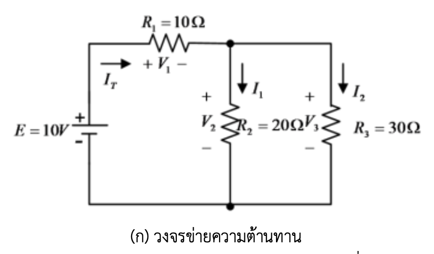
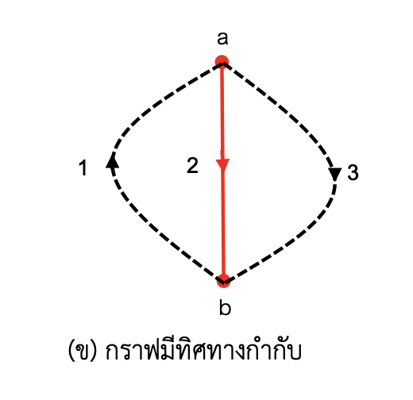
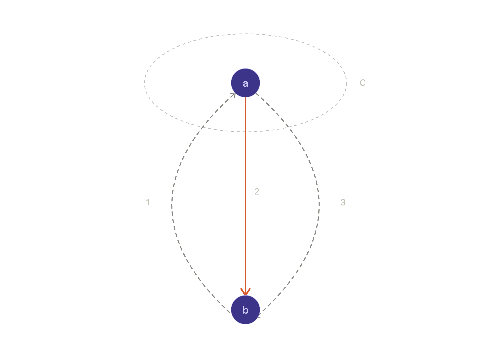

# วิเคราะห์วงจรด้วยวิธีชุดตัดพื้นฐาน (Fundamental Cutset Analysis)

> โจทย์ข้อนี้เป็นการประยุกต์ทฤษฎีกราฟโครงข่าย (Network Topology) ระดับ Circuit 2 โดยใช้แนวคิด **Tree/Co-tree**, **Fundamental Cutset** และ **Fundamental Cutset Matrix ($Q_f$)**
>
> อ้างอิงหลัก: C.A. Desoer & E.S. Kuh, *Basic Circuit Theory* (McGraw-Hill), Ch. 9–10; L.O. Chua, C.A. Desoer & E.S. Kuh, *Linear and Nonlinear Circuits* (McGraw-Hill), Ch. 12

---

## สารบัญ

1. [โจทย์](#โจทย์)
2. [อ่านโครงสร้างกราฟจากรูป](#ขั้นที่-1-อ่านโครงสร้างกราฟจากรูป)
3. [ทฤษฎีของ Fundamental Cutset](#ขั้นที่-2-ทฤษฎีของ-fundamental-cutset)
4. [หาสมการแรงดันกิ่ง (KVL)](#ขั้นที่-3-หาสมการแรงดันกิ่ง)
5. [สมการคุณสมบัติของแต่ละกิ่ง](#ขั้นที่-4-สมการคุณสมบัติของแต่ละกิ่ง)
6. [รวมสมการคุณสมบัติเป็น Branch Admittance Matrix](#ขั้นที่-5-รวมสมการคุณสมบัติทั้งหมดเป็นรูปเมทริกซ์)
7. [ประสานสมการทั้งสามกลุ่ม](#ขั้นที่-6-ประสานสมการทั้งสามกลุ่มเข้าด้วยกัน)
8. [แทนค่าตัวแปรของโจทย์](#ขั้นที่-7-แทนค่าตัวแปรของโจทย์)
9. [ตรวจทานด้วยตัวเลขจริง](#ขั้นที่-8-ตรวจทานด้วยตัวเลขจริง)
10. [สรุปแนวคิดสำคัญ](#สรุปแนวคิดสำคัญ)

---

## โจทย์

จากวงจรข่ายความต้านทานใน **รูปที่ 1 (ก)** ซึ่งเขียนกราฟมีทิศทางกำกับได้ดัง **รูปที่ 1 (ข)** อันประกอบด้วยกลุ่มของปม คือ $\{a, b\}$ และกลุ่มของกิ่ง คือ $\{1,2,3\}$

**กำหนด:**
- กิ่งที่ 1 กับกิ่งที่ 3 เป็น **ลิงค์ (Link)**
- กิ่งที่ 2 เป็น **ทรี (Tree/Twig)**
- $e$ คือ **แรงดันกิ่งของทรี**

**จงเขียนสมการชุดตัดให้อยู่ในรูปแบบเมทริกซ์-เวกเตอร์ ที่มีตัวแปรคือแรงดันกิ่งของทรี $e$** (ยังไม่ต้องแทนค่า $E, R_1, R_2, R_3$)

---

## ขั้นที่ 1: อ่านโครงสร้างกราฟจากรูป

จากรูป มี 2 ปม $\{a,b\}$ และ 3 กิ่ง $\{1,2,3\}$ โดยดูทิศทางลูกศรแต่ละกิ่งได้ดังนี้:

| กิ่ง | ทิศทาง (จากลูกศรในรูป) | สอดคล้องกับองค์ประกอบในวงจร | ประเภท |
|---|---|---|---|
| กิ่ง 1 | $b \to a$ | กิ่งรวมของ $E$ กับ $R_1$ (กระแส $I_T$ ไหลจาก $b$ ผ่าน $E,R_1$ เข้าปม $a$) | **ลิงค์ (Link)** |
| กิ่ง 2 | $a \to b$ | $R_2$ (กระแส $I_1$ ไหลจาก $a$ ลง $b$) | **ทรี (Tree/Twig)** |
| กิ่ง 3 | $a \to b$ | $R_3$ (กระแส $I_2$ ไหลจาก $a$ ลง $b$) | **ลิงค์ (Link)** |

ตรวจสอบว่ากราฟถูกต้องตามทฤษฎี: $n=2$ ปม, $b=3$ กิ่ง
- จำนวนกิ่งทรี = $n-1 = 1$ กิ่ง (ตรงกับกิ่ง 2) ✓
- จำนวนลิงค์ = $b-(n-1) = 3-1 = 2$ กิ่ง (ตรงกับกิ่ง 1, 3) ✓

**นิยามของ $e$**: โจทย์กำหนดให้ $e$ = แรงดันกิ่งของทรี (กิ่ง 2) โดยยึดทิศทางอ้างอิงเดียวกับลูกศรของกิ่ง 2 คือ $+$ ที่ปม $a$ (หาง) และ $-$ ที่ปม $b$ (หัวลูกศร) — สังเกตว่านี่คือ $V_2$ ในวงจรจริงนั่นเอง

---

## ขั้นที่ 2: ทฤษฎีของ Fundamental Cutset

**นิยาม**: เมื่อตัดกิ่งทรี 1 กิ่งออกจากต้นไม้ (tree) ต้นไม้จะแยกออกเป็น 2 ส่วน (2 กลุ่มปม) เสมอ **Fundamental Cutset** ของกิ่งทรีนั้น คือเซตของกิ่ง**ทั้งหมด**ในกราฟ (ทั้งทรีและลิงค์) ที่เชื่อมระหว่าง 2 ส่วนนี้

สำหรับกรณีนี้ ($n=2$): เมื่อตัดกิ่งทรี (กิ่ง 2) ออก ต้นไม้จะแยกเป็นปม $\{a\}$ กับปม $\{b\}$ ทันที (เพราะทรีมีแค่กิ่งเดียว) ดังนั้น **fundamental cutset ของกิ่ง 2 คือกิ่งทั้ง 3 กิ่งทั้งหมด** (เพราะทุกกิ่งเชื่อมระหว่าง $a$ กับ $b$)

**ทิศทางอ้างอิงของชุดตัด**: กำหนดให้ตรงกับทิศทางของกิ่งทรีที่นิยามมัน คือ $a \to b$

**เครื่องหมายในเมทริกซ์ $Q_f$**: เทียบทิศทางแต่ละกิ่งกับทิศทางอ้างอิงของชุดตัด ($a\to b$)
- เหมือนทิศทาง → $+1$
- สวนทิศทาง → $-1$
- ไม่อยู่ในชุดตัด → $0$

| กิ่ง | ทิศทางกิ่ง | เทียบกับทิศทางชุดตัด ($a\to b$) | ค่าใน $Q_f$ |
|---|---|---|---|
| 1 | $b\to a$ | สวนทาง | $-1$ |
| 2 | $a\to b$ (ตัวมันเอง) | ตามทาง | $+1$ |
| 3 | $a\to b$ | ตามทาง | $+1$ |

$$
Q_f = \begin{bmatrix} -1 & 1 & 1 \end{bmatrix} \quad \text{(ขนาด } 1\times 3\text{, เรียงตามกิ่ง 1,2,3)}
$$

**สมการ KCL ของชุดตัด** (บริบทก่อนไปขั้นต่อไป): $Q_f I_b = 0$ ให้ $-I_1+I_2+I_3=0$ ซึ่งตรงกับ KCL ที่ปม $a$ พอดี ($I_1$ ไหลเข้า = $I_2+I_3$ ไหลออก)

---

## ขั้นที่ 3: หาสมการแรงดันกิ่ง (KVL)

ทฤษฎีบทมาตรฐาน (Desoer-Kuh) กล่าวว่า: แรงดันกิ่งทรี (twig voltage) เป็นตัวแปรอิสระ และแรงดันทุกกิ่งในกราฟเขียนได้ในรูป

$$
V_b = Q_f^{\,T}\, e
$$

โดย $e$ คือเวกเตอร์แรงดันกิ่งทรี (ที่นี่มีตัวเดียว คือ $e$)

$$
\begin{bmatrix} V_1 \\ V_2 \\ V_3 \end{bmatrix}
=
\begin{bmatrix} -1 \\ 1 \\ 1 \end{bmatrix} e
$$

**เขียนแยกสมการ**:

$$
V_1 = -e, \qquad V_2 = e, \qquad V_3 = e
$$

### ตรวจทานความถูกต้อง (sanity check)

เนื่องจากกราฟนี้มีแค่ 2 ปม กรณีนี้จึงลดรูปเป็น**การวิเคราะห์แบบ single-node-pair แบบคลาสสิก** พอดี: ถ้าตั้ง $b$ เป็นปมอ้างอิง ($V_b=0$) แล้ว $e = V_a$ คือแรงดันปม $a$ นั่นเอง ตรวจสอบด้วยเมทริกซ์การต่อเนื่องแบบลดรูป (reduced incidence matrix, ตัดแถวปม $b$ ทิ้ง) จะได้ $A_{red} = [-1,\ 1,\ 1]$ ซึ่ง**เท่ากับ $Q_f$ พอดี** — เพราะเมื่อ $n=2$ ชุดตัดพื้นฐานหนึ่งเดียวก็คือ "กิ่งทั้งหมดที่แตะปม $a$" ซึ่งเป็นนิยามเดียวกับแถวเมทริกซ์การต่อเนื่องของปม $a$ พอดี และสูตร $V_b=A^T V_n$ (แรงดันกิ่ง = ผลต่างแรงดันปม) ก็ให้ผลเดียวกัน — ยืนยันว่าคำตอบถูกต้องสอดคล้องกันทั้งสองวิธี

---

## ขั้นที่ 4: สมการคุณสมบัติของแต่ละกิ่ง (Branch Constitutive Relations)

### หลักการทั่วไป: Passive Sign Convention

ก่อนเขียนสมการ ต้องยึด**กฎเครื่องหมาย (passive sign convention)** ให้สอดคล้องกับที่นิยาม $Q_f$ ไว้แล้ว: สำหรับกิ่งกราฟทุกกิ่ง เรากำหนดขั้ว **+ อยู่ที่หาง (tail)** ของลูกศร และ **− อยู่ที่หัว (head)** ของลูกศร โดยที่กระแสอ้างอิงไหลจาก + ไป − **ภายในกิ่ง** (นี่คือกฎเดียวกับที่ใช้ตอนกำหนด $V_2=e$ ไปแล้วในขั้นที่ 1) การยึดกฎนี้ให้สม่ำเสมอสำคัญมาก เพราะถ้าสลับขั้วแม้แต่กิ่งเดียว เครื่องหมายในสมการสุดท้ายจะผิดทันที

### กิ่งที่ 2 และ 3 (ตัวต้านทานล้วน)

ทั้งสองกิ่งนี้เป็น**ตัวต้านทานเพียวๆ** ทิศทางกระแสอ้างอิง ($a\to b$) ตรงกับทิศทางที่ใช้นิยาม $V_2,V_3$ อยู่แล้ว (+ ที่ $a$, − ที่ $b$) ดังนั้นกฎของโอห์มเขียนตรงไปตรงมาแบบ passive sign convention ปกติ:

$$
V_2 = R_2 I_2 \qquad\Longrightarrow\qquad I_2 = \frac{1}{R_2}V_2 = G_2 V_2
$$

$$
V_3 = R_3 I_3 \qquad\Longrightarrow\qquad I_3 = \frac{1}{R_3}V_3 = G_3 V_3
$$

โดย $G_2=1/R_2$, $G_3=1/R_3$ คือ**ค่าความนำไฟฟ้า (conductance)** ของแต่ละกิ่ง

### กิ่งที่ 1 (กิ่งผสม: แหล่งจ่ายแรงดัน $E$ อนุกรมกับ $R_1$)

กิ่งนี้ซับซ้อนกว่า เพราะในกราฟทอพอโลยี **กิ่งที่ 1 คือการรวม $E$ กับ $R_1$ เข้าเป็นอุปกรณ์สองขั้วเดียว (two-terminal composite element)** ตามภาพวงจร: กระแส $I_T$ ไหลออกจากขั้ว $+$ ของ $E$ ผ่าน $R_1$ เข้าสู่โหนด $a$ ขณะที่ขั้ว $-$ ของ $E$ ต่อกับโหนด $b$

**ไล่ศักย์ไฟฟ้าทีละช่วง จากโหนด $b$ ไปโหนด $a$** (ตามทิศทางอ้างอิงของกิ่ง 1 คือ $b\to a$):

1. จากโหนด $b$ ผ่านแหล่งจ่าย $E$ (จากขั้ว $-$ ไป $+$): ศักย์ **เพิ่มขึ้น** $E$ โวลต์
2. จากนั้นผ่าน $R_1$ ในทิศทางที่กระแส $I_1$ ไหล: ศักย์ **ลดลง** $I_1 R_1$ โวลต์

รวมสองช่วงเข้าด้วยกัน:

$$
V(a) = V(b) + E - I_1 R_1
$$

จัดรูปใหม่โดยใช้นิยาม $V_1 \equiv V(b)-V(a)$ (ขั้ว $+$ ที่ $b$ ตามที่ตารางในขั้นที่ 1 กำหนดไว้ว่ากิ่ง 1 มีทิศ $b\to a$):

$$
\boxed{V_1 = R_1 I_1 - E}
$$

**นี่คือสมการคุณสมบัติของกิ่งผสม** ซึ่งก็คือสมการ Thevenin (แหล่งจ่ายแรงดัน $E$ อนุกรมกับความต้านทาน $R_1$) พอดี

จัดรูปใหม่เพื่อให้ได้กระแสเป็นฟังก์ชันของแรงดัน (จำเป็นสำหรับขั้นต่อไป):

$$
I_1 = \frac{V_1+E}{R_1} = \underbrace{\frac{1}{R_1}}_{G_1}V_1 + \underbrace{\frac{E}{R_1}}_{I_{s1}}
$$

$$
\boxed{I_1 = G_1 V_1 + I_{s1}}
$$

รูปแบบนี้เรียกว่า **Norton Equivalent Form** ของกิ่ง — คือแปลง "แหล่งแรงดัน $E$ อนุกรม $R_1$" (Thevenin) ให้เป็น "แหล่งกระแส $I_{s1}=E/R_1$ ขนาน $R_1$" (Norton) นั่นเอง ทำไมต้องแปลง? เพราะ**วิธีชุดตัด (เช่นเดียวกับวิธีโหนด) ทำงานบนพื้นฐานของ KCL** ซึ่งบวกลบ "กระแส" เข้าด้วยกัน จึงจำเป็นต้องมีสมการในรูป $I=f(V)$ ไม่ใช่ $V=f(I)$ — นี่คือเหตุผลเชิงลึกว่าทำไมวิธี node/cutset analysis จึงนิยมแปลงทุกกิ่งเป็น Norton form ก่อนเสมอ

---

## ขั้นที่ 5: รวมสมการคุณสมบัติทั้งหมดเป็นรูปเมทริกซ์ (Branch Admittance Matrix Form)

รวมสมการทั้ง 3 กิ่งเป็นระบบเมทริกซ์เดียว:

$$
\begin{bmatrix}I_1\\I_2\\I_3\end{bmatrix} = \begin{bmatrix}G_1&0&0\\0&G_2&0\\0&0&G_3\end{bmatrix}\begin{bmatrix}V_1\\V_2\\V_3\end{bmatrix} + \begin{bmatrix}I_{s1}\\0\\0\end{bmatrix}
$$

เขียนย่อ:

$$
\boxed{I_b = Y_b\, V_b + I_s}
$$

โดย:
- $Y_b = \text{diag}(G_1,G_2,G_3) = \text{diag}\!\left(\dfrac{1}{R_1},\dfrac{1}{R_2},\dfrac{1}{R_3}\right)$ เรียกว่า **branch admittance matrix** — เป็นเมทริกซ์แนวทแยงเสมอ **ก็ต่อเมื่อไม่มีการควบคุมข้ามกิ่ง (no controlled sources / no mutual coupling)**
- $I_s = \begin{bmatrix}E/R_1\\0\\0\end{bmatrix}$ คือ **เวกเตอร์แหล่งกระแสสมมูล (Norton source vector)** ของแต่ละกิ่ง — มีค่าไม่เป็นศูนย์เฉพาะกิ่งที่มีแหล่งจ่ายอิสระอยู่จริง

สมการรูปนี้ (companion form) เป็นมาตรฐานที่ใช้ทั้งในการวิเคราะห์วงจรด้วยมือ และเป็นรากฐานของอัลกอริทึม **Modified Nodal Analysis (MNA)** ที่โปรแกรมจำลองวงจรอย่าง SPICE ใช้จริงในการคำนวณ

---

## ขั้นที่ 6: ประสานสมการทั้งสามกลุ่มเข้าด้วยกัน

ตอนนี้เรามีสมการครบ 3 กลุ่มแล้ว:

$$
\text{(KCL)} \quad Q_f I_b = 0 \tag{1}
$$

$$
\text{(KVL)} \quad V_b = Q_f^T e \tag{2}
$$

$$
\text{(Element law)} \quad I_b = Y_b V_b + I_s \tag{3}
$$

**ขั้นตอนการยุบตัวแปร (elimination):** เป้าหมายคือกำจัด $I_b$ และ $V_b$ ออกไป ให้เหลือแต่ $e$ ตัวเดียว

**แทน (3) ลงใน (1):**

$$
Q_f\big(Y_b V_b + I_s\big) = 0
$$

$$
Q_f Y_b V_b + Q_f I_s = 0 \tag{4}
$$

**แทน (2) ลงใน (4):**

$$
Q_f Y_b \big(Q_f^T e\big) + Q_f I_s = 0
$$

$$
\big(Q_f Y_b Q_f^T\big) e = -Q_f I_s
$$

**นี่คือรูปแบบทั่วไปของสมการชุดตัด** ที่เขียนในรูปเมทริกซ์-เวกเตอร์ โดยมี $e$ เป็นตัวแปรเดียว:

$$
\boxed{Y_C\, e = J_C}
$$

โดยนิยาม:
- $Y_C \equiv Q_f Y_b Q_f^T$ เรียกว่า **Cutset Admittance Matrix** — ขนาด $(n-1)\times(n-1)$ (ในที่นี้คือ $1\times1$) เป็นตัวที่บอก "ความนำไฟฟ้ารวม" ที่ตัวแปร $e$ มองเห็น
- $J_C \equiv -Q_f I_s$ เรียกว่า **Equivalent Cutset Source Vector** — เป็นผลรวมของแหล่งกระแสทั้งหมดที่ถูก "โยน" เข้ามาปะทะที่ชุดตัดนั้นๆ

> สังเกตว่ารูปแบบ $Y_C e = J_C$ นี้ **มีโครงสร้างเหมือนกันเป๊ะ** กับสมการโหนด $Y_n V_n = I_n$ ที่คุ้นเคยจาก nodal analysis ทั่วไป (Circuit 1) นั่นเพราะ **cutset analysis คือการวางนัยทั่วไป (generalization) ของ nodal analysis** ให้ใช้ได้กับกราฟที่ไม่จำเป็นต้องมี "ต้นไม้แบบดาว (star tree)" — ขณะที่ nodal analysis แบบดั้งเดิมมองว่าตัวแปรอิสระคือแรงดันแต่ละโหนดเทียบกับ ground เสมอ, cutset analysis ยืดหยุ่นกว่าเพราะเลือกต้นไม้ (tree) ได้อิสระ

---

## ขั้นที่ 7: แทนค่าตัวแปรของโจทย์ (เชิงสัญลักษณ์)

คำนวณ $Y_C = Q_f Y_b Q_f^T$ ทีละขั้นตอน (คูณเมทริกซ์จากขวาไปซ้าย):

**ขั้นย่อย ก) หา $Y_b Q_f^T$:**

$$
Y_b Q_f^T = \begin{bmatrix}\frac{1}{R_1}&0&0\\0&\frac{1}{R_2}&0\\0&0&\frac{1}{R_3}\end{bmatrix}\begin{bmatrix}-1\\1\\1\end{bmatrix} = \begin{bmatrix}-\frac{1}{R_1}\\[4pt]\frac{1}{R_2}\\[4pt]\frac{1}{R_3}\end{bmatrix}
$$

**ขั้นย่อย ข) หา $Q_f\big(Y_b Q_f^T\big)$:**

$$
Y_C = \begin{bmatrix}-1&1&1\end{bmatrix}\begin{bmatrix}-\frac{1}{R_1}\\[4pt]\frac{1}{R_2}\\[4pt]\frac{1}{R_3}\end{bmatrix} = (-1)\!\left(-\frac{1}{R_1}\right)+(1)\!\left(\frac{1}{R_2}\right)+(1)\!\left(\frac{1}{R_3}\right)
$$

$$
\boxed{Y_C = \frac{1}{R_1}+\frac{1}{R_2}+\frac{1}{R_3}} \quad (\text{ขนาด }1\times1\text{ เพราะมีทรีเดียว})
$$

คำนวณ $J_C = -Q_f I_s$:

$$
J_C = -\begin{bmatrix}-1&1&1\end{bmatrix}\begin{bmatrix}E/R_1\\0\\0\end{bmatrix} = -\Big[(-1)(E/R_1)+0+0\Big] = \frac{E}{R_1}
$$

$$
\boxed{J_C = \frac{E}{R_1}}
$$

### ✅ สมการชุดตัดฉบับสมบูรณ์ (คำตอบที่โจทย์ต้องการ)

$$
\underbrace{\left(\frac{1}{R_1}+\frac{1}{R_2}+\frac{1}{R_3}\right)}_{Y_C}\; e \;=\; \underbrace{\frac{E}{R_1}}_{J_C}
$$

หรือเขียนในรูปเมทริกซ์-เวกเตอร์เต็มรูปแบบ (แสดงที่มาครบทุกขั้น):

$$
\begin{bmatrix}-1&1&1\end{bmatrix}\begin{bmatrix}\frac{1}{R_1}&0&0\\0&\frac{1}{R_2}&0\\0&0&\frac{1}{R_3}\end{bmatrix}\begin{bmatrix}-1\\1\\1\end{bmatrix} e \;=\; -\begin{bmatrix}-1&1&1\end{bmatrix}\begin{bmatrix}E/R_1\\0\\0\end{bmatrix}
$$

นี่คือคำตอบสุดท้ายในรูปแบบเมทริกซ์-เวกเตอร์ ที่มีตัวแปรเดียวคือแรงดันกิ่งทรี $e$ ตามที่โจทย์ต้องการเป๊ะ — ยังไม่ต้องแทนค่าตัวเลข $E,R_1,R_2,R_3$ ก็ยังคงเป็นสมการที่สมบูรณ์และแก้ได้ในเชิงสัญลักษณ์

---

## ขั้นที่ 8: ตรวจทานด้วยตัวเลขจริง (best practice)

ลองแทนตัวเลขจริง $E=10\text{V}, R_1=10\Omega, R_2=20\Omega, R_3=30\Omega$:

$$
Y_C = \frac{1}{10}+\frac{1}{20}+\frac{1}{30} = 0.1+0.05+0.0333 = 0.1833\ \text{S}
$$

$$
J_C = \frac{10}{10}=1\ \text{A}
$$

$$
e = \frac{J_C}{Y_C} = \frac{1}{0.1833} \approx 5.4545\ \text{V}
$$

**ตรวจทานด้วยวิธี nodal analysis แบบดั้งเดิม (Circuit 1)** โดยตั้ง $b$ เป็น ground, $e=V_a$: กระแสที่ไหลเข้าโหนด $a$ จาก $E,R_1$ ต้องเท่ากับกระแสที่ไหลออกผ่าน $R_2,R_3$:

$$
\frac{E-V_a}{R_1}=\frac{V_a}{R_2}+\frac{V_a}{R_3} \;\;\Rightarrow\;\; V_a \approx 5.4545\text{ V}
$$

ตรงกันพอดีกับค่า $e$ ที่ได้จากวิธีชุดตัด ✓ ยืนยันว่าการยุบสมการทั้งหมดถูกต้อง — และยังยืนยันสิ่งที่ระบุไว้ตอนท้ายขั้นที่ 3 ด้วยว่า สำหรับกราฟ 2 โหนดกรณีนี้ วิธีชุดตัดลดรูปเหลือเทียบเท่ากับวิธีโหนดพอดี

---

## สรุปแนวคิดสำคัญ

1. **สมการวิเคราะห์วงจรทุกวิธีมี 3 ชั้นเสมอ**: topological KCL, topological KVL, และ element (constitutive) law — สิ่งที่ต่างกันระหว่างวิธี node/loop/cutset คือ**ลำดับการยุบตัวแปร**และ**ตัวแปรอิสระที่เลือกเก็บไว้**เท่านั้น
2. กิ่งที่มีแหล่งจ่ายอนุกรมกับตัวต้านทานต้องแปลงเป็น **Norton form** ก่อนเสมอ เพื่อให้อยู่ในรูป $I=f(V)$ ที่เข้ากับ KCL ได้
3. $Y_C = Q_f Y_b Q_f^T$ คือ Cutset Admittance Matrix ซึ่งมีโครงสร้างขนานกับ Nodal Admittance Matrix ทุกประการ — เป็นเหตุผลที่ทำให้ cutset method เป็น **generalization** ของ nodal analysis
4. วิธีนี้ (และคู่ตรงข้ามของมันคือ loop method ผ่าน $Z_L = B_f Z_b B_f^T$) เป็นรากฐานของการวิเคราะห์วงจรเชิงระบบ (systematic circuit analysis) ที่ใช้ในซอฟต์แวร์ EDA/SPICE จริง

---

## อ้างอิงหลัก

- C.A. Desoer & E.S. Kuh, *Basic Circuit Theory*, McGraw-Hill — บทที่ 9 (Network Topology), บทที่ 10 (Formulation of Network Equations)
- L.O. Chua, C.A. Desoer & E.S. Kuh, *Linear and Nonlinear Circuits*, McGraw-Hill — บทที่ 12 (State Equations, Cutset/Loop methods)
