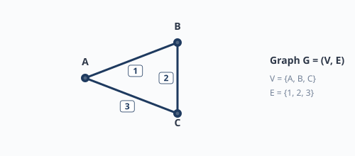
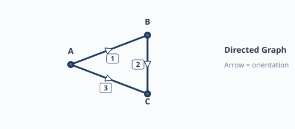
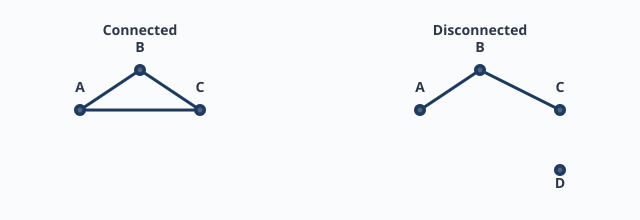
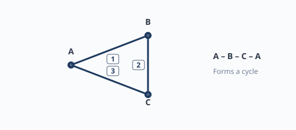
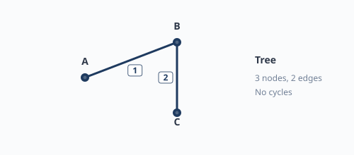
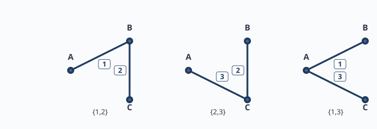

# หน่วยที่ 1 — พื้นฐานทฤษฎีกราฟสำหรับวงจรไฟฟ้า

## 1.1 ทำไมต้องเรียนกราฟเพื่อวิเคราะห์วงจร?

วงจรไฟฟ้าที่ซับซ้อนมีหลายอุปกรณ์ต่อกันด้วยลวดสายไฟ หากจะเขียนสมการ KCL/KVL โดยตรง เราอาจพลาดหรือทำสมการซ้ำซ้อน ทฤษฎีกราฟช่วยให้มองวงจรเป็นโครงสร้างนามธรรม (abstract structure) แล้วเขียนสมการเชิงระบบได้ถูกต้องและเป็นระบบ

**ตัวอย่าง**: วงจร 6 ปม 11 กิ่ง ในข้อพิเศษ มี spanning tree 139 แบบ แต่ละแบบให้ชุดสมการ cutset ที่อิสระต่อกัน ซึ่งเป็นพื้นฐานของการวิเคราะห์ mesh/nodal ขั้นสูง

---

## 1.2 คำจำกัดความพื้นฐาน

### กราฟ (Graph)

กราฟ $G = (V, E)$ ประกอบด้วย
- $V$ คือ เซตของ **ปม** (vertex / node) แทนจุดต่อ หรือ บัส (bus) ในวงจร
- $E$ คือ เซตของ **กิ่ง** (edge / branch) แทนอุปกรณ์หรือเส้นทางเชื่อมต่อระหว่างปม

### กราฟมีทิศทางกำกับ (Directed Graph)

กราฟที่แต่ละกิ่งมีทิศทาง (orientation) กำหนดจากปมหัว (tail) ไปยังปมหาง (head) ในวงจร ทิศทางมักเลือกตามลูกศรของกระแสอ้างอิง แต่หากต้องการหา tree เราจะละทิ้งทิศทางชั่วคราว

### กราฟเชื่อมต่อ (Connected Graph)

กราฟเชื่อมต่อคือ กราฟที่ทุกคู่ปมสามารถเดินทางถึงกันได้โดยใช้กิ่งในกราฟ วงจรไฟฟ้าส่วนใหญ่สมมติว่าเชื่อมต่อ ถ้าไม่เชื่อมต่อแสดงว่ามีส่วนย่อยแยกจากกัน

### วงรอบ (Cycle / Loop)

วงรอบคือ เส้นทางที่เริ่มและจบที่ปมเดียวกัน โดยไม่ผ่านกิ่งซ้ำ ในกราฟเชิงเส้น (simple graph) วงรอบ 3 ปมคือสามเส้นต่อเป็นสามเหลี่ยม

### ต้นไม้ (Tree)

ต้นไม้คือ กราฟเชื่อมต่อที่ไม่มีวงรอบ สมบัติสำคัญ:
- ถ้ามี $n$ ปม ต้นไม้จะมี $n-1$ กิ่ง
- ระหว่างปมใด ๆ สองปม มีเส้นทางเพียงเส้นทางเดียว
- ตัดกิ่งใดกิ่งหนึ่งออก กราฟจะแยกเป็นสองส่วน

### ต้นไม้ทอดข้าม (Spanning Tree)

ต้นไม้ทอดข้ามของกราฟ $G$ คือ ต้นไม้ย่อยของ $G$ ที่มีปมครบทุกปมของ $G$ กิ่งใน spanning tree เรียกว่า **twig** กิ่งที่เหลือของ $G$ เรียกว่า **link** หรือ **co-tree branch**

---

## 1.3 การนับเบื้องต้นด้วยการวาด

สำหรับกราฟเล็ก ๆ เราสามารถวาด spanning tree ทั้งหมดด้วยมือ

**ตัวอย่าง**: กราฟสามเหลี่ยม 3 ปม 3 กิ่ง
- กิ่งคือ {1,2,3} โดย 1=AB, 2=BC, 3=CA
- spanning tree คือ ชุดกิ่ง 2 กิ่งที่เชื่อมต่อทุกปมและไม่มีวงรอบ
- ได้ทั้งหมด 3 แบบ: {1,2}, {2,3}, {3,1}

**วิธีตรวจสอบ**: มีกี่วิธีเลือกกิ่ง 2 จาก 3 กิ่ง ($\binom{3}{2}=3$) แล้วตรวจว่าแต่ละชุดเชื่อมต่อครบทุกปมและไม่มีวงรอบ

---

## 1.4 แบบฝึกหัดท้ายหน่วย

1. กราฟเชื่อมต่อ 4 ปม เป็นเส้นตรง A–B–C–D มีกี่ spanning tree?
2. กราฟสี่เหลี่ยม 4 ปม 4 กิ่ง มีกี่ spanning tree?
3. ทำไม spanning tree ของกราฟ $n$ ปม จึงมี $n-1$ กิ่ง

## 1.5 หมายเหตุ

เนื้อหาต่อจากหน่วยนี้จะนำกราฟไปสู่การนับด้วยเมทริกซ์และการเขียนสมการเซตตัด ดู [หน่วยที่ 2](02-graph-matrices-and-matrix-tree-theorem.md)
