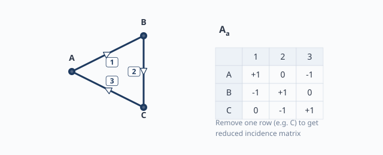
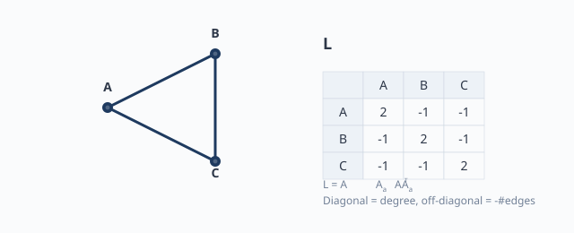
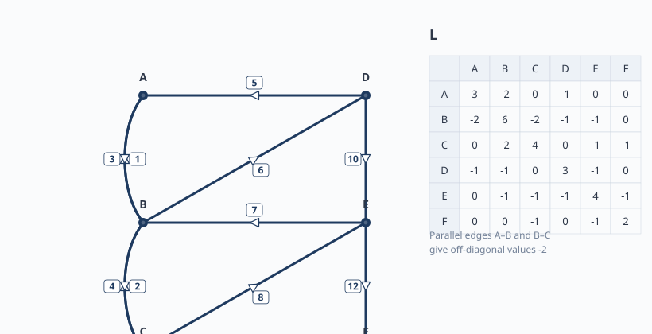
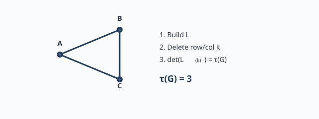

# หน่วยที่ 2 — เมทริกซ์ของกราฟ และ Matrix-Tree Theorem

ในหน่วยที่ 1 เราเรียนรู้ว่า "วงจรไฟฟ้า" สามารถมองเป็น "กราฟ" ได้ โดยมีปม (node) แทนจุดเชื่อมต่อ และมีกิ่ง (branch) แทนอุปกรณ์หรือสายไฟ หน่วยนี้จะพาทุกคนก้าวต่อไปอีกก้าว: **การเก็บกราฟลงในตารางตัวเลข** แล้วใช้ตัวเลขเหล่านั้นนับ spanning tree ได้โดยไม่ต้องวาดทุกรูป

เป้าหมายหลักของหน่วยที่ 2 มี 3 ข้อ:

1. เข้าใจว่า **เมทริกซ์ (matrix)** คืออะไร และทำไมต้องใช้กับกราฟ
2. สร้าง **Incidence Matrix** และ **Laplacian Matrix** ได้จากกราฟที่ให้มา
3. ใช้ **Matrix-Tree Theorem** นับจำนวน spanning tree อย่างถูกต้อง รวมถึงกราฟที่มีกิ่งขนานด้วย

เอกสารชุดนี้เขียนให้ผู้อ่านที่ไม่มีพื้นฐานคณิตศาสตร์มากก็สามารถทำตามได้ ทุกขั้นจะมีตัวอย่างประกอบ และในท้ายที่สุดเราจะแก้โจทย์เดียวกับ [SPECIAL_PROBLEM.md](../chapter1-exercise-1-3-cutset-equations/SPECIAL_PROBLEM.md) เพื่อให้เห็นภาพเต็ม

---

## 2.0 ทบทวนเครื่องมือคณิตศาสตร์ที่ต้องใช้

ก่อนลงรายละเอียดเรื่องกราฟ เราต้องทำความรู้จักเครื่องมือ 3 อย่าง: **ตารางตัวเลข (matrix)**, **ดัชนี (index)**, และ **ดีเทอร์มิแนนต์ (determinant)**

### 2.0.1 ตารางตัวเลข (Matrix)

เมทริกซ์คือการเรียงตัวเลขเป็น **แถว (row)** แนวนอน และ **หลัก (column)** แนวตั้ง ลงในตารางสี่เหลี่ยม

ตัวอย่างเมทริกซ์ $3 \times 3$ อ่านว่า "สาม คูณ สาม" หมายถึงมี 3 แถว 3 หลัก:

$$
M =
\begin{bmatrix}
2 & -1 & 0 \\
-1 & 3 & -1 \\
0 & -1 & 2
\end{bmatrix}
$$

คำศัพท์ที่ใช้:

- **แถว** (row): แนวนอน ในตัวอย่างแถวแรกคือ $[2, -1, 0]$
- **หลัก** (column): แนวตั้ง ในตัวอย่างหลักแรกคือ $\begin{bmatrix}2 \\ -1 \\ 0\end{bmatrix}$
- **องค์ประกอบ** (entry/element): ตัวเลขแต่ละช่อง เช่น $m_{11}=2$, $m_{12}=-1$, $m_{23}=-1$

สัญลักษณ์ $m_{ij}$ อ่านว่า "เอ็ม ไอ เจ" หมายถึงองค์ประกอบใน **แถวที่ $i$** และ **หลักที่ $j$** ตัวห้อยตัวแรกคือแถว ตัวห้อยตัวหลังคือหลัก

### 2.0.2 ตัวห้อยและตัวยก

- ตัวห้อย (subscript) เช่น $i_j$ หรือ $a_{ij}$ ใช้บอก "ลำดับ" หรือ "ตำแหน่ง"
- ตัวยก (superscript) เช่น $A^{\mathsf{T}}$ ใช้บอก "transpose" คือ การสลับแถวกับหลัก
- ตัวยกในวงเล็บ เช่น $L^{(k)}$ หมายถึง "เมทริกซ์ $L$ ที่ลบแถวและหลัก $k$ ออก"

### 2.0.3 ดีเทอร์มิแนนต์ (Determinant)

ดีเทอร์มิแนนต์คือค่าตัวเลขหนึ่งค่าที่หาได้จากเมทริกซ์สี่เหลี่ยม (จำนวนแถว = จำนวนหลัก) สัญลักษณ์คือ $\det(M)$ หรือ $|M|$

สำหรับเมทริกซ์ $2 \times 2$:

$$
\det\!
\begin{bmatrix}
a & b \\
c & d
\end{bmatrix}
= ad - bc
$$

สำหรับเมทริกซ์ $3 \times 3$ สามารถหาได้ด้วยวิธี cofactor expansion ซึ่งจะอธิบายต่อเมื่อถึงตัวอย่าง

### 2.0.4 ทรานสโพส (Transpose)

การทำ transpose คือการสลับแถวกลายเป็นหลัก และหลักกลายเป็นแถว สัญลักษณ์คือ $M^{\mathsf{T}}$

ตัวอย่าง:

$$
A =
\begin{bmatrix}
1 & -1 & 0 \\
0 & 1 & -1
\end{bmatrix}
\quad\Rightarrow\quad
A^{\mathsf{T}} =
\begin{bmatrix}
1 & 0 \\
-1 & 1 \\
0 & -1
\end{bmatrix}
$$

เมทริกซ์ $A$ ขนาด $2 \times 3$ มี transpose ขนาด $3 \times 2$ องค์ประกอบ $a_{ij}$ ของ $A$ จะกลายเป็น $a_{ji}$ ของ $A^{\mathsf{T}}$

---

## 2.1 ทำไมต้องใช้เมทริกซ์กับกราฟ

เมื่อกราฟมีจำนวนปมและกิ่งมากขึ้น การวาดรูปและนับด้วยตาเปล่าจะผิดพลาดได้ง่าย เมทริกซ์ช่วยให้เรา:

1. **เก็บข้อมูลเป็นตาราง**: ปมเป็นแถว กิ่งเป็นหลัก ทิศทางเป็นเครื่องหมาย $+1$ หรือ $-1$
2. **คำนวณเป็นระบบ**: ใช้กฎของเมทริกซ์หา Laplacian และ determinant
3. **นับ spanning tree**: ใช้ Matrix-Tree Theorem หาจำนวนต้นไม้ได้โดยไม่ต้องวาดทุกรูป

---

## 2.2 Incidence Matrix แบบเต็ม ($A_a$)

### 2.2.1 นิยาม

สำหรับกราฟมีทิศทางกำกับที่มี $n$ ปม และ $b$ กิ่ง **Incidence Matrix แบบเต็ม** หรือ **Augmented Incidence Matrix** เขียนสัญลักษณ์ว่า $A_a$ เป็นตารางขนาด $n \times b$ กำหนดดังนี้

$$
(a_{ij}) =
\begin{cases}
+1, & \text{กิ่ง } j \text{ ออกจากปม } i \\
-1, & \text{กิ่ง } j \text{ เข้าปม } i \\
0, & \text{กิ่ง } j \text{ ไม่เกี่ยวข้องกับปม } i
\end{cases}
$$

คำอธิบาย:

- **แถว** = ปม เช่น แถว 1 = ปม A, แถว 2 = ปม B
- **หลัก** = กิ่ง เช่น หลัก 1 = กิ่ง 1, หลัก 2 = กิ่ง 2
- ถ้ากิ่งออกจากปม ใส่ $+1$
- ถ้ากิ่งเข้าปม ใส่ $-1$
- ถ้ากิ่งไม่ได้ต่อกับปม ใส่ $0$

### 2.2.2 วิธีสร้าง Incidence Matrix ทีละขั้น

**ขั้นที่ 1 — วาดกราฟและกำหนดชื่อ**

เขียนปมและกิ่ง พร้อมระบุทิศทางลูกศรและหมายเลขกิ่ง

**ขั้นที่ 2 — สร้างตารางเปล่า**

แถว = ปม (เรียงตามชื่อ), หลัก = กิ่ง (เรียงตามหมายเลข)

**ขั้นที่ 3 — เติมเครื่องหมาย**

ดูกิ่งแต่ละกิ่ง แล้วใส่ $+1$ ในปมที่ลูกศรออก, $-1$ ในปมที่ลูกศรเข้า, $0$ ในปมอื่น

**ขั้นที่ 4 — ตรวจสอบ**

ในแต่ละหลักต้องมี $+1$ หนึ่งตัว, $-1$ หนึ่งตัว และ $0$ ในที่เหลือ (เพราะกิ่งหนึ่งกิ่งเชื่อมระหว่างสองปม) ถ้ากราฟมีกิ่งขนาน แต่ละกิ่งจะเป็นหลักแยกกัน

### 2.2.3 ตัวอย่าง 1: กราฟ 3 ปม 3 กิ่งสามเหลี่ยม

กราฟมีปม A, B, C และกิ่ง 1, 2, 3 ดังนี้:

- กิ่ง 1: A ไป B
- กิ่ง 2: B ไป C
- กิ่ง 3: C ไป A

สร้างตาราง:

| ปม \ กิ่ง | 1 | 2 | 3 |
|:---:|:---:|:---:|:---:|
| A | +1 | 0 | -1 |
| B | -1 | +1 | 0 |
| C | 0 | -1 | +1 |

เขียนเป็นเมทริกซ์:

$$
A_a =
\begin{bmatrix}
+1 & 0 & -1 \\
-1 & +1 & 0 \\
0 & -1 & +1
\end{bmatrix}
$$

ตรวจสอบ:

- หลัก 1: กิ่ง 1 ออกจาก A ไป B → แถว A ได้ $+1$ แถว B ได้ $-1$ ถูกต้อง
- หลัก 2: กิ่ง 2 ออกจาก B ไป C → แถว B ได้ $+1$ แถว C ได้ $-1$ ถูกต้อง
- หลัก 3: กิ่ง 3 ออกจาก C ไป A → แถว C ได้ $+1$ แถว A ได้ $-1$ ถูกต้อง

### 2.2.4 ตัวอย่าง 2: กราฟมีกิ่งขนาน

พิจารณากราฟ 2 ปม A และ B มีกิ่งขนาน 2 กิ่ง กิ่ง 1 จาก A ไป B, กิ่ง 2 จาก A ไป B

| ปม \ กิ่ง | 1 | 2 |
|:---:|:---:|:---:|
| A | +1 | +1 |
| B | -1 | -1 |

$$
A_a =
\begin{bmatrix}
+1 & +1 \\
-1 & -1
\end{bmatrix}
$$

สังเกต: กิ่งขนานจะมีหลักแยกกัน แต่ละหลักยังคงมี $+1$ และ $-1$ คู่กัน

### 2.2.5 ตัวอย่าง 3: กราฟ 6 ปม 11 กิ่ง

โจทย์พิเศษใน [SPECIAL_PROBLEM.md](../chapter1-exercise-1-3-cutset-equations/SPECIAL_PROBLEM.md) มีกราฟ 6 ปม 11 กิ่ง ปมเรียกว่า A, B, C, D, E, F ทิศทางกิ่งดังตาราง:

| กิ่ง | ทิศทาง | กิ่ง | ทิศทาง |
|---:|:---|---:|:---|
| 1 | $B \to A$ | 2 | $C \to B$ |
| 3 | $A \to B$ | 4 | $B \to C$ |
| 5 | $D \to A$ | 6 | $B \to D$ |
| 7 | $E \to B$ | 8 | $C \to E$ |
| 9 | $C \to F$ | 10 | $D \to E$ |
| 12 | $E \to F$ | | |

Incidence matrix ขนาด $6 \times 11$ จึงเป็น:

$$
A_a =
\begin{bmatrix}
+1 & 0 & -1 & 0 & +1 & -1 & 0 & 0 & 0 & 0 & 0 \\
-1 & +1 & +1 & -1 & 0 & +1 & -1 & 0 & 0 & 0 & 0 \\
0 & -1 & 0 & +1 & 0 & 0 & 0 & +1 & +1 & 0 & 0 \\
0 & 0 & 0 & 0 & -1 & +1 & 0 & 0 & 0 & +1 & 0 \\
0 & 0 & 0 & 0 & 0 & 0 & +1 & -1 & 0 & -1 & +1 \\
0 & 0 & 0 & 0 & 0 & 0 & 0 & 0 & -1 & 0 & -1
\end{bmatrix}
$$

คอลัมน์เรียงตามลำดับกิ่ง $1, 2, 3, 4, 5, 6, 7, 8, 9, 10, 12$ ลองตรวจสอบกิ่ง 1 กิ่งเดียว: กิ่ง 1 ไปจาก B ไป A ดังนั้นแถว B ได้ $-1$ แถว A ได้ $+1$ ถูกต้อง

---

## 2.3 Reduced Incidence Matrix ($A$)

### 2.3.1 ทำไมต้องลบแถว

เมื่อนำ Incidence Matrix $A_a$ ไปคูณกับเวกเตอร์กระแส $i_b$ จะได้:

$$
A_a i_b = 0
$$

หมายถึง KCL ที่ทุกปม แต่สมการ KCL ที่ทุกปมไม่เป็นอิสระต่อกัน: ถ้ารวมทุกสมการ ฝั่งซ้ายจะหักล้างกันหมดเหลือ $0 = 0$ ซึ่งไม่ให้ข้อมูลใหม่ ดังนั้นเราลบ **แถวหนึ่งแถว** ออก (เลือกปมอ้างอิง หรือ ground) เพื่อให้ได้สมการที่เป็นอิสระ

### 2.3.2 วิธีลบแถว

เลือกปมใดปมหนึ่งเป็น **ปมอ้างอิง (reference node)** แล้วลบแถวของปมนั้นออกจาก $A_a$ เหลือเมทริกซ์ $A$ ขนาด $(n-1) \times b$

ตัวอย่าง จาก $A_a$ ของกราฟ 3 ปม ถ้าเลือก C เป็นปมอ้างอิง ลบแถว C ออก:

$$
A =
\begin{bmatrix}
+1 & 0 & -1 \\
-1 & +1 & 0
\end{bmatrix}
$$

เมทริกซ์ $A$ ขนาด $2 \times 3$ แสดง KCL ที่ปม A และ B โดยมี C เป็น reference

---

## 2.4 Laplacian Matrix ($L$)

### 2.4.1 นิยามจาก Incidence Matrix

**Laplacian Matrix** เขียนว่า $L$ เป็นวิธีรวมข้อมูล degree และการเชื่อมต่อของกราฟเข้าในเมทริกซ์สี่เหลี่ยม นิยามได้จาก:

$$
L = A_a A_a^{\mathsf{T}}
$$

หมายความว่า คูณ $A_a$ กับ transpose ของตัวเอง ผลลัพธ์จะเป็นเมทริกซ์ขนาด $n \times n$

### 2.4.2 นิยามทีละองค์ประกอบ

การคูณเมทริกซ์ข้างต้นจะให้ผลลัพธ์ที่มีความหมายชัดเจน:

$$
L_{ij} =
\begin{cases}
\deg(i), & i = j \\
- \text{จำนวนกิ่งระหว่าง } i \text{ และ } j, & i \neq j
\end{cases}
$$

คำอธิบาย:

- **ทแยงมุม** ($i = j$): คือ degree ของปม $i$ หรือจำนวนกิ่งที่ต่อกับปมนั้น ถ้ามีกิ่งขนานให้นับแยก
- **นอกทแยงมุม** ($i \neq j$): คือลบด้วยจำนวนกิ่งที่เชื่อมระหว่างปม $i$ กับปม $j$

### 2.4.3 วิธีสร้าง Laplacian โดยตรงจากกราฟ

ไม่ต้องคูณเมทริกซ์ ทำตามขั้นตอนนี้:

1. วาดกราฟและนับ degree ของแต่ละปม ใส่ในตำแหน่งทแยงมุม
2. สำหรับคู่ปม $i$ กับ $j$ ใส่ $-\text{จำนวนกิ่งระหว่าง i กับ j}$ ในตำแหน่ง $(i,j)$ และ $(j,i)$
3. ตรวจสอบว่าเมทริกซ์สมมาตร: $L_{ij} = L_{ji}$

### 2.4.4 ตัวอย่าง 1: กราฟ 3 ปมสามเหลี่ยม

กราฟมีปม A, B, C กิ่ง 1(A-B), 2(B-C), 3(C-A) ไม่มีกิ่งขนาน

- $\deg(A) = 2$ เชื่อมกับ B และ C
- $\deg(B) = 2$ เชื่อมกับ A และ C
- $\deg(C) = 2$ เชื่อมกับ A และ B

ทุกคู่ปมมีกิ่งเชื่อม 1 กิ่ง ดังนั้นนอกทแยงมุม = $-1$

$$
L =
\begin{bmatrix}
2 & -1 & -1 \\
-1 & 2 & -1 \\
-1 & -1 & 2
\end{bmatrix}
$$

### 2.4.5 ตัวอย่าง 2: กราฟ 4 ปมเส้นตรง

กราฟ A–B–C–D มี 3 กิ่ง ได้แก่ AB, BC, CD

- $\deg(A) = 1$ (ต่อกับ B)
- $\deg(B) = 2$ (ต่อกับ A, C)
- $\deg(C) = 2$ (ต่อกับ B, D)
- $\deg(D) = 1$ (ต่อกับ C)

คู่ปมที่ไม่ได้เชื่อมโดยตรง เช่น A-C, A-D, B-D มีค่า 0

$$
L =
\begin{bmatrix}
1 & -1 & 0 & 0 \\
-1 & 2 & -1 & 0 \\
0 & -1 & 2 & -1 \\
0 & 0 & -1 & 1
\end{bmatrix}
$$

### 2.4.6 ตัวอย่าง 3: กราฟ 4 ปมสี่เหลี่ยม

กราฟ A–B–C–D–A มี 4 กิ่ง ได้แก่ AB, BC, CD, DA

- $\deg(A) = 2$ (ต่อกับ B, D)
- $\deg(B) = 2$ (ต่อกับ A, C)
- $\deg(C) = 2$ (ต่อกับ B, D)
- $\deg(D) = 2$ (ต่อกับ C, A)

$$
L =
\begin{bmatrix}
2 & -1 & 0 & -1 \\
-1 & 2 & -1 & 0 \\
0 & -1 & 2 & -1 \\
-1 & 0 & -1 & 2
\end{bmatrix}
$$

### 2.4.7 ตัวอย่าง 4: กราฟ 6 ปม 11 กิ่งจาก SPECIAL_PROBLEM

กราฟนี้มีกิ่งขนานระหว่าง A–B 2 กิ่ง (1, 3) และระหว่าง B–C 2 กิ่ง (2, 4)

การนับ degree ให้นับทุกกิ่งแยกกัน:

- ปม A: เชื่อมกับ B โดยกิ่ง 1, 3 และกับ D โดยกิ่ง 5 → $\deg(A) = 3$
- ปม B: เชื่อมกับ A โดยกิ่ง 1, 3, กับ C โดยกิ่ง 2, 4, กับ D โดยกิ่ง 6, และกับ E โดยกิ่ง 7 → $\deg(B) = 6$
- ปม C: เชื่อมกับ B โดยกิ่ง 2, 4, กับ E โดยกิ่ง 8, และกับ F โดยกิ่ง 9 → $\deg(C) = 4$
- ปม D: เชื่อมกับ A โดยกิ่ง 5, กับ B โดยกิ่ง 6, และกับ E โดยกิ่ง 10 → $\deg(D) = 3$
- ปม E: เชื่อมกับ B โดยกิ่ง 7, กับ C โดยกิ่ง 8, กับ D โดยกิ่ง 10, และกับ F โดยกิ่ง 12 → $\deg(E) = 4$
- ปม F: เชื่อมกับ C โดยกิ่ง 9 และกับ E โดยกิ่ง 12 → $\deg(F) = 2$

คู่ปมที่มีกิ่งขนาน:

- A–B มี 2 กิ่ง → $L_{AB} = L_{BA} = -2$
- B–C มี 2 กิ่ง → $L_{BC} = L_{CB} = -2$
- คู่ปมอื่นมีกิ่งเดียว → $-1$
- คู่ปมที่ไม่ได้เชื่อมตรง → $0$

Laplacian matrix จึงได้:

$$
L =
\begin{bmatrix}
3 & -2 & 0 & -1 & 0 & 0 \\
-2 & 6 & -2 & -1 & -1 & 0 \\
0 & -2 & 4 & 0 & -1 & -1 \\
-1 & -1 & 0 & 3 & -1 & 0 \\
0 & -1 & -1 & -1 & 4 & -1 \\
0 & 0 & -1 & 0 & -1 & 2
\end{bmatrix}
$$

ตรวจสอบความสมมาตร: $L_{12} = -2$ และ $L_{21} = -2$ ถูกต้อง $L_{23} = -2$ และ $L_{32} = -2$ ถูกต้อง

---

## 2.5 Matrix-Tree Theorem

### 2.5.1 ทฤษฎีบท

**ทฤษฎีบท (Kirchhoff, 1847)**: จำนวน spanning tree ของกราฟ $G$ ที่เชื่อมต่อ เท่ากับ cofactor ใด ๆ ของ Laplacian matrix $L$ หรือก็คือ

$$
\tau(G) = \det(L^{(k)})
$$

โดย $L^{(k)}$ คือเมทริกซ์ $L$ ที่ลบ **แถวที่ $k$ และหลักที่ $k$** ออกไป ค่า $\det$ จะได้เท่ากันไม่ว่าจะเลือก $k$ ใด

### 2.5.2 ทำไมต้องนับ spanning tree

ในบทเรียนต่อ ๆ ไป เราจะเห็นว่าแต่ละ spanning tree ให้ชุดสมการ cutset ที่อิสระต่อกัน หากรู้จำนวนต้นไม้ทั้งหมด เราจะรู้ว่ามีวิธีเลือกต้นไม้กี่วิธี ซึ่งสำคัญกับการวิเคราะห์วงจรหลาย ๆ แบบ

### 2.5.3 วิธีใช้งาน Matrix-Tree Theorem ทีละขั้น

1. **สร้าง Laplacian matrix $L$ ขนาด $n \times n$** จากกราฟ
2. **เลือกปมอ้างอิง** (กราวด์) ที่จะลบออก
3. **ลบแถวและหลักที่ตรงกับปมอ้างอิง** ได้เมทริกซ์ $(n-1) \times (n-1)$
4. **หา determinant** ของเมทริกซ์ที่เหลือ
5. **ค่า determinant คือจำนวน spanning tree ทั้งหมด**

### 2.5.4 ทำไม cofactor ใดก็ได้ให้ค่าเท่ากัน

สมบัติทางคณิตศาสตร์ของ Laplacian บอกว่า แถวทุกแถวและหลักทุกหลักรวมกันเป็น 0 เมทริกซ์ที่มีสมบัตินี้จะทำให้ cofactor ทุกตำแห่งมีค่าเท่ากัน ดังนั้นเลือกลบปมที่สะดวกที่สุด เช่น ปมที่มี degree น้อยหรือปมที่อยู่ขอบกราฟ

---

## 2.6 ตัวอย่างเต็ม: กราฟ 3 ปมสามเหลี่ยม

พิจารณากราฟสามเหลี่ยมที่มีปม A, B, C และกิ่ง 1(A–B), 2(B–C), 3(C–A)

### ขั้นที่ 1: สร้าง Laplacian

$$
L =
\begin{bmatrix}
2 & -1 & -1 \\
-1 & 2 & -1 \\
-1 & -1 & 2
\end{bmatrix}
$$

### ขั้นที่ 2: เลือกปมอ้างอิง

เลือกปม C เป็นปมอ้างอิง

### ขั้นที่ 3: ลบแถวและหลักของ C

$$
L^{(C)} =
\begin{bmatrix}
2 & -1 \\
-1 & 2
\end{bmatrix}
$$

### ขั้นที่ 4: หา determinant

สำหรับเมทริกซ์ $2 \times 2$:

$$
\det(L^{(C)}) = (2)(2) - (-1)(-1) = 4 - 1 = 3
$$

### ขั้นที่ 5: สรุป

กราฟนี้มี **3 spanning trees** ซึ่งตรงกับที่เราวาดได้ในเนื้อหา 3 แบบ: $\{1,2\}, \{2,3\}, \{3,1\}$

---

## 2.7 ตัวอย่างเต็ม: กราฟ 4 ปมเส้นตรง

กราฟ A–B–C–D มีกิ่ง AB, BC, CD

### ขั้นที่ 1: สร้าง Laplacian

$$
L =
\begin{bmatrix}
1 & -1 & 0 & 0 \\
-1 & 2 & -1 & 0 \\
0 & -1 & 2 & -1 \\
0 & 0 & -1 & 1
\end{bmatrix}
$$

### ขั้นที่ 2: เลือกปมอ้างอิง

เลือกปม D เป็นปมอ้างอิง

### ขั้นที่ 3: ลบแถวและหลัก D

$$
L^{(D)} =
\begin{bmatrix}
1 & -1 & 0 \\
-1 & 2 & -1 \\
0 & -1 & 2
\end{bmatrix}
$$

### ขั้นที่ 4: หา determinant

สำหรับเมทริกซ์ $3 \times 3$ ใช้ cofactor expansion ตามแถวแรก:

$$
\det(L^{(D)}) = 1 \cdot \det\!
\begin{bmatrix} 2 & -1 \\ -1 & 2 \end{bmatrix}
- (-1) \cdot \det\!
\begin{bmatrix} -1 & -1 \\ 0 & 2 \end{bmatrix}
+ 0 \cdot \det\!
\begin{bmatrix} -1 & 2 \\ 0 & -1 \end{bmatrix}
$$

คำนวณ:

$$
= 1 \cdot (4 - 1) + 1 \cdot (-2 - 0) + 0
= 3 - 2
= 1
$$

### ขั้นที่ 5: สรุป

กราฟเส้นตรง A–B–C–D มี **1 spanning tree** ตัวเดียว (ต้นไม้คือกราฟตัวมันเอง)

---

## 2.8 ตัวอย่างเต็ม: กราฟ 4 ปมสี่เหลี่ยม

กราฟ A–B–C–D–A มีกิ่ง AB, BC, CD, DA

### ขั้นที่ 1: สร้าง Laplacian

$$
L =
\begin{bmatrix}
2 & -1 & 0 & -1 \\
-1 & 2 & -1 & 0 \\
0 & -1 & 2 & -1 \\
-1 & 0 & -1 & 2
\end{bmatrix}
$$

### ขั้นที่ 2: เลือกปมอ้างอิง

เลือกปม D เป็นปมอ้างอิง

### ขั้นที่ 3: ลบแถวและหลัก D

$$
L^{(D)} =
\begin{bmatrix}
2 & -1 & 0 \\
-1 & 2 & -1 \\
0 & -1 & 2
\end{bmatrix}
$$

### ขั้นที่ 4: หา determinant

ใช้ cofactor expansion ตามแถวแรก:

$$
\det(L^{(D)}) = 2 \cdot \det\!
\begin{bmatrix} 2 & -1 \\ -1 & 2 \end{bmatrix}
- (-1) \cdot \det\!
\begin{bmatrix} -1 & -1 \\ 0 & 2 \end{bmatrix}
+ 0 \cdot \det\!
\begin{bmatrix} -1 & 2 \\ 0 & -1 \end{bmatrix}
$$

คำนวณ:

$$
= 2 \cdot (4 - 1) + 1 \cdot (-2 - 0) + 0
= 6 - 2
= 4
$$

### ขั้นที่ 5: สรุป

กราฟสี่เหลี่ยมมี **4 spanning trees** ลองวาดดู: แต่ละ spanning tree ต้องตัดออก 1 กิ่งจาก 4 กิ่ง ซึ่งตรงกับผลลัพธ์ 4 แบบ

---

## 2.9 ตัวอย่างจาก SPECIAL_PROBLEM: กราฟ 6 ปม 11 กิ่ง

โจทย์พิเศษใน [SPECIAL_PROBLEM.md](../chapter1-exercise-1-3-cutset-equations/SPECIAL_PROBLEM.md) เป็นกราฟที่มี 6 ปม 11 กิ่ง มีกิ่งขนานระหว่าง A–B และ B–C เราจะใช้ Matrix-Tree Theorem หาจำนวน spanning tree ทั้งหมด

### ขั้นที่ 1: วาดกราฟและระบุปม

ปม A, B, C อยู่คอลัมน์ซ้าย (A บน, B กลาง, C ล่าง) ปม D, E, F อยู่คอลัมน์ขวา (D บน, E กลาง, F ล่าง) กิ่งและทิศทางดังตาราง:

| กิ่ง | ทิศทาง | กิ่ง | ทิศทาง |
|---:|:---|---:|:---|
| 1 | $B \to A$ | 2 | $C \to B$ |
| 3 | $A \to B$ | 4 | $B \to C$ |
| 5 | $D \to A$ | 6 | $B \to D$ |
| 7 | $E \to B$ | 8 | $C \to E$ |
| 9 | $C \to F$ | 10 | $D \to E$ |
| 12 | $E \to F$ | | |

### ขั้นที่ 2: สร้าง Laplacian

เมื่อละทิศทาง (ทิศทางไม่มีผลต่อการนับ spanning tree) และนับกิ่งขนานแยกกัน จะได้:

$$
L =
\begin{bmatrix}
3 & -2 & 0 & -1 & 0 & 0 \\
-2 & 6 & -2 & -1 & -1 & 0 \\
0 & -2 & 4 & 0 & -1 & -1 \\
-1 & -1 & 0 & 3 & -1 & 0 \\
0 & -1 & -1 & -1 & 4 & -1 \\
0 & 0 & -1 & 0 & -1 & 2
\end{bmatrix}
$$

### ขั้นที่ 3: เลือกปมอ้างอิง

เลือกปม F เป็นปมอ้างอิง เนื่องจากอยู่ขอบกราฟและมี degree น้อย (degree 2)

### ขั้นที่ 4: ลบแถวและหลัก F

ลบแถวที่ 6 และหลักที่ 6 ออก:

$$
L^{(F)} =
\begin{bmatrix}
3 & -2 & 0 & -1 & 0 \\
-2 & 6 & -2 & -1 & -1 \\
0 & -2 & 4 & 0 & -1 \\
-1 & -1 & 0 & 3 & -1 \\
0 & -1 & -1 & -1 & 4
\end{bmatrix}
$$

### ขั้นที่ 5: หา determinant

การหา determinant ของเมทริกซ์ $5 \times 5$ ทำได้โดย cofactor expansion หรือวิธีลดรูป (row reduction) สำหรับหลักสูตรนี้เราใช้เครื่องมือคำนวณหรือ cofactor ซึ่งเมื่อคำนวณเสร็จจะได้:

$$
\det(L^{(F)}) = 139
$$

### ขั้นที่ 6: สรุป

กราฟ 6 ปม 11 กิ่งนี้มี **139 spanning trees** ทั้งหมด รายชื่อครบทุกแบบอยู่ใน [ALL_SPANNING_TREES.md](../chapter1-exercise-1-3-cutset-equations/ALL_SPANNING_TREES.md)

หมายเหตุ: ทิศทางของลูกศรในโจทย์ไม่มีผลต่อการนับ spanning tree แต่มีผลเมื่อเขียนสมการ cutset ในหน่วยต่อ ๆ ไป

---

## 2.10 การเชื่อมโยงกับ SPECIAL_PROBLEM

Matrix-Tree Theorem ในหน่วยนี้เป็น **ขั้นตอนที่ 1** ของการแก้โจทย์พิเศษ กล่าวคือ:

1. **หากราฟมี tree กี่แบบ** (หน่วยนี้) → ได้ 139 แบบ
2. **เลือก tree หนึ่งต้นไม้** เช่น $T_0 = \{1, 2, 5, 10, 12\}$ (หน่วยที่ 3 และ 4)
3. **หา fundamental cutset** ของ twig แต่ละกิ่ง (หน่วยที่ 4 และ 5)
4. **เขียนสมการ KCL ในรูปเมทริกซ์** $Q_f i_b = 0$ (หน่วยที่ 6)

หน่วยที่ 2 จึงเป็นรากฐานที่ทำให้เราเชื่อมั่นได้ว่า โจทย์นี้มี 139 วิธีเลือกต้นไม้ แต่ละวิธีจะให้ชุดสมการ cutset ที่อิสระต่อกัน $n-1 = 5$ สมการ

---

## 2.11 ตารางสรุป: ความสัมพันธ์ของเมทริกซ์

| เมทริกซ์ | สัญลักษณ์ | ขนาด | ความหมาย |
|:---|:---|:---|:---|
| Incidence Matrix แบบเต็ม | $A_a$ | $n \times b$ | ปม vs กิ่ง บอกทิศทาง $+1/-1$ |
| Reduced Incidence Matrix | $A$ | $(n-1) \times b$ | $A_a$ ที่ลบแถวปมอ้างอิง |
| Laplacian Matrix | $L$ | $n \times n$ | ทแยงมุม = degree, นอกทแยงมุม = $-1 \times$ จำนวนกิ่ง |
| Reduced Laplacian | $L^{(k)}$ | $(n-1) \times (n-1)$ | $L$ ที่ลบแถวและหลัก $k$ |

---

## 2.12 แบบฝึกหัด

1. สร้าง Incidence Matrix ของกราฟ 3 ปมสามเหลี่ยม โดยกำหนดทิศทางต่างจากตัวอย่าง (เช่น กิ่ง 1 จาก B ไป A) แล้วเปรียบเทียบว่า $A_a$ เปลี่ยนไปอย่างไร
2. กราฟ 2 ปม A และ B มีกิ่งขนาน 3 กิ่ง ทุกกิ่งไปจาก A ไป B เขียน $A_a$ ขนาด $2 \times 3$
3. สร้าง Laplacian Matrix ของกราฟเส้นตรง 5 ปม A–B–C–D–E
4. กราฟสี่เหลี่ยม 4 ปม 4 กิ่ง มีกี่ spanning tree? ตรวจสอบด้วย Matrix-Tree Theorem
5. กราฟ 3 ปม 3 กิ่งสามเหลี่ยม ถ้าเพิ่มกิ่งขนานอีก 1 กิ่งระหว่าง A–B จะมีกี่ spanning tree?
6. ทำไมการลบแถวและหลักใด ๆ ของ Laplacian จึงให้ค่า determinant เท่ากัน?

---

## 2.13 สรุป

หน่วยที่ 2 นำเสนอวิธีเก็บกราฟในรูปเมทริกซ์ และใช้เมทริกซ์นับ spanning tree ได้หลักสำคัญคือ:

- **Incidence Matrix** $A_a$ เก็บทิศทางกิ่งในแต่ละปม
- **Reduced Incidence Matrix** $A$ ได้จากการลบแถวปมอ้างอิง
- **Laplacian Matrix** $L = A_a A_a^{\mathsf{T}}$ รวม degree และการเชื่อมต่อ
- **Matrix-Tree Theorem** บอกว่า $\tau(G) = \det(L^{(k)})$ สำหรับกราฟที่เชื่อมต่อ

ในหน่วยถัดไป เราจะใช้ต้นไม้ที่นับได้นี้มาสร้าง **fundamental cutset** และเขียนสมการ KCL เป็นระบบ

## 2.14 อ่านต่อ

- [หน่วยที่ 1: พื้นฐานทฤษฎีกราฟ](01-foundations-of-graphs.md)
- [หน่วยที่ 3: โทโปโลยี Twig, Link และ KCL/KVL](03-circuit-topology-branches-twigs-links.md)
- [หน่วยที่ 4: Cutsets และ Fundamental Cutsets](04-cutsets-and-fundamental-cutsets.md)
- [SPECIAL_PROBLEM.md](../chapter1-exercise-1-3-cutset-equations/SPECIAL_PROBLEM.md)
- [ALL_SPANNING_TREES.md](../chapter1-exercise-1-3-cutset-equations/ALL_SPANNING_TREES.md)
