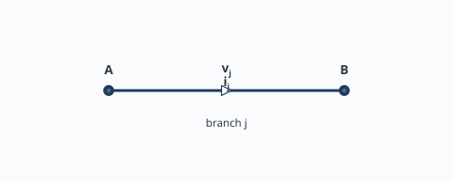
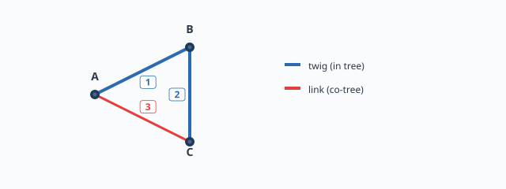
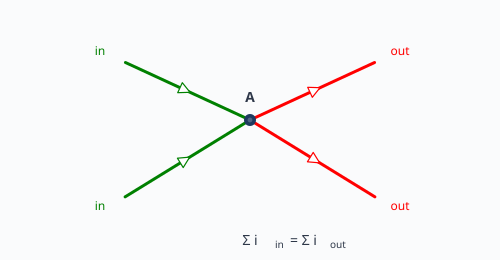

# หน่วยที่ 3 — โทโปโลยีของวงจร Twig, Link และ KCL/KVL

## 3.1 กิ่ง (Branch) ในวงจรไฟฟ้า

ในการวิเคราะห์วงจร กิ่ง (branch) คือเส้นทางระหว่างสองปมที่มีตัวแปรกระแส $i_j$ และแรงดัน $v_j$ กำกับอยู่ กิ่งอาจมีตัวประกอบใดตัวประกอบหนึ่งหรือหลายตัว (R, L, C, แหล่งจ่าย) รวมกัน

## 3.2 Twig และ Link

เมื่อเลือก spanning tree ใด ๆ หนึ่งต้นไม้ของกราฟ:
- **Twig** คือกิ่งที่อยู่ใน spanning tree มี $n-1$ กิ่ง
- **Link** หรือ **co-tree branch** คือกิ่งที่ไม่อยู่ใน spanning tree มี $b - (n-1)$ กิ่ง

## 3.3 ความสำคัญของ Twig/Link

- กระแส twig สามารถหาได้จากกระแส link ผ่านสมการ cutset
- แรงดัน link สามารถหาได้จากแรงดัน twig ผ่านสมการ loop (KVL)
- ดังนั้น หากรู้กระแส link ทั้งหมด ก็สามารถหากระแสทุกกิ่งได้ ทำให้ลดจำนวนตัวแปรที่ต้องแก้

## 3.4 Branch-Current Vector

กระแสในแต่ละกิ่งเรียงเป็นเวกเตอร์คอลัมน์:

$$
i_b = \begin{bmatrix} i_1 & i_2 & \dots & i_b \end{bmatrix}^{\mathsf{T}}
$$

เรียกว่า **branch-current vector** ซึ่งเป็นตัวแปรหลักที่ต้องการหาในวงจร

## 3.5 KCL ในรูปกราฟ

KCL ที่ปม $k$ เขียนได้ว่า ผลรวมกระแสที่เข้า/ออกปม $k$ เท่ากับศูนย์ ในเมทริกซ์ incidence matrix:

$$
A_a i_b = 0
$$

หากใช้ reduced incidence matrix (ลบปมอ้างอิงออก):

$$
A i_b = 0
$$

นี่คือสมการ $n-1$ สมการ ที่สัมพันธ์กระแสทุกกิ่ง

## 3.6 การเลือก Tree ที่สะดวก

การเลือก tree มีผลต่อความง่ายในการแก้ปัญหา:
- ควรเลือก tree ที่กระแสที่สนใจเป็น twig ถ้าเป็นไปได้
- หรือเลือก tree ที่ทำให้ fundamental cutset ตรงกับเส้นประ (cutset) ที่โจทย์กำหนด

## 3.7 แบบฝึกหัด

1. กราฟ 4 ปม 5 กิ่ง ถ้าเลือก tree เป็น {1,2,3} กิ่งไหนเป็น link?
2. สมมติกราฟมี $n=6$ ปม $b=11$ กิ่ง ถ้าเลือก tree ห้ากิ่ง มี link กี่กิ่ง?
3. ทำไม KCL ที่ทุกปมถึงมีสมการที่ไม่เป็นอิสระ? ปมอ้างอิงมีบทบาทอย่างไร?

## 3.8 อ่านต่อ

การนำ tree ไปสร้างชุดตัดอิสระ ดู [หน่วยที่ 4](04-cutsets-and-fundamental-cutsets.md)
