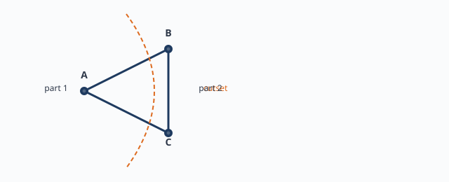
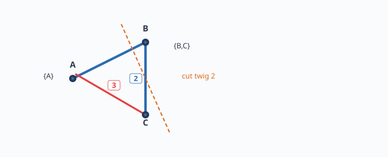
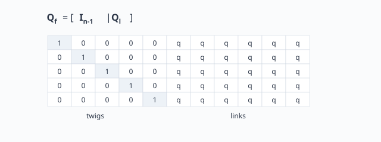

# หน่วยที่ 4 — Cutset, Fundamental Cutset และ Cutset Equations

## 4.1 Cutset คืออะไร

**Cutset** ของกราฟเชื่อมต่อ คือ เซตย่อยของกิ่งที่มีสมบัติว่า เมื่อนำกิ่งเหล่านี้ออกจากกราฟ กราฟจะแยกออกเป็นส่วนย่อยที่ไม่เชื่อมต่อกันพอดี 2 ส่วน และหากเอากิ่งใดกิ่งหนึ่งกลับคืน กราฟจะเชื่อมต่อกันอีกครั้ง

ในภาษาวงจร: cutset แบ่งวงจรออกเป็น 2 ส่วน และกระแสที่ไหลผ่าน cutset ต้องรวมกันเป็นศูนย์ตาม KCL

## 4.2 ชุดตัดอิสระ (Independent Cutsets)

กราฟ $n$ ปม มี KCL ที่อิสระต่อกัน $n-1$ สมการ สอดคล้องกับจำนวน twig ของ spanning tree ดังนั้น **ชุดตัดอิสระที่สมบูรณ์** มี $n-1$ ชุด

## 4.3 Fundamental Cutset

เมื่อเลือก spanning tree $T$:
- ตัด twig หนึ่งกิ่งออกจาก tree
- ต้นไม้จะแยกออกเป็น 2 ส่วน
- กิ่งของกราฟเดิมที่พาดระหว่าง 2 ส่วนนี้ คือ **fundamental cutset** ของ twig นั้น

เนื่องจากมี twig $n-1$ กิ่ง จึงได้ fundamental cutset $n-1$ ชุด ซึ่งเป็นอิสระต่อกัน

## 4.4 กฎเครื่องหมายของ Cutset Equation

สำหรับแต่ละ cutset กำหนดทิศอ้างอิง (มักเลือกตามทิศของ twig ที่ก่อ cutset โดยให้ twig มีสัมประสิทธิ์ $+1$):

$$
\sum_{j \in C_k} q_{kj} i_j = 0
$$

โดย
- $q_{kj} = +1$ ถ้ากิ่ง $j$ ข้าม cutset ในทิศเดียวกับทิศอ้างอิง
- $q_{kj} = -1$ ถ้ากิ่ง $j$ ข้าม cutset สวนทิศอ้างอิง
- $q_{kj} = 0$ ถ้ากิ่ง $j$ ไม่ได้ข้าม cutset

## 4.5 Cutset Matrix $Q_f$

เรียงสมการ cutset เป็นเมทริกซ์:

$$
Q_f = \begin{bmatrix} q_{kj} \end{bmatrix}
$$

หากเรียง branch-current vector โดยวาง twig ก่อน link จะได้รูป:

$$
Q_f = \begin{bmatrix} I_{n-1} & Q_l \end{bmatrix}
$$

โดย $I_{n-1}$ เป็น identity matrix บล็อกหน้าสะท้อนว่าแต่ละแถวมี twig ของตนเองเพียงกิ่งเดียวและสัมประสิทธิ์ $+1$ นี่เป็นหลักฐานเชิงเมทริกซ์ว่าทุกแถวเป็นอิสระต่อกัน

## 4.6 สมการ Cutset ในรูปเมทริกซ์

$$
Q_f i_b = 0
$$

หมายความว่า สมการทั้งหมดของ fundamental cutset สามารถเขียนรวมกันเป็นเมทริกซ์คูณเวกเตอร์กระแสได้

## 4.7 แบบฝึกหัด

1. กราฟเชื่อมต่อ 4 ปม 5 กิ่ง มี fundamental cutset กี่ชุด?
2. ทำไม $Q_f$ ที่เรียง twig ก่อน link จึงมีบล็อก $I_{n-1}$ ด้านหน้า?
3. หาก twig ของ tree หนึ่งถูกตัดออก กิ่ง link ทั้งหมดที่ข้ามระหว่างสองส่วนมีบทบาทอย่างไร?

## 4.8 อ่านต่อ

ตัวอย่างเต็ม 6 ปม 11 กิ่ง ดู [หน่วยที่ 5](05-worked-example-6-nodes-11-branches.md)
