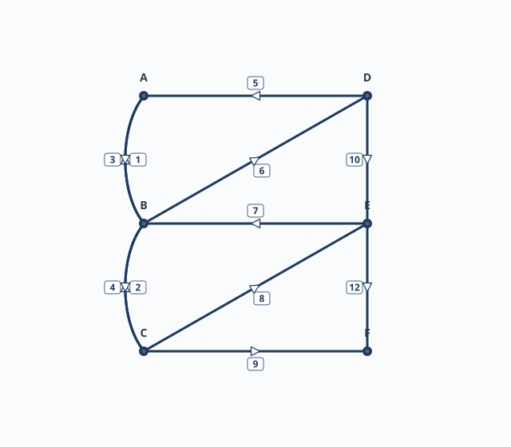
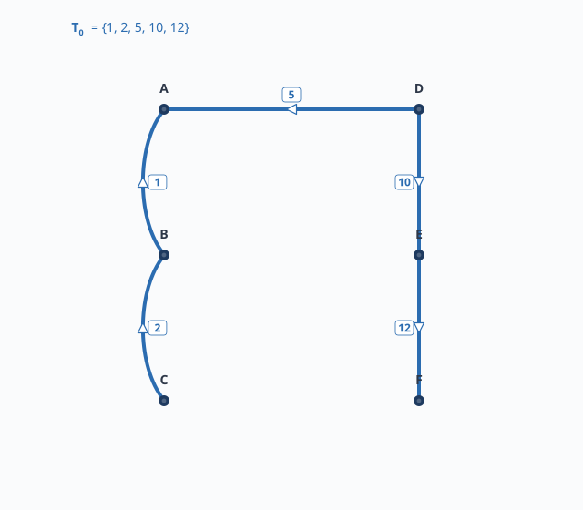
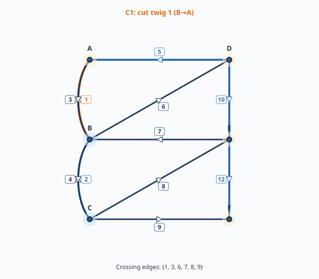
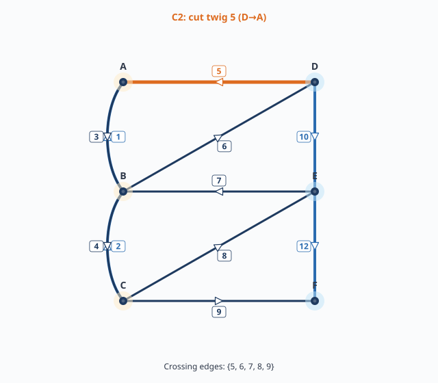
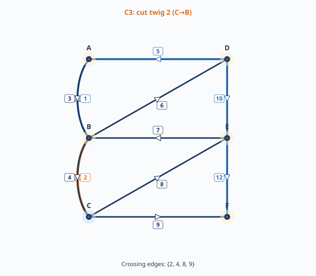
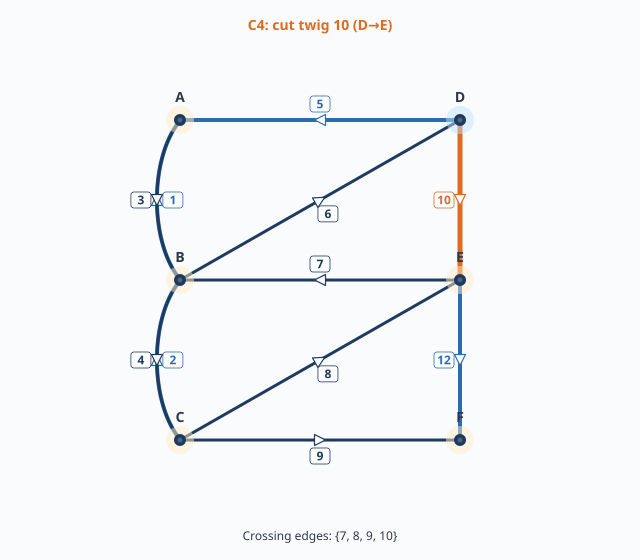
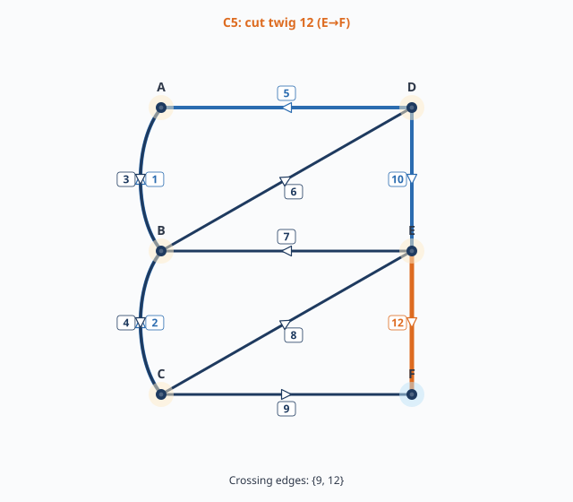

# หน่วยที่ 5 — ตัวอย่างเต็ม: กราฟ 6 ปม 11 กิ่ง

## 5.1 ข้อมูลกราฟ

กราฟมีทิศทางกำกับ 6 ปม: $A, B, C$ (คอลัมน์ซ้าย) และ $D, E, F$ (คอลัมน์ขวา) 11 กิ่งมีทิศทางดังนี้:

| กิ่ง | ทิศทาง | กิ่ง | ทิศทาง |
|---:|:---|---:|:---|
| 1 | $B \to A$ | 2 | $C \to B$ |
| 3 | $A \to B$ | 4 | $B \to C$ |
| 5 | $D \to A$ | 6 | $B \to D$ |
| 7 | $E \to B$ | 8 | $C \to E$ |
| 9 | $C \to F$ | 10 | $D \to E$ |
| 12 | $E \to F$ | | |

หมายเหตุ: ไม่มีกิ่งหมายเลข 11

## 5.2 ขั้นตอนที่ 1 — นับ spanning tree ด้วย Matrix-Tree Theorem

ละทิ้งทิศทางชั่วคราว นับกิ่งขนานระหว่าง A–B มี 2 กิ่ง (1, 3) และ B–C มี 2 กิ่ง (2, 4) สร้าง Laplacian matrix สำหรับปม A, B, C, D, E, F:

$$
L = \begin{bmatrix}
3 & -2 & 0 & -1 & 0 & 0 \\
-2 & 6 & -2 & -1 & -1 & 0 \\
0 & -2 & 4 & 0 & -1 & -1 \\
-1 & -1 & 0 & 3 & -1 & 0 \\
0 & -1 & -1 & -1 & 4 & -1 \\
0 & 0 & -1 & 0 & -1 & 2
\end{bmatrix}
$$

ลบแถว/หลักของปม $F$ แล้วหา determinant ได้

$$
\tau(G) = \det L^{(F)} = 139
$$

ดังนั้น มี spanning tree ทั้งหมด **139 แบบ** รายชื่อครบทุกแบบอยู่ใน [ALL_SPANNING_TREES.md](../chapter1-exercise-1-3-cutset-equations/ALL_SPANNING_TREES.md)

## 5.3 ขั้นตอนที่ 2 — เลือก Tree และหา Fundamental Cutset

เลือก tree $T_0 = \{1, 2, 5, 10, 12\}$ ซึ่งต่อครบ 6 ปมและไม่มีวงรอบ

| กิ่ง | ชนิด | หมายเหตุ |
|---:|:---|:---|
| 1, 2, 5, 10, 12 | twig | ใน tree |
| 3, 4, 6, 7, 8, 9 | link | ไม่ใน tree |

## 5.4 ขั้นตอนที่ 3 — ตัด twig ทีละกิ่งและหา cutset

### Cutset $C_1$ ของ twig 1 ($B \to A$)

ตัดกิ่ง 1 ออก ต้นไม้แยกเป็น $\{B, C\}$ และ $\{A, D, E, F\}$

กิ่งที่ข้ามระหว่างสองส่วน: $\{1, 3, 6, 7, 8, 9\}$

เลือกทิศอ้างอิงจาก $\{B, C\}$ ไป $\{A, D, E, F\}$ (ตามทิศของ twig 1: $B \to A$)

| กิ่ง | ทิศทาง | สัมพันธ์กับทิศอ้างอิง | สัมประสิทธิ์ |
|---:|:---|:---|:---:|
| 1 | $B \to A$ | ตรง | $+1$ |
| 3 | $A \to B$ | สวน | $-1$ |
| 6 | $B \to D$ | ตรง | $+1$ |
| 7 | $E \to B$ | สวน | $-1$ |
| 8 | $C \to E$ | ตรง | $+1$ |
| 9 | $C \to F$ | ตรง | $+1$ |

สมการ:

$$
\boxed{i_1 - i_3 + i_6 - i_7 + i_8 + i_9 = 0}
$$

### Cutset $C_2$ ของ twig 5 ($D \to A$)

ตัด twig 5 ออก สองส่วนคือ $\{D, E, F\}$ และ $\{A, B, C\}$

กิ่งที่ข้าม: $\{5, 6, 7, 8, 9\}$

ทิศอ้างอิงจาก $\{D, E, F\}$ ไป $\{A, B, C\}$ (ตามทิศ twig 5: $D \to A$)

| กิ่ง | ทิศทาง | สัมพันธ์กับทิศอ้างอิง | สัมประสิทธิ์ |
|---:|:---|:---|:---:|
| 5 | $D \to A$ | ตรง | $+1$ |
| 6 | $B \to D$ | สวน | $-1$ |
| 7 | $E \to B$ | ตรง | $+1$ |
| 8 | $C \to E$ | สวน | $-1$ |
| 9 | $C \to F$ | สวน | $-1$ |

สมการ:

$$
\boxed{i_5 - i_6 + i_7 - i_8 - i_9 = 0}
$$

## 5.5 สรุปสมการทั้งหมดของ $T_0$

$$
\begin{aligned}
C_1 &= \{1, 3, 6, 7, 8, 9\}, & i_1 - i_3 + i_6 - i_7 + i_8 + i_9 &= 0 \\
C_2 &= \{5, 6, 7, 8, 9\}, & i_5 - i_6 + i_7 - i_8 - i_9 &= 0 \\
C_3 &= \{2, 4, 8, 9\}, & i_2 - i_4 + i_8 + i_9 &= 0 \\
C_4 &= \{7, 8, 9, 10\}, & -i_7 + i_8 + i_9 + i_{10} &= 0 \\
C_5 &= \{9, 12\}, & i_9 + i_{12} &= 0
\end{aligned}
$$

## 5.6 แบบฝึกหัด

1. ตรวจสอบ $C_3, C_4, C_5$ ด้วยตนเอง
2. ถ้าเลือก tree อื่น เช่น $\{1, 4, 5, 10, 12\}$ สมการ cutset เปลี่ยนไปอย่างไร?
3. ทำไม $C_1$ และ $C_2$ ในตารางนี้จึงตรงกับเส้นประในโจทย์ [1.3]?

## 5.7 อ่านต่อ

การเขียนรูปเมทริกซ์และตรวจสอบความเป็นอิสระ ดู [หน่วยที่ 6](06-advanced-problem-solving.md)
