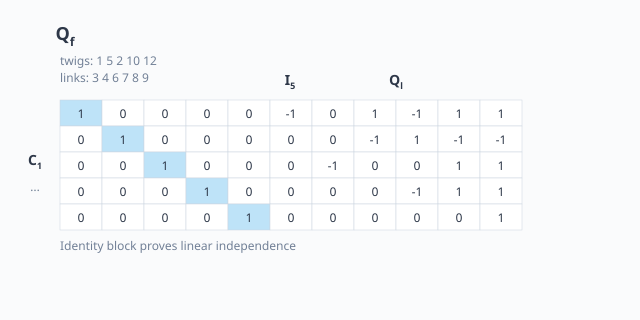

# หน่วยที่ 6 — การเขียน Cutset Matrix และตรวจสอบความเป็นอิสระ

## 6.1 จาก Cutset Equations สู่ Matrix Form

สมการ fundamental cutset ของ tree $T_0 = \{1, 2, 5, 10, 12\}$ มี 5 สมการ สำหรับ 11 กระแส สามารถเขียนเป็น:

$$
Q_f i_b = 0
$$

โดยเรียง branch-current vector เป็น:

$$
i_b = \begin{bmatrix}
i_1 & i_5 & i_2 & i_{10} & i_{12} & i_3 & i_4 & i_6 & i_7 & i_8 & i_9
\end{bmatrix}^{\mathsf{T}}
$$

(วาง twig ก่อน ตามลำดับ 1, 5, 2, 10, 12)

## 6.2 สร้าง Cutset Matrix $Q_f$

แต่ละแถวของ $Q_f$ คือสมการหนึ่ง cutset คอลัมน์เรียงตาม $i_b$ ด้านบน:

$$
Q_f =
\left[
\begin{array}{ccccc|rrrrrr}
1 & 0 & 0 & 0 & 0 & -1 & 0 & 1 & -1 & 1 & 1 \\
0 & 1 & 0 & 0 & 0 & 0 & 0 & -1 & 1 & -1 & -1 \\
0 & 0 & 1 & 0 & 0 & 0 & -1 & 0 & 0 & 1 & 1 \\
0 & 0 & 0 & 1 & 0 & 0 & 0 & 0 & -1 & 1 & 1 \\
0 & 0 & 0 & 0 & 1 & 0 & 0 & 0 & 0 & 0 & 1
\end{array}
\right]
$$

## 6.3 ทำไม $Q_f$ มีบล็อก $I_5$ ด้านหน้า

- แถว 1 มี twig 1 ใน $C_1$ สัมประสิทธิ์ $+1$
- แถว 2 มี twig 5 ใน $C_2$ สัมประสิทธิ์ $+1$
- แถว 3 มี twig 2 ใน $C_3$ สัมประสิทธิ์ $+1$
- แถว 4 มี twig 10 ใน $C_4$ สัมประสิทธิ์ $+1$
- แถว 5 มี twig 12 ใน $C_5$ สัมประสิทธิ์ $+1$

เนื่องจากแต่ละ twig ปรากฏเพียงครั้งเดียวในแถวของตนเอง บล็อกหน้าจึงเป็น identity matrix $I_5$ ซึ่งหมายความว่าแถวทั้งห้าเป็นอิสระต่อกัน (rank = 5)

## 6.4 ความเป็นอิสระเชิงเส้น (Linear Independence)

แถวของ $Q_f$ เป็นอิสระเชิงเส้นเพราะ:

$$
\det(I_5) = 1 \neq 0
$$

หมายความว่า ไม่มีสมการใดสามารถเขียนเป็นผลรวมของสมการอื่น ๆ ได้

## 6.5 จำนวนสมการอิสระ

กราฟ $n$ ปม มีสมการ KCL ที่อิสระต่อกัน $n-1$ สมการ ซึ่งเท่ากับ:

- จำนวน twig ของ spanning tree
- จำนวนแถวของ $Q_f$
- rank ของ incidence matrix $A_a$

นี่เป็นเหตุผลที่เราเลือก spanning tree มาช่วยกำหนดสมการอิสระที่สมบูรณ์

## 6.6 ขั้นตอนสรุปสำหรับโจทย์ทั่วไป

1. วาดกราฟและระบุปม กิ่ง ทิศทาง
2. หาจำนวน spanning tree ด้วย Matrix-Tree Theorem
3. เลือก tree ที่สะดวก (มักเลือกให้ตรงกับเส้นประในโจทย์)
4. หา fundamental cutset ของแต่ละ twig
5. เขียนสมการ KCL สำหรับแต่ละ cutset
6. รวมเป็น cutset matrix $Q_f$ และตรวจสอบความเป็นอิสระ

## 6.7 แบบฝึกหัดสุดท้าย

1. พิสูจน์ว่า $\text{rank}(A_a) = n - 1$ สำหรับกราฟเชื่อมต่อ
2. ถ้าเรียง $i_b$ โดยวาง link ก่อน twig $Q_f$ จะมีรูปอย่างไร?
3. หากกราฟมีส่วนย่อยไม่เชื่อมต่อกัน จำนวน cutset อิสระจะเปลี่ยนไปอย่างไร?

## 6.8 อ้างอิง

- C.A. Desoer & E.S. Kuh, *Basic Circuit Theory*, Network Topology
- [303212S1Y2569lec01.pdf](303212S1Y2569lec01.pdf) หน้า 11-12, 18
