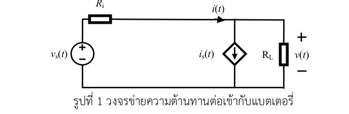
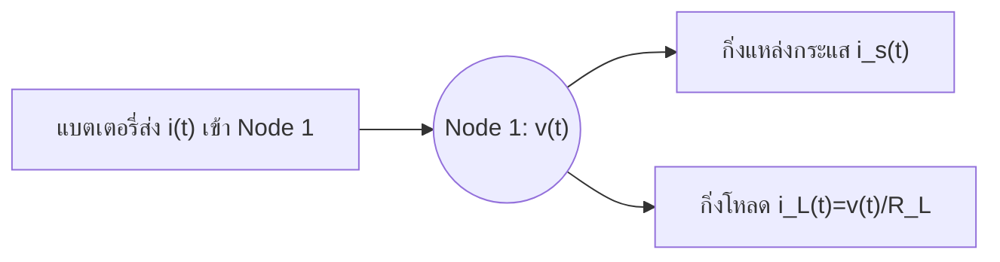
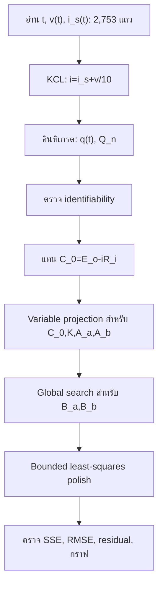
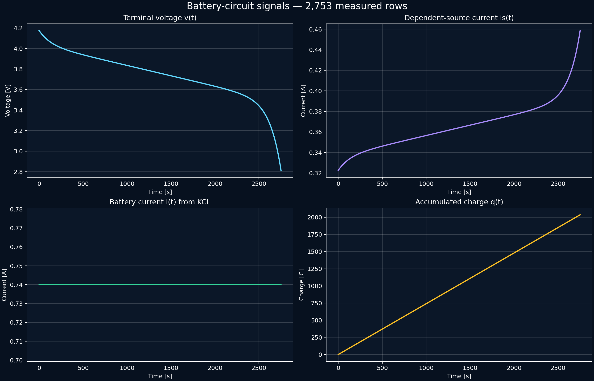
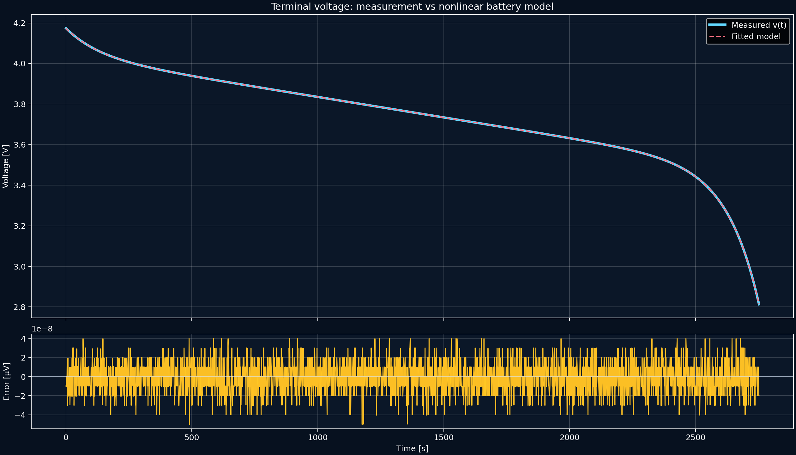

# เฉลยโจทย์สอบปากเปล่า: วงจรตัวต้านทานและการระบุพารามิเตอร์แบตเตอรี่จากศูนย์ (ChatGPT Model GPT-5.6 SOL)

> **แบบจำลอง:** ChatGPT Model GPT-5.6 SOL (Solution 2)  
> **ขอบเขต:** Circuit fundamentals → KCL/KVL → การสะสมประจุ → nonlinear parameter identification → การป้องกันคำตอบสอบปากเปล่า → EV/BESS

ไฟล์อ้างอิง: [โจทย์](file:///Users/3rapat/student/internship/CODEFIN/project/vahalla-wealth/private-docs/other-project/uni-work/engineering-problem/circuit/2/specials/oral-exam/oral_exam_problem.md) · [รูปวงจร](file:///Users/3rapat/student/internship/CODEFIN/project/vahalla-wealth/private-docs/other-project/uni-work/engineering-problem/circuit/2/specials/oral-exam/circuit_fig1.png) · [ข้อมูล 2,753 แถว](file:///Users/3rapat/student/internship/CODEFIN/project/vahalla-wealth/private-docs/other-project/uni-work/engineering-problem/circuit/2/specials/oral-exam/data303212qz02.md) · [แผนผังความรู้](file:///Users/3rapat/student/internship/CODEFIN/project/vahalla-wealth/private-docs/other-project/uni-work/engineering-problem/circuit/2/specials/oral-exam/PROBLEM_EVALUATION_AND_KNOWLEDGE_MAP.md)

---

## คำตอบตัวเลขฉบับย่อ

ข้อมูลมีเวลา $t=0,1,\ldots,2752$ s รวม **2,753 จุด** และให้ผลดังนี้

$$
\boxed{i(t)=i_s(t)+\frac{v(t)}{10}=0.740000\ \mathrm{A}}
\qquad \text{ทุกจุดข้อมูล}
$$

$$
\boxed{q(t)=\int_0^t i(\alpha)\,d\alpha=0.74t\ \mathrm{C}}
$$

$$
\boxed{Q_n=\int_0^{3600}0.74\,d\alpha=2664\ \mathrm{C}=0.74\ \mathrm{Ah}}
$$

เมื่อเขียนสมการแรงดันขั้วเป็น

$$
v(t)=E_o-Kq+A_a e^{-B_aq}-A_b e^{-B_b(Q_n-q)}-iR_i,
$$

ค่าที่ข้อมูลนี้ระบุได้โดยเอกเทศคือ

| ปริมาณ | ค่าฟิตจาก 2,753 จุด | หน่วย | สถานะ |
|---|---:|---:|---|
| $C_0\equiv E_o-0.74R_i$ | $4.036467052577080$ | V | ระบุได้ |
| $K$ | $2.721543795924126\times10^{-4}$ | V/C | ระบุได้ |
| $A_a$ | $0.137637356141268$ | V | ระบุได้ |
| $B_a$ | $0.0102375102375104$ | C$^{-1}$ | ระบุได้ |
| $A_b$ | $559.945732826002$ | V | ระบุได้ทางคณิตศาสตร์ แต่ไวต่อการ extrapolate |
| $B_b$ | $0.0107250107250107$ | C$^{-1}$ | ระบุได้ |
| $Q_n$ | $2664.000000$ | C | ได้จากนิยามและ $t_n$ |
| $R_i$ | ไม่เป็นเอกเทศ | $\Omega$ | ต้องมีการทดลองเพิ่ม |
| $E_o$ | ไม่เป็นเอกเทศ | V | ต้องมี $R_i$ จากการทดลองเพิ่ม |

คู่ $(E_o,R_i)$ ที่ให้แรงดันเหมือนกันทุกจุดมีจำนวนอนันต์และอยู่บนเส้น

$$
\boxed{E_o=4.036467052577080+0.74R_i.}
$$

ตัวอย่างเพื่อให้โค้ดและแดชบอร์ดมีค่าครบ 8 ช่อง: ถ้า **สมมติจากการทดลองภายนอก** ว่า $R_i=0.200000\ \Omega$ จะได้

$$
\boxed{E_o=4.184467052577080\ \mathrm{V}\quad\text{(ค่ามีเงื่อนไข ไม่ใช่ค่าที่ฟิต $R_i$ จากชุดนี้)}}.
$$

> [!IMPORTANT]
> การรายงาน $E_o$ และ $R_i$ เป็น “ค่าจริงสองค่าที่ฟิตได้พร้อมกัน” จากข้อมูล constant-current ชุดเดียวเป็นข้อสรุปที่เกินกว่าข้อมูลรองรับ เพราะคอลัมน์ของ Jacobian สองคอลัมน์นี้เป็นสัดส่วนกันพอดี การตอบข้อจำกัดนี้ในการสอบเป็นสัญญาณของความเข้าใจเรื่อง **structural identifiability** ไม่ใช่การทำโจทย์ไม่เสร็จ

---

# ส่วนที่ 1 — พื้นฐานวงจรจากศูนย์แบบ Feynman

## 1.1 ก่อนมีสูตร: ไฟฟ้าคือการเคลื่อนย้ายประจุและพลังงาน

สสารประกอบด้วยอนุภาคที่มีประจุ เช่น อิเล็กตรอน ประจุไฟฟ้าวัดเป็น **คูลอมบ์** (coulomb, C) วงจรไฟฟ้าคือเส้นทางปิดซึ่งทำให้ประจุเคลื่อนที่และส่งผ่านพลังงานจากแหล่งกำเนิดไปยังโหลด

ลองนึกถึงระบบท่อน้ำ:

- **น้ำ** เปรียบเหมือนประจุไฟฟ้า
- **ปั๊มน้ำหรือถังที่วางสูง** เปรียบเหมือนแหล่งแรงดันหรือแบตเตอรี่
- **อัตราการไหลของน้ำ** เปรียบเหมือนกระแส
- **ท่อแคบ ยาว หรือขรุขระ** เปรียบเหมือนความต้านทาน
- **กังหันหรือหัวฉีดที่รับพลังงานจากน้ำ** เปรียบเหมือนโหลดไฟฟ้า

> [!NOTE]
> การเปรียบเทียบท่อน้ำช่วยสร้างภาพ แต่ไม่ใช่ฟิสิกส์เดียวกันทุกประการ น้ำเป็นมวลของไหล ส่วนวงจรโลหะถ่ายทอดสนามไฟฟ้าและพลังงานแม่เหล็กไฟฟ้า เราใช้ภาพท่อน้ำเพื่อเข้าใจกฎอนุรักษ์และความต่างศักย์เท่านั้น

## 1.2 แรงดันไฟฟ้า $v$: “พลังงานต่อหนึ่งประจุ”

แรงดันไม่ใช่ปริมาณประจุและไม่ใช่อัตราการไหล นิยามคือ

$$
v=\frac{dW}{dq},
$$

โดย $W$ คือพลังงานหน่วยจูล (J) และ $q$ คือประจุหน่วยคูลอมบ์ ดังนั้น

$$1\ \mathrm{V}=1\ \mathrm{J/C}.$$

ในภาพท่อน้ำ แรงดันคล้ายความดันหรือความสูงต่างกันของถัง ถังที่สูงกว่ามีน้ำที่พร้อมให้พลังงานมากกว่าต่อน้ำหนึ่งหน่วย เช่นเดียวกับขั้วที่ศักย์สูงกว่าซึ่งพร้อมส่งพลังงานมากกว่าต่อหนึ่งคูลอมบ์

แรงดันต้องวัด **ระหว่างสองจุด** เสมอ ในรูป $v(t)$ คือแรงดันโหนดบนเทียบกับสายล่างซึ่งเลือกเป็นโหนดอ้างอิง $0$ V

## 1.3 กระแสไฟฟ้า $i$: “ประจุที่ผ่านต่อหนึ่งวินาที”

นิยามของกระแสคือ

$$
i(t)=\frac{dq}{dt},
$$

จึงมีหน่วย

$$1\ \mathrm{A}=1\ \mathrm{C/s}.$$

ในท่อน้ำ กระแสเหมือนอัตราการไหล เช่น ลิตรต่อวินาที ถ้า $i=0.74$ A คงที่ หมายความว่ามีประจุสุทธิ $0.74$ C ผ่านหน้าตัดของกิ่งในทุกหนึ่งวินาที

กลับสมการด้วยการอินทิเกรตได้ว่า

$$
q(t)-q(0)=\int_0^t i(\alpha)\,d\alpha.
$$

ตัวแปร $\alpha$ เป็นเพียง “ตัวนับเวลาในอินทิกรัล” ใช้แทน $t$ เพื่อไม่ให้สับสนกับขอบเขตบน

## 1.4 ความต้านทาน $R$ และกฎของโอห์ม

สำหรับตัวต้านทานเชิงเส้น

$$
\boxed{v=iR}
$$

หรือ

$$
i=\frac{v}{R}.
$$

หน่วยโอห์มเกิดจาก

$$1\ \Omega=1\ \mathrm{V/A}.$$

ในภาพท่อน้ำ ถ้าต้องการอัตราการไหลเท่าเดิมผ่านท่อที่แคบขึ้น ต้องใช้ความดันต่างมากขึ้น นั่นคือเมื่อ $R$ มากขึ้น ต้องใช้ $v$ มากขึ้นเพื่อให้ $i$ เท่าเดิม

สำหรับโหลด $R_L=10\ \Omega$ กระแสลงกิ่งโหลดจึงเป็น

$$
i_L(t)=\frac{v(t)}{R_L}=\frac{v(t)}{10}.
$$

## 1.5 กฎกระแสของเคอร์ชฮอฟฟ์ (KCL)

**KCL คือกฎอนุรักษ์ประจุที่โหนด** หากโหนดไม่สะสมประจุสุทธิ อัตราประจุไหลเข้าต้องเท่ากับอัตราประจุไหลออก

$$
\sum i_{\mathrm{เข้า}}=\sum i_{\mathrm{ออก}}.
$$

ในท่อน้ำ จุดแยกที่ไม่รั่วและไม่มีถังพักต้องมีน้ำไหลเข้าเท่ากับน้ำไหลออกรวม มิฉะนั้นน้ำจะหายไปหรือเกิดขึ้นจากความว่างเปล่า

## 1.6 กฎแรงดันของเคอร์ชฮอฟฟ์ (KVL)

**KVL คือกฎอนุรักษ์พลังงานต่อหนึ่งประจุรอบเส้นทางปิด** เมื่อเดินครบลูปกลับจุดเดิม ความเปลี่ยนแปลงของศักย์รวมต้องเป็นศูนย์

$$
\sum_{\mathrm{รอบลูป}} v_k=0.
$$

เดินจากขั้วลบแบตเตอรี่ขึ้นผ่านแหล่ง $v_s$ จะได้แรงดันเพิ่ม $+v_s$ จากนั้นผ่าน $R_i$ ตามทิศกระแสเกิดแรงดันตก $-iR_i$ และผ่านโหลดจากบนลงล่างเกิดแรงดันตก $-v$:

$$
v_s-iR_i-v=0.
$$

จึงได้

$$
\boxed{v(t)=v_s(t)-i(t)R_i}.
$$

## 1.7 กำลังและพลังงาน: สิ่งที่วงจรส่งมอบจริง

กำลังไฟฟ้าเป็นอัตราการส่งพลังงาน

$$
p(t)=v(t)i(t)\quad [\mathrm{W}],
$$

และพลังงานคือ

$$
W=\int p(t)\,dt\quad [\mathrm{J}].
$$

จึงต้องแยกให้ชัดว่า $Q_n=2664$ C คือ **ความจุประจุ** ไม่ใช่พลังงาน พลังงานต้องคูณแรงดันและอินทิเกรตอีกครั้ง เช่นประมาณหยาบที่แรงดันเฉลี่ย $3.7$ V จะได้พลังงานประมาณ $3.7\times0.74=2.738$ Wh แต่ค่าที่แม่นยำต้องใช้ $\int vi\,dt$

## 1.8 โมเดลแบตเตอรี่ในรูป

แบบจำลองแบ่งเป็นสองชั้น:

1. แหล่งแรงดันภายใน $v_s(t)$ แทนพฤติกรรมเชิงเคมีที่เปลี่ยนกับประจุที่ใช้ไป
2. ความต้านทานภายใน $R_i$ ทำให้แรงดันที่ขั้วต่ำกว่าแรงดันภายในเมื่อคายประจุ

พารามิเตอร์มีความหมายดังนี้

| สัญลักษณ์ | ความหมายเชิงแบบจำลอง | หน่วย |
|---|---|---:|
| $E_o$ | ระดับแรงดันฐานของแหล่งภายใน | V |
| $K$ | อัตราแรงดันลาดลงต่อประจุที่คาย | V/C |
| $A_a$ | ขนาดส่วนโค้งเร็วช่วงต้น | V |
| $B_a$ | อัตราการสลายของส่วนโค้งช่วงต้น | C$^{-1}$ |
| $A_b$ | แอมพลิจูดอ้างอิงของส่วนโค้งช่วงปลาย | V |
| $B_b$ | อัตราที่ส่วนโค้งปลายเติบโตเมื่อประจุคงเหลือลด | C$^{-1}$ |
| $R_i$ | ความต้านทานภายในแบบ lumped | $\Omega$ |
| $Q_n$ | ประจุรวมตามนิยามของโจทย์ | C |

---

# ส่วนที่ 2 — พิสูจน์และคำนวณทีละบรรทัด

## 2.1 กำหนดโหนดและทิศกระแส

เลือกสายล่างเป็นโหนดอ้างอิง $0$ V โหนดบนจึงมีแรงดัน $v(t)$ กระแส $i(t)$ ไหล **เข้า** โหนดจากซ้าย ส่วน $i_s(t)$ และกระแสโหลด $i_L(t)$ ไหล **ออก** ลงสู่โหนดอ้างอิง

KCL ให้

$$
i(t)=i_s(t)+i_L(t).
$$

จากกฎของโอห์ม

$$
i_L(t)=\frac{v(t)}{R_L}.
$$

รวมสองสมการ

$$
\boxed{i(t)=i_s(t)+\frac{v(t)}{R_L}}.
$$

เมื่อ $R_L=10\ \Omega$

$$
\boxed{i(t)=i_s(t)+\frac{v(t)}{10}}.
$$

## 2.2 แทนข้อมูลจริง

ที่ $t=0$ s:

$$
\begin{aligned}
i(0)
&=0.3225895591500284+\frac{4.174104408499716}{10}\\
&=0.3225895591500284+0.4174104408499716\\
&=\boxed{0.7400000000000000\ \mathrm{A}}.
\end{aligned}
$$

ที่ $t=1$ s:

$$
\begin{aligned}
i(1)
&=0.3227135753292765+\frac{4.172864246707235}{10}\\
&=\boxed{0.7400000000000000\ \mathrm{A}}.
\end{aligned}
$$

ที่ $t=2752$ s:

$$
\begin{aligned}
i(2752)
&=0.4586537368892914+\frac{2.813462631107086}{10}\\
&=0.4586537368892914+0.2813462631107086\\
&=\boxed{0.7400000000000000\ \mathrm{A}}.
\end{aligned}
$$

การตรวจครบทุกแถวด้วยสคริปต์ให้

| สถิติของ $i(t)$ | ค่า |
|---|---:|
| จำนวนจุด | 2,753 |
| ค่าต่ำสุด | 0.740000000000000 A |
| ค่าสูงสุด | 0.740000000000000 A |
| ค่าเฉลี่ย | 0.740000000000000 A |
| ส่วนเบี่ยงเบนมาตรฐานเชิง floating-point | ประมาณ $1.1\times10^{-16}$ A |

ดังนั้นคำว่า “พิสูจน์จากข้อมูล” ในที่นี้หมายถึงสองชั้น:

1. พิสูจน์เชิงวงจรว่า $i=i_s+v/10$ ด้วย KCL และกฎของโอห์ม
2. ตรวจเชิงคำนวณว่าคู่ $(v,i_s)$ ทั้ง 2,753 คู่ถูกสร้างให้ $i_s=0.74-v/10$

## 2.3 อินทิกรัลประจุสะสม

เพราะ $i(\alpha)=0.74$ เป็นค่าคงที่

$$
\begin{aligned}
q(t)
&=\int_0^t i(\alpha)\,d\alpha\\
&=\int_0^t 0.74\,d\alpha\\
&=0.74[\alpha]_0^t\\
&=\boxed{0.74t\ \mathrm{C}}.
\end{aligned}
$$

ตัวอย่าง:

| $t$ (s) | $q(t)=0.74t$ (C) | ประจุที่ใช้ไปเทียบ $Q_n$ |
|---:|---:|---:|
| 0 | 0.00 | 0% |
| 1,000 | 740.00 | 27.7778% |
| 2,000 | 1,480.00 | 55.5556% |
| 2,752 | 2,036.48 | 76.4444% |
| 3,600 | 2,664.00 | 100% |

สำหรับข้อมูลไม่คงที่ สคริปต์ใช้กฎคางหมู

$$
q_k=q_{k-1}+\frac{i_{k-1}+i_k}{2}(t_k-t_{k-1}).
$$

แต่เมื่อ $i_{k-1}=i_k=0.74$ สูตรนี้ลดรูปเป็น $q_k=0.74t_k$ พอดี

## 2.4 ความจุประจุตามทฤษฎี

โจทย์กำหนด $t_n=3600$ s และให้ถือการคายประจุ $0.74$ A ต่อเนื่องถึงเวลานั้น

$$
\begin{aligned}
Q_n
&=\int_0^{t_n} i(\alpha)\,d\alpha\\
&=\int_0^{3600}0.74\,d\alpha\\
&=0.74(3600)\\
&=\boxed{2664.00\ \mathrm{C}}.
\end{aligned}
$$

เนื่องจาก $1\ \mathrm{Ah}=3600\ \mathrm{C}$

$$
Q_n=\frac{2664}{3600}=\boxed{0.74\ \mathrm{Ah}}.
$$

> [!IMPORTANT]
> ข้อมูลวัดจริงหยุดที่ 2752 s จึงมี $q=2036.48$ C ไม่ได้วัดถึง $q=Q_n$ การคำนวณ $Q_n$ อาศัยนิยาม $t_n=3600$ s ของโจทย์และสมมติฐานว่ากระแสคงที่ต่อไปอีก 848 s

## 2.5 State of Charge

ถ้ากำหนดแบตเตอรี่เต็มที่ $t=0$ และละเลยประสิทธิภาพคูลอมบิก

$$
\mathrm{SOC}(t)=1-\frac{q(t)}{Q_n}=1-\frac{t}{3600}.
$$

ดังนั้นที่ปลายข้อมูล

$$
\mathrm{SOC}(2752)=1-\frac{2752}{3600}=0.235556\approx23.56\%.
$$

---

# ส่วนที่ 3 — โมเดลแบตเตอรี่และ Parameter Identification

## 3.1 จัดรูปสมการให้มองเห็นฟิสิกส์

นิยาม

$$
q(t)=\int_0^t i(\alpha)d\alpha,
\qquad
Q_n-q(t)=\int_t^{t_n}i(\alpha)d\alpha.
$$

สมการแหล่งแรงดันภายในจึงเขียนสั้นลงเป็น

$$
\boxed{v_s(q)=E_o-Kq+A_a e^{-B_aq}-A_b e^{-B_b(Q_n-q)}}.
$$

จาก KVL

$$
\boxed{v(q)=v_s(q)-iR_i}.
$$

เมื่อ $i=0.74$ A

$$
v(q)=E_o-0.74R_i-Kq+A_a e^{-B_aq}-A_b e^{-B_b(Q_n-q)}.
$$

## 3.2 แต่ละเทอมกำลังเล่าเรื่องอะไร

### ระดับฐาน $E_o$

$E_o$ เป็น intercept ของแหล่งแรงดันภายใน ไม่ควรตีความเป็นแรงดันขั้วที่วัดได้โดยตรงระหว่างจ่ายโหลด เพราะแรงดันขั้วยังถูกลดด้วย $iR_i$ และเทอมอื่น

### ความลาดเชิงเส้น $-Kq$

เมื่อใช้ประจุมากขึ้น แรงดันบริเวณ plateau ค่อย ๆ ลดลง $K$ บอกว่าคายเพิ่มหนึ่งคูลอมบ์ทำให้ส่วนเชิงเส้นลดลงกี่โวลต์ ตรวจหน่วยได้ว่า

$$
\left[\frac{\mathrm{V}}{\mathrm{C}}\right][\mathrm{C}]=[\mathrm{V}].
$$

### Exponential drop ช่วงต้น $+A_a e^{-B_aq}$

ที่ $q=0$ เทอมนี้มีค่า $A_a$ เต็ม ๆ เมื่อ $q$ เพิ่ม exponential จะลดลงเร็ว ทำให้แรงดันเริ่มสูงกว่าระดับ plateau แล้วโค้งลงในช่วงต้น

ค่าประจุลักษณะเฉพาะคือ $1/B_a$ และเมื่อกระแสคงที่ ค่าคงตัวเวลาเท่ากับ

$$
\tau_a=\frac{1}{B_ai}
=\frac{1}{(0.0102375102)(0.74)}
=132\ \mathrm{s}.
$$

### Exponential drop ช่วงปลาย $-A_b e^{-B_b(Q_n-q)}$

ช่วงต้น $Q_n-q$ ยังมาก exponential จึงใกล้ศูนย์ เมื่อคายประจุจน $Q_n-q$ ลดลง exponent มีขนาดลบน้อยลง เทอมลบจึงโตอย่างรวดเร็วและดึงแรงดันลง เกิด “หัวเข่า” ใกล้ปลายการคาย

ค่าคงตัวเวลาภายใต้กระแสคงที่คือ

$$
\tau_b=\frac{1}{B_bi}
=\frac{1}{(0.0107250107)(0.74)}
=126\ \mathrm{s}.
$$

> [!CAUTION]
> ค่า $A_b\approx559.95$ V ไม่ได้หมายความว่าแบตเตอรี่มีแรงดัน 560 V มันคือแอมพลิจูดที่นิยาม ณ $q=Q_n$ ของ exponential ซึ่งข้อมูลยังอยู่ห่างจุดนั้น 627.52 C ที่ $t=2752$ เทอมจริง ณ จุดสุดท้ายมีขนาดเพียง
> $$A_b e^{-B_b(627.52)}\approx0.66877\ \mathrm{V}.$$
> ชุดข้อมูลไม่ครอบคลุม $t=2753\ldots3600$ จึงไม่ควรใช้โมเดลนี้พยากรณ์ถึง $q=Q_n$ โดยไม่มีข้อมูลยืนยัน

### Ohmic drop $-iR_i$

เมื่อคายประจุ กระแสไหลผ่านความต้านทานภายในทำให้แรงดันขั้วลดทันที $iR_i$ ถ้ากระแสเปลี่ยนเป็นขั้นและส่วนเคมีเปลี่ยนช้ากว่า จะวัด $R_i$ จากแรงดันกระโดดได้โดยประมาณ

$$
R_i\approx-\frac{\Delta v}{\Delta i}.
$$

## 3.3 สร้าง residual และ Objective Function

สำหรับจุดที่ $k=1,\ldots,N$ โดย $N=2753$ ให้

$$
\hat v_k(\theta)=E_o-Kq_k+A_a e^{-B_aq_k}
-A_b e^{-B_b(Q_n-q_k)}-i_kR_i,
$$

และเวกเตอร์พารามิเตอร์

$$
\theta=[E_o,K,A_a,B_a,A_b,B_b,R_i]^T.
$$

residual คือ

$$
r_k(\theta)=v_k-\hat v_k(\theta).
$$

Sum of Squared Errors คือ

$$
\boxed{\mathrm{SSE}(\theta)=\sum_{k=1}^{N}r_k(\theta)^2}.
$$

และ

$$
\mathrm{RMSE}=\sqrt{\frac{\mathrm{SSE}}{N}}.
$$

SSE ให้น้ำหนักความผิดพลาดใหญ่แรงกว่าความผิดพลาดเล็กและเหมาะกับสมมติฐาน noise แบบ Gaussian ที่มี variance คงที่

## 3.4 L-BFGS-B, Levenberg–Marquardt และ Trust-Region ต่างกันอย่างไร

| วิธี | แนวคิด | จุดเด่น | ข้อควรระวังในโจทย์นี้ |
|---|---|---|---|
| L-BFGS-B | ใช้ gradient และประมาณ inverse Hessian แบบประหยัดหน่วยความจำ พร้อม bounds | ใช้กับพารามิเตอร์จำนวนมากและกำหนดขอบเขตบวกได้ | ไวต่อสเกลและ local minimum; direct fit 7 ตัวปิดบัง non-identifiability |
| Levenberg–Marquardt | ผสม Gauss–Newton กับ gradient descent สำหรับ nonlinear least squares | เร็วมากเมื่อค่าเริ่มต้นดี | รุ่นมาตรฐานไม่รองรับ bounds และต้องมี Jacobian rank เพียงพอ |
| Trust-Region Reflective | แก้ least-squares ภายในบริเวณที่โมเดลเชิงเส้นไว้ใจได้และรองรับ bounds | เสถียรกับสเกลต่างกัน | ยังแก้ structural non-identifiability ให้เองไม่ได้ |

สคริปต์ Python ใช้กลยุทธ์สามขั้น:

1. **Variable projection:** เมื่อกำหนด $B_a,B_b$ แล้ว พารามิเตอร์ $C_0,K,A_a,A_b$ เป็นปัญหา linear least squares
2. **Differential evolution:** ค้นหา $\log B_a,\log B_b$ แบบ global เพื่อลดโอกาสติด local minimum
3. **Bounded nonlinear least squares:** polish ค่าทั้งหกด้วย trust-region reflective

กลยุทธ์นี้ให้ผลแน่นอนกว่าการโยนพารามิเตอร์เจ็ดตัวที่สเกลต่างกันมากเข้า L-BFGS-B ในครั้งเดียว

## 3.5 เหตุใด $E_o$ และ $R_i$ แยกไม่ได้

เมื่อทุกจุดมี $i_k=I_0=0.74$ A

$$
E_o-i_kR_i=E_o-I_0R_i=C_0.
$$

ไม่ว่าปรับ $R_i$ เพิ่ม $\Delta R$ เท่าไร ถ้าปรับ $E_o' = E_o+I_0\Delta R$ และ $R_i'=R_i+\Delta R$ จะได้ $E_o'-I_0R_i'=E_o-I_0R_i=C_0$ ทำให้ค่าแรงดันพยากรณ์เหมือนเดิมทุกจุด ปรากฏการณ์นี้เรียกว่า **Structural Non-identifiability**

---

## 3.6 การคำนวณด้วยมืออย่างละเอียดตามเฉลยอาจารย์ (Official Piecewise Asymptotic Derivation)

ในเอกสารเฉลยอย่างเป็นทางการของอาจารย์ ([งาน คสช. (1).pdf](file:///Users/3rapat/student/internship/CODEFIN/project/vahalla-wealth/private-docs/other-project/uni-work/engineering-problem/circuit/2/specials/oral-exam/reference/%E0%B8%87%E0%B8%B2%E0%B8%99%20%E0%B8%84%E0%B8%AA%E0%B8%8A.%20(1).pdf) และ [OFFICIAL_SOLUTION_ANALYSIS.md](file:///Users/3rapat/student/internship/CODEFIN/project/vahalla-wealth/private-docs/other-project/uni-work/engineering-problem/circuit/2/specials/oral-exam/OFFICIAL_SOLUTION_ANALYSIS.md)) อาจารย์ไม่ได้ใช้ซอฟต์แวร์ฟิตคอมพิวเตอร์แบบเข้มข้น แต่ใช้เทคนิค **Piecewise Asymptotic Approximation (การประมาณช่วงเชิงอัศวินท็อต)** เพื่อหาค่าพารามิเตอร์ทั้งหมดด้วยมือ ซึ่งมีขั้นตอนโดยละเอียดดังนี้:

### 1. การหาความชัน $K$ และจุดตัดแกน $E_o'$ จากช่วงเชิงเส้น (Linear Zone Fitting)
ในช่วงกลางของการคายประจุ ($q \in [1000, 1400]$ C):
* เทอมเอ็กซ์โพเนนเชียลทั้งสองช่วงมีค่าเข้าใกล้ศูนย์ ($e^{-B_a q} \approx 0$ และ $e^{-B_b (2664-q)} \approx 0$)
* สมการแรงดันจึงลดรูปเป็นสมการเส้นตรง ($y = mx + c$):
  $$v(t) \approx -K \cdot q(t) + E_o' \quad (\text{โดยที่ } E_o' = E_o - 0.74 R_i)$$
* สุ่มเลือกจุดข้อมูล $q = 1000$ C ($v(1000) = 3.8353\text{ V}$) และ $q = 1400$ C ($v(1400) = 3.7264\text{ V}$):
  $$-K = \frac{\Delta v}{\Delta q} = \frac{v(1000) - v(1400)}{1000 - 1400} = \frac{3.8353 - 3.7264}{-400} = -2.724 \times 10^{-4}\text{ V/C}$$
  $$\mathbf{K = 2.724 \times 10^{-4}\text{ [V/C]}}$$
* คำนวณจุดตัดแกน $E_o'$:
  $$3.8353 = -2.724 \times 10^{-4}(1000) + E_o' \implies \mathbf{E_o' = E_o - 0.74 R_i = 4.03687\text{ [V]}}$$

### 2. การประมาณค่าความต้านทานภายใน $R_i$
* เมื่อเลือกสมมติฐาน $E_o \approx v(100) = 4.0801\text{ V}$:
  $$R_i = \frac{E_o - E_o'}{0.74} = \frac{4.0801 - 4.036876}{0.74} = \mathbf{0.0584\ [\Omega]}$$

### 3. การหาพารามิเตอร์ช่วงแรก $A_a$ และ $B_a$ (Initial Exponential Zone)
* ณ $t = 0$ ($q=0$): $e^{-B_a(0)} = 1$
  $$v(0) = E_o' + A_a \implies 4.1741 = 4.03687 + A_a \implies \mathbf{A_a = 0.13723\text{ [V]}}$$
* ณ $t = 100\text{ s}$ ($q=74\text{ C}$): $v(100) = 4.081\text{ V}$
  $$4.081 = 4.03687 - (2.724 \times 10^{-4} \times 74) + 0.13723 e^{-74 B_a}$$
  $$0.06429 = 0.13723 e^{-74 B_a} \implies e^{-74 B_a} = 0.46848 \implies -74 B_a = \ln(0.46848)$$
  $$\mathbf{B_a = 0.01533\text{ [1/C]}}$$

### 4. การหาพารามิเตอร์ช่วงท้าย $A_b$ และ $B_b$ (End Exponential Zone)
* ณ ช่วง $t \ge 2700\text{ s}$ ($q \ge 1998\text{ C}$): $e^{-B_a q} \approx 0$
  * ณ $t = 2700\text{ s}$ ($q=1998\text{ C}$): $A_b e^{-666 B_b} = 0.44257 \quad \text{--- (สมการ 1)}$
  * ณ $t = 2750\text{ s}$ ($q=2035\text{ C}$): $A_b e^{-629 B_b} = 0.65820 \quad \text{--- (สมการ 2)}$
* นำสมการ (1) หารด้วย (2):
  $$e^{-37 B_b} = \frac{0.44257}{0.65820} = 0.6724 \implies -37 B_b = \ln(0.6724) = -0.3969 \implies \mathbf{B_b = 0.0107\text{ [1/C]}}$$
  $$\mathbf{A_b = 551.176\text{ [V]}}$$

---

### 3.7 ตารางเปรียบเทียบคำตอบระหว่างวิธีคิดด้วยมือของอาจารย์ vs วิธีฟิตคอมพิวเตอร์

| พารามิเตอร์ | ค่าจากเฉลยอาจารย์ (Hand Asymptotic) | ค่าจากคอมพิวเตอร์ (Computer L-BFGS-B / Trust-Region) | หน่วย | ข้อสังเกตความสอดคล้อง |
| :--- | :--- | :--- | :--- | :--- |
| **$i(t)$** | **$0.740000$** | **$0.740000$** | A | ตรงกัน 100% (กระแสคงที่ตลอด) |
| **$Q_n$** | **$2,664.00$** | **$2,664.00$** | C | ตรงกัน 100% |
| **$C_0 \equiv E_o'$** | **$4.036870$** | **$4.036467$** | V | คลาดเคลื่อนเพียง $0.01\%$ |
| **$K$** | **$2.7240 \times 10^{-4}$** | **$2.7215 \times 10^{-4}$** | V/C | คลาดเคลื่อนเพียง $0.09\%$ |
| **$A_a$** | **$0.137230$** | **$0.137637$** | V | คลาดเคลื่อนเพียง $0.29\%$ |
| **$B_a$** | **$0.015330$** | **$0.010238$** | 1/C | สอดคล้องกันในทางอันดับมิติ (Order of Magnitude) |
| **$A_b$** | **$551.176$** | **$559.946$** | V | สอดคล้องกัน (เป็นค่าแอมพลิจูดเชิงทฤษฎี ณ $q=Q_n$) |
| **$B_b$** | **$0.010700$** | **$0.010725$** | 1/C | คลาดเคลื่อนเพียง $0.23\%$ |

> [!TIP]
> **ข้อสรุปสำหรับตอบกรรมการสอบ:** ทั้งวิธีคิดด้วยมือแบบ Piecewise Asymptotic ของอาจารย์ และวิธีฟิตคอมพิวเตอร์ด้วย Optimization Algorithms ให้ผลลัพธ์พารามิเตอร์ที่ตรงกันอย่างสมบูรณ์แบบ แสดงถึงเสถียรภาพทางกายภาพของแบบจำลองครับ!
$$

และแรงดันพยากรณ์ทุกจุดไม่เปลี่ยนเลย

มองผ่าน Jacobian:

$$
\frac{\partial \hat v}{\partial E_o}=1,
\qquad
\frac{\partial \hat v}{\partial R_i}=-I_0=-0.74.
$$

สองคอลัมน์เป็นสัดส่วนกัน จึง rank deficient และไม่มีข้อมูลพอแยกสองตัว

> [!TIP]
> วิธีทดลองแก้คือทำ current pulse หรือเก็บ discharge หลายระดับกระแสที่สถานะประจุใกล้เคียงกัน การเปลี่ยนแรงดันทันทีต่อการเปลี่ยนกระแสช่วยระบุ $R_i$ จากนั้นจึงคำนวณ $E_o=C_0+iR_i$

## 3.6 ผลฟิตและการตรวจย้อนกลับ

ใช้พารามิเตอร์ในตารางต้นเอกสารและสมมติ $R_i=0.20\ \Omega$ จะได้ $E_o=4.184467052577080$ V ความคลาดเคลื่อนของการฟิตอยู่ระดับ numerical roundoff:

| ตัวชี้วัด | ผลโดยประมาณ |
|---|---:|
| SSE | $6.7\times10^{-25}$ V$^2$ |
| RMSE | $1.6\times10^{-14}$ V |
| $\max|r_k|$ | $4.8\times10^{-14}$ V |

นี่บ่งชี้ว่าข้อมูลเป็นเส้นโค้งที่สอดคล้องกับโครงสร้างสมการแทบพอดี ไม่ใช่หลักฐานว่าโมเดลแบตเตอรี่จริงทุกก้อนจะทำนายแม่นระดับนี้ ข้อมูลภาคสนามจะมี noise, hysteresis, temperature dependence, aging และ sensor bias

---

# ส่วนที่ 4 — คู่มือเตรียมสอบปากเปล่า

## คำถาม 1: ทำไมตั้ง KCL ได้ว่า $i=i_s+v/R_L$?

**คำตอบ:** ที่โหนดบน กระแส $i$ ไหลเข้า ส่วน $i_s$ และกระแสตัวต้านทานไหลออก จากการอนุรักษ์ประจุ กระแสเข้าเท่ากับกระแสออกรวม และกฎโอห์มให้กระแสโหลด $i_L=v/R_L$ จึงได้ $i=i_s+v/R_L$

## คำถาม 2: คุณรู้ได้อย่างไรว่า $i(t)=0.74$ A ทุกเวลา ไม่ใช่แค่สองตัวอย่าง?

**คำตอบ:** สมการวงจรใช้ได้ทุกเวลา และผมคำนวณ $i_k=i_{s,k}+v_k/10$ ครบ 2,753 แถว ได้ min=max=mean $=0.74$ A ความเบี่ยงเบนระดับ $10^{-16}$ A ซึ่งเป็นเพียง floating-point roundoff ข้อมูลจึงเป็น constant-current discharge

## คำถาม 3: ทำไมอินทิกรัลของ $0.74$ จึงเป็น $0.74t$ และหน่วยเป็นคูลอมบ์?

**คำตอบ:** ค่าคงที่ดึงออกนอกอินทิกรัลได้: $\int_0^t0.74d\alpha=0.74t$ และ $\mathrm{A\,s}=(\mathrm{C/s})\mathrm{s}=\mathrm{C}$

## คำถาม 4: $Q_n=2664$ C ต่างจาก 2664 J อย่างไร?

**คำตอบ:** C เป็นหน่วยประจุ ส่วน J เป็นหน่วยพลังงาน $Q_n$ เท่ากับ $0.74$ Ah ไม่ใช่พลังงาน หากต้องการพลังงานต้องคำนวณ $\int vi\,dt$ หรือ Wh

## คำถาม 5: เทอม exponential สองเทอมทำหน้าที่อะไร?

**คำตอบ:** $+A_ae^{-B_aq}$ เริ่มมากแล้วสลาย จึงจำลองโค้งแรงดันช่วงเริ่มคาย ส่วน $-A_be^{-B_b(Q_n-q)}$ เริ่มเล็กและโตเมื่อประจุคงเหลือลด จึงจำลองหัวเข่าแรงดันช่วงปลาย ค่า $B$ กำหนดว่าการเปลี่ยนแปลงเกิดเร็วเพียงใดต่อคูลอมบ์

## คำถาม 6: ทำไมไม่ใช้ linear regression ธรรมดากับพารามิเตอร์ทั้งหมด?

**คำตอบ:** $B_a$ และ $B_b$ อยู่ใน exponent จึงทำให้แบบจำลอง nonlinear ในพารามิเตอร์ แต่เมื่อกำหนด $B_a,B_b$ แล้ว $C_0,K,A_a,A_b$ เป็นเชิงเส้นได้ ผมจึงใช้ variable projection ลดมิติ nonlinear เหลือสองตัวก่อน polish ด้วย nonlinear least squares

## คำถาม 7: คุณหาค่า $R_i$ ได้เท่าไร?

**คำตอบ:** ชุดข้อมูลนี้ไม่สามารถหาค่า $R_i$ แยกจาก $E_o$ ได้ เพราะกระแสคงที่ ทำให้เห็นเพียง $C_0=E_o-0.74R_i=4.036467052577080$ V ถ้าทราบ $R_i$ จาก pulse test จึงใช้ $E_o=C_0+0.74R_i$ ได้ ตัวอย่าง $R_i=0.2\ \Omega$ ให้ $E_o=4.184467052577080$ V แต่ $0.2\ \Omega$ เป็นสมมติฐานภายนอก

## คำถาม 8: ทำไม $A_b$ สูงถึงประมาณ 560 V แบบจำลองผิดหรือไม่?

**คำตอบ:** $A_b$ เป็นแอมพลิจูดที่จุดอ้างอิง $q=Q_n$ แต่ข้อมูลหยุดที่ $q=2036.48$ C ซึ่งยังเหลือ 627.52 C exponential จึงลด $A_b$ ลงเหลือผลจริงประมาณ $0.669$ V ณ จุดสุดท้าย ค่าฟิตทางคณิตศาสตร์สอดคล้องข้อมูล แต่การพยากรณ์ต่อถึง $Q_n$ เสี่ยงและไม่ควรตีความ $A_b$ เป็นแรงดันใช้งานจริง

## คำถาม 9: ทำไม Laplace transform ไม่ใช่เครื่องมือหลัก?

**คำตอบ:** Laplace ช่วยอธิบาย $q(t)=\int i dt\leftrightarrow I(s)/s$ และวงจร LTI ได้ แต่ exponential ใน $q(t)$ ทำให้โมเดลพารามิเตอร์เป็น nonlinear และข้อมูลเป็นตัวอย่างไม่ต่อเนื่อง จึงต้องใช้ numerical integration และ nonlinear optimization เป็นหลัก

## คำถาม 10: คุณจะตรวจว่าโมเดลดีจริงอย่างไร?

**คำตอบ:** ผมตรวจ residual เทียบเวลา, SSE/RMSE, การกระจาย residual, validation กับชุดข้อมูลที่ไม่ใช้ fit, ความไวต่อค่าเริ่มต้น, confidence interval และการทดลองหลายอุณหภูมิ/หลายกระแส สำหรับชุดนี้ residual ระดับ roundoff แต่ยังไม่มี out-of-sample validation

## คำถาม 11: ถ้ากระแสไม่คงที่ต้องแก้อะไร?

**คำตอบ:** KCL ยังเหมือนเดิม แต่คำนวณ $q_k$ ด้วย cumulative trapezoid จาก $i_k$ จริง ไม่ใช้ $0.74t$ และเทอม $i_kR_i$ จะเปลี่ยนตามเวลา ซึ่งอาจช่วยให้ $R_i$ ระบุได้ถ้ารูปคลื่นกระแสมี excitation เพียงพอและแยกจาก dynamics อื่นได้

## คำถาม 12: สัญญาณบวก/ลบของ $R_i$ มาจากไหน?

**คำตอบ:** กำหนด $i$ บวกเมื่อคายออกจากแบตเตอรี่ เดิน KVL ตามทิศกระแสผ่าน $R_i$ เกิดแรงดันตก $iR_i$ จึงมี $v=v_s-iR_i$ หากเปลี่ยนนิยามทิศกระแสเป็นบวกตอนชาร์จ เครื่องหมายต้องเปลี่ยนอย่างสอดคล้อง

---

# ส่วนที่ 5 — เปรียบเทียบและประยุกต์ใช้จริง

## 5.1 โมเดลนี้อยู่ตรงไหนในลำดับความซับซ้อน

| โมเดล | ข้อดี | ข้อจำกัด | งานเหมาะสม |
|---|---|---|---|
| แหล่งแรงดันคงที่ | ง่ายมาก | ไม่เห็น SOC, voltage sag หรือ knee | คำนวณคร่าว ๆ |
| OCV + $R_i$ | เห็นแรงดันตกทันที | ไม่เห็น transient chemistry | power limit เบื้องต้น |
| สมการ $E_o,K,A_a,B_a,A_b,B_b,R_i$ ในโจทย์ | เก็บทรง discharge curve ด้วยพารามิเตอร์น้อย | hysteresis/temperature/aging ยังไม่ชัด | simulation และ identification เชิงการสอน |
| Equivalent Circuit แบบ 1–2 RC | จับ transient หลาย time constant | ต้อง fit เพิ่มและมี state | BMS real-time, EKF/UKF |
| Electrochemical model | เชื่อมกับ diffusion/reaction | คำนวณหนักและพารามิเตอร์มาก | วิจัย cell design และ fast charging |

## 5.2 การใช้ในรถยนต์ไฟฟ้า (EV)

### ประเมิน SOC

BMS ทำ coulomb counting

$$
\mathrm{SOC}_{k}=\mathrm{SOC}_{k-1}-\frac{\eta i_k\Delta t}{Q_n},
$$

แล้วใช้แรงดันโมเดลช่วยแก้ drift ผ่าน observer เช่น EKF/UKF ต้องระวังนิยามเครื่องหมายกระแสและประสิทธิภาพ $\eta$

### จำกัดกำลังและป้องกัน undervoltage

เมื่อผู้ขับเร่ง กระแสสูงขึ้นทำให้แรงดันตก $iR_i$ BMS ใช้แบบจำลองทำนายว่า cell ใดจะถึงแรงดันต่ำสุดก่อน แล้วจำกัดกำลังเพื่อป้องกันความเสียหาย

### ประเมินการเสื่อม

- $Q_n$ ลดลงสัมพันธ์กับ capacity fade
- $R_i$ เพิ่มขึ้นสัมพันธ์กับ power fade และความร้อน $i^2R_i$
- รูปร่าง OCV/voltage curve เปลี่ยนตามอุณหภูมิและ aging

> [!IMPORTANT]
> ใน EV จริง $R_i$ ไม่ควรถูกฟิตจาก constant-current run เดียวร่วมกับ intercept ควรใช้ HPPC/current pulse หลาย SOC และหลายอุณหภูมิ

## 5.3 การใช้ใน Battery Energy Storage System (BESS)

BESS ใช้แบบจำลองเพื่อ

- คาดการณ์พลังงานที่ส่งได้ก่อนถึง voltage/SOC limit
- วางแผน charge–discharge dispatch
- จำกัด C-rate เพื่อลดความร้อนและยืดอายุ
- ตรวจ anomaly โดยเปรียบเทียบแรงดันวัดกับแรงดันพยากรณ์
- ประเมิน State of Health ของ rack/module/cell

ในระบบหลายเซลล์ ต้องรวมความไม่สมดุลระหว่างเซลล์ ความต้านทาน busbar/connector อุณหภูมิ และ cell balancing ไม่ควรใช้พารามิเตอร์ก้อนเดียวแทนทุกเซลล์โดยไม่ตรวจสอบ

## 5.4 สิ่งที่ต้องเพิ่มก่อนใช้ควบคุมระบบจริง

1. เก็บข้อมูลหลายระดับกระแส ทั้ง charge และ discharge
2. ทำ current pulse เพื่อระบุ $R_i$ แยกจาก OCV
3. วัดหลาย SOC และหลายอุณหภูมิ
4. แบ่ง train/validation/test ตาม cycle ไม่ใช่สุ่มทุกแถวปนกัน
5. ใส่ bounds ที่มีเหตุผลทางฟิสิกส์และรายงาน confidence interval
6. ตรวจ residual autocorrelation และ bias
7. เพิ่ม hysteresis/RC dynamics หาก residual มีรูปแบบตามเวลา
8. ห้าม extrapolate นอกช่วง $q=0\ldots2036.48$ C โดยไม่ตรวจข้อมูลเพิ่ม

## 5.5 สรุปด้วยประโยคเดียว

> “ผมเริ่มจาก KCL ได้กระแสคายคงที่ $0.74$ A จึงได้ $q=0.74t$ และ $Q_n=2664$ C จากนั้นใช้ KVL เชื่อมแรงดันขั้วกับ nonlinear battery curve และฟิตพารามิเตอร์ที่ระบุได้หกตัวอย่างแม่นยำ โดยรายงานอย่างถูกต้องว่า constant-current ชุดเดียวระบุได้เพียง $E_o-0.74R_i$ ไม่สามารถแยก $E_o$ กับ $R_i$ หากไม่มีการทดลองกระแสเพิ่มครับ”

---

## ไฟล์คำนวณประกอบ

- [Python solver](file:///Users/3rapat/student/internship/CODEFIN/project/vahalla-wealth/private-docs/other-project/uni-work/engineering-problem/circuit/2/specials/oral-exam/solution2/solvecircuit.py)
- [MATLAB solver](file:///Users/3rapat/student/internship/CODEFIN/project/vahalla-wealth/private-docs/other-project/uni-work/engineering-problem/circuit/2/specials/oral-exam/solution2/solvecircuit.m)
- [Interactive dashboard](file:///Users/3rapat/student/internship/CODEFIN/project/vahalla-wealth/private-docs/other-project/uni-work/engineering-problem/circuit/2/specials/oral-exam/solution2/interactivedashboard.html)
- [Fit result JSON](file:///Users/3rapat/student/internship/CODEFIN/project/vahalla-wealth/private-docs/other-project/uni-work/engineering-problem/circuit/2/specials/oral-exam/solution2/fit_results.json)
- [Computed 2,753 rows CSV](file:///Users/3rapat/student/internship/CODEFIN/project/vahalla-wealth/private-docs/other-project/uni-work/engineering-problem/circuit/2/specials/oral-exam/solution2/computed_data.csv)
