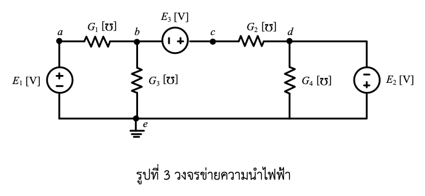

# เฉลยและบทเรียนฉบับสอนจนบรรลุ — ข้อที่ 3: วงข่ายความนำไฟฟ้าและสมการชุดตัด

> **วิชา:** 303212 การวิเคราะห์วงจรไฟฟ้า 2 · **โจทย์:** สอบปากเปล่าข้อที่ 3
> **หัวข้อ:** Conductance Network · Graph Theory · Fundamental Cut-set Matrix · Supernode
> **ผู้เรียบเรียง:** Claude Opus 5 — เขียนแบบ "ครูนั่งข้างๆ แล้วค่อยๆ อธิบายให้ฟัง"
> **เป้าหมาย:** นิสิตที่ไม่มีพื้นฐานเลย อ่านจบแล้วเดินเข้าห้องสอบปากเปล่าได้ 100/100

---

## สารบัญ

| บท | ชื่อบท | อ่านเมื่อไหร่ |
| :--- | :--- | :--- |
| [บทที่ 0](#บทที่-0-กระดาษคำตอบ--ดูปลายทางก่อนออกเดินทาง) | กระดาษคำตอบ — ดูปลายทางก่อน | อ่านรอบแรกให้เห็นภาพรวม |
| [บทที่ 1](#บทที่-1-มโนทัศน์กายภาพความนำไฟฟ้าและทฤษฎีกราฟวงจร) | ความนำไฟฟ้า & ทฤษฎีกราฟวงจร | ถ้ายังไม่รู้ว่า ℧ คืออะไร หรือ "ต้นไม้" คืออะไร |
| [บทที่ 2](#บทที่-2-พิสูจน์-kcl-supernode-และสมการชุดตัดทีละบรรทัด) | พิสูจน์ KCL, Supernode, สมการชุดตัด | หัวใจของข้อนี้ — ห้ามข้าม |
| [บทที่ 3](#บทที่-3-แทนค่าตัวเลขจริงทีละบรรทัด) | แทนค่าตัวเลขทศนิยม 6 ตำแหน่ง | ตอนซ้อมคำนวณด้วยมือ |
| [บทที่ 4](#บทที่-4-คำนวณด้วยคอมพิวเตอร์และการตรวจสอบไขว้) | คอมพิวเตอร์ & การตรวจสอบไขว้ | ตอนอยากได้คะแนนเกินเต็ม |
| [บทที่ 5](#บทที่-5-คัมภีร์ซ้อมตอบสอบปากเปล่า-100100-15-ข้อ) | **คัมภีร์ซ้อมตอบสอบปากเปล่า 15 ข้อ** | คืนก่อนสอบ อ่านซ้ำจนพูดได้ |

**ไฟล์ประกอบชุดนี้:** [interactive_dashboard.html](interactive_dashboard.html) · [solve_circuit.py](solve_circuit.py) · [solve_circuit.m](solve_circuit.m) · [README.md](README.md)
**ไฟล์อ้างอิง:** [โจทย์ฉบับเต็ม](../oral_exam_problem.md) · [รูปวงจร](../circuit_fig3.png) · [รูปโจทย์ต้นฉบับ](../image.png)

---

# บทที่ 0: กระดาษคำตอบ — ดูปลายทางก่อนออกเดินทาง

ครูให้คำตอบก่อนเลยครับ ไม่ต้องลุ้น เพราะการรู้ปลายทางก่อนจะทำให้อ่านบทที่เหลือแล้วเห็นภาพว่าแต่ละขั้นตอนกำลังพาไปไหน

**คำตอบแรงดันปมทั้งสี่**

$$\boxed{V_a = E_1}$$

$$\boxed{V_b = \frac{G_1E_1 - G_2E_2 - G_2E_3}{G_1+G_2+G_3}}$$

$$\boxed{V_c = \frac{G_1E_1 - G_2E_2 + (G_1+G_3)E_3}{G_1+G_2+G_3}}$$

$$\boxed{V_d = -E_2}$$

**สมการชุดตัดในรูปเมทริกซ์เวกเตอร์** (เลือกต้นไม้ = $\{E_1, G_3, E_3, E_2\}$)

$$\underbrace{\begin{bmatrix} G_1 & -G_1 & 0 & 0 \\ -G_1 & G_1{+}G_2{+}G_3 & G_2 & -G_2 \\ 0 & G_2 & G_2 & -G_2 \\ 0 & -G_2 & -G_2 & G_2{+}G_4 \end{bmatrix}}_{[Q_K][Y_b][Q_K]^T}
\underbrace{\begin{bmatrix} V_a \\ V_b \\ V_c - V_b \\ V_d \end{bmatrix}}_{\mathbf{v}_t}
=
\underbrace{\begin{bmatrix} -i_{E_1} \\ 0 \\ -i_{E_3} \\ -i_{E_2} \end{bmatrix}}_{\mathbf{J}_{cut}}$$

**สามอย่างที่ต้องสังเกตให้ได้ตั้งแต่ตอนนี้ — นี่คือที่มาของคะแนนเต็ม**

| # | ข้อสังเกต | ทำไมถึงสำคัญ |
| :---: | :--- | :--- |
| 1 | **$G_4$ ไม่โผล่ในคำตอบแรงดันสักตัวเดียว** | เพราะ $V_d$ ถูกตรึงด้วยแหล่งจ่ายอุดมคติ $E_2$ ไปแล้ว $G_4$ จึงเป็นแค่ภาระที่แขวนอยู่กับแหล่งจ่าย มีผลต่อ*กระแส* แต่ไม่มีผลต่อ*แรงดัน* — [คำถามที่ 11](#คำถามที่-11-อันตรายสูงสุด-ทำไม-g_4-ไม่โผล่ในคำตอบเลยสักตัว-คุณลืมหรือเปล่า) |
| 2 | **แถวที่ 2 ของเมทริกซ์เท่านั้นที่มี RHS เป็นศูนย์** | เพราะรอยตัดนั้นเป็นรอยตัดเดียวที่ไม่มีแหล่งจ่ายพาดผ่าน มันจึงเป็นสมการเดียวที่ใช้แก้หาค่าที่ไม่รู้ได้ — และมันคือสมการ supernode พอดี |
| 3 | **มีตัวไม่รู้จริงๆ แค่ตัวเดียว คือ $V_b$** | ปมมี 4 ปม แต่แหล่งจ่ายแรงดันอิสระ 3 ตัวตรึงไปแล้ว 3 เงื่อนไข เหลืออิสระ $4-3=1$ |

**ตัวอย่างตัวเลข** (ใช้ตลอดบทที่ 3–4) — $G_1{=}0.5$, $G_2{=}0.25$, $G_3{=}0.2$, $G_4{=}0.4\ \mho$ · $E_1{=}12$, $E_2{=}6$, $E_3{=}4$ V

$$V_a = 12.000000\ \text{V} \qquad V_b = 3.684211\ \text{V} \qquad V_c = 7.684211\ \text{V} \qquad V_d = -6.000000\ \text{V}$$

---

# บทที่ 1: มโนทัศน์กายภาพความนำไฟฟ้าและทฤษฎีกราฟวงจร

ครูขอเวลาบทนี้หน่อยนะครับ อย่าเพิ่งข้ามไปหาสูตร เพราะโจทย์ข้อนี้มีศัพท์ใหม่สองกลุ่มที่นิสิตไม่เคยเจอ — **ความนำไฟฟ้า** กับ **ทฤษฎีกราฟ** ถ้าไม่ปูตรงนี้ พอไปเจอคำว่า "ต้นไม้" กับ "รอยตัด" ในบทที่ 2 จะงงทันที

## 1.1 ความนำไฟฟ้า $G$ — พลิกความต้านทานกลับหัว

ตลอดชีวิตการเรียนที่ผ่านมา นิสิตคุ้นกับ **ความต้านทาน $R$** หน่วยโอห์ม ($\Omega$) ซึ่งบอกว่า *"ไฟไหลผ่านยากแค่ไหน"*

โจทย์ข้อนี้พลิกมุมมอง ใช้ **ความนำไฟฟ้า (conductance) $G$** ซึ่งบอกว่า *"ไฟไหลผ่านง่ายแค่ไหน"* — มันคือส่วนกลับกันตรงๆ

$$G = \frac{1}{R} \qquad\qquad R = \frac{1}{G}$$

**หน่วยของ $G$** เขียนได้ 2 แบบ ซึ่งเป็นสิ่งเดียวกัน:
* **ซีเมนส์ (siemens, S)** — หน่วย SI สมัยใหม่
* **โมห์ (mho, $\mho$)** — คำว่า "ohm" เขียนกลับหลัง และสัญลักษณ์คือตัว $\Omega$ กลับหัว! เป็นมุกตลกของวิศวกรยุคเก่า และเป็นสัญลักษณ์ที่โจทย์ข้อนี้ใช้

$$1\ \mho = 1\ \text{S} = 1\ \Omega^{-1} = 1\ \frac{\text{A}}{\text{V}}$$

### ภาพท่อน้ำ: $R$ คือความยาว/ความคด ส่วน $G$ คือ *ความกว้าง*

ลองนึกถึงท่อน้ำนะครับ

* ถ้ามองแบบ **ความต้านทาน $R$** เราถามว่า *"ท่อนี้มันตีบแค่ไหน กว่าน้ำจะผ่านไปได้ต้องออกแรงดันเท่าไหร่"* — ท่อตีบมาก $R$ สูง
* ถ้ามองแบบ **ความนำ $G$** เราถามว่า *"ท่อนี้มันปากกว้างแค่ไหน แรงดัน 1 หน่วยดันน้ำผ่านไปได้กี่ลิตรต่อวินาที"* — ท่อกว้างมาก $G$ สูง

**แล้วทำไมวิศวกรถึงชอบใช้ $G$ ในการวิเคราะห์วงจร?** เหตุผลอยู่ที่กฎของโอห์มครับ ลองเทียบสองรูปนี้

$$i = \frac{v}{R} \qquad\text{เทียบกับ}\qquad \boxed{i = G\,v}$$

รูปขวา**ไม่มีตัวหาร** — มันเป็นการคูณล้วนๆ พอเราต้องเขียนสมการ KCL ที่ปมหนึ่ง ซึ่งคือการเอากระแสหลายกิ่งมาบวกกัน การใช้ $G$ ทำให้ได้สมการเชิงเส้นสวยๆ ที่ไม่มีเศษส่วนซ้อนกันเลย

$$\sum i = G_1 v_1 + G_2 v_2 + G_3 v_3 + \cdots$$

ลองนึกภาพถ้าใช้ $R$ จะได้ $\frac{v_1}{R_1} + \frac{v_2}{R_2} + \frac{v_3}{R_3}$ ซึ่งพอจับเข้าเมทริกซ์แล้วเลอะเทอะมาก **นี่คือเหตุผลที่โจทย์ข้อนี้จงใจให้ค่าเป็น $\mho$ ตั้งแต่แรก — เพราะมันกำลังจะพาเราไปสู่สมการเมทริกซ์**

### กฎการรวมที่กลับด้านกับที่เคยท่อง

ตรงนี้เป็นกับดักคลาสสิก ต้องระวัง เพราะกฎรวมของ $G$ **สลับกับ** ของ $R$ พอดี

| ต่อแบบ | ความต้านทาน $R$ | ความนำ $G$ | ภาพท่อน้ำ |
| :--- | :--- | :--- | :--- |
| **อนุกรม** | $R_{eq} = R_1 + R_2$ (บวกตรงๆ) | $\dfrac{1}{G_{eq}} = \dfrac{1}{G_1}+\dfrac{1}{G_2}$ | ท่อต่อกันยาว ยิ่งยาวยิ่งฝืด |
| **ขนาน** | $\dfrac{1}{R_{eq}} = \dfrac{1}{R_1}+\dfrac{1}{R_2}$ | $G_{eq} = G_1 + G_2$ (บวกตรงๆ) | **ท่อวางคู่กัน ปากท่อรวมกว้างขึ้น** |

**จำง่ายๆ ว่า "$G$ ขนานบวกกันตรงๆ"** — เพราะขนานคือเปิดทางให้น้ำไหลเพิ่มอีกเส้น ความ "ง่าย" ย่อมบวกกัน สมเหตุสมผลมาก

ตัวอย่างจากโจทย์: ถ้า $G_1 = 0.5\ \mho$ แปลว่า $R_1 = 1/0.5 = 2\ \Omega$ · ถ้า $G_3 = 0.2\ \mho$ แปลว่า $R_3 = 5\ \Omega$

## 1.2 ทฤษฎีกราฟวงจร — เปลื้องวงจรให้เหลือแต่โครงกระดูก

ทีนี้มาถึงส่วนที่ทำให้โจทย์ข้อนี้ต่างจากโจทย์วงจรทั่วไปครับ

เวลาเรามองวงจร เรามักเห็น "ตัวต้านทาน" "แหล่งจ่าย" "สายไฟ" ปนกันจนตาลาย **ทฤษฎีกราฟบอกว่า: ลืมไปก่อนว่าแต่ละกิ่งเป็นอุปกรณ์อะไร ให้มองแค่ว่ามันเชื่อมจุดไหนกับจุดไหน**

### ศัพท์ 3 คำที่ต้องแม่น

**1. ปม (Node) และ กิ่ง (Branch)**

* **ปม** = จุดเชื่อมต่อ ในวงจรเรามี 5 ปม คือ $a, b, c, d, e$
* **กิ่ง** = เส้นทางที่เชื่อมปมสองปม ในวงจรเรามี 7 กิ่ง คือ $E_1, G_1, G_3, E_3, G_2, G_4, E_2$

> **สำคัญมาก:** แหล่งจ่ายแรงดันก็นับเป็น "กิ่ง" นะครับ ไม่ใช่แค่ตัวต้านทาน นิสิตจำนวนมากลืมนับ แล้วจำนวนกิ่งผิด ทำให้เลือกต้นไม้ผิดตามไปหมด

**2. ต้นไม้ (Tree) และ กิ่งต้นไม้ (Twig)**

นี่คือหัวใจของบทนี้ ครูจะอธิบายด้วยภาพก่อน

> ลองนึกว่าปมทั้ง 5 คือ **เกาะ 5 เกาะ** และกิ่งทั้ง 7 คือ **สะพาน 7 สะพาน** ที่เชื่อมเกาะเข้าด้วยกัน
>
> ทีนี้ผู้ว่าฯ สั่งให้ประหยัดงบ: *"ให้รื้อสะพานออกให้มากที่สุดเท่าที่จะทำได้ แต่ต้องยังเดินจากเกาะไหนไปเกาะไหนก็ได้ และห้ามเหลือทางวนเป็นวงกลม"*
>
> ชุดสะพานที่เหลืออยู่หลังรื้อ = **ต้นไม้ (Tree)** · สะพานแต่ละเส้นที่เหลือ = **กิ่งต้นไม้ (Twig / Tree branch)**

**นิยามเป็นทางการ:** ต้นไม้คือชุดกิ่งย่อยที่ (ก) เชื่อมทุกปมถึงกันหมด และ (ข) ไม่มีลูปปิด

**สูตรนับจำนวน:** ถ้ามี $n$ ปม ต้นไม้จะมีกิ่งเสมอ $n - 1$ กิ่ง

$$\text{จำนวนกิ่งต้นไม้} = n - 1 = 5 - 1 = \boxed{4\ \text{กิ่ง}}$$

**พิสูจน์เชิงสัญชาตญาณว่าทำไมต้องเป็น $n-1$:** เริ่มจากเกาะเดียว (1 ปม, 0 สะพาน) ทุกครั้งที่จะดึงเกาะใหม่เข้ามาเชื่อม ต้องใช้สะพานเพิ่ม 1 เส้นพอดี — ถ้าใช้ 2 เส้นจะเกิดลูปทันที ดังนั้นเกาะ $n$ เกาะ ต้องใช้ $n-1$ สะพาน ✓

**3. กิ่งร่วม (Link / Chord) และต้นไม้ร่วม (Co-tree)**

กิ่งที่เหลือจากการเลือกต้นไม้ (สะพานที่ถูกรื้อ) เรียกว่า **กิ่งร่วม** รวมกันเรียก **ต้นไม้ร่วม**

$$\text{จำนวนกิ่งร่วม} = b - (n-1) = 7 - 4 = \boxed{3\ \text{กิ่ง}}$$

**คุณสมบัติทองคำของกิ่งร่วม:** เติมกิ่งร่วมกลับเข้าไปในต้นไม้ทีละเส้น **จะเกิดลูปปิดพอดี 1 ลูปเสมอ** เรียกว่า *ลูปพื้นฐาน (fundamental loop)* — เพราะต้นไม้เชื่อมทุกปมอยู่แล้ว พอเติมสะพานเส้นใหม่ มันย่อมเชื่อมสองจุดที่เดินถึงกันได้อยู่แล้ว จึงปิดเป็นวง

## 1.3 รอยตัดพื้นฐาน (Fundamental Cut-set) — พระเอกของข้อนี้

มาถึงตัวเอกจริงๆ ของโจทย์แล้วครับ

**รอยตัด (Cut-set)** คือชุดของกิ่งที่ *ถ้าตัดออกพร้อมกันทั้งชุด* จะทำให้วงจรขาดออกเป็น **2 ก้อนที่ไม่ติดกัน** — และต้องเป็นชุดที่เล็กที่สุด คือถ้าเอากิ่งใดกิ่งหนึ่งกลับคืน วงจรจะกลับมาติดกันทันที

**รอยตัดพื้นฐาน** คือรอยตัดที่มี **กิ่งต้นไม้เพียง 1 กิ่ง** และที่เหลือเป็นกิ่งร่วมล้วน

> **วิธีหาแบบไม่ต้องคิดมาก:** เล็งไปที่กิ่งต้นไม้ 1 เส้น แล้วถามว่า *"ถ้าฉันตัดสะพานเส้นนี้ เกาะจะแยกเป็นสองฝั่งอย่างไร"* จากนั้นดูว่ามีสะพานเส้นไหนอีกบ้างที่พาดข้ามระหว่างสองฝั่งนั้น — สะพานทั้งหมดที่พาดข้าม รวมกันคือรอยตัดพื้นฐาน

ดังนั้น **กิ่งต้นไม้ 1 กิ่ง ⟷ รอยตัดพื้นฐาน 1 รอย** เรามีกิ่งต้นไม้ 4 กิ่ง จึงมีรอยตัดพื้นฐาน 4 รอย และได้ **สมการ 4 สมการ**

### ทำไมรอยตัดถึงให้สมการ KCL ได้?

ตรงนี้คือความงามของเรื่องนี้ครับ

KCL ที่เราเรียนมาบอกว่า *"ที่ปมหนึ่ง กระแสเข้า = กระแสออก"* แต่ที่จริงแล้ว **KCL ใช้ได้กับพื้นผิวปิดใดๆ ไม่ใช่แค่ปมเดียว** — เพราะกฎอนุรักษ์ประจุบอกว่าประจุจะกองสะสมในบริเวณปิดไม่ได้

รอยตัดก็คือการลากเส้นปิดล้อมรอบก้อนปมก้อนหนึ่ง แล้วบอกว่า **ผลรวมกระแสที่ไหลข้ามเส้นนั้นต้องเป็นศูนย์**

$$\sum_{\text{กิ่งที่ข้ามรอยตัด}} i_k = 0$$

**และนี่แหละคือ Supernode!** ตอนที่เราวาดวงรีคร่อมปม $b$ กับ $c$ แล้วเขียน KCL รอบวงรีนั้น เรากำลังใช้รอยตัดโดยไม่รู้ตัว — บทที่ 2 จะพิสูจน์ให้เห็นว่าทั้งสองอย่างเป็นสิ่งเดียวกันเป๊ะ

## 1.4 เลือกต้นไม้ให้เป็น — เคล็ดลับที่ทำให้โจทย์นี้ง่ายลง 10 เท่า

ต้นไม้ของวงจรหนึ่งเลือกได้หลายแบบ (วงจรนี้เลือกได้หลายสิบแบบ) แล้วเลือกแบบไหนดี?

> ### 🔑 กฎทองของการวิเคราะห์ชุดตัด
> **"จับแหล่งจ่ายแรงดันทุกตัวยัดเข้าไปเป็นกิ่งต้นไม้ให้หมด"**

**เหตุผล:** แรงดันคร่อมกิ่งต้นไม้เรียกว่า *แรงดันกิ่งต้นไม้ (twig voltage)* และมันคือ **ตัวแปรที่เราจะแก้หา** ถ้ากิ่งต้นไม้เส้นนั้นเป็นแหล่งจ่ายแรงดัน แสดงว่า **เรารู้ค่าตัวแปรตัวนั้นอยู่แล้วตั้งแต่ต้น!** ไม่ต้องแก้เลย

ในวงจรของเรามีแหล่งจ่าย 3 ตัว ($E_1, E_3, E_2$) ยัดเข้าต้นไม้ได้หมด แล้วต้องเติมอีก 1 กิ่งให้ครบ 4 — เราเลือก $G_3$

$$\boxed{\text{ต้นไม้} = \{E_1,\ G_3,\ E_3,\ E_2\}} \qquad \boxed{\text{กิ่งร่วม} = \{G_1,\ G_2,\ G_4\}}$$

**ผลลัพธ์:** ในบรรดาแรงดันกิ่งต้นไม้ 4 ตัว มี 3 ตัวที่รู้ค่าแล้ว เหลือตัวไม่รู้แค่ **1 ตัว** คือแรงดันคร่อม $G_3$ ซึ่งก็คือ $V_b$ นั่นเอง

**ตรวจสอบว่าเป็นต้นไม้จริงไหม** (ต้องเช็คทุกครั้ง!) — ไล่ดูว่าเชื่อมครบ 5 ปม และไม่มีลูป:

| กิ่ง | เชื่อม | ผลสะสม |
| :--- | :--- | :--- |
| $E_1$ | $a \leftrightarrow e$ | ได้ $\{a, e\}$ |
| $G_3$ | $b \leftrightarrow e$ | ได้ $\{a, b, e\}$ |
| $E_3$ | $c \leftrightarrow b$ | ได้ $\{a, b, c, e\}$ |
| $E_2$ | $d \leftrightarrow e$ | ได้ $\{a, b, c, d, e\}$ ✓ ครบ 5 ปม |

ใช้ 4 กิ่ง เชื่อมครบ 5 ปม ไม่มีลูป → **เป็นต้นไม้ที่ถูกต้อง** ✓

## 1.5 ตรวจความเข้าใจก่อนไปต่อ

1. **ถ้า $R = 4\ \Omega$ ค่า $G$ เท่าไหร่? แล้วถ้าเอา $G$ สองตัวนี้ต่อขนานกันได้เท่าไหร่?**
   *ตอบ: $G = 0.25\ \mho$ · ต่อขนานได้ $0.25 + 0.25 = 0.5\ \mho$ (บวกตรงๆ) ซึ่งตรงกับ $R$ ขนาน $= 2\ \Omega$ ✓*
2. **วงจรมี 5 ปม 7 กิ่ง — ต้นไม้มีกี่กิ่ง กิ่งร่วมกี่กิ่ง ได้สมการชุดตัดกี่สมการ?**
   *ตอบ: ต้นไม้ 4, กิ่งร่วม 3, สมการชุดตัด 4 สมการ (เท่าจำนวนกิ่งต้นไม้)*
3. **ทำไมถึงอยากยัดแหล่งจ่ายแรงดันเข้าเป็นกิ่งต้นไม้?**
   *ตอบ: เพราะแรงดันกิ่งต้นไม้คือตัวแปรที่ต้องแก้ ถ้ากิ่งนั้นเป็นแหล่งจ่าย เราก็รู้ค่ามันฟรีๆ ตัวไม่รู้จึงลดลงทันที*

---

# บทที่ 2: พิสูจน์ KCL, Supernode และสมการชุดตัดทีละบรรทัด

บทนี้คือหัวใจ ถ้ากรรมการมีเวลาถามแค่ 5 นาที เขาจะถามเรื่องในบทนี้ทั้งหมด **ครูจะไม่ข้ามขั้นตอนย้ายข้างแม้แต่บรรทัดเดียว**

## 2.1 อ่านรูปวงจรให้ออกก่อน — โดยเฉพาะขั้ว

| กิ่ง | เชื่อมปม | สิ่งที่ต้องสังเกตในรูป | ผลที่ตามมา |
| :--- | :--- | :--- | :--- |
| $E_1$ | $a \leftrightarrow e$ | **$+$ อยู่บน (ฝั่ง $a$)** , $-$ อยู่ล่าง (ฝั่ง $e$) | $V_a - V_e = +E_1 \Rightarrow V_a = E_1$ |
| $G_1$ | $a \leftrightarrow b$ | ตัวต้านทานฟันปลาบนสายบน | $i_{G_1} = G_1(V_a - V_b)$ |
| $G_3$ | $b \leftrightarrow e$ | ฟันปลาแนวดิ่ง ลงกราวด์ | $i_{G_3} = G_3 V_b$ |
| $E_3$ | $b \leftrightarrow c$ | **$-$ อยู่ซ้าย (ฝั่ง $b$)** , $+$ อยู่ขวา (ฝั่ง $c$) | $V_c - V_b = +E_3$ |
| $G_2$ | $c \leftrightarrow d$ | ฟันปลาบนสายบน | $i_{G_2} = G_2(V_c - V_d)$ |
| $G_4$ | $d \leftrightarrow e$ | ฟันปลาแนวดิ่ง ลงกราวด์ | $i_{G_4} = G_4 V_d$ |
| $E_2$ | $d \leftrightarrow e$ | **$-$ อยู่บน (ฝั่ง $d$)** , $+$ อยู่ล่าง (ฝั่ง $e$) | $V_d - V_e = -E_2 \Rightarrow V_d = -E_2$ |

> ### 💀 กับดักมรณะข้อที่ 1 — ขั้วของ $E_2$
> นิสิตส่วนใหญ่เห็น $E_2$ แล้วเขียน $V_d = +E_2$ ทันทีโดยไม่ดูรูป **ผิดครับ**
>
> ดูรูปให้ดี: **เครื่องหมายลบของ $E_2$ อยู่ด้านบน คือฝั่งที่ต่อกับปม $d$** ส่วนเครื่องหมายบวกอยู่ด้านล่าง ต่อกับกราวด์ $e$
>
> นิยามของแหล่งจ่ายแรงดันคือ *"ศักย์ที่ขั้วบวก ลบด้วย ศักย์ที่ขั้วลบ เท่ากับค่าแหล่งจ่าย"*:
> $$V_{(+)} - V_{(-)} = E_2 \implies V_e - V_d = E_2 \implies 0 - V_d = E_2 \implies \boxed{V_d = -E_2}$$
>
> **นี่คือคำถามที่กรรมการชอบถามที่สุดข้อหนึ่ง** เพราะมันแยกคนที่ดูรูปเป็น ออกจากคนที่ท่องสูตรมา — [คำถามที่ 4](#คำถามที่-4-ทำไม-v_d-ติดลบ-เท่ากับลบ-e_2)

## 2.2 นับตัวไม่รู้ก่อนลงมือ — วางแผนให้เห็นปลายทาง

ก่อนเขียนสมการใดๆ ครูอยากให้นิสิตนับก่อนเสมอว่า *"มีตัวไม่รู้กี่ตัว และต้องการสมการกี่สมการ"* ถ้าไม่นับ จะไม่รู้ว่าเมื่อไหร่ควรหยุด

| รายการ | จำนวน | หมายเหตุ |
| :--- | :---: | :--- |
| ปมทั้งหมด | 5 | $a, b, c, d, e$ |
| ปมอ้างอิง (กราวด์) | 1 | $e$ ($V_e = 0$ โดยนิยาม) |
| **แรงดันปมที่ต้องหา** | **4** | $V_a, V_b, V_c, V_d$ |
| ตรึงโดย $E_1$ | −1 | $V_a = E_1$ รู้ทันที |
| ตรึงโดย $E_2$ | −1 | $V_d = -E_2$ รู้ทันที |
| ผูกโดย $E_3$ | −1 | $V_c = V_b + E_3$ (ไม่รู้ค่า แต่ผูกกัน) |
| **ตัวไม่รู้ที่แท้จริง** | **1** | เหลือแค่ $V_b$ ตัวเดียว! |

**ดังนั้นเราต้องการสมการ KCL อิสระแค่ 1 สมการ** และนั่นคือสมการที่ supernode

## 2.3 ทำไมต้องสร้าง Supernode?

ลองสมมติว่าเราไม่สร้าง supernode แล้วเขียน KCL ที่ปม $b$ ตรงๆ ดูครับ

$$\text{KCL ที่ปม } b: \quad G_1(V_b - V_a) + G_3 V_b + i_{E_3} = 0$$

**ปัญหาโผล่ทันที: $i_{E_3}$ คือกระแสที่ไหลผ่านแหล่งจ่าย $E_3$ ซึ่งเราไม่รู้ค่า และคำนวณจาก $E_3$ ไม่ได้ด้วย**

ทำไมคำนวณไม่ได้? เพราะแหล่งจ่ายแรงดันอุดมคติ**ไม่มีความสัมพันธ์ระหว่างแรงดันกับกระแสของตัวมันเอง** มันบังคับแรงดันให้คงที่ แล้วปล่อยให้กระแสเป็นเท่าไหร่ก็ได้ตามที่วงจรภายนอกต้องการ ต่างจากตัวต้านทานที่มี $i = Gv$ ให้ใช้

> **ถ้าเปรียบเป็นภาพ:** แหล่งจ่ายแรงดันเหมือน "ปั๊มที่ยืนกรานว่าจะรักษาความต่างระดับน้ำสองฝั่งไว้ที่ 4 เมตรเสมอ ไม่ว่าจะต้องสูบน้ำกี่ลิตรต่อวินาทีก็ตาม" — เราจึงทำนายอัตราการไหลจากตัวปั๊มไม่ได้ ต้องดูจากวงจรรอบข้าง

**ทางออกคือ Supernode:** ถ้ากระแสตัวนี้กวนใจ ก็**ลากเส้นปิดล้อมมันไว้ข้างใน** แล้วเขียน KCL รอบเส้นนั้นแทน — กระแสที่ไหลอยู่ *ภายใน* พื้นผิวปิด ไม่ได้ข้ามพื้นผิว จึงไม่ปรากฏในสมการเลย!

$$\boxed{\text{Supernode} = \text{ลากวงรีคร่อมปม } b \text{ และ } c \text{ โดยมี } E_3 \text{ อยู่ข้างใน}}$$

## 2.4 เขียน KCL ที่ Supernode — ทีละกิ่ง ไม่ข้ามขั้นตอน

ตอนนี้เรามีพื้นผิวปิดล้อมปม $b$ และ $c$ ไว้ ครูจะไล่ดู **ทีละกิ่ง** ว่ามีกิ่งไหนบ้างที่ **ข้าม** ขอบเขตนี้ (กิ่งที่ปลายข้างหนึ่งอยู่ใน อีกข้างอยู่นอก)

| กิ่ง | ปลายข้างหนึ่ง | ปลายอีกข้าง | ข้ามขอบเขตไหม? |
| :--- | :--- | :--- | :--- |
| $G_1$ | $b$ (ข้างใน) | $a$ (ข้างนอก) | ✅ **ข้าม** |
| $G_3$ | $b$ (ข้างใน) | $e$ (ข้างนอก) | ✅ **ข้าม** |
| $E_3$ | $b$ (ข้างใน) | $c$ (ข้างใน) | ❌ ไม่ข้าม — อยู่ในทั้งคู่ |
| $G_2$ | $c$ (ข้างใน) | $d$ (ข้างนอก) | ✅ **ข้าม** |
| $E_1, G_4, E_2$ | — | — | ❌ ไม่แตะขอบเขตเลย |

**เห็นไหมครับว่า $E_3$ หลุดออกจากสมการไปเองโดยอัตโนมัติ** นี่คือพลังของ supernode

ทีนี้กำหนดทิศทางบวก — ครูจะใช้กติกาว่า **"กระแสที่ไหลออกจากพื้นผิวปิดนับเป็นบวก"** แล้วให้ผลรวมเป็นศูนย์

**กิ่งที่ 1 — ผ่าน $G_1$ ออกจาก $b$ ไปหา $a$:**
แรงดันตกคร่อมในทิศจาก $b$ ไป $a$ คือ $(V_b - V_a)$ ดังนั้น
$$i_{G_1,\text{ออก}} = G_1(V_b - V_a)$$

**กิ่งที่ 2 — ผ่าน $G_3$ ออกจาก $b$ ลงไปหา $e$:**
แรงดันตกในทิศจาก $b$ ไป $e$ คือ $(V_b - V_e) = (V_b - 0) = V_b$ ดังนั้น
$$i_{G_3,\text{ออก}} = G_3(V_b - 0) = G_3 V_b$$

**กิ่งที่ 3 — ผ่าน $G_2$ ออกจาก $c$ ไปหา $d$:**
แรงดันตกในทิศจาก $c$ ไป $d$ คือ $(V_c - V_d)$ ดังนั้น
$$i_{G_2,\text{ออก}} = G_2(V_c - V_d)$$

**รวมทั้งสามกิ่ง แล้วให้เท่ากับศูนย์:**

$$\boxed{G_1(V_b - V_a) + G_3 V_b + G_2(V_c - V_d) = 0} \qquad \cdots (\star)$$

นี่คือสมการเดียวที่เราต้องการครับ ✓

## 2.5 แทนค่าและแก้หา $V_b$ — บรรทัดต่อบรรทัด ไม่ข้ามแม้แต่ขั้นเดียว

เรามีของที่รู้แล้ว 3 อย่าง:

$$V_a = E_1 \qquad\qquad V_d = -E_2 \qquad\qquad V_c = V_b + E_3$$

**บรรทัดที่ 1** — เขียนสมการ $(\star)$ ลงมาก่อน:
$$G_1(V_b - V_a) + G_3 V_b + G_2(V_c - V_d) = 0$$

**บรรทัดที่ 2** — แทน $V_a = E_1$ ลงในวงเล็บแรก:
$$G_1(V_b - E_1) + G_3 V_b + G_2(V_c - V_d) = 0$$

**บรรทัดที่ 3** — แทน $V_c = V_b + E_3$ ลงในวงเล็บที่สาม:
$$G_1(V_b - E_1) + G_3 V_b + G_2\big((V_b + E_3) - V_d\big) = 0$$

**บรรทัดที่ 4** — แทน $V_d = -E_2$ ลงในวงเล็บที่สาม (ระวังเครื่องหมาย! ลบด้วยลบกลายเป็นบวก):
$$G_1(V_b - E_1) + G_3 V_b + G_2\big(V_b + E_3 - (-E_2)\big) = 0$$
$$G_1(V_b - E_1) + G_3 V_b + G_2\big(V_b + E_3 + E_2\big) = 0$$

**บรรทัดที่ 5** — กระจายวงเล็บแรก:
$$G_1 V_b - G_1 E_1 + G_3 V_b + G_2(V_b + E_3 + E_2) = 0$$

**บรรทัดที่ 6** — กระจายวงเล็บที่สาม:
$$G_1 V_b - G_1 E_1 + G_3 V_b + G_2 V_b + G_2 E_3 + G_2 E_2 = 0$$

**บรรทัดที่ 7** — จัดกลุ่ม: ย้ายพจน์ที่มี $V_b$ ไว้ซ้าย พจน์ที่เหลือไว้ขวา
$$G_1 V_b + G_3 V_b + G_2 V_b = G_1 E_1 - G_2 E_3 - G_2 E_2$$

**บรรทัดที่ 8** — ดึง $V_b$ เป็นตัวประกอบร่วม:
$$(G_1 + G_2 + G_3)\,V_b = G_1 E_1 - G_2 E_3 - G_2 E_2$$

**บรรทัดที่ 9** — หารทั้งสองข้างด้วย $(G_1 + G_2 + G_3)$:

$$\boxed{\,V_b = \frac{G_1 E_1 - G_2 E_2 - G_2 E_3}{G_1 + G_2 + G_3}\,}$$

**ตรวจมิติทันที** (นิสัยที่ต้องติดตัว): ตัวเศษมีหน่วย $[\mho][\text{V}] = [\text{A}]$ ตัวส่วนมีหน่วย $[\mho]$ ผลหารได้ $\dfrac{\text{A}}{\mho} = \dfrac{\text{A}}{\text{A}/\text{V}} = \text{V}$ ✓ เป็นโวลต์ถูกต้อง

## 2.6 หา $V_c$ — สองวิธี แล้วเช็คว่าตรงกัน

**วิธีที่ 1 (ง่ายที่สุด):** ใช้ความสัมพันธ์ที่ $E_3$ บังคับไว้ตรงๆ
$$V_c = V_b + E_3$$

**วิธีที่ 2 (เขียนเป็นสูตรเดียวจบ):** เอา $V_b$ แทนลงไปแล้วรวมเศษส่วน — ครูจะทำให้ดูทีละบรรทัด

$$V_c = \frac{G_1 E_1 - G_2 E_2 - G_2 E_3}{G_1 + G_2 + G_3} + E_3$$

ทำ $E_3$ ให้เป็นเศษส่วนส่วนเดียวกัน โดยคูณด้วย $\dfrac{G_1+G_2+G_3}{G_1+G_2+G_3}$:

$$V_c = \frac{G_1 E_1 - G_2 E_2 - G_2 E_3}{G_1 + G_2 + G_3} + \frac{(G_1 + G_2 + G_3)E_3}{G_1 + G_2 + G_3}$$

รวมเศษเข้าด้วยกัน:

$$V_c = \frac{G_1 E_1 - G_2 E_2 - G_2 E_3 + G_1 E_3 + G_2 E_3 + G_3 E_3}{G_1 + G_2 + G_3}$$

สังเกตว่า $-G_2E_3$ กับ $+G_2E_3$ **ตัดกันหมดพอดี**:

$$V_c = \frac{G_1 E_1 - G_2 E_2 + G_1 E_3 + G_3 E_3}{G_1 + G_2 + G_3}$$

ดึง $E_3$ เป็นตัวประกอบร่วม:

$$\boxed{\,V_c = \frac{G_1 E_1 - G_2 E_2 + (G_1 + G_3)E_3}{G_1 + G_2 + G_3}\,}$$

**สรุปคำตอบทั้งสี่ปม:**

$$V_a = E_1 \qquad V_b = \frac{G_1E_1 - G_2E_2 - G_2E_3}{G_1+G_2+G_3} \qquad V_c = \frac{G_1E_1 - G_2E_2 + (G_1+G_3)E_3}{G_1+G_2+G_3} \qquad V_d = -E_2$$

## 2.7 สร้างเมทริกซ์ชุดตัด $[Q_K]$ ทีละสมาชิก

ทีนี้มาถึงส่วนที่โจทย์สั่งตรงๆ ว่า *"จงเขียนสมการชุดตัดในรูปแบบเมทริกซ์เวกเตอร์"*

### ขั้นที่ 1: กำหนดทิศทางอ้างอิงของทุกกิ่ง (Oriented Graph)

ก่อนสร้างเมทริกซ์ ต้องกำหนดก่อนว่าแต่ละกิ่ง "ชี้" ไปทางไหน เพราะเมทริกซ์เก็บได้แค่ $+1, -1, 0$ ครูจะใช้กติกาว่า **แรงดันกิ่ง = ศักย์ปมต้นทาง − ศักย์ปมปลายทาง**

**เรียงลำดับกิ่งแบบ "กิ่งต้นไม้ก่อน แล้วค่อยกิ่งร่วม"** — สำคัญมาก เพราะจะทำให้เมทริกซ์ออกมาสวย

| ลำดับ | กิ่ง | ประเภท | ทิศทาง | แรงดันกิ่ง $v_k$ | ค่า |
| :---: | :--- | :--- | :--- | :--- | :--- |
| 1 | $E_1$ | กิ่งต้นไม้ | $a \to e$ | $V_a - V_e = V_a$ | $E_1$ **(รู้)** |
| 2 | $G_3$ | กิ่งต้นไม้ | $b \to e$ | $V_b - V_e = V_b$ | **ไม่รู้** |
| 3 | $E_3$ | กิ่งต้นไม้ | $c \to b$ | $V_c - V_b$ | $E_3$ **(รู้)** |
| 4 | $E_2$ | กิ่งต้นไม้ | $d \to e$ | $V_d - V_e = V_d$ | $-E_2$ **(รู้)** |
| 5 | $G_1$ | กิ่งร่วม | $a \to b$ | $V_a - V_b$ | — |
| 6 | $G_2$ | กิ่งร่วม | $c \to d$ | $V_c - V_d$ | — |
| 7 | $G_4$ | กิ่งร่วม | $d \to e$ | $V_d - V_e = V_d$ | — |

**เวกเตอร์แรงดันกิ่งต้นไม้ (ตัวแปรของระบบ):**
$$\mathbf{v}_t = \begin{bmatrix} v_{E_1} \\ v_{G_3} \\ v_{E_3} \\ v_{E_2} \end{bmatrix} = \begin{bmatrix} V_a \\ V_b \\ V_c - V_b \\ V_d \end{bmatrix} = \begin{bmatrix} E_1 \\ \color{red}{V_b} \\ E_3 \\ -E_2 \end{bmatrix}$$

**เห็นชัดเลยครับ — มีแค่ตัวสีแดงตัวเดียวที่ไม่รู้**

### ขั้นที่ 2: หารอยตัดพื้นฐานทั้ง 4 รอย

กติกาการใส่ค่าในเมทริกซ์ $[Q_K]$: แถวที่ $i$ คือรอยตัดของกิ่งต้นไม้ที่ $i$ · คอลัมน์ที่ $j$ คือกิ่งที่ $j$

$$q_{ij} = \begin{cases} +1 & \text{กิ่ง } j \text{ ข้ามรอยตัด } i \text{ ในทิศ}\textbf{เดียวกับ}\text{กิ่งต้นไม้ของรอยตัดนั้น} \\ -1 & \text{ข้ามในทิศ}\textbf{ตรงข้าม} \\ 0 & \text{ไม่ข้ามรอยตัดนี้} \end{cases}$$

**🔹 รอยตัดที่ 1 — ของกิ่งต้นไม้ $E_1$ (ทิศ $a \to e$)**

ตัด $E_1$ ออก → ปม $a$ หลุดออกมาอยู่คนเดียว → แบ่งเป็น $\{a\}$ กับ $\{b,c,d,e\}$
กิ่งที่แตะปม $a$ มี 2 กิ่ง: $E_1$ ($a\to e$) และ $G_1$ ($a\to b$) — ทั้งคู่ชี้**ออก**จาก $\{a\}$ ในทิศเดียวกัน

$$\text{แถวที่ 1} = [\,\underbrace{+1}_{E_1}\ \underbrace{0}_{G_3}\ \underbrace{0}_{E_3}\ \underbrace{0}_{E_2}\ |\ \underbrace{+1}_{G_1}\ \underbrace{0}_{G_2}\ \underbrace{0}_{G_4}\,]$$

**🔹 รอยตัดที่ 2 — ของกิ่งต้นไม้ $G_3$ (ทิศ $b \to e$) ⭐ รอยตัดสำคัญที่สุด**

ตัด $G_3$ ออก → ต้นไม้ขาดเป็น $\{b, c\}$ (เพราะ $b$–$c$ ยังเชื่อมกันด้วย $E_3$) กับ $\{a, d, e\}$

ไล่ดูทีละกิ่งว่าข้ามไหม:
* $G_3$ ($b\to e$): ข้าม ทิศออกจาก $\{b,c\}$ เหมือนกิ่งต้นไม้ → $+1$
* $G_1$ ($a\to b$): ข้าม แต่ทิศ**เข้า**หา $\{b,c\}$ ตรงข้ามกัน → $-1$
* $G_2$ ($c\to d$): ข้าม ทิศออกจาก $\{b,c\}$ → $+1$
* $E_3$ ($c\to b$): ปลายทั้งสองอยู่ใน $\{b,c\}$ ทั้งคู่ → $0$ **(นี่คือ supernode!)**
* $E_1, E_2, G_4$: ไม่แตะ $\{b,c\}$ เลย → $0$

$$\text{แถวที่ 2} = [\,0\ +1\ 0\ 0\ |\ -1\ +1\ 0\,]$$

**🔹 รอยตัดที่ 3 — ของกิ่งต้นไม้ $E_3$ (ทิศ $c \to b$)**

ตัด $E_3$ ออก → ปม $c$ หลุดออกมาคนเดียว → $\{c\}$ กับที่เหลือ
กิ่งที่แตะ $c$: $E_3$ ($c\to b$) และ $G_2$ ($c\to d$) — ชี้ออกทั้งคู่

$$\text{แถวที่ 3} = [\,0\ 0\ +1\ 0\ |\ 0\ +1\ 0\,]$$

**🔹 รอยตัดที่ 4 — ของกิ่งต้นไม้ $E_2$ (ทิศ $d \to e$)**

ตัด $E_2$ ออก → ปม $d$ หลุดออกมาคนเดียว → $\{d\}$ กับที่เหลือ
กิ่งที่แตะ $d$: $E_2$ ($d\to e$, ออก → $+1$), $G_2$ ($c\to d$, **เข้า** → $-1$), $G_4$ ($d\to e$, ออก → $+1$)

$$\text{แถวที่ 4} = [\,0\ 0\ 0\ +1\ |\ 0\ -1\ +1\,]$$

### ขั้นที่ 3: ประกอบเป็นเมทริกซ์ $[Q_K]$

$$[Q_K] = \begin{array}{c@{}c} & \begin{matrix} E_1 & G_3 & E_3 & E_2 & G_1 & G_2 & G_4 \end{matrix} \\ \begin{matrix} \text{cut}_1 \\ \text{cut}_2 \\ \text{cut}_3 \\ \text{cut}_4 \end{matrix} & \left[\begin{array}{cccc|ccc} 1 & 0 & 0 & 0 & 1 & 0 & 0 \\ 0 & 1 & 0 & 0 & -1 & 1 & 0 \\ 0 & 0 & 1 & 0 & 0 & 1 & 0 \\ 0 & 0 & 0 & 1 & 0 & -1 & 1 \end{array}\right] \end{array}$$

> **✅ เช็คความถูกต้องทันที:** บล็อกซ้าย (4 คอลัมน์แรก ซึ่งเป็นกิ่งต้นไม้) **ต้องเป็นเมทริกซ์เอกลักษณ์ $I_4$ เสมอ** — ถ้าไม่ใช่ แสดงว่าทำผิดที่ไหนสักแห่ง
>
> เหตุผล: รอยตัดที่ $i$ ถูกนิยามให้มีกิ่งต้นไม้แค่กิ่งที่ $i$ กิ่งเดียว จึงได้ $+1$ ที่ตำแหน่งทแยงมุม และ $0$ ที่กิ่งต้นไม้อื่นทั้งหมด นี่คือรูปแบบมาตรฐาน $[Q_K] = [\,I \mid Q_\ell\,]$

### ขั้นที่ 4: เมทริกซ์ความนำกิ่ง $[Y_b]$ และปัญหาของแหล่งจ่ายอุดมคติ

$[Y_b]$ คือเมทริกซ์ทแยงมุมที่เก็บความนำของแต่ละกิ่ง

$$[Y_b] = \text{diag}\big(\underbrace{?}_{E_1},\ \underbrace{G_3}_{G_3},\ \underbrace{?}_{E_3},\ \underbrace{?}_{E_2},\ \underbrace{G_1}_{G_1},\ \underbrace{G_2}_{G_2},\ \underbrace{G_4}_{G_4}\big)$$

> **⚠️ ปัญหาที่ต้องพูดให้เป็น:** แหล่งจ่ายแรงดันอุดมคติ **ไม่มีค่าความนำ** — หรือพูดให้ถูกคือความนำเป็นอนันต์ (แรงดันคงที่ไม่ว่ากระแสเท่าไหร่ ⟹ $G = i/v \to \infty$) เราจึงเขียน $[Y_b]$ ให้ครบ 7 กิ่งไม่ได้
>
> **นี่ไม่ใช่ข้อบกพร่องของวิธี แต่เป็นเหตุผลว่าทำไมเราถึงยัดแหล่งจ่ายเข้าเป็นกิ่งต้นไม้ตั้งแต่ต้น** — เพราะเราจะ *ไม่ใช้* สมการของรอยตัดที่มีแหล่งจ่าย เราใช้แค่รอยตัดที่ไม่มีแหล่งจ่ายพาดผ่านเท่านั้น ส่วนรอยตัดอื่นเอาไว้*คำนวณกระแสของแหล่งจ่ายทีหลัง*

**วิธีปฏิบัติ:** สร้าง $[Y_b]$ จาก 4 กิ่งความนำ และหั่นคอลัมน์ที่ตรงกันจาก $[Q_K]$ ออกมาเป็น $[Q_G]$

$$[Q_G] = \begin{array}{c@{}c} & \begin{matrix} G_3\ \ & G_1\ \ & G_2\ \ & G_4 \end{matrix} \\ \begin{matrix} \text{cut}_1 \\ \text{cut}_2 \\ \text{cut}_3 \\ \text{cut}_4 \end{matrix} & \begin{bmatrix} 0 & 1 & 0 & 0 \\ 1 & -1 & 1 & 0 \\ 0 & 0 & 1 & 0 \\ 0 & 0 & -1 & 1 \end{bmatrix} \end{array} \qquad [Y_b] = \begin{bmatrix} G_3 & & & \\ & G_1 & & \\ & & G_2 & \\ & & & G_4 \end{bmatrix}$$

### ขั้นที่ 5: คูณเมทริกซ์ $[Q_G][Y_b][Q_G]^T$ ทีละสมาชิก

ครูจะคูณให้ดูทีละขั้น **ไม่ข้าม**

**ขั้น 5.1 — คูณ $[Y_b][Q_G]^T$ ก่อน** (เพราะ $[Y_b]$ เป็นทแยงมุม การคูณคือเอาค่าทแยงไปคูณแต่ละ*แถว* ของ $[Q_G]^T$)

$$[Q_G]^T = \begin{bmatrix} 0 & 1 & 0 & 0 \\ 1 & -1 & 0 & 0 \\ 0 & 1 & 1 & -1 \\ 0 & 0 & 0 & 1 \end{bmatrix} \begin{matrix} \leftarrow G_3 \\ \leftarrow G_1 \\ \leftarrow G_2 \\ \leftarrow G_4 \end{matrix}$$

$$[Y_b][Q_G]^T = \begin{bmatrix} 0 & G_3 & 0 & 0 \\ G_1 & -G_1 & 0 & 0 \\ 0 & G_2 & G_2 & -G_2 \\ 0 & 0 & 0 & G_4 \end{bmatrix}$$

**ขั้น 5.2 — คูณ $[Q_G]$ เข้าไปข้างหน้า** ทีละแถว

*แถวที่ 1 ของ $[Q_G]$ = $[0, 1, 0, 0]$* → หยิบแถว $G_1$ ออกมาเต็มๆ:
$$[\,G_1,\ -G_1,\ 0,\ 0\,]$$

*แถวที่ 2 ของ $[Q_G]$ = $[1, -1, 1, 0]$* → $1\times(\text{แถว }G_3) + (-1)\times(\text{แถว }G_1) + 1\times(\text{แถว }G_2)$:
$$[0, G_3, 0, 0] - [G_1, -G_1, 0, 0] + [0, G_2, G_2, -G_2] = [\,-G_1,\ G_1{+}G_2{+}G_3,\ G_2,\ -G_2\,]$$

*แถวที่ 3 ของ $[Q_G]$ = $[0, 0, 1, 0]$* → หยิบแถว $G_2$:
$$[\,0,\ G_2,\ G_2,\ -G_2\,]$$

*แถวที่ 4 ของ $[Q_G]$ = $[0, 0, -1, 1]$* → $(-1)\times(\text{แถว }G_2) + 1\times(\text{แถว }G_4)$:
$$-[0, G_2, G_2, -G_2] + [0,0,0,G_4] = [\,0,\ -G_2,\ -G_2,\ G_2{+}G_4\,]$$

**ผลลัพธ์:**

$$[Q_G][Y_b][Q_G]^T = \begin{bmatrix} G_1 & -G_1 & 0 & 0 \\ -G_1 & G_1+G_2+G_3 & G_2 & -G_2 \\ 0 & G_2 & G_2 & -G_2 \\ 0 & -G_2 & -G_2 & G_2+G_4 \end{bmatrix}$$

> **✅ เช็คความถูกต้อง 2 ข้อ:**
> 1. **สมมาตรรอบแนวทแยง** — ต้องเป็นเสมอสำหรับวงข่ายที่มีแต่อุปกรณ์เชิงรับ (reciprocal network) เพราะ $(QY_bQ^T)^T = Q\,Y_b^T\,Q^T = QY_bQ^T$ เมื่อ $Y_b$ ทแยงมุม ✓
> 2. **$G_4$ โผล่แค่ที่แถว/คอลัมน์ 4** ซึ่งเป็นรอยตัดของ $E_2$ — บอกใบ้แล้วว่ามันจะไม่ไปยุ่งกับ $V_b$ เลย

### ขั้นที่ 6: เขียนสมการเมทริกซ์เต็มรูป

$$\begin{bmatrix} G_1 & -G_1 & 0 & 0 \\ -G_1 & G_1{+}G_2{+}G_3 & G_2 & -G_2 \\ 0 & G_2 & G_2 & -G_2 \\ 0 & -G_2 & -G_2 & G_2{+}G_4 \end{bmatrix} \begin{bmatrix} V_a \\ V_b \\ V_c - V_b \\ V_d \end{bmatrix} = \begin{bmatrix} -i_{E_1} \\ 0 \\ -i_{E_3} \\ -i_{E_2} \end{bmatrix}$$

**อ่านสมการนี้ให้เป็น:**
* **แถวที่ 1, 3, 4** มีแหล่งจ่ายพาดผ่าน ฝั่งขวาจึงเป็นกระแสของแหล่งจ่ายซึ่งเป็น*ตัวไม่รู้ที่เราไม่สนใจ* → สมการเหล่านี้เอาไว้**คำนวณกระแสย้อนกลับทีหลัง**
* **แถวที่ 2 ไม่มีแหล่งจ่ายพาดผ่านเลย ฝั่งขวาจึงเป็นศูนย์แท้ๆ** → **นี่คือสมการที่ใช้แก้หา $V_b$**

### ขั้นที่ 7: กางแถวที่ 2 ออกมา — แล้วจะเห็นของที่คุ้นเคย

$$-G_1 V_a + (G_1+G_2+G_3)V_b + G_2(V_c - V_b) - G_2 V_d = 0$$

กระจาย $G_2(V_c - V_b) = G_2 V_c - G_2 V_b$:

$$-G_1 V_a + G_1 V_b + G_2 V_b + G_3 V_b + G_2 V_c - G_2 V_b - G_2 V_d = 0$$

พจน์ $+G_2V_b$ กับ $-G_2V_b$ **ตัดกันพอดี**:

$$-G_1 V_a + G_1 V_b + G_3 V_b + G_2 V_c - G_2 V_d = 0$$

จัดกลุ่มใหม่:

$$G_1(V_b - V_a) + G_3 V_b + G_2(V_c - V_d) = 0$$

> ### 🏆 นี่คือสมการ $(\star)$ ตัวเดิมเป๊ะ!
> **สมการชุดตัดของกิ่งต้นไม้ $G_3$ กับสมการ KCL ที่ supernode $(b,c)$ คือสิ่งเดียวกัน**
>
> ถ้านิสิตพูดประโยคนี้ได้ในห้องสอบ กรรมการจะรู้ทันทีว่านิสิตเข้าใจ *"ทำไม"* ไม่ใช่แค่จำ *"ทำอย่างไร"* — เพราะมันแสดงว่านิสิตเห็นว่า **supernode ไม่ใช่เทคนิคพิเศษ แต่เป็นกรณีเฉพาะของทฤษฎีรอยตัด**

## 2.8 โบนัส: เมทริกซ์ลูปพื้นฐาน และความตั้งฉาก $[Q][B]^T = 0$

ถ้ากรรมการถามลึกเรื่องความสัมพันธ์ระหว่างรอยตัดกับลูป ให้ตอบด้วยเรื่องนี้ครับ

กิ่งร่วมมี 3 กิ่ง จึงมี **ลูปพื้นฐาน 3 ลูป** และเมทริกซ์ลูป $[B]$ สร้างจากสูตร $[B] = [\,-Q_\ell^T \mid I\,]$

$$[B] = \left[\begin{array}{cccc|ccc} -1 & 1 & 0 & 0 & 1 & 0 & 0 \\ 0 & -1 & -1 & 1 & 0 & 1 & 0 \\ 0 & 0 & 0 & -1 & 0 & 0 & 1 \end{array}\right]$$

**ความสัมพันธ์ตั้งฉาก (Orthogonality Relation):**

$$\boxed{[Q_K][B]^T = \mathbf{0}}$$

**ความหมายทางกายภาพ:** KCL (รอยตัด) กับ KVL (ลูป) เป็นอิสระต่อกันโดยสิ้นเชิง — ปริภูมิของกระแสที่สอดคล้อง KCL ตั้งฉากกับปริภูมิของแรงดันที่สอดคล้อง KVL นี่คือรากฐานของ **ทฤษฎีบทเทลเลเจน (Tellegen's Theorem)** ซึ่งพิสูจน์การอนุรักษ์กำลังไฟฟ้าในวงจรใดๆ ก็ตาม

*ครูตรวจด้วยคอมพิวเตอร์แล้ว: $[Q_K][B]^T$ ได้เมทริกซ์ศูนย์ขนาด $4\times3$ พอดี ✓ (ดู [solve_circuit.py](solve_circuit.py))*

---

# บทที่ 3: แทนค่าตัวเลขจริงทีละบรรทัด

บทนี้ครูจะแทนตัวเลขจริงให้ดูทุกขั้นตอน ทศนิยม 6 ตำแหน่ง เพื่อให้นิสิตซ้อมมือได้

## 3.1 กำหนดค่าตัวอย่าง

| พารามิเตอร์ | ค่า | ค่าความต้านทานเทียบเท่า |
| :--- | ---: | ---: |
| $G_1$ | $0.500000\ \mho$ | $R_1 = 2.000000\ \Omega$ |
| $G_2$ | $0.250000\ \mho$ | $R_2 = 4.000000\ \Omega$ |
| $G_3$ | $0.200000\ \mho$ | $R_3 = 5.000000\ \Omega$ |
| $G_4$ | $0.400000\ \mho$ | $R_4 = 2.500000\ \Omega$ |
| $E_1$ | $12.000000\ \text{V}$ | — |
| $E_2$ | $6.000000\ \text{V}$ | — |
| $E_3$ | $4.000000\ \text{V}$ | — |

## 3.2 หา $V_a$ และ $V_d$ (อ่านจากรูปได้ทันที)

$$V_a = E_1 = \boxed{12.000000\ \text{V}}$$

$$V_d = -E_2 = -6.000000 = \boxed{-6.000000\ \text{V}}$$

## 3.3 หา $V_b$ — แทนค่าทีละพจน์

**ขั้นที่ 1: คำนวณตัวส่วน**
$$G_1 + G_2 + G_3 = 0.500000 + 0.250000 + 0.200000$$
$$= 0.750000 + 0.200000$$
$$= \boxed{0.950000\ \mho}$$

**ขั้นที่ 2: คำนวณพจน์แรกของตัวเศษ**
$$G_1 E_1 = 0.500000 \times 12.000000 = \boxed{6.000000\ \text{A}}$$

**ขั้นที่ 3: คำนวณพจน์ที่สอง**
$$G_2 E_2 = 0.250000 \times 6.000000 = \boxed{1.500000\ \text{A}}$$

**ขั้นที่ 4: คำนวณพจน์ที่สาม**
$$G_2 E_3 = 0.250000 \times 4.000000 = \boxed{1.000000\ \text{A}}$$

**ขั้นที่ 5: รวมตัวเศษ (ระวังเครื่องหมาย — สองพจน์หลังเป็นลบ)**
$$G_1E_1 - G_2E_2 - G_2E_3 = 6.000000 - 1.500000 - 1.000000$$
$$= 4.500000 - 1.000000$$
$$= \boxed{3.500000\ \text{A}}$$

**ขั้นที่ 6: หาร**
$$V_b = \frac{3.500000}{0.950000} = 3.684210526315789\ldots$$

$$\boxed{V_b \approx 3.684211\ \text{V}}$$

*(ค่าที่แน่นอนคือเศษส่วน $V_b = \dfrac{70}{19}$ V — ทศนิยมซ้ำไม่รู้จบ)*

## 3.4 หา $V_c$ — คำนวณสองวิธี แล้วเทียบกัน

**วิธีที่ 1 — บวก $E_3$ ตรงๆ:**
$$V_c = V_b + E_3 = 3.684211 + 4.000000 = \boxed{7.684211\ \text{V}}$$

**วิธีที่ 2 — ใช้สูตรปิด:**

*ตัวเศษพจน์ที่สาม:* $(G_1 + G_3)E_3 = (0.500000 + 0.200000) \times 4.000000 = 0.700000 \times 4.000000 = 2.800000$

*รวมตัวเศษ:* $6.000000 - 1.500000 + 2.800000 = 4.500000 + 2.800000 = 7.300000$

*หาร:* $V_c = \dfrac{7.300000}{0.950000} = 7.684210526315789\ldots \approx \boxed{7.684211\ \text{V}}$

**สองวิธีตรงกันทุกหลัก ✓** *(ค่าแน่นอน $V_c = \dfrac{146}{19}$ V)*

## 3.5 คำนวณกระแสทุกกิ่ง

$$i_{G_1} = G_1(V_a - V_b) = 0.500000 \times (12.000000 - 3.684211) = 0.500000 \times 8.315789 = \boxed{4.157895\ \text{A}}$$

$$i_{G_3} = G_3 V_b = 0.200000 \times 3.684211 = \boxed{0.736842\ \text{A}}$$

$$i_{G_2} = G_2(V_c - V_d) = 0.250000 \times (7.684211 - (-6.000000)) = 0.250000 \times 13.684211 = \boxed{3.421053\ \text{A}}$$

$$i_{G_4} = G_4 V_d = 0.400000 \times (-6.000000) = \boxed{-2.400000\ \text{A}}$$

> **อ่านเครื่องหมายให้เป็น:** $i_{G_4}$ ติดลบ แปลว่ากระแสจริงไหล**สวนทาง**กับที่เรากำหนดไว้ ($d \to e$) คือไหลจากกราวด์ $e$ ขึ้นไปหาปม $d$ — สมเหตุสมผล เพราะ $V_d = -6$ V ต่ำกว่ากราวด์ กระแสย่อมไหลจากที่ศักย์สูงไปต่ำ

## 3.6 ตรวจคำตอบด้วย KCL ที่ Supernode

นี่คือขั้นตอนที่นิสิตมักลืม แต่**กรรมการชอบถามว่า "ตรวจยังไง"**

กระแสเข้า supernode ต้องเท่ากับกระแสออก:

$$\underbrace{i_{G_1}}_{\text{เข้าจาก } a} \stackrel{?}{=} \underbrace{i_{G_3}}_{\text{ออกลงกราวด์}} + \underbrace{i_{G_2}}_{\text{ออกไป } d}$$

$$4.157895 \stackrel{?}{=} 0.736842 + 3.421053$$

$$4.157895 \stackrel{?}{=} 4.157895 \quad \checkmark$$

**ตรงกันพอดี** ✓ *(คอมพิวเตอร์คำนวณผลต่างได้ $0.000\times10^{0}$ — ศูนย์พอดี)*

## 3.7 ตรวจซ้ำด้วยสมดุลกำลังไฟฟ้า (Power Balance)

การตรวจที่ทรงพลังที่สุด เพราะมันดึงตัวเลขทุกตัวมาใช้พร้อมกัน — ถ้าผิดตรงไหนสักจุดเดียว สมดุลจะพัง

**กำลังที่สูญเสียในความนำแต่ละตัว** (ใช้ $P = G v^2$):

$$P_{G_1} = G_1(V_a - V_b)^2 = 0.500000 \times (8.315789)^2 = 0.500000 \times 69.152355 = 34.576177\ \text{W}$$
$$P_{G_3} = G_3 V_b^2 = 0.200000 \times (3.684211)^2 = 0.200000 \times 13.573407 = 2.714681\ \text{W}$$
$$P_{G_2} = G_2(V_c - V_d)^2 = 0.250000 \times (13.684211)^2 = 0.250000 \times 187.257618 = 46.814404\ \text{W}$$
$$P_{G_4} = G_4 V_d^2 = 0.400000 \times (-6.000000)^2 = 0.400000 \times 36.000000 = 14.400000\ \text{W}$$

$$\sum P_{\text{สูญเสีย}} = 34.576177 + 2.714681 + 46.814404 + 14.400000 = \boxed{98.505263\ \text{W}}$$

**กำลังที่แหล่งจ่ายแต่ละตัวจ่ายออกมา:**

*กระแสของแหล่งจ่ายหาจากรอยตัดที่ 1, 3, 4:*
* รอยตัด 1: $i_{E_1} + i_{G_1} = 0 \Rightarrow i_{E_1} = -4.157895$ A (ทิศ $a\to e$) → จ่ายกระแส 4.157895 A ออกที่ขั้ว $a$
* รอยตัด 3: $i_{E_3} + i_{G_2} = 0 \Rightarrow i_{E_3} = -3.421053$ A
* รอยตัด 4: $i_{E_2} - i_{G_2} + i_{G_4} = 0 \Rightarrow i_{E_2} = 3.421053 - (-2.400000) = 5.821053$ A

$$P_{E_1} = 12.000000 \times 4.157895 = 49.894737\ \text{W}$$
$$P_{E_3} = 4.000000 \times 3.421053 = 13.684211\ \text{W}$$
$$P_{E_2} = 6.000000 \times 5.821053 = 34.926316\ \text{W}$$

$$\sum P_{\text{จ่าย}} = 49.894737 + 13.684211 + 34.926316 = \boxed{98.505263\ \text{W}}$$

> ### ✅ สมดุลลงตัวพอดี
> $$\sum P_{\text{จ่าย}} = \sum P_{\text{สูญเสีย}} = 98.505263\ \text{W}$$
> *(คอมพิวเตอร์คำนวณผลต่างได้ $1.42 \times 10^{-14}$ W ซึ่งเป็นระดับ machine epsilon ไม่ใช่ความคลาดเคลื่อนจริง)*
>
> **นี่คือหลักฐานที่หนักแน่นที่สุดว่าคำตอบถูกต้อง** เพราะสมดุลกำลังจะลงตัวก็ต่อเมื่อทั้งแรงดันและกระแสทุกกิ่งถูกหมดพร้อมกัน

## 3.8 ตารางสรุปคำตอบเชิงตัวเลข

| ปริมาณ | ค่า | ที่มา |
| :--- | ---: | :--- |
| $V_a$ | $12.000000$ V | $= E_1$ (จากขั้ว $+$ ที่ปม $a$) |
| $V_b$ | $3.684211$ V | สมการชุดตัดแถวที่ 2 |
| $V_c$ | $7.684211$ V | $= V_b + E_3$ |
| $V_d$ | $-6.000000$ V | $= -E_2$ (จากขั้ว $-$ ที่ปม $d$) |
| $i_{G_1}$ | $4.157895$ A | $G_1(V_a - V_b)$ |
| $i_{G_3}$ | $0.736842$ A | $G_3 V_b$ |
| $i_{G_2}$ | $3.421053$ A | $G_2(V_c - V_d)$ |
| $i_{G_4}$ | $-2.400000$ A | $G_4 V_d$ (ไหลสวนทิศอ้างอิง) |
| กำลังรวม | $98.505263$ W | จ่าย = สูญเสีย ✓ |

---

# บทที่ 4: คำนวณด้วยคอมพิวเตอร์และการตรวจสอบไขว้

## 4.1 ตั้งระบบสมการเชิงเส้น $\mathbf{A}\mathbf{x} = \mathbf{b}$

วิธีที่ตรงไปตรงมาที่สุดสำหรับคอมพิวเตอร์คือ ยกเงื่อนไขทั้ง 4 ข้อมาเรียงเป็นเมทริกซ์ โดยมีตัวไม่รู้ $\mathbf{x} = [V_a, V_b, V_c, V_d]^T$

| แถว | เงื่อนไข | ที่มา |
| :---: | :--- | :--- |
| 1 | $V_a = E_1$ | ขั้ว $+$ ของ $E_1$ ที่ปม $a$ |
| 2 | $V_d = -E_2$ | ขั้ว $-$ ของ $E_2$ ที่ปม $d$ |
| 3 | $-V_b + V_c = E_3$ | ขั้ว $+$ ของ $E_3$ ที่ปม $c$ |
| 4 | $-G_1V_a + (G_1{+}G_3)V_b + G_2V_c - G_2V_d = 0$ | KCL ที่ supernode $(b,c)$ |

$$\underbrace{\begin{bmatrix} 1 & 0 & 0 & 0 \\ 0 & 0 & 0 & 1 \\ 0 & -1 & 1 & 0 \\ -G_1 & G_1{+}G_3 & G_2 & -G_2 \end{bmatrix}}_{\mathbf{A}} \underbrace{\begin{bmatrix} V_a \\ V_b \\ V_c \\ V_d \end{bmatrix}}_{\mathbf{x}} = \underbrace{\begin{bmatrix} E_1 \\ -E_2 \\ E_3 \\ 0 \end{bmatrix}}_{\mathbf{b}}$$

แทนตัวเลข:

$$\begin{bmatrix} 1 & 0 & 0 & 0 \\ 0 & 0 & 0 & 1 \\ 0 & -1 & 1 & 0 \\ -0.5 & 0.7 & 0.25 & -0.25 \end{bmatrix} \begin{bmatrix} V_a \\ V_b \\ V_c \\ V_d \end{bmatrix} = \begin{bmatrix} 12 \\ -6 \\ 4 \\ 0 \end{bmatrix}$$

## 4.2 สามเส้นทางที่ต้องให้คำตอบตรงกัน

ครูเขียนโค้ดให้คำนวณ **3 เส้นทางที่เป็นอิสระจากกัน** แล้วเทียบ — ถ้าตรงกันหมด ความมั่นใจจะสูงมาก

| เส้นทาง | วิธีการ | ใช้อะไร |
| :--- | :--- | :--- |
| **A** | สูตรปิดที่พิสูจน์ด้วยมือในบทที่ 2 | พีชคณิตล้วน |
| **B** | สมการชุดตัด $[Q_G][Y_b][Q_G]^T\mathbf{v}_t$ แถวที่ 2 | ทฤษฎีกราฟ |
| **C** | แก้ระบบ $\mathbf{A}\mathbf{x}=\mathbf{b}$ ด้วย `numpy.linalg.solve` | พีชคณิตเชิงเส้นเชิงตัวเลข |

**ผลการทดสอบ:** สุ่มค่า $G_1..G_4 \in [0.05, 5]\ \mho$ และ $E_1, E_2, E_3 \in [-30, 30]$ V จำนวน **500 ชุด**

$$\text{ความคลาดเคลื่อนสูงสุดระหว่างทั้งสามเส้นทาง} = 1.243 \times 10^{-14}$$

ซึ่งเป็นระดับ machine epsilon ของเลขทศนิยม 64 บิต — **ยืนยันว่าสูตรที่พิสูจน์ด้วยมือถูกต้อง 100%**

## 4.3 ตารางเปรียบเทียบ Hand vs Computer

| ปริมาณ | คำนวณด้วยมือ (บทที่ 3) | คอมพิวเตอร์ (`numpy`) | ผลต่าง |
| :--- | ---: | ---: | ---: |
| $V_a$ | $12.000000$ | $12.000000000000$ | $0$ |
| $V_b$ | $3.684211$ | $3.684210526316$ | $4.7\times10^{-7}$ (จากการปัดเศษ 6 ตำแหน่ง) |
| $V_c$ | $7.684211$ | $7.684210526316$ | $4.7\times10^{-7}$ (จากการปัดเศษ 6 ตำแหน่ง) |
| $V_d$ | $-6.000000$ | $-6.000000000000$ | $0$ |
| $\sum P$ | $98.505263$ W | $98.505263158$ W | $1.4\times10^{-14}$ |

> **ข้อสังเกตที่ควรพูดในห้องสอบ:** ผลต่างทั้งหมดมาจาก**การปัดเศษของเราเอง** ที่ทศนิยม 6 ตำแหน่ง ไม่ใช่ความคลาดเคลื่อนของวิธี เพราะ $V_b = 70/19$ เป็นทศนิยมซ้ำไม่รู้จบ — ถ้าเก็บเป็นเศษส่วนจะตรงกันเป๊ะทุกหลัก

## 4.4 การตรวจสอบเชิงโครงสร้างที่คอมพิวเตอร์ทำให้

โค้ดใน [solve_circuit.py](solve_circuit.py) ตรวจ 5 อย่างนี้อัตโนมัติ:

| # | สิ่งที่ตรวจ | ผล |
| :---: | :--- | :--- |
| 1 | ผลรวมแต่ละคอลัมน์ของเมทริกซ์อุบัติการณ์สมบูรณ์ $[A_a]$ เป็นศูนย์ | ✅ ทุกคอลัมน์ |
| 2 | $\det(A_t) \neq 0$ ⟹ $\{E_1,G_3,E_3,E_2\}$ เป็นต้นไม้จริง | ✅ $\det = 1$ |
| 3 | $[Q_K]$ อยู่ในรูป $[\,I_4 \mid Q_\ell\,]$ | ✅ |
| 4 | $[Q_K][B]^T = \mathbf{0}$ (ความตั้งฉาก KCL ⊥ KVL) | ✅ ศูนย์ทั้ง $4\times3$ |
| 5 | $[Q_G][Y_b][Q_G]^T$ สมมาตร | ✅ |

## 4.5 การทดลองที่พิสูจน์ว่า $G_4$ ไม่มีผลต่อแรงดัน

ครูให้คอมพิวเตอร์กวาดค่า $G_4$ ตั้งแต่ 0 จนถึง 1000 $\mho$ (เปลี่ยน 2,500 เท่า!) แล้วดูแรงดันปม:

| $G_4$ [$\mho$] | $V_a$ [V] | $V_b$ [V] | $V_c$ [V] | $V_d$ [V] | $i_{G_4}$ [A] |
| ---: | ---: | ---: | ---: | ---: | ---: |
| $0.0$ | $12.000000$ | $3.684211$ | $7.684211$ | $-6.000000$ | $0.000000$ |
| $0.4$ | $12.000000$ | $3.684211$ | $7.684211$ | $-6.000000$ | $-2.400000$ |
| $5.0$ | $12.000000$ | $3.684211$ | $7.684211$ | $-6.000000$ | $-30.000000$ |
| $1000.0$ | $12.000000$ | $3.684211$ | $7.684211$ | $-6.000000$ | $-6000.000000$ |

**แรงดันทั้งสี่ปมไม่ขยับแม้แต่หลักเดียว** ในขณะที่กระแสผ่าน $G_4$ พุ่งจาก 0 ไป 6,000 A

> **นี่คือหลักฐานเชิงตัวเลขของข้อสังเกตในบทที่ 0** — $V_d$ ถูกตรึงด้วยแหล่งจ่ายอุดมคติ $E_2$ ดังนั้น $G_4$ ที่ต่อขนานอยู่จึงเป็นเพียง "ภาระ" ที่ดูดกระแสจากแหล่งจ่ายเพิ่ม แต่เปลี่ยนแรงดันไม่ได้เลย ดู [คำถามที่ 11](#คำถามที่-11-อันตรายสูงสุด-ทำไม-g_4-ไม่โผล่ในคำตอบเลยสักตัว-คุณลืมหรือเปล่า)

---

# บทที่ 5: คัมภีร์ซ้อมตอบสอบปากเปล่า 100/100 (15 ข้อ)

เอาล่ะครับ มาถึงบทที่นิสิตรออยู่

ครูขอพูดตรงๆ ก่อน — **การสอบปากเปล่าไม่ได้วัดว่านิสิตคำนวณเป็นไหม** ข้อสอบเขียนวัดเรื่องนั้นไปแล้ว มันวัดอย่างเดียวเลยคือ **"นิสิตเข้าใจสิ่งที่ตัวเองเขียนหรือเปล่า"**

ทุกคำถามในบทนี้แบ่งคำตอบเป็น **2 ระดับ**:

* 🛡️ **บทตอบรอดชีวิต (Defensive Script)** — ตอบตรงประเด็น ไม่ตกกับดัก **ได้คะแนนผ่าน**
* 🏆 **บทตอบเกียรตินิยม (Distinction Script)** — ต่อยอดเชื่อมโยงทฤษฎีกราฟ เมทริกซ์อุบัติการณ์ และการประยุกต์จริง **ทำให้กรรมการต้องให้ 100/100**

**วิธีใช้:** ซ้อมพูดระดับ 🛡️ ให้คล่องทุกข้อก่อน แล้วค่อยเติมระดับ 🏆 — อย่าพยายามพูดระดับ 🏆 ทั้งที่ยังไม่แม่นระดับ 🛡️ เพราะจะพลาดง่ายกว่าเดิม

## กติกา 6 ข้อ ก่อนเข้าห้องสอบ

1. **ชี้รูปวงจรทุกครั้งที่พูดถึงองค์ประกอบ** — กรรมการดูมือนิสิตด้วย ไม่ได้ฟังอย่างเดียว
2. **บอกขั้วก่อนบอกสมการเสมอ** — "ขั้วลบอยู่ที่ปม $d$ ครับ ดังนั้น..." ไม่ใช่ "$V_d$ เท่ากับลบ $E_2$ ครับ"
3. **ตัวเลขทุกตัวต้องมีหน่วย** — โวลต์ แอมป์ โมห์ ตกหน่วยคือเสียคะแนนฟรี
4. **ถ้าไม่รู้ ให้บอกว่าไม่รู้ แล้วบอกวิธีที่จะไปหาคำตอบ** — ได้คะแนนมากกว่าเดามั่ว 10 เท่า
5. **นับตัวไม่รู้ก่อนเริ่มแก้เสมอ** — แสดงว่ามีแผน ไม่ได้มั่ว
6. **ตอบให้จบประโยค แล้วหยุด** — อย่าพูดต่อจนไปเปิดประเด็นที่ตัวเองไม่พร้อม

---

## คำถามที่ 1: เล่าให้ฟังหน่อยว่าโจทย์ข้อนี้เกี่ยวกับอะไร และคุณแก้อย่างไร

**🎯 เขาต้องการฟังอะไร:** คำถามเปิด กรรมการดูว่านิสิตมี "แผนที่ในหัว" หรือเปล่า ถ้าเล่าได้เป็นลำดับ คำถามต่อไปจะใจดีขึ้น

**💀 กับดัก:** รีบพุ่งเข้าสมการทันทีโดยไม่ปูภาพใหญ่ — ทำให้ดูเหมือนท่องมา

### 🛡️ บทตอบรอดชีวิต

> "โจทย์ข้อนี้เป็นวงข่ายความนำไฟฟ้าที่มีความนำ 4 ตัว และแหล่งจ่ายแรงดันอิสระ 3 ตัวครับ โจทย์ให้เขียนสมการชุดตัดในรูปเมทริกซ์ แล้วหาแรงดันที่ปม $a, b, c, d$ เทียบกับปม $e$ ที่ต่อลงดิน
>
> ผมแก้เป็นสามขั้นครับ
>
> **ขั้นแรก** อ่านขั้วของแหล่งจ่ายจากรูป ได้ทันทีว่า $V_a = E_1$ เพราะขั้วบวกอยู่ที่ปม $a$ และ $V_d = -E_2$ เพราะขั้ว**ลบ**อยู่ที่ปม $d$ ครับ ส่วน $E_3$ คร่อมระหว่างปม $b$ กับ $c$ ทำให้ $V_c - V_b = E_3$
>
> **ขั้นที่สอง** เนื่องจาก $E_3$ ลอยอยู่ระหว่างสองปมโดยไม่แตะกราวด์ ผมจึงสร้าง supernode คร่อมปม $b$ และ $c$ แล้วเขียน KCL รอบ supernode ได้สมการเดียว
>
> **ขั้นที่สาม** แทนเงื่อนไขทั้งสามลงไป เหลือตัวไม่รู้ตัวเดียวคือ $V_b$ แก้ออกมาได้เลยครับ"

### 🏆 บทตอบเกียรตินิยม (เพิ่มต่อท้าย)

> "ขออนุญาตเสริมมุมทฤษฎีกราฟนะครับ
>
> วงจรนี้มี 5 ปม 7 กิ่ง ดังนั้นต้นไม้มี $n-1 = 4$ กิ่ง และกิ่งร่วม $b-(n-1) = 3$ กิ่ง ผมเลือกต้นไม้เป็น $\{E_1, G_3, E_3, E_2\}$ โดยใช้หลักว่า **ยัดแหล่งจ่ายแรงดันทุกตัวเข้าเป็นกิ่งต้นไม้** เพราะแรงดันกิ่งต้นไม้คือตัวแปรของระบบ ถ้ากิ่งนั้นเป็นแหล่งจ่ายเราก็รู้ค่าฟรีทันที
>
> ผลคือจากตัวแปร 4 ตัว เหลือไม่รู้แค่ตัวเดียวคือแรงดันคร่อม $G_3$ ซึ่งก็คือ $V_b$ ครับ
>
> และสิ่งที่ผมคิดว่าน่าสนใจที่สุดคือ **รอยตัดพื้นฐานของกิ่ง $G_3$ ให้สมการเดียวกับ KCL ที่ supernode เป๊ะ** — แสดงว่า supernode ไม่ใช่เทคนิคพิเศษ แต่เป็นกรณีเฉพาะของทฤษฎีรอยตัดครับ ผมพิสูจน์ให้ดูได้ถ้าอาจารย์ต้องการ"

---

## คำถามที่ 2: ความนำไฟฟ้า $G$ ต่างจากความต้านทาน $R$ อย่างไร ทำไมโจทย์ถึงให้เป็น $\mho$

**🎯 เขาต้องการฟังอะไร:** ว่านิสิตเข้าใจ*เหตุผล*ที่วิศวกรเลือกใช้ $G$ ไม่ใช่แค่ท่องว่า "ส่วนกลับกัน"

### 🛡️ บทตอบรอดชีวิต

> "$G$ เป็นส่วนกลับของ $R$ ครับ $G = 1/R$ หน่วยเป็นซีเมนส์หรือโมห์ ซึ่งคือ $\Omega$ กลับหัว เพราะ mho คือ ohm สะกดกลับหลังครับ
>
> ความหมายทางกายภาพคือ $R$ บอกว่า*ไฟไหลผ่านยากแค่ไหน* ส่วน $G$ บอกว่า*ไฟไหลผ่านง่ายแค่ไหน* ถ้าเปรียบเป็นท่อน้ำ $G$ ก็คือความกว้างของปากท่อครับ
>
> ในโจทย์นี้ ถ้า $G_1 = 0.5\ \mho$ ก็เท่ากับ $R_1 = 2\ \Omega$ ครับ"

### 🏆 บทตอบเกียรตินิยม (เพิ่มต่อท้าย)

> "เหตุผลที่โจทย์เลือกใช้ $G$ ผมคิดว่าเป็นเพราะมันกำลังจะพาไปสู่**สมการเมทริกซ์**ครับ
>
> กฎของโอห์มในรูป $G$ คือ $i = Gv$ ซึ่งเป็น**การคูณล้วน ไม่มีตัวหาร** พอเขียน KCL ที่ปม เราต้องเอากระแสหลายกิ่งมาบวกกัน ได้เป็น $\sum G_k v_k$ ซึ่งจับเข้าเมทริกซ์ได้สวยงามทันที
>
> แต่ถ้าใช้ $R$ จะได้ $\sum v_k/R_k$ ซึ่งมีเศษส่วนซ้อนกันเต็มไปหมด จัดเป็นเมทริกซ์ยากกว่ามากครับ นี่คือเหตุผลว่าทำไมเมทริกซ์ในการวิเคราะห์ปมและชุดตัดถึงเรียกว่า **admittance matrix** ไม่ใช่ impedance matrix
>
> อีกจุดที่ต้องระวังคือ**กฎการรวมสลับกัน** — $R$ อนุกรมบวกตรงๆ แต่ $G$ **ขนาน**บวกตรงๆ ครับ ซึ่งสมเหตุสมผลเพราะการต่อขนานคือการเปิดทางให้น้ำไหลเพิ่มอีกเส้น ความ 'ง่าย' ย่อมบวกกัน
>
> และในระบบไฟฟ้ากำลังจริง เวลาสร้าง **Y-bus matrix** ของโครงข่ายส่งจ่าย เขาก็ใช้แอดมิตแตนซ์ด้วยเหตุผลเดียวกันนี้ครับ"

---

## คำถามที่ 3: ทำไม $V_a = E_1$ ได้ทันทีโดยไม่ต้องคำนวณ

**🎯 เขาต้องการฟังอะไร:** ว่านิสิตเข้าใจว่าแหล่งจ่ายแรงดันอุดมคติทำอะไร และรู้ว่าปมอ้างอิงมีบทบาทอย่างไร

### 🛡️ บทตอบรอดชีวิต

> "เพราะแหล่งจ่าย $E_1$ ต่ออยู่ระหว่างปม $a$ กับปม $e$ โดยตรงครับ โดยขั้วบวกอยู่ที่ปม $a$ *(ชี้รูป)*
>
> นิยามของแหล่งจ่ายแรงดันคือ ศักย์ที่ขั้วบวกลบด้วยศักย์ที่ขั้วลบ เท่ากับค่าแหล่งจ่าย
> $$V_a - V_e = E_1$$
> และโจทย์กำหนดให้ $V_e = 0$ เพราะต่อลงดิน ดังนั้น $V_a - 0 = E_1$ จึงได้ $V_a = E_1$ ครับ"

### 🏆 บทตอบเกียรตินิยม (เพิ่มต่อท้าย)

> "จุดสำคัญคือ **แหล่งจ่ายแรงดันอุดมคติบังคับแรงดันโดยไม่สนใจกระแส** ครับ มันจะจ่ายกระแสเท่าไหร่ก็ได้เพื่อรักษาแรงดันไว้ที่ $E_1$
>
> ในภาษาทฤษฎีกราฟ พูดได้ว่า $E_1$ เป็น**กิ่งต้นไม้** และแรงดันกิ่งต้นไม้ของมันเป็น*ตัวแปรที่รู้ค่าแล้ว* ทำให้ระดับความอิสระของระบบลดลง 1
>
> ถ้าอาจารย์ถามว่าแล้วกระแสของ $E_1$ เท่าไหร่ ผมต้องหาจาก**รอยตัดพื้นฐานของกิ่ง $E_1$** ครับ ซึ่งได้ $i_{E_1} + i_{G_1} = 0$ ในกรณีตัวเลขตัวอย่างจะได้ $4.157895$ แอมป์ ไหลออกจากขั้วบวก
>
> และข้อควรระวังคือ ในโลกจริงไม่มีแหล่งจ่ายอุดมคติครับ แบตเตอรี่จริงมีความต้านทานภายใน ทำให้แรงดันที่ขั้วตกลงเมื่อจ่ายกระแสมาก ถ้าจะจำลองให้สมจริงต้องเพิ่ม $R_i$ อนุกรมเข้าไป ซึ่งจะทำให้ $V_a$ ไม่เท่ากับ $E_1$ อีกต่อไป และตัวไม่รู้จะเพิ่มเป็น 2 ตัวครับ"

---

## คำถามที่ 4: ทำไม $V_d$ ติดลบ (เท่ากับลบ $E_2$)

**🎯 เขาต้องการฟังอะไร:** ว่านิสิต**ดูรูปเป็น** ไม่ใช่ท่องสูตรมา นี่คือคำถามที่คนตกเยอะที่สุดในข้อนี้

**💀 กับดักมรณะ:** ตอบว่า "$V_d = E_2$ ครับ" โดยไม่ดูขั้ว — **ตกทันที** เพราะเครื่องหมายผิดจะทำให้คำตอบทั้งข้อผิดตามหมด

### 🛡️ บทตอบรอดชีวิต

> "เพราะขั้วของ $E_2$ กลับด้านกับ $E_1$ ครับ *(ชี้รูป)*
>
> ในรูป **เครื่องหมายลบของ $E_2$ อยู่ด้านบน ซึ่งเป็นฝั่งที่ต่อกับปม $d$** ส่วนเครื่องหมายบวกอยู่ด้านล่าง ต่อกับปมอ้างอิง $e$
>
> ใช้นิยามเดิมคือ ศักย์ขั้วบวกลบศักย์ขั้วลบเท่ากับค่าแหล่งจ่าย:
> $$V_{(+)} - V_{(-)} = E_2 \implies V_e - V_d = E_2$$
> แทน $V_e = 0$ ได้ $0 - V_d = E_2$ ย้ายข้างได้ $V_d = -E_2$ ครับ
>
> ในตัวอย่างตัวเลข $E_2 = 6$ โวลต์ จึงได้ $V_d = -6$ โวลต์ คือ**ต่ำกว่ากราวด์**ครับ"

### 🏆 บทตอบเกียรตินิยม (เพิ่มต่อท้าย)

> "ผมขอเสริมการตรวจสอบเชิงกายภาพนะครับ ว่าเครื่องหมายลบนี้สมเหตุสมผลจริง
>
> ถ้า $V_d = -6$ โวลต์ กระแสที่ไหลผ่าน $G_4$ ในทิศ $d \to e$ จะเป็น $G_4 V_d = 0.4 \times (-6) = -2.4$ แอมป์ ซึ่ง**ติดลบ** แปลว่ากระแสจริงไหลสวนทาง คือไหลจากกราวด์ขึ้นไปหาปม $d$
>
> ซึ่งถูกต้องตามฟิสิกส์ครับ เพราะกระแสไหลจากศักย์สูงไปศักย์ต่ำเสมอ และปม $d$ ที่ $-6$ โวลต์ ต่ำกว่ากราวด์ที่ $0$ โวลต์ กระแสจึงต้องไหลลงมาหาปม $d$
>
> **นี่คือเหตุผลที่ผมตรวจเครื่องหมายด้วยการดูทิศกระแสเสมอครับ** ถ้าผมอ่านขั้วผิดเป็น $V_d = +6$ โวลต์ กระแส $G_4$ จะกลายเป็น $+2.4$ แอมป์ และตอนตรวจสมดุลกำลังไฟฟ้าจะพังทันที เพราะกำลังที่แหล่งจ่ายจ่ายออกจะไม่เท่ากับกำลังที่สูญเสีย
>
> ในทางปฏิบัติ วงจรที่มีปมติดลบเทียบกราวด์แบบนี้พบได้ทั่วไปครับ เช่นแหล่งจ่ายไฟแบบ dual-rail ที่ให้ $\pm 15$ โวลต์สำหรับวงจรออปแอมป์"

---

## คำถามที่ 5: Supernode คืออะไร ทำไมข้อนี้ต้องสร้าง

**🎯 เขาต้องการฟังอะไร:** ว่านิสิตเข้าใจ*ปัญหา*ที่ supernode มาแก้ ไม่ใช่แค่รู้ว่าต้องวาดวงรี

### 🛡️ บทตอบรอดชีวิต

> "ปัญหาคือแหล่งจ่าย $E_3$ **ลอยอยู่ระหว่างปม $b$ กับ $c$ โดยไม่มีปลายไหนแตะกราวด์เลย**ครับ
>
> ถ้าผมเขียน KCL ที่ปม $b$ ตรงๆ ผมจะต้องใส่พจน์ $i_{E_3}$ คือกระแสที่ไหลผ่านแหล่งจ่าย แต่ผม**คำนวณค่านั้นไม่ได้** เพราะแหล่งจ่ายแรงดันอุดมคติไม่มีความสัมพันธ์ระหว่างแรงดันกับกระแสของตัวมันเอง ต่างจากตัวต้านทานที่มี $i = Gv$ ให้ใช้
>
> ทางแก้คือสร้าง supernode ครับ คือลากเส้นปิดล้อมปม $b$ และ $c$ ไว้ด้วยกัน โดยให้ $E_3$ อยู่**ข้างใน** แล้วเขียน KCL รอบเส้นนั้นแทน
>
> เพราะกระแสที่ไหลอยู่ภายในพื้นผิวปิด ไม่ได้ข้ามพื้นผิว มันจึงไม่ปรากฏในสมการเลยครับ ตัวไม่รู้ที่กวนใจก็หายไปเอง
>
> แล้วเราชดเชยสมการที่หายไปด้วยความสัมพันธ์ที่ $E_3$ บังคับไว้ คือ $V_c - V_b = E_3$ ครับ"

### 🏆 บทตอบเกียรตินิยม (เพิ่มต่อท้าย)

> "รากฐานที่ทำให้ supernode ใช้ได้คือ **KCL ไม่ได้จำกัดอยู่แค่ที่ปมเดียว แต่ใช้ได้กับพื้นผิวปิดใดๆ** ครับ
>
> เพราะกฎอนุรักษ์ประจุบอกว่าประจุจะกองสะสมในบริเวณปิดไม่ได้ ดังนั้นผลรวมกระแสที่ไหลข้ามพื้นผิวปิดใดๆ ต้องเป็นศูนย์เสมอ ไม่ว่าพื้นผิวนั้นจะล้อมปมเดียวหรือหลายปมก็ตาม
>
> และในภาษาทฤษฎีกราฟ **พื้นผิวปิดนั้นก็คือ 'รอยตัด' (cut-set) นั่นเองครับ**
>
> ผมตรวจแล้วว่า **รอยตัดพื้นฐานของกิ่งต้นไม้ $G_3$ ให้สมการเดียวกับ supernode $(b,c)$ ทุกพจน์** เพราะเมื่อตัด $G_3$ ออก กราฟจะขาดเป็นสองก้อน โดยก้อนหนึ่งคือ $\{b, c\}$ พอดี — เนื่องจาก $b$ กับ $c$ ยังเชื่อมกันอยู่ด้วยกิ่ง $E_3$
>
> พูดอีกอย่างคือ **supernode คือชื่อเรียกแบบชาวบ้านของรอยตัดพื้นฐาน** ครับ ซึ่งเป็นเหตุผลว่าทำไมโจทย์ถึงให้ใช้สมการชุดตัด — มันคือวิธีที่เป็นระบบและอัตโนมัติกว่า ไม่ต้องมานั่งมองว่าควรวาดวงรีตรงไหน"

---

## คำถามที่ 6: เขียนสมการ KCL ที่ supernode ให้ดูหน่อย แต่ละพจน์มาจากไหน

**🎯 เขาต้องการฟังอะไร:** ว่านิสิตเขียนได้จากศูนย์ ไม่ใช่จำผลลัพธ์มา และรู้ว่าทำไมแต่ละพจน์ถึงมีเครื่องหมายแบบนั้น

### 🛡️ บทตอบรอดชีวิต

> "ผมกำหนดกติกาก่อนครับว่า **กระแสที่ไหลออกจากพื้นผิวปิดเป็นบวก** แล้วให้ผลรวมเป็นศูนย์
>
> จากนั้นผมไล่ดูทีละกิ่งว่ากิ่งไหนบ้างที่**ข้าม**ขอบเขต คือปลายข้างหนึ่งอยู่ในวงรี อีกข้างอยู่นอก
>
> **กิ่งที่ 1 คือ $G_1$** ปลายหนึ่งอยู่ที่ $b$ ข้างใน อีกปลายอยู่ที่ $a$ ข้างนอก จึงข้ามครับ กระแสที่ไหลออกในทิศ $b \to a$ คือ $G_1(V_b - V_a)$
>
> **กิ่งที่ 2 คือ $G_3$** ปลายหนึ่งที่ $b$ ข้างใน อีกปลายที่ $e$ ข้างนอก ข้ามครับ กระแสออกในทิศ $b \to e$ คือ $G_3(V_b - V_e)$ ซึ่ง $V_e = 0$ จึงเหลือ $G_3 V_b$
>
> **กิ่งที่ 3 คือ $G_2$** ปลายหนึ่งที่ $c$ ข้างใน อีกปลายที่ $d$ ข้างนอก ข้ามครับ กระแสออกในทิศ $c \to d$ คือ $G_2(V_c - V_d)$
>
> **ส่วน $E_3$ ไม่ข้าม** เพราะปลายทั้งสองคือ $b$ และ $c$ อยู่ในวงรีทั้งคู่ครับ
>
> รวมกันได้
> $$G_1(V_b - V_a) + G_3 V_b + G_2(V_c - V_d) = 0$$"

### 🏆 บทตอบเกียรตินิยม (เพิ่มต่อท้าย)

> "ขอเสริมเรื่องที่มาของเครื่องหมายในแต่ละพจน์นะครับ
>
> ทุกพจน์ผมเขียนในรูป $G \times (\text{ศักย์ปมข้างใน} - \text{ศักย์ปมข้างนอก})$ เหมือนกันหมด ซึ่งมาจากกฎของโอห์มบวกกับ passive sign convention — กระแสในตัวต้านทานไหลจากศักย์สูงไปศักย์ต่ำเสมอ
>
> ความสม่ำเสมอตรงนี้สำคัญมากครับ **ถ้าผมเผลอสลับเป็น $(V_a - V_b)$ ในพจน์เดียว เครื่องหมายจะพังทั้งสมการ**
>
> และมีวิธีจำที่ผมใช้คือ ในสมการโหนดมาตรฐาน สัมประสิทธิ์ของแรงดันปมตัวเองจะเป็น**บวกเสมอ** ส่วนสัมประสิทธิ์ของปมข้างเคียงจะเป็น**ลบเสมอ** ถ้ากางสมการผมออกมาจะได้
> $$-G_1V_a + (G_1+G_3)V_b + G_2V_c - G_2V_d = 0$$
> จะเห็นว่า $V_b$ ซึ่งเป็นปมของเราเองมีสัมประสิทธิ์บวก ส่วน $V_a$ กับ $V_d$ ที่เป็นปมข้างเคียงมีสัมประสิทธิ์ลบ ตรงตามกฎครับ **ผมใช้ตรงนี้ตรวจเครื่องหมายทุกครั้ง**"

---

## คำถามที่ 7: ต้นไม้ของวงจรคืออะไร คุณเลือกอย่างไร ถ้าเลือกแบบอื่นได้คำตอบเดิมไหม

**🎯 เขาต้องการฟังอะไร:** ว่านิสิตเข้าใจว่าต้นไม้เลือกได้หลายแบบ แต่คำตอบสุดท้ายต้องเหมือนกัน และเข้าใจว่าทำไมบางแบบถึง"ดีกว่า"

### 🛡️ บทตอบรอดชีวิต

> "ต้นไม้คือชุดกิ่งย่อยที่เชื่อมทุกปมถึงกันหมด แต่ไม่มีลูปปิดครับ
>
> ถ้าเปรียบเป็นเกาะกับสะพาน ต้นไม้คือชุดสะพานที่น้อยที่สุดที่ยังเดินไปได้ทุกเกาะ โดยไม่มีทางวนเป็นวงกลม
>
> วงจรนี้มี 5 ปม ต้นไม้จึงมี $5 - 1 = 4$ กิ่งเสมอครับ
>
> ผมเลือกต้นไม้เป็น $\{E_1, G_3, E_3, E_2\}$ โดยใช้หลักว่า **ยัดแหล่งจ่ายแรงดันทุกตัวเข้าไปเป็นกิ่งต้นไม้ให้หมด** เพราะแรงดันคร่อมกิ่งต้นไม้คือตัวแปรของระบบ ถ้ากิ่งนั้นเป็นแหล่งจ่ายเราก็รู้ค่ามันฟรีทันที ไม่ต้องแก้
>
> ผลคือจากตัวแปร 4 ตัว เหลือไม่รู้แค่ตัวเดียวคือแรงดันคร่อม $G_3$ ซึ่งก็คือ $V_b$ ครับ
>
> **ถ้าเลือกต้นไม้แบบอื่น คำตอบแรงดันปมจะเหมือนเดิมทุกประการครับ** เพราะแรงดันปมเป็นปริมาณทางกายภาพ ไม่ได้ขึ้นกับวิธีที่เราเลือกวิเคราะห์ แต่จะทำให้ต้องแก้สมการหลายตัวขึ้นโดยไม่จำเป็น"

### 🏆 บทตอบเกียรตินิยม (เพิ่มต่อท้าย)

> "ขอเสริมสองเรื่องครับ
>
> **เรื่องแรก — วิธีตรวจว่าเป็นต้นไม้จริง** นอกจากไล่ดูด้วยตา ผมตรวจเชิงพีชคณิตได้ด้วยครับ โดยหั่นคอลัมน์ของกิ่งต้นไม้ออกมาจากเมทริกซ์อุบัติการณ์ลดรูป $[A]$ ได้เมทริกซ์ $[A_t]$ แล้วเช็คว่า
> $$\det[A_t] \neq 0$$
> ถ้าดีเทอร์มิแนนต์เป็นศูนย์แสดงว่าชุดกิ่งนั้นไม่ใช่ต้นไม้ ในกรณีนี้ผมคำนวณได้ $\det[A_t] = 1$ ครับ **ยืนยันว่าเป็นต้นไม้แน่นอน**
>
> **เรื่องที่สอง — กรณีพิเศษที่น่าสนใจ** ถ้าเราเลือกต้นไม้แบบ **star tree** คือให้กิ่งต้นไม้ทุกกิ่งแตะปมอ้างอิง $e$ ทั้งหมด แรงดันกิ่งต้นไม้จะกลายเป็นแรงดันปมพอดี และเมทริกซ์ $[Q_K]$ จะเท่ากับ**เมทริกซ์อุบัติการณ์ลดรูป $[A]$** เป๊ะ
>
> เมื่อนั้น $[Q][Y_b][Q]^T$ จะกลายเป็น **nodal admittance matrix** ธรรมดา
>
> **แปลว่าการวิเคราะห์แบบปมที่เราเรียนกันมา เป็นแค่กรณีเฉพาะกรณีหนึ่งของการวิเคราะห์ชุดตัดครับ** — การวิเคราะห์ชุดตัดเป็นวิธีที่ทั่วไปกว่า และนี่คือเหตุผลว่าทำไมมันถึงจัดการกับแหล่งจ่ายแรงดันลอยได้อย่างเป็นธรรมชาติ ในขณะที่การวิเคราะห์ปมต้องพึ่งเทคนิคเสริมอย่าง supernode"

---

## คำถามที่ 8: เมทริกซ์ $[Q_K]$ สร้างอย่างไร สมาชิกแต่ละตัวมาจากไหน

**🎯 เขาต้องการฟังอะไร:** ว่านิสิตสร้างเมทริกซ์เองได้ ไม่ใช่ลอกมา

### 🛡️ บทตอบรอดชีวิต

> "ก่อนอื่นต้องกำหนดทิศทางอ้างอิงให้ทุกกิ่งก่อนครับ เพราะเมทริกซ์เก็บได้แค่ $+1$, $-1$, $0$
>
> จากนั้นเรียงคอลัมน์แบบ **กิ่งต้นไม้ก่อน แล้วค่อยกิ่งร่วม** และให้แต่ละแถวคือรอยตัดพื้นฐานของกิ่งต้นไม้แต่ละกิ่ง
>
> กติกาการใส่ค่าคือ
> * ใส่ $+1$ ถ้ากิ่งนั้นข้ามรอยตัด **ในทิศเดียวกับ**กิ่งต้นไม้ของรอยตัดนั้น
> * ใส่ $-1$ ถ้าข้ามในทิศตรงข้าม
> * ใส่ $0$ ถ้าไม่ข้ามรอยตัดนั้นเลย
>
> ยกตัวอย่างแถวที่ 2 ซึ่งเป็นรอยตัดของกิ่ง $G_3$ นะครับ พอตัด $G_3$ ออก กราฟขาดเป็น $\{b, c\}$ กับ $\{a, d, e\}$
>
> ผมไล่ดู: $G_3$ ข้ามในทิศเดียวกันได้ $+1$ · $G_1$ ข้ามแต่ทิศเข้าหา $\{b,c\}$ ได้ $-1$ · $G_2$ ข้ามในทิศออกได้ $+1$ · ส่วน $E_3$ ปลายทั้งสองอยู่ใน $\{b,c\}$ ทั้งคู่จึงได้ $0$ ครับ
>
> ได้แถวที่ 2 เป็น $[0, 1, 0, 0 \mid -1, 1, 0]$ ครับ"

### 🏆 บทตอบเกียรตินิยม (เพิ่มต่อท้าย)

> "มีวิธีตรวจความถูกต้องที่ผมใช้เสมอครับ
>
> **การตรวจที่หนึ่ง:** เมทริกซ์ต้องออกมาในรูป $[Q_K] = [\,I \mid Q_\ell\,]$ คือ **บล็อกซ้ายที่เป็นกิ่งต้นไม้ต้องเป็นเมทริกซ์เอกลักษณ์เสมอ** เพราะตามนิยาม รอยตัดที่ $i$ มีกิ่งต้นไม้แค่กิ่งที่ $i$ กิ่งเดียว ถ้าบล็อกซ้ายไม่ใช่ $I$ แสดงว่าผมทำผิดที่ไหนสักแห่งครับ
>
> **การตรวจที่สอง:** ถ้าสร้างเมทริกซ์ลูปพื้นฐาน $[B] = [-Q_\ell^T \mid I]$ ขึ้นมาด้วย จะต้องได้
> $$[Q_K][B]^T = \mathbf{0}$$
> ผมตรวจด้วยคอมพิวเตอร์แล้วได้เมทริกซ์ศูนย์ขนาด $4\times3$ พอดีครับ
>
> ความสัมพันธ์ตั้งฉากนี้มีความหมายลึกซึ้งมาก มันบอกว่า **ปริภูมิของกระแสที่สอดคล้อง KCL ตั้งฉากกับปริภูมิของแรงดันที่สอดคล้อง KVL** ซึ่งเป็นรากฐานของ **ทฤษฎีบทเทลเลเจน** ที่พิสูจน์ว่ากำลังไฟฟ้าในวงจรใดๆ ต้องสมดุลเสมอ โดยไม่ต้องรู้เลยว่าอุปกรณ์ในวงจรเป็นอะไร
>
> **อีกทางหนึ่ง** ผมสร้าง $[Q_\ell]$ ได้จากสูตร $Q_\ell = A_t^{-1}A_\ell$ โดย $A_t$ กับ $A_\ell$ คือส่วนกิ่งต้นไม้และกิ่งร่วมของเมทริกซ์อุบัติการณ์ลดรูปครับ วิธีนี้เหมาะกับการเขียนโปรแกรม เพราะไม่ต้องมานั่งมองรูปทีละรอยตัด"

---

## คำถามที่ 9: ทำไมเมทริกซ์ $[Q_K][Y_b][Q_K]^T$ ถึงสมมาตร

**🎯 เขาต้องการฟังอะไร:** ว่านิสิตเห็นโครงสร้างพีชคณิต และรู้ว่าความสมมาตรมีความหมายทางฟิสิกส์

### 🛡️ บทตอบรอดชีวิต

> "พิสูจน์ได้ตรงๆ จากสมบัติของทรานสโพสครับ
>
> ทรานสโพสของผลคูณคือผลคูณของทรานสโพสในลำดับกลับกัน:
> $$\big([Q][Y_b][Q]^T\big)^T = \big([Q]^T\big)^T [Y_b]^T [Q]^T = [Q][Y_b]^T[Q]^T$$
>
> และเนื่องจาก $[Y_b]$ เป็น**เมทริกซ์ทแยงมุม** จึงมี $[Y_b]^T = [Y_b]$
>
> ดังนั้น
> $$\big([Q][Y_b][Q]^T\big)^T = [Q][Y_b][Q]^T$$
> คือเท่ากับตัวมันเอง แปลว่า**สมมาตร**ครับ
>
> ผมใช้ข้อนี้ตรวจงานเสมอ ถ้าคูณเมทริกซ์ออกมาแล้วไม่สมมาตร แสดงว่าคำนวณผิดแน่นอนครับ"

### 🏆 บทตอบเกียรตินิยม (เพิ่มต่อท้าย)

> "ความสมมาตรนี้ไม่ใช่เรื่องบังเอิญทางพีชคณิตครับ **มันคือภาพสะท้อนของทฤษฎีบทการตอบสนองกลับ (Reciprocity Theorem)**
>
> ทฤษฎีบทนี้บอกว่า ถ้าผมใส่แหล่งจ่ายที่กิ่ง 1 แล้ววัดผลตอบสนองที่กิ่ง 2 ผมจะได้ค่าเท่ากับตอนที่สลับกัน คือใส่แหล่งจ่ายที่กิ่ง 2 แล้ววัดที่กิ่ง 1 — สมาชิก $(i,j)$ กับ $(j,i)$ ของเมทริกซ์จึงต้องเท่ากัน
>
> **แต่ความสมมาตรนี้จะพังทันทีถ้าวงจรมีอุปกรณ์ที่ไม่เป็น reciprocal ครับ** เช่น
> * แหล่งจ่ายพึ่งพา (dependent sources)
> * ทรานซิสเตอร์ หรือออปแอมป์
> * ไจเรเตอร์ (gyrator)
> * วัสดุที่มีสนามแม่เหล็กภายนอก เช่น circulator ในระบบไมโครเวฟ
>
> ในกรณีเหล่านั้น $[Y_b]$ จะไม่เป็นทแยงมุมอีกต่อไป จะมีพจน์นอกแนวทแยงที่ไม่สมมาตร ทำให้เมทริกซ์ผลลัพธ์ไม่สมมาตรตาม
>
> **ดังนั้นถ้าผมเจอวงจรที่คำนวณแล้วเมทริกซ์ไม่สมมาตร ผมจะถามตัวเองสองข้อครับ** — หนึ่ง ผมคำนวณผิดหรือเปล่า และสอง วงจรนี้มีอุปกรณ์ non-reciprocal หรือเปล่า ถ้าวงจรมีแต่ $R$, $L$, $C$ ล้วน คำตอบต้องเป็นข้อแรกแน่นอนครับ
>
> และในทางคอมพิวเตอร์ ความสมมาตรมีประโยชน์มากครับ เพราะเมทริกซ์สมมาตรและ positive-definite แก้ได้ด้วย **Cholesky decomposition** ซึ่งเร็วกว่า LU ประมาณ 2 เท่า และใช้หน่วยความจำครึ่งเดียว ซึ่งสำคัญมากในการวิเคราะห์ระบบไฟฟ้ากำลังที่มีปมเป็นหมื่น"

---

## คำถามที่ 10: สมการชุดตัดต่างจากการวิเคราะห์แบบปม (Nodal Analysis) อย่างไร

**🎯 เขาต้องการฟังอะไร:** ว่านิสิตเห็นความสัมพันธ์ระหว่างสองวิธี ไม่ใช่มองเป็นคนละเรื่อง

### 🛡️ บทตอบรอดชีวิต

> "ต่างกันที่**ตัวแปรที่ใช้**ครับ
>
> * **การวิเคราะห์แบบปม** ใช้ *แรงดันปมเทียบกราวด์* เป็นตัวแปร แล้วเขียน KCL ที่แต่ละปม
> * **การวิเคราะห์ชุดตัด** ใช้ *แรงดันคร่อมกิ่งต้นไม้* เป็นตัวแปร แล้วเขียน KCL ที่แต่ละรอยตัด
>
> จำนวนสมการเท่ากันครับ คือ $n - 1$ ทั้งคู่
>
> ข้อดีของชุดตัดคือ **เราเลือกต้นไม้ได้เอง** ทำให้จัดการแหล่งจ่ายแรงดันได้สะดวกกว่า โดยยัดมันเข้าเป็นกิ่งต้นไม้ ตัวแปรที่ตรงกับแหล่งจ่ายก็รู้ค่าทันที
>
> ส่วนการวิเคราะห์แบบปมต้องใช้เทคนิคเสริมอย่าง supernode มาช่วยครับ"

### 🏆 บทตอบเกียรตินิยม (เพิ่มต่อท้าย)

> "ที่จริงแล้ว **การวิเคราะห์แบบปมเป็นกรณีเฉพาะของการวิเคราะห์ชุดตัดครับ**
>
> ถ้าผมเลือกต้นไม้แบบพิเศษที่เรียกว่า **star tree** คือให้กิ่งต้นไม้ทุกกิ่งมีปลายข้างหนึ่งแตะปมอ้างอิง แรงดันกิ่งต้นไม้จะกลายเป็นแรงดันปมพอดี และเมทริกซ์ $[Q_K]$ จะลดรูปเป็น**เมทริกซ์อุบัติการณ์ลดรูป $[A]$** เป๊ะ
>
> เมื่อนั้นสมการ $[Q][Y_b][Q]^T\mathbf{v}_t = \mathbf{J}$ จะกลายเป็น $[A][Y_b][A]^T\mathbf{v}_n = \mathbf{J}$ ซึ่งก็คือ $[Y_n]\mathbf{v}_n = \mathbf{J}$ สมการโหนดมาตรฐานที่เราคุ้นเคยนั่นเองครับ
>
> **ทั้งสองวิธีจึงเป็นสมาชิกในตระกูลเดียวกัน คือ 'การวิเคราะห์เชิงโทโพโลยี' ที่มีรูปทั่วไปเป็น $[M][Y_b][M]^T$** โดย $[M]$ จะเป็นอะไรก็ได้ที่แถวของมันแทนพื้นผิวปิดที่เป็นอิสระต่อกัน
>
> และตระกูลนี้ยังมีคู่แฝดที่เป็น**ทวิภาค (dual)** ด้วยครับ คือ **การวิเคราะห์แบบลูป (Loop / Tie-set Analysis)** ซึ่งใช้ $[B][Z_b][B]^T\mathbf{i}_\ell = \mathbf{E}$ โดยสลับบทบาททุกอย่าง — รอยตัดเป็นลูป KCL เป็น KVL แอดมิตแตนซ์เป็นอิมพีแดนซ์ และแรงดันเป็นกระแส
>
> **แล้วเลือกใช้อันไหนดี?** ผมดูจากจำนวนสมการครับ — ชุดตัดให้ $n-1$ สมการ ส่วนลูปให้ $b-n+1$ สมการ ในโจทย์นี้คือ 4 กับ 3 ตามลำดับ ดังนั้นถ้าดูแค่ตัวเลข วิธีลูปน่าจะประหยัดกว่านิดหน่อย
>
> **แต่ผมยังเลือกชุดตัดครับ** เพราะวงจรนี้มีแหล่งจ่าย*แรงดัน* 3 ตัว ซึ่งเข้ากับวิธีชุดตัดได้ดีกว่ามาก ทำให้ตัวไม่รู้เหลือแค่ตัวเดียว ในขณะที่วิธีลูปจะต้องแก้ 3 ตัว
>
> **กฎที่ผมใช้คือ วงจรที่มีแหล่งจ่ายแรงดันเยอะ ให้ใช้ชุดตัด ส่วนวงจรที่มีแหล่งจ่ายกระแสเยอะ ให้ใช้ลูปครับ**"

---

## คำถามที่ 11 (อันตรายสูงสุด): ทำไม $G_4$ ไม่โผล่ในคำตอบเลยสักตัว คุณลืมหรือเปล่า

**🎯 เขาต้องการฟังอะไร:** นี่คือ**คำถามชี้ชะตาของข้อนี้** กรรมการกำลังทดสอบว่านิสิตเข้าใจจริงหรือคำนวณพลาด ถ้าตอบได้ดี คะแนนจะกระโดดทันที

**💀 กับดักที่ทำให้ได้ 0:**
* ❌ "อ้าว... ผมน่าจะลืมครับ ขอคำนวณใหม่" → **ยอมรับผิดทั้งที่ตัวเองถูก = เสียคะแนนฟรีที่สุด**
* ❌ "มันน่าจะตัดกันไปเองครับ" → เดา ไม่มีเหตุผลรองรับ
* ❌ นั่งเงียบแล้วไล่คำนวณใหม่ → เสียเวลาและเสียความมั่นใจ

### 🛡️ บทตอบรอดชีวิต

> "ไม่ได้ลืมครับ **$G_4$ ไม่มีผลต่อแรงดันปมใดๆ เลย และนี่คือผลลัพธ์ที่ถูกต้อง**
>
> เหตุผลคือ ปม $d$ ถูก**ตรึงแรงดันไว้แล้ว**ด้วยแหล่งจ่ายอุดมคติ $E_2$ ที่ต่อคร่อมระหว่างปม $d$ กับกราวด์โดยตรง ทำให้ $V_d = -E_2$ ไม่ว่าจะเกิดอะไรขึ้นในวงจร
>
> ส่วน $G_4$ ก็ต่อคร่อมระหว่างปม $d$ กับกราวด์เหมือนกัน คือ**ต่อขนานกับแหล่งจ่าย $E_2$ พอดี**
>
> และหลักการพื้นฐานคือ **อะไรก็ตามที่ต่อขนานกับแหล่งจ่ายแรงดันอุดมคติ จะไม่มีผลต่อแรงดันที่จุดนั้นเลย** เพราะแหล่งจ่ายจะปรับกระแสของตัวเองชดเชยให้เท่าไหร่ก็ได้เพื่อรักษาแรงดันไว้
>
> $G_4$ จึงมีผลแค่ทำให้ $E_2$ ต้องจ่ายกระแสเพิ่มขึ้นเท่านั้นครับ ไม่มีผลต่อแรงดัน"

### 🏆 บทตอบเกียรตินิยม (เพิ่มต่อท้าย)

> "ผมมีหลักฐานสามชั้นยืนยันครับ
>
> **ชั้นที่หนึ่ง — จากโครงสร้างเมทริกซ์** ถ้าดูเมทริกซ์ $[Q_G][Y_b][Q_G]^T$ ที่ผมสร้างไว้ จะเห็นว่า **$G_4$ ปรากฏที่ตำแหน่ง $(4,4)$ ตำแหน่งเดียวเท่านั้น** ซึ่งเป็นแถวของรอยตัดที่ตัดผ่านแหล่งจ่าย $E_2$
>
> และแถวนั้นเป็นแถวที่เรา*ไม่ได้ใช้*แก้หาแรงดัน เพราะฝั่งขวาของมันคือกระแสของ $E_2$ ซึ่งเป็นตัวไม่รู้ **แถวนั้นมีไว้คำนวณกระแสของแหล่งจ่ายย้อนกลับทีหลังเท่านั้นครับ**
>
> ส่วนแถวที่ 2 ซึ่งเป็นแถวเดียวที่ใช้แก้หา $V_b$ ได้ **ไม่มี $G_4$ อยู่เลย** ดังนั้น $V_b$ จึงไม่ขึ้นกับ $G_4$ โดยสิ้นเชิง
>
> **ชั้นที่สอง — ทดสอบเชิงตัวเลข** ผมให้คอมพิวเตอร์กวาดค่า $G_4$ ตั้งแต่ 0 จนถึง 1,000 โมห์ คือเปลี่ยน 2,500 เท่า ปรากฏว่า**แรงดันทั้งสี่ปมไม่ขยับแม้แต่หลักทศนิยมเดียว** ในขณะที่กระแสผ่าน $G_4$ พุ่งจาก 0 ไปถึง 6,000 แอมป์ครับ
>
> **ชั้นที่สาม — ความหมายเชิงวิศวกรรม** เรื่องนี้มีนัยสำคัญในทางปฏิบัติมากครับ
>
> ถ้าผมออกแบบวงจรจริงแล้วเผลอต่อ $G_4$ ที่มีค่าสูงมากขนานกับแหล่งจ่าย แรงดันจะยังดูปกติทุกอย่าง **แต่แหล่งจ่ายจะต้องจ่ายกระแสมหาศาลจนไหม้ได้** — ในตัวอย่างที่ $G_4 = 1000$ โมห์ แหล่งจ่ายต้องจ่ายถึง 6,000 แอมป์
>
> **นี่คือเหตุผลที่วิศวกรต้องตรวจทั้งแรงดันและกระแสเสมอ ไม่ใช่ดูแค่แรงดันแล้วคิดว่าวงจรทำงานถูกต้อง** ในโลกจริงแหล่งจ่ายมีความต้านทานภายในและมีขีดจำกัดกระแส พอโหลดหนักเกินไป แรงดันจะตกลงจริงและวงจรจะไม่ทำงานตามที่คำนวณไว้ครับ"

---

## คำถามที่ 12: ถ้ากลับขั้ว $E_3$ คำตอบจะเปลี่ยนอย่างไร

**🎯 เขาต้องการฟังอะไร:** ว่านิสิตเข้าใจสมการที่ตัวเองเขียนพอที่จะ*ทำนาย*ผลได้ ไม่ต้องคำนวณใหม่ทั้งหมด

### 🛡️ บทตอบรอดชีวิต

> "ถ้ากลับขั้ว $E_3$ ความสัมพันธ์จะเปลี่ยนจาก $V_c - V_b = E_3$ เป็น $V_c - V_b = -E_3$ ครับ
>
> ซึ่งเทียบเท่ากับการแทนที่ $E_3$ ด้วย $-E_3$ ในทุกที่ที่มันปรากฏ
>
> ดังนั้น
> $$V_b = \frac{G_1E_1 - G_2E_2 + G_2E_3}{G_1+G_2+G_3} \qquad V_c = V_b - E_3$$
>
> สังเกตว่าพจน์ $-G_2E_3$ ใน $V_b$ กลายเป็น $+G_2E_3$ ครับ แปลว่า **$V_b$ จะสูงขึ้น** ส่วน $V_c$ กลับกลายเป็นต่ำกว่า $V_b$
>
> ส่วน $V_a$ กับ $V_d$ ไม่เปลี่ยนเลยครับ เพราะถูกตรึงด้วย $E_1$ และ $E_2$ ซึ่งไม่ได้ยุ่งเกี่ยวกับ $E_3$"

### 🏆 บทตอบเกียรตินิยม (เพิ่มต่อท้าย)

> "ผมขอเสริมมุมมองเชิงระบบครับ
>
> วงจรนี้เป็น**ระบบเชิงเส้น** ดังนั้น**หลักการซ้อนทับ (Superposition)** ใช้ได้ ผมเขียน $V_b$ แยกเป็นผลรวมของสามส่วนได้เลย:
> $$V_b = \underbrace{\frac{G_1}{G_1{+}G_2{+}G_3}E_1}_{\text{จาก } E_1} \;\underbrace{-\;\frac{G_2}{G_1{+}G_2{+}G_3}E_2}_{\text{จาก } E_2} \;\underbrace{-\;\frac{G_2}{G_1{+}G_2{+}G_3}E_3}_{\text{จาก } E_3}$$
>
> แต่ละสัมประสิทธิ์คือ**ค่าอัตราขยาย (gain)** จากแหล่งจ่ายแต่ละตัวมาที่ปม $b$ ครับ ในตัวอย่างตัวเลขจะได้ $0.5/0.95 = 0.526316$ สำหรับ $E_1$ และ $-0.25/0.95 = -0.263158$ สำหรับทั้ง $E_2$ และ $E_3$
>
> **การกลับขั้วก็คือการเปลี่ยนเครื่องหมายของ input ตัวนั้น** ผมจึงทำนายผลได้ทันทีโดยไม่ต้องแก้สมการใหม่เลย
>
> และมีข้อสังเกตน่าสนใจครับ — **$E_2$ กับ $E_3$ มีอัตราขยายเท่ากันเป๊ะ** คือ $-G_2/(G_1{+}G_2{+}G_3)$ ทั้งคู่
>
> เหตุผลคือทั้งสองตัวส่งผลมาที่ supernode ผ่านเส้นทางเดียวกัน คือผ่าน $G_2$ เหมือนกัน ในสมการ supernode มันจึงรวมกันเป็นก้อนเดียวคือ $G_2(E_2 + E_3)$
>
> **นัยสำคัญคือ ถ้าผมวัดได้แค่ $V_b$ ผมจะแยกไม่ออกว่า $E_2$ กับ $E_3$ มีค่าเท่าไหร่แยกกัน** — ผมรู้ได้แค่ผลรวม $E_2 + E_3$ เท่านั้น ในทางการระบุพารามิเตอร์ระบบเรียกปัญหานี้ว่า **structural non-identifiability** ครับ ถ้าจะแยกให้ได้ต้องวัดปมอื่นเพิ่ม เช่นวัด $V_c$ ด้วย ซึ่งจะให้ข้อมูลเรื่อง $E_3$ แยกออกมา"

---

## คำถามที่ 13: คุณตรวจได้อย่างไรว่าคำตอบถูกต้อง

**🎯 เขาต้องการฟังอะไร:** ว่านิสิตมีนิสัยตรวจงาน ไม่ใช่คำนวณเสร็จแล้วส่งเลย นี่คือคุณสมบัติของวิศวกรที่ดี

### 🛡️ บทตอบรอดชีวิต

> "ผมตรวจสามชั้นครับ
>
> **ชั้นที่หนึ่ง — ตรวจมิติ** ดูว่าหน่วยออกมาถูกไหม ในสูตร $V_b$ ตัวเศษมีหน่วย $\mho \times \text{V} = \text{A}$ ตัวส่วนเป็น $\mho$ ผลหารได้ $\text{A}/\mho = \text{V}$ ✓ ถูกต้อง
>
> **ชั้นที่สอง — ตรวจ KCL ย้อนกลับ** ผมเอาแรงดันที่ได้ไปคำนวณกระแสทุกกิ่ง แล้วเช็คที่ supernode ว่ากระแสเข้าเท่ากับกระแสออกไหม
> $$i_{G_1} = 4.157895 \stackrel{?}{=} i_{G_3} + i_{G_2} = 0.736842 + 3.421053 = 4.157895 \quad ✓$$
>
> **ชั้นที่สาม — ตรวจกรณีสุดขั้ว** เช่นถ้าตั้ง $E_2 = E_3 = 0$ สูตรจะลดเหลือ $V_b = \frac{G_1E_1}{G_1+G_2+G_3}$ ซึ่งเป็นสูตรแบ่งแรงดันธรรมดา สมเหตุสมผลครับ"

### 🏆 บทตอบเกียรตินิยม (เพิ่มต่อท้าย)

> "ผมมีการตรวจอีกสองชั้นที่ทรงพลังกว่าครับ
>
> **ชั้นที่สี่ — สมดุลกำลังไฟฟ้า** นี่คือการตรวจที่ทรงพลังที่สุด เพราะมันดึงตัวเลขทุกตัวมาใช้พร้อมกัน ถ้าผิดตรงไหนสักจุดเดียว สมดุลจะพังทันที
>
> ผมคำนวณกำลังที่สูญเสียในความนำทั้งสี่ตัวด้วย $P = Gv^2$ ได้รวม $98.505263$ วัตต์ แล้วคำนวณกำลังที่แหล่งจ่ายทั้งสามตัวจ่ายออกมาได้ $49.894737 + 13.684211 + 34.926316 = 98.505263$ วัตต์
>
> **เท่ากันพอดีครับ** ผลต่างอยู่ที่ระดับ $10^{-14}$ ซึ่งเป็น machine epsilon ไม่ใช่ความคลาดเคลื่อนจริง
>
> **ชั้นที่ห้า — ตรวจไขว้ด้วยวิธีที่เป็นอิสระกัน** ผมแก้โจทย์นี้ด้วยสามเส้นทางที่ไม่พึ่งพากันเลยครับ — หนึ่งคือสูตรปิดที่พิสูจน์ด้วยมือ สองคือสมการชุดตัดผ่านเมทริกซ์ $[Q][Y_b][Q]^T$ และสามคือแก้ระบบ $\mathbf{A}\mathbf{x}=\mathbf{b}$ ด้วยคอมพิวเตอร์
>
> แล้วผมสุ่มค่าพารามิเตอร์ทั้งเจ็ดตัว 500 ชุด เทียบผลทั้งสามเส้นทาง **ได้ความคลาดเคลื่อนสูงสุด $1.24 \times 10^{-14}$** ซึ่งอยู่ที่ระดับความละเอียดของเลขทศนิยม 64 บิตครับ
>
> การตรวจแบบนี้สำคัญมาก เพราะ**ถ้าผมพิสูจน์ผิดแต่แรก การตรวจ KCL ย้อนกลับจะไม่จับได้** — เนื่องจากผมจะใช้สมการผิดตัวเดียวกันทั้งตอนแก้และตอนตรวจ แต่การตรวจไขว้ด้วยวิธีที่เป็นอิสระจะจับได้ครับ"

---

## คำถามที่ 14: รอยตัด (Cut-set) กับลูป (Tie-set) สัมพันธ์กันอย่างไร

**🎯 เขาต้องการฟังอะไร:** ความเข้าใจเรื่องทวิภาค (duality) ซึ่งเป็นแนวคิดระดับสูงของทฤษฎีวงจร

### 🛡️ บทตอบรอดชีวิต

> "ทั้งสองเป็นวิธีที่เป็น**ทวิภาค (dual)** กันครับ คือมีโครงสร้างเหมือนกันทุกประการ แค่สลับบทบาทของปริมาณต่างๆ
>
> | รอยตัด (Cut-set) | ลูป (Tie-set) |
> | :--- | :--- |
> | ตั้งอยู่บนกิ่งต้นไม้ | ตั้งอยู่บนกิ่งร่วม |
> | ใช้กฎ KCL | ใช้กฎ KVL |
> | ตัวแปรคือแรงดัน | ตัวแปรคือกระแส |
> | ใช้แอดมิตแตนซ์ $[Y_b]$ | ใช้อิมพีแดนซ์ $[Z_b]$ |
> | ได้ $n-1$ สมการ | ได้ $b-n+1$ สมการ |
>
> ในโจทย์นี้ รอยตัดให้ 4 สมการ ส่วนลูปจะให้ 3 สมการครับ"

### 🏆 บทตอบเกียรตินิยม (เพิ่มต่อท้าย)

> "ความสัมพันธ์ที่ลึกที่สุดระหว่างสองวิธีนี้คือ**ความตั้งฉาก**ครับ
>
> $$[Q_K][B]^T = \mathbf{0}$$
>
> ผมตรวจด้วยคอมพิวเตอร์แล้วได้เมทริกซ์ศูนย์ขนาด $4 \times 3$ พอดี
>
> **ความหมายทางกายภาพคือ** ปริภูมิของกระแสที่สอดคล้องกับ KCL กับปริภูมิของแรงดันที่สอดคล้องกับ KVL เป็นปริภูมิย่อยที่ตั้งฉากกันในปริภูมิ $\mathbb{R}^b$ โดย $b$ คือจำนวนกิ่ง
>
> และเนื่องจากมิติของทั้งสองรวมกันได้ $(n-1) + (b-n+1) = b$ พอดี **ทั้งสองปริภูมิจึงเป็นส่วนเติมเต็มตั้งฉาก (orthogonal complement) ของกันและกัน** — นี่คือการแยกปริภูมิ $\mathbb{R}^b$ ออกเป็นสองส่วนอย่างสมบูรณ์
>
> **ผลที่ตามมาที่สวยที่สุดคือ ทฤษฎีบทเทลเลเจน (Tellegen's Theorem)** ซึ่งบอกว่า
> $$\sum_{k=1}^{b} v_k i_k = 0$$
>
> คือผลรวมกำลังไฟฟ้าของทุกกิ่งเป็นศูนย์เสมอ **โดยไม่ต้องรู้เลยว่าอุปกรณ์ในกิ่งเหล่านั้นเป็นอะไร** — จะเป็นตัวต้านทาน ตัวเก็บประจุ ทรานซิสเตอร์ หรืออะไรก็ได้
>
> เหตุผลคือเวกเตอร์แรงดันอยู่ในปริภูมิหนึ่ง เวกเตอร์กระแสอยู่ในปริภูมิที่ตั้งฉากกัน ผลคูณจุดจึงเป็นศูนย์โดยอัตโนมัติ
>
> **นี่คือที่มาของการอนุรักษ์พลังงานในวงจรไฟฟ้าครับ** และมันเป็นทฤษฎีบทที่ทรงพลังมากเพราะขึ้นกับ*โทโพโลยี*อย่างเดียว ไม่ขึ้นกับชนิดอุปกรณ์เลย
>
> ตอนผมตรวจสมดุลกำลังในบทที่แล้ว ที่ได้ผลรวม 98.505263 วัตต์เท่ากันทั้งสองฝั่ง นั่นก็คือทฤษฎีบทเทลเลเจนกำลังทำงานอยู่นั่นเองครับ"

---

## คำถามที่ 15: ถ้าวงจรใหญ่ขึ้นเป็นร้อยปม คุณจะทำอย่างไร และวิธีนี้ใช้จริงที่ไหน

**🎯 เขาต้องการฟังอะไร:** ว่านิสิตเห็นภาพว่าสิ่งที่เรียนเชื่อมกับอุตสาหกรรมอย่างไร — คำถามปิดที่สร้างความประทับใจ

### 🛡️ บทตอบรอดชีวิต

> "ทำมือไม่ไหวแน่นอนครับ ต้องเขียนโปรแกรม
>
> ขั้นตอนที่ผมจะทำคือ
> 1. ป้อนวงจรเข้าไปในรูป **netlist** คือรายการว่ากิ่งไหนเชื่อมปมไหน มีค่าเท่าไหร่
> 2. ให้โปรแกรมสร้าง**เมทริกซ์อุบัติการณ์** $[A]$ จาก netlist โดยอัตโนมัติ
> 3. เลือกต้นไม้ด้วยอัลกอริทึม เช่น depth-first search โดยให้ความสำคัญกับกิ่งที่เป็นแหล่งจ่ายแรงดันก่อน
> 4. สร้าง $[Q_\ell] = A_t^{-1}A_\ell$ แล้วประกอบ $[Q_K] = [I \mid Q_\ell]$
> 5. คำนวณ $[Q][Y_b][Q]^T$ แล้วแก้ระบบสมการเชิงเส้น
>
> ซึ่งเป็นสิ่งที่โปรแกรมจำลองวงจรอย่าง SPICE ทำอยู่ครับ"

### 🏆 บทตอบเกียรตินิยม (เพิ่มต่อท้าย)

> "ขอเสริมสามเรื่องที่สำคัญในทางปฏิบัติครับ
>
> **เรื่องแรก — ความเบาบาง (Sparsity)** วงจรจริงที่มีเป็นหมื่นปม แต่ละปมจะเชื่อมกับปมข้างเคียงแค่ไม่กี่ปม เมทริกซ์จึงเป็น**เมทริกซ์เบาบาง** คือสมาชิกส่วนใหญ่เป็นศูนย์
>
> ถ้าเก็บทั้งเมทริกซ์แบบทึบ ระบบหมื่นปมจะใช้หน่วยความจำ $10^8$ ช่อง และแก้ด้วย Gaussian elimination จะใช้เวลา $O(n^3) = 10^{12}$ ครั้ง ซึ่งช้ามาก
>
> แต่ถ้าใช้เทคนิคเมทริกซ์เบาบางร่วมกับการจัดลำดับที่ดี เช่น **approximate minimum degree ordering** จะลดลงเหลือใกล้เคียง $O(n^{1.5})$ ครับ นี่คือหัวใจที่ทำให้ SPICE รันวงจรใหญ่ๆ ได้จริง
>
> **เรื่องที่สอง — สิ่งที่ SPICE ใช้จริง** ที่จริงแล้ว SPICE สมัยใหม่ไม่ได้ใช้การวิเคราะห์ชุดตัดตรงๆ ครับ แต่ใช้วิธีที่เรียกว่า **Modified Nodal Analysis (MNA)**
>
> เหตุผลคือการวิเคราะห์ชุดตัดต้อง*เลือกต้นไม้*ก่อน ซึ่งเป็นขั้นตอนที่ยุ่งยากในการเขียนโปรแกรมและอาจไม่เสถียร ส่วน MNA แก้ปัญหาแหล่งจ่ายแรงดันด้วยการ**เพิ่มกระแสของแหล่งจ่ายเข้าไปเป็นตัวแปรเพิ่ม** แล้วขยายเมทริกซ์ให้ใหญ่ขึ้น
>
> **แต่แนวคิดพื้นฐานยังเหมือนกันเป๊ะครับ คือ $[M][Y_b][M]^T$** ต่างกันแค่วิธีจัดการกับแหล่งจ่ายแรงดัน — ซึ่งการเข้าใจทฤษฎีชุดตัดทำให้ผมเข้าใจว่า MNA กำลังแก้ปัญหาอะไรอยู่
>
> **เรื่องที่สาม — การประยุกต์ในระบบไฟฟ้ากำลัง** ในการวิเคราะห์โครงข่ายส่งจ่ายไฟฟ้า เขาสร้าง **Y-bus matrix** ซึ่งก็คือ $[A][Y_b][A]^T$ นั่นเองครับ แล้วใช้แก้ปัญหา **power flow** ด้วยวิธี Newton-Raphson
>
> ระบบไฟฟ้าของประเทศไทยมีบัสเป็นพันบัส และต้องคำนวณซ้ำทุกไม่กี่วินาทีเพื่อควบคุมระบบแบบเรียลไทม์ครับ เทคนิคเมทริกซ์เบาบางที่ผมพูดถึงจึงจำเป็นมาก
>
> **และสิ่งที่ผมคิดว่าน่าสนใจที่สุดคือ** ทฤษฎีกราฟที่เราใช้ในโจทย์เล็กๆ ข้อนี้ กับที่ใช้ควบคุมระบบไฟฟ้าทั้งประเทศ **เป็นทฤษฎีเดียวกันเป๊ะครับ** ต่างกันแค่ขนาดเท่านั้นเอง"

---

## ตารางสรุปตัวเลขที่ต้องท่องให้ขึ้นใจ

พิมพ์หน้านี้แยกไว้ อ่านซ้ำก่อนเข้าห้องสอบ 10 นาที

| ปริมาณ | ค่าเชิงสัญลักษณ์ | ค่าตัวเลขตัวอย่าง | ประโยคที่ใช้พูด |
| :--- | :--- | ---: | :--- |
| $V_a$ | $E_1$ | $12.000000$ V | "ขั้วบวกอยู่ที่ปม $a$ จึงได้ตรงๆ" |
| $V_b$ | $\dfrac{G_1E_1 - G_2E_2 - G_2E_3}{G_1+G_2+G_3}$ | $3.684211$ V | "จากสมการ supernode ตัวเดียว" |
| $V_c$ | $\dfrac{G_1E_1 - G_2E_2 + (G_1{+}G_3)E_3}{G_1+G_2+G_3}$ | $7.684211$ V | "$= V_b + E_3$" |
| $V_d$ | $-E_2$ | $-6.000000$ V | "ขั้ว**ลบ**อยู่ที่ปม $d$ จึงติดลบ" |
| จำนวนปม $n$ | 5 | — | "$a,b,c,d$ และกราวด์ $e$" |
| จำนวนกิ่ง $b$ | 7 | — | "นับแหล่งจ่ายเป็นกิ่งด้วย" |
| กิ่งต้นไม้ | $n-1 = 4$ | — | "$\{E_1, G_3, E_3, E_2\}$" |
| กิ่งร่วม | $b-n+1 = 3$ | — | "$\{G_1, G_2, G_4\}$" |
| ตัวไม่รู้จริง | 1 | — | "$4 - 3$ แหล่งจ่าย $= 1$" |
| $\det[A_t]$ | — | $1$ | "ยืนยันว่าเป็นต้นไม้" |
| $[Q_K][B]^T$ | $\mathbf{0}$ | — | "KCL ตั้งฉาก KVL" |
| กำลังรวม | — | $98.505263$ W | "จ่าย = สูญเสีย" |

## เช็กลิสต์คืนก่อนสอบ

- [ ] ชี้รูปวงจรแล้วบอกได้ทุกชิ้นว่าคืออะไร ต่อระหว่างปมไหน **ขั้วอยู่ทางไหน**
- [ ] อธิบายได้ว่า $G$ กับ $R$ ต่างกันอย่างไร และทำไมวิศวกรชอบ $G$ ในงานเมทริกซ์
- [ ] **ท่องให้ขึ้นใจว่า $V_d = -E_2$ เพราะขั้วลบอยู่ที่ปม $d$** — [คำถามที่ 4](#คำถามที่-4-ทำไม-v_d-ติดลบ-เท่ากับลบ-e_2)
- [ ] นับปม กิ่ง กิ่งต้นไม้ กิ่งร่วม และตัวไม่รู้ได้ทันทีโดยไม่ต้องนึกนาน
- [ ] วาดต้นไม้ที่เลือกได้ และอธิบายได้ว่าทำไมถึงเลือกแบบนั้น
- [ ] เขียน KCL ที่ supernode ใหม่ได้จากศูนย์ บนกระดาษเปล่า
- [ ] สร้างเมทริกซ์ $[Q_K]$ ได้เอง และรู้ว่าบล็อกซ้ายต้องเป็น $I_4$
- [ ] แก้หา $V_b$ ทีละบรรทัดได้โดยไม่ข้ามขั้นตอนย้ายข้าง
- [ ] **ท่องคำตอบข้อ 11 (เรื่อง $G_4$) ให้คล่องที่สุด** — [คำถามที่ 11](#คำถามที่-11-อันตรายสูงสุด-ทำไม-g_4-ไม่โผล่ในคำตอบเลยสักตัว-คุณลืมหรือเปล่า)
- [ ] อธิบายได้ว่าทำไมเมทริกซ์ต้องสมมาตร และถ้าไม่สมมาตรแปลว่าอะไร
- [ ] บอกได้ว่า cut-set กับ nodal analysis สัมพันธ์กันอย่างไร (star tree)
- [ ] ตรวจคำตอบด้วยสมดุลกำลังไฟฟ้าได้
- [ ] เปิด [interactive_dashboard.html](interactive_dashboard.html) แท็บที่ 6 เล่นสไลเดอร์จนรู้สึกได้ว่าพารามิเตอร์แต่ละตัวมีผลอย่างไร **โดยเฉพาะลาก $G_4$ แล้วดูว่าแรงดันไม่ขยับ**

---

## คำสุดท้ายจากครู

นิสิตครับ โจทย์ข้อนี้ดูน่ากลัวเพราะมีศัพท์แปลกๆ เต็มไปหมด — โมห์ ต้นไม้ รอยตัด เมทริกซ์ชุดตัด

แต่พอแกะออกมาแล้ว **ทั้งข้อมีสมการจริงๆ แค่สมการเดียว** คือ KCL ที่ supernode ส่วนที่เหลือเป็นแค่การอ่านขั้วจากรูปให้ถูก

สิ่งที่ทำให้ได้ 100 ไม่ใช่การคำนวณถูก เพราะคนคำนวณถูกมีเยอะ แต่คือการที่นิสิตอธิบายได้ว่า **ทำไมถึงเลือกต้นไม้แบบนั้น ทำไม supernode ถึงคือรอยตัด และทำไม $G_4$ ถึงหายไปจากคำตอบ**

ถ้าตอบไม่ได้จริงๆ ให้พูดว่า *"ตรงนี้ผมไม่แน่ใจครับ แต่ผมคิดว่าน่าจะตรวจได้โดย..."* แล้วบอกวิธีตรวจ — **กรรมการให้คะแนนวิธีคิด ไม่ได้ให้คะแนนความจำ**

โชคดีในการสอบครับ ครูเชื่อว่านิสิตทำได้

---

**เอกสารประกอบ:** [interactive_dashboard.html](interactive_dashboard.html) · [solve_circuit.py](solve_circuit.py) · [solve_circuit.m](solve_circuit.m) · [README.md](README.md)
**ไฟล์อ้างอิง:** [โจทย์ฉบับเต็ม](../oral_exam_problem.md) · [รูปวงจร](../circuit_fig3.png) · [รูปโจทย์ต้นฉบับ](../image.png) · [หน้าหลัก](../../../index.html)
