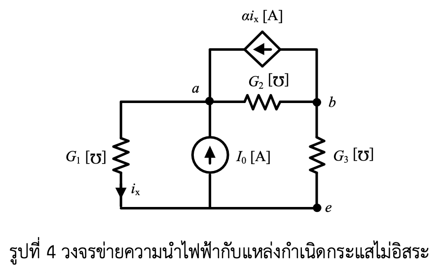

# โจทย์สอบปากเปล่า: วงข่ายความนำไฟฟ้ากับแหล่งกำเนิดกระแสไม่อิสระ (Pure Problem & Circuit Breakdown)

---

## 1. ถอดข้อความจากโจทย์ต้นฉบับ (Transcribed Problem Text)

**โจทย์:**

> **[4] พิจารณาวงจรข่ายความนำไฟฟ้า $G_1, G_2$ และ $G_3$ ซึ่งมีแหล่งกำเนิดกระแสอิสระ $I_0$ และแหล่งกำเนิดกระแสไม่อิสระ $\alpha i_x$ ดังรูปที่ 4 จงเขียนสมการชุดตัดในรูปแบบเมทริกซ์เวกเตอร์และหาค่าแรงดัน $V_a$ และ $V_b$ ที่ปม $a$ และ $b$ ตามลำดับ เมื่อเปรียบเทียบกับ แรงดันที่ปม $e$**

---

## 2. รูปวงจรไฟฟ้าและไฟล์ข้อมูลอ้างอิง (Circuit Diagram & Reference Data)

### 2.1 รูปวงจรไฟฟ้า

*รูปที่ 4: วงจรข่ายความนำไฟฟ้ากับแหล่งกำเนิดกระแสไม่อิสระ (Conductance Network with Dependent Current Source)*

---

## 3. การวิเคราะห์รูปวงจรอย่างละเอียด (Detailed Circuit Diagram & Variable Analysis)

ในส่วนนี้เป็นการวิเคราะห์องค์ประกอบ สัญลักษณ์ ขั้วไฟฟ้า ทิศทางกระแส และตัวแปรทั้งหมดที่ปรากฏอยู่ในรูปภาพ [รูปที่ 4](circuit_fig4.png) โดยระบุการเชื่อมโยงกับข้อความและประโยคในโจทย์อย่างละเอียด:

### 3.1 ตารางสรุปตัวแปรและองค์ประกอบในรูปวงจร (Component & Variable Matrix)

| สัญลักษณ์ในรูป | ชื่อองค์ประกอบ / ตัวแปร | ประเภททางไฟฟ้า / ขั้ว / ทิศทาง / หน่วย | ความสัมพันธ์และตำแหน่งในโจทย์ข้อความ |
| :--- | :--- | :--- | :--- |
| **$G_1 [\mho]$** | ความนำไฟฟ้ากิ่งที่ 1 | ตัวนำไฟฟ้า (Conductance) หน่วยซีเมนส์/โมห์ $[\mho]$ ต่อระหว่าง ปม $a$ กับ ปมอ้างอิง $e$ | ปรากฏในประโยคที่ 1: "...พิจารณาวงจรข่ายความนำไฟฟ้า $G_1, G_2$ และ $G_3$..." |
| **$G_2 [\mho]$** | ความนำไฟฟ้ากิ่งที่ 2 | ตัวนำไฟฟ้า (Conductance) หน่วยซีเมนส์/โมห์ $[\mho]$ ต่อในแนวแนวนอนระหว่าง ปม $a$ กับ ปม $b$ | ปรากฏในประโยคที่ 1: "...พิจารณาวงจรข่ายความนำไฟฟ้า $G_1, G_2$ และ $G_3$..." |
| **$G_3 [\mho]$** | ความนำไฟฟ้ากิ่งที่ 3 | ตัวนำไฟฟ้า (Conductance) หน่วยซีเมนส์/โมห์ $[\mho]$ ต่อในแนวดิ่งระหว่าง ปม $b$ กับ ปมอ้างอิง $e$ | ปรากฏในประโยคที่ 1: "...พิจารณาวงจรข่ายความนำไฟฟ้า $G_1, G_2$ และ $G_3$..." |
| **$I_0 [\text{A}]$** | แหล่งกำเนิดกระแสอิสระ | แหล่งกำเนิดกระแสอิสระ (Independent Current Source) หน่วยแอมแปร์ $[\text{A}]$ สัญลักษณ์วงกลม ลูกศรชี้ขึ้น ($\uparrow$) จากปม $e$ เข้าหาปม $a$ | ปรากฏในประโยคที่ 1: "...ซึ่งมีแหล่งกำเนิดกระแสอิสระ $I_0$..." |
| **$\alpha i_x [\text{A}]$** | แหล่งกำเนิดกระแสไม่อิสระ | แหล่งกำเนิดกระแสพึ่งพาชนิดควบคุมด้วยกระแส (Current-Controlled Current Source - CCCS) สัญลักษณ์ข้าวหลามตัด ลูกศรชี้ไปทางซ้าย ($\leftarrow$) จากปม $b$ เข้าหาปม $a$ | ปรากฏในประโยคที่ 1: "...และแหล่งกำเนิดกระแสไม่อิสระ $\alpha i_x$..." |
| **$i_x$** | กระแสควบคุม (Control Current) | ตัวแปรสถานะกระแส ไหลลง ($\downarrow$) ผ่านความนำไฟฟ้า $G_1$ จากปม $a$ ลงสู่ปมอ้างอิง $e$ | ปรากฏเป็นตัวแปรควบคุมในเทอม $\alpha i_x$ ของแหล่งกำเนิดกระแสไม่อิสระ |
| **$\alpha$** | ค่าคงที่อัตราขยายกระแส | สัมปสิทธิ์อัตราขยายของแหล่งกำเนิดกระแสพึ่งพา (Current Gain Multiplier) | ปรากฏในตัวกำกับแหล่งกำเนิดกระแสไม่อิสระ $\alpha i_x$ |
| **$a, b$** | ปมไฟฟ้าหลัก (Non-reference Nodes) | ปมเชื่อมต่อหลักทางไฟฟ้าในวงจร | ปรากฏในประโยคที่ 2: "...และหาค่าแรงดัน $V_a$ และ $V_b$ ที่ปม $a$ และ $b$ ตามลำดับ..." |
| **$e$** | ปมอ้างอิง / กราวด์ (Reference Node) | ปมสายล่างสุด (Reference Node / Ground) | ปรากฏในประโยคที่ 2: "...เมื่อเปรียบเทียบกับ แรงดันที่ปม $e$" |
| **$V_a, V_b$** | แรงดันที่ปมเทียบกับปมอ้างอิง | ตัวแปรแรงดันปม (Node Voltages) เทียบกับ $V_e$ | ปรากฏในคำสั่งหลักประโยคที่ 2: "...และหาค่าแรงดัน $V_a$ และ $V_b$..." |

---

### 3.2 การวิเคราะห์รายละเอียดขององค์ประกอบในรูปภาพ (Detailed Breakdown of Diagram Visuals)

#### 1. แหล่งกำเนิดกระแสอิสระ $I_0 [\text{A}]$ (กิ่งแนวดิ่งกลาง)
* **ลักษณะทางทัศนวิสัย:** สัญลักษณ์วงกลม ข้างในมีลูกศรชี้ขึ้น ($\uparrow$) มีข้อความ $I_0 [\text{A}]$ กำกับอยู่ทางด้านขวาของวงกลม
* **การต่อในวงจร:** วางแนวดิ่งตรงกลาง ต่อระหว่างปม $a$ (ด้านบน) กับสายปมอ้างอิง $e$ (ด้านล่าง) โดยทิศทางกระแสจ่ายออกจากปม $e$ เข้าสู่ปม $a$
* **การเชื่อมโยงกับโจทย์:**
  * เป็นแหล่งกำเนิดกระแสอิสระหลักที่ป้อนกระแสเข้าสู่ระบบ ปรากฏในประโยคที่ 1 ของโจทย์

#### 2. แหล่งกำเนิดกระแสไม่อิสระ $\alpha i_x [\text{A}]$ (กิ่งบนสุด)
* **ลักษณะทางทัศนวิสัย:** สัญลักษณ์รูปสี่เหลี่ยมข้าวหลามตัด (Diamond) ข้างในมีลูกศรชี้ไปทางซ้าย ($\leftarrow$) มีข้อความ $\alpha i_x [\text{A}]$ กำกับอยู่ด้านบน
* **การต่อในวงจร:** วางในแนวขนานด้านบนสุด ต่อเชื่อมระหว่างปม $b$ (ทางขวา) และปม $a$ (ทางซ้าย) ทิศทางกระแสไหลออกจากปม $b$ มุ่งหน้าเข้าสู่ปม $a$
* **การเชื่อมโยงกับโจทย์:**
  * เป็นแหล่งกำเนิดกระแสพึ่งพา (Dependent Current Source) มีขนาดเท่ากับ $\alpha$ คูณด้วยกระแสควบคุม $i_x$
  * ปรากฏในประโยคที่ 1 ของโจทย์

#### 3. ตัวนำไฟฟ้า $G_1 [\mho]$ และกระแสควบคุม $i_x$ (กิ่งแนวดิ่งซ้ายสุด)
* **ลักษณะทางทัศนวิสัย:** สัญลักษณ์ตัวต้านทานแบบฟันปลา (Zig-zag) วางในแนวดิ่งซ้ายสุด มีข้อความ $G_1 [\mho]$ กำกับอยู่ด้านซ้าย และมีลูกศรสีดำชี้ลง ($\downarrow$) พร้อมตัวอักษร $i_x$ อยู่บริเวณปลายล่างของตัวต้านทาน
* **การต่อในวงจร:** ต่ออยู่ระหว่างปม $a$ กับปมอ้างอิง $e$
* **การเชื่อมโยงกับโจทย์:**
  * กระแส $i_x$ ไหลผ่าน $G_1$ จากปม $a$ ลงสู่ปม $e$ ดังนั้นตามกฎของโอห์มในเทอมความนำไฟฟ้า จะได้สมการความสัมพันธ์: $i_x = G_1 (V_a - V_e)$ 
  * หากกำหนดให้ปม $e$ เป็นกราวด์อ้างอิง ($V_e = 0\text{ V}$) จะได้ $i_x = G_1 V_a$
  * นำไปแทนค่าในแหล่งกำเนิดกระแสพึ่งพา $\alpha i_x = \alpha G_1 V_a$

#### 4. ตัวนำไฟฟ้า $G_2 [\mho]$ (กิ่งแนวขนานกลาง)
* **ลักษณะทางทัศนวิสัย:** สัญลักษณ์ตัวต้านทานแบบฟันปลา (Zig-zag) วางในแนวขนานกลาง ระหว่างปม $a$ กับปม $b$ มีข้อความ $G_2 [\mho]$ กำกับอยู่ด้านบน
* **การต่อในวงจร:** ต่อเชื่อมระหว่างปม $a$ และปม $b$ Direct Link
* **การเชื่อมโยงกับโจทย์:**
  * ทำหน้าที่เป็นตัวนำไฟฟ้าเชื่อมระหว่างสองปมหลัก กระแสที่ไหลผ่าน $G_2$ จาก $a$ ไป $b$ คือ $i_{G2} = G_2 (V_a - V_b)$
  * ปรากฏในประโยคที่ 1 ของโจทย์

#### 5. ตัวนำไฟฟ้า $G_3 [\mho]$ (กิ่งแนวดิ่งขวาสุด)
* **ลักษณะทางทัศนวิสัย:** สัญลักษณ์ตัวต้านทานแบบฟันปลา (Zig-zag) วางในแนวดิ่งขวาสุด ต่อจากปม $b$ ลงสู่ปมอ้างอิง $e$ มีข้อความ $G_3 [\mho]$ กำกับอยู่ด้านขวา
* **การต่อในวงจร:** ต่ออยู่ระหว่างปม $b$ กับปมอ้างอิง $e$
* **การเชื่อมโยงกับโจทย์:**
  * กระแสที่ไหลผ่าน $G_3$ จากปม $b$ ลงสู่ปม $e$ คือ $i_{G3} = G_3 (V_b - V_e) = G_3 V_b$
  * ปรากฏในประโยคที่ 1 ของโจทย์

#### 6. ปมไฟฟ้า $a, b$ และปมอ้างอิง $e$
* **ลักษณะทางทัศนวิสัย:** จุดดำ (Node Dots) ระบุตำแหน่งทางไฟฟ้า:
  * **ปม $a$:** จุดเชื่อมระหว่าง $G_1$, $I_0$, $G_2$ และฝั่งรับกระแสของ $\alpha i_x$
  * **ปม $b$:** จุดเชื่อมระหว่าง $G_2$, $G_3$ และฝั่งจ่ายกระแสของ $\alpha i_x$
  * **ปมอ้างอิง $e$:** สายเส้นล่างสุดทั้งหมดที่เชื่อมปลายล่างของ $G_1$, $I_0$, $G_3$ เข้าด้วยกัน มีจุดดำกำกับด้วยตัวอักษร $e$ ทางขวาล่าง
* **การเชื่อมโยงกับโจทย์:**
  * ปรากฏในคำสั่งหลักประโยคที่ 2 ให้คำนวณหาแรงดันปม $V_a$ และ $V_b$ เทียบกับ $V_e$

---

### 3.3 รายละเอียดข้อกำหนดโจทย์และเป้าหมายการคำนวณ (Problem Requirements Checklist)

1. **การตั้งสมการชุดตัด (Cut-set Equations):**
   * **คำสั่ง:** "จงเขียนสมการชุดตัดในรูปแบบเมทริกซ์เวกเตอร์"
   * **ข้อกำหนด:** กำหนดกราฟของวงจร เลือกกิ่งต้นไม้ (Tree Branches) และกิ่งต้นไม้ร่วม (Cotree Branches) เพื่อสร้างเมทริกซ์ชุดตัดพื้นฐาน (Fundamental Cut-set Matrix $[Q]$) แล้วเขียนสมการดุลกระแสในรูปแบบ $[A][V] = [I_{src}]$ หรือ $[Q][I] = 0$

2. **การคำนวณหาแรงดันปม (Node Voltage Determination):**
   * **คำสั่ง:** "และหาค่าแรงดัน $V_a$ และ $V_b$ ที่ปม $a$ และ $b$ ตามลำดับ เมื่อเปรียบเทียบกับ แรงดันที่ปม $e$"
   * **ข้อกำหนด:** แก้ระบบสมการเพื่อหาค่า $V_a$ และ $V_b$ ในรูปของพารามิเตอร์ $I_0, \alpha, G_1, G_2, G_3$
