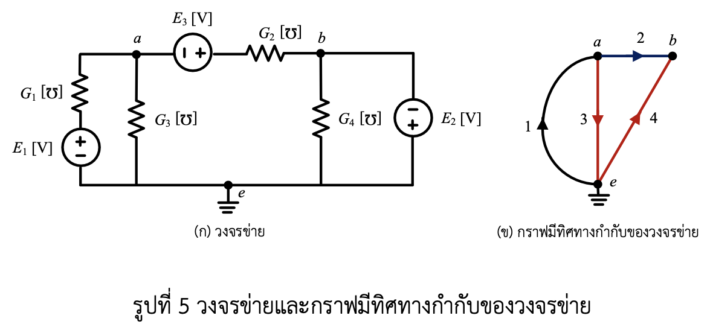

# โจทย์สอบปากเปล่า: วงข่ายความนำไฟฟ้าและกราฟมีทิศทางกำกับ (Pure Problem & Circuit Breakdown)

---

## 1. ถอดข้อความจากโจทย์ต้นฉบับ (Transcribed Problem Text)

**โจทย์:**

> **[5] พิจารณาวงจรข่ายและกราฟมีทิศทางกำกับของวงจรข่ายในรูปที่ 5 จงเขียนสมการชุดตัดในรูปแบบเมทริกซ์เวกเตอร์ซึ่งมีตัวแปรแรงดัน $V_a$ และ $V_b$ เมื่อเปรียบเทียบกับแรงดันที่ปม $e$**

---

## 2. รูปวงจรไฟฟ้าและไฟล์ข้อมูลอ้างอิง (Circuit Diagram & Reference Data)

### 2.1 รูปวงจรไฟฟ้าและกราฟมีทิศทางกำกับ

*รูปที่ 5: (ก) วงจรข่ายความนำไฟฟ้า และ (ข) กราฟมีทิศทางกำกับของวงจรข่าย (Conductance Network and Directed Graph)*

---

## 3. การวิเคราะห์รูปวงจรและกราฟมีทิศทางกำกับอย่างละเอียด (Detailed Circuit & Directed Graph Analysis)

ในส่วนนี้เป็นการวิเคราะห์องค์ประกอบ สัญลักษณ์ ขั้วไฟฟ้า ทิศทางในกราฟ และตัวแปรทั้งหมดที่ปรากฏอยู่ในรูปภาพ [รูปที่ 5](circuit_fig5.png) ทั้งรูป (ก) วงจรข่าย และรูป (ข) กราฟมีทิศทางกำกับ โดยระบุการเชื่อมโยงกับข้อความและประโยคในโจทย์อย่างละเอียด:

### 3.1 ตารางสรุปตัวแปรและองค์ประกอบในรูปวงจรและกราฟ (Component, Graph Edge & Variable Matrix)

| สัญลักษณ์ในรูป | ชื่อองค์ประกอบ / กิ่งกราฟ / ตัวแปร | ประเภททางไฟฟ้า / ขั้ว / ทิศทางกราฟ / หน่วย | ความสัมพันธ์และตำแหน่งในโจทย์ข้อความ |
| :--- | :--- | :--- | :--- |
| **(ก) วงจรข่าย** | รูปวงจรไฟฟ้า | แผนผังวงจรไฟฟ้าประกอบด้วยตัวนำไฟฟ้าและแหล่งกำเนิดแรงดัน | ปรากฏในประโยคเปิด: "...พิจารณาวงจรข่าย..." |
| **(ข) กราฟมีทิศทาง** | กราฟมีทิศทาง (Directed Graph) | โครงสร้างทฤษฎีกราฟแสดงทิศทางกระแสของแต่ละกิ่ง | ปรากฏในประโยคเปิด: "...และกราฟมีทิศทางกำกับของวงจรข่ายในรูปที่ 5..." |
| **$G_1 [\mho]$** | ความนำไฟฟ้ากิ่งที่ 1 | ตัวนำไฟฟ้า (Conductance) หน่วยซีเมนส์/โมห์ $[\mho]$ ต่ออนุกรมกับ $E_1$ ในกิ่งซ้ายสุด | สอดคล้องกับกิ่งที่ 1 ในกราฟ (ข) |
| **$E_1 [\text{V}]$** | แหล่งกำเนิดแรงดันอิสระที่ 1 | แหล่งกำเนิดแรงดันอิสระ หน่วยโวลต์ $[\text{V}]$ ขั้ว $+$ ด้านบน ต่ออนุกรมล่าง $G_1$ | สอดคล้องกับกิ่งที่ 1 ในกราฟ (ข) |
| **$G_3 [\mho]$** | ความนำไฟฟ้ากิ่งที่ 3 | ตัวนำไฟฟ้า (Conductance) หน่วยซีเมนส์/โมห์ $[\mho]$ ต่อแนวดิ่งระหว่าง ปม $a$ กับ ปม $e$ | สอดคล้องกับกิ่งที่ 3 ในกราฟ (ข) |
| **$E_3 [\text{V}]$** | แหล่งกำเนิดแรงดันอิสระที่ 3 | แหล่งกำเนิดแรงดันอิสระ หน่วยโวลต์ $[\text{V}]$ ขั้ว $-$ ด้านซ้าย (ปม $a$), ขั้ว $+$ ด้านขวา | สอดคล้องกับกิ่งที่ 2 ในกราฟ (ข) ต่ออนุกรมกับ $G_2$ |
| **$G_2 [\mho]$** | ความนำไฟฟ้ากิ่งที่ 2 | ตัวนำไฟฟ้า (Conductance) หน่วยซีเมนส์/โมห์ $[\mho]$ ต่อแนวนอนระหว่าง $E_3$ กับ ปม $b$ | สอดคล้องกับกิ่งที่ 2 ในกราฟ (ข) |
| **$G_4 [\mho]$** | ความนำไฟฟ้ากิ่งที่ 4 | ตัวนำไฟฟ้า (Conductance) หน่วยซีเมนส์/โมห์ $[\mho]$ ต่อแนวดิ่งระหว่าง ปม $b$ กับ ปม $e$ | สอดคล้องกับกิ่งที่ 4 ในกราฟ (ข) |
| **$E_2 [\text{V}]$** | แหล่งกำเนิดแรงดันอิสระที่ 2 | แหล่งกำเนิดแรงดันอิสระ หน่วยโวลต์ $[\text{V}]$ ขั้ว $-$ ด้านบน (ปม $b$), ขั้ว $+$ ด้านล่าง (ปม $e$) | อยู่กิ่งขวาสุด ต่อขนานร่วมกับกิ่งของ $G_4$ ในการวิเคราะห์ปม $b$ |
| **กิ่ง 1 (Edge 1)** | กิ่งกราฟที่ 1 | เส้นโค้งสีดำซ้ายสุด ทิศทางชี้ขึ้นจากปม $e$ ไปปม $a$ ($\uparrow$) | ตรงกับกิ่งอนุกรม $G_1 - E_1$ ในรูป (ก) |
| **กิ่ง 2 (Edge 2)** | กิ่งกราฟที่ 2 | เส้นตรงสีน้ำเงินบน ทิศทางชี้ขวาจากปม $a$ ไปปม $b$ ($\rightarrow$) | ตรงกับกิ่งอนุกรม $E_3 - G_2$ ในรูป (ก) |
| **กิ่ง 3 (Edge 3)** | กิ่งกราฟที่ 3 | เส้นตรงสีแดงแนวดิ่ง ทิศทางชี้ลงจากปม $a$ ไปปม $e$ ($\downarrow$) | ตรงกับกิ่ง $G_3$ ในรูป (ก) |
| **กิ่ง 4 (Edge 4)** | กิ่งกราฟที่ 4 | เส้นตรงสีแดงเฉียง ทิศทางชี้ลงซ้ายจากปม $b$ ไปปม $e$ ($\swarrow$) | ตรงกับกิ่ง $G_4$ ในรูป (ก) |
| **$a, b$** | ปมไฟฟ้าหลัก (Non-reference Nodes) | ปมเชื่อมต่อทางไฟฟ้าหลักในวงจรและกราฟ | ปรากฏในโจทย์: "...ซึ่งมีตัวแปรแรงดัน $V_a$ และ $V_b$..." |
| **$e$** | ปมอ้างอิง / กราวด์ (Reference Node) | ปมสายล่างสุด ต่อสัญลักษณ์ลงดิน ($V_e = 0\text{ V}$) | ปรากฏในโจทย์: "...เมื่อเปรียบเทียบกับแรงดันที่ปม $e$" |
| **$V_a, V_b$** | แรงดันที่ปมเทียบกับปมอ้างอิง | ตัวแปรแรงดันปม (Node Voltages) เทียบกับ $V_e$ | ปรากฏในคำสั่งหลัก: "...หาค่าแรงดัน $V_a$ และ $V_b$..." |

---

### 3.2 การวิเคราะห์รายละเอียดขององค์ประกอบในรูปภาพ (Detailed Breakdown of Diagram Visuals)

#### 3.2.1 การวิเคราะห์รูป (ก) วงจรข่ายไฟฟ้า (Circuit Diagram Visuals)

1. **กิ่งอนุกรม $G_1 - E_1$ (กิ่งซ้ายสุด):**
   * มีตัวนำไฟฟ้า $G_1 [\mho]$ วางอนุกรมอยู่ด้านบนของแหล่งกำเนิดแรงดันอิสระ $E_1 [\text{V}]$
   * ขั้วของ $E_1$: ขั้วบวก ($+$) อยู่ด้านบน ต่อกับ $G_1$ และขั้วลบ ($-$) อยู่ด้านล่าง ต่อกับปมอ้างอิง $e$
   * เชื่อมต่อระหว่างปม $a$ กับปมอ้างอิง $e$

2. **กิ่งขนาน $G_3$ (กิ่งแนวดิ่งกลางซ้าย):**
   * เป็นตัวนำไฟฟ้า $G_3 [\mho]$ วางแนวดิ่ง ต่อโดยตรงระหว่างปม $a$ กับปมอ้างอิง $e$

3. **กิ่งอนุกรม $E_3 - G_2$ (กิ่งแนวนอนบน):**
   * มีแหล่งกำเนิดแรงดันอิสระ $E_3 [\text{V}]$ วางอนุกรมกับตัวนำไฟฟ้า $G_2 [\mho]$
   * ขั้วของ $E_3$: ขั้วลบ ($-$) ต่อกับปม $a$ ด้านซ้าย และขั้วบวก ($+$) ต่อกับ $G_2$ ด้านขวา
   * เชื่อมต่อระหว่างปม $a$ กับปม $b$

4. **กิ่ง $G_4$ (กิ่งแนวดิ่งกลางขวา):**
   * เป็นตัวนำไฟฟ้า $G_4 [\mho]$ วางแนวดิ่ง ต่อโดยตรงระหว่างปม $b$ กับปมอ้างอิง $e$

5. **แหล่งกำเนิดแรงดัน $E_2$ (กิ่งขวาสุด):**
   * เป็นแหล่งกำเนิดแรงดันอิสระ $E_2 [\text{V}]$ วางแนวดิ่งกิ่งขวาสุด
   * ขั้วของ $E_2$: ขั้วลบ ($-$) อยู่ด้านบน ต่อกับปม $b$ และขั้วบวก ($+$) อยู่ด้านล่าง ต่อกับปมอ้างอิง $e$
   * กำหนดให้แรงดันไฟฟ้าที่ปม $b$ ถูกบังคับโดยตรงจาก $E_2$: เนื่องจากขั้วลบอยู่ที่ปม $b$ จะได้ $V_b = -E_2$

---

#### 3.2.2 การวิเคราะห์รูป (ข) กราฟมีทิศทางกำกับ (Directed Graph & Network Topology)

1. **ปมในกราฟ (Nodes):**
   * มีทั้งหมด 3 ปม ได้แก่ ปม $a$ (ซ้ายบน), ปม $b$ (ขวาบน) และปม $e$ (ล่างสุด ต่อสัญลักษณ์กราวด์)

2. **กิ่งในกราฟและทิศทาง (Directed Branches / Edges):**
   * **กิ่ง 1 (Edge 1):** เส้นโค้งสีดำ ทิศทางชี้จากปม $e$ ขึ้นไปปม $a$ ($\uparrow$) แสดงทิศทางกระแสอ้างอิงของกิ่งที่ 1
   * **กิ่ง 2 (Edge 2):** เส้นตรงสีน้ำเงิน ทิศทางชี้จากปม $a$ ไปทางขวาเข้าปม $b$ ($\rightarrow$) แสดงทิศทางกระแสอ้างอิงของกิ่งที่ 2
   * **กิ่ง 3 (Edge 3):** เส้นตรงสีแดงแนวดิ่ง ทิศทางชี้จากปม $a$ ลงมาปม $e$ ($\downarrow$) แสดงทิศทางกระแสอ้างอิงของกิ่งที่ 3
   * **กิ่ง 4 (Edge 4):** เส้นตรงสีแดงเฉียง ทิศทางชี้จากปม $b$ ลงมาปม $e$ ($\swarrow$) แสดงทิศทางกระแสอ้างอิงของกิ่งที่ 4

3. **การจำแนกต้นไม้และกิ่งร่วม (Tree and Cotree Classification):**
   * **กิ่งต้นไม้ (Tree Branches / Twigs):** กิ่งสีแดง (กิ่ง 3 และ กิ่ง 4) เชื่อมทุกปมโดยไม่เกิดลูปปิด
   * **กิ่งร่วม (Cotree Branches / Links):** กิ่งสีดำ (กิ่ง 1) และกิ่งสีน้ำเงิน (กิ่ง 2) นำมาใช้สร้างชุดตัดพื้นฐาน (Fundamental Cut-sets)

---

### 3.3 รายละเอียดข้อกำหนดโจทย์และเป้าหมายการคำนวณ (Problem Requirements Checklist)

1. **การตั้งสมการชุดตัด (Cut-set Equations):**
   * **คำสั่ง:** "จงเขียนสมการชุดตัดในรูปแบบเมทริกซ์เวกเตอร์ซึ่งมีตัวแปรแรงดัน $V_a$ และ $V_b$ เมื่อเปรียบเทียบกับแรงดันที่ปม $e$"
   * **ข้อกำหนด:** นำทิศทางจากกราฟมีทิศทางรูป (ข) และค่าพารามิเตอร์จากวงจรรูป (ก) มาสร้างเมทริกซ์ชุดตัดพื้นฐาน (Fundamental Cut-set Matrix $[Q]$) แล้วจัดรูปเป็นสมการดุลกระแสเมทริกซ์ในรูปแบบ $[Y_{cut}][V_{node}] = [I_{cut}]$ หรือ $[A][V] = [S]$

2. **การวิเคราะห์ตัวแปรแรงดันปม (Node Voltage Determination):**
   * **คำสั่ง:** "ซึ่งมีตัวแปรแรงดัน $V_a$ และ $V_b$ เมื่อเปรียบเทียบกับแรงดันที่ปม $e$"
   * **ข้อกำหนด:** แสดงความสัมพันธ์ของ $V_a$ และ $V_b$ ในระบบสมการเมทริกซ์เทียบกับปมอ้างอิง $V_e = 0\text{ V}$
